# The First Circle: Introduction to Bayesian Statistics, Part One

<br/>
Jiří Fejlek

2026-06-16
<br/>

<br/> This is the first part of the first circle dedicated to Bayesian
Statistics. I plan to organize the earlier circles mostly as summaries
of topics covered in *Bayesian Data Analysis 3rd edition* (Gelman et al.
1995) with bits and pieces taken from other sources. The reason is
pretty simple. At the time of writing these lines, I do not feel being
as much versed in Bayesian statistics as I was with generalized linear
models and “frequentist” statistics in general, when I started working
on *Nine Circles of Statistical Modeling*. So, it is time to go through
the fundamentals first… <br/>

## Table of Contents
- [Bayesian Data Analysis](#bayesian-data-analysis)
- [Single-parameter models](#single-parameter-models)
  - [Binomial Model](#binomial-model)
  - [Poisson Model](#poisson-model)
  - [Exponential Model](#exponential-model)
- [German Tank Problem](#german-tank-problem)
- [References](#references)

## Bayesian Data Analysis

Bayesian inference is a statistical inference framework based on *Bayes’
theorem*, which allows us to update our *prior* beliefs as we obtain
more information from the data. The Bayesian framework can be split into
the following three main steps (Gelman et al. 1995)

1.  Setting up a *full probability model*, a joint probability
    distribution for all observable and unobservable quantities
2.  Computing the *posterior distribution* of the unobserved quantities
    of interest given the observed data
3.  Evaluating the fit of the model and performing inference based on
    the posterior distribution

In the previous cycle of projects, *Nine Circles of Statistical
Modeling*, we have explored a traditional alternative approach to
statistical inference, often referred to as the *frequentist approach*.
The cornerstone of frequentist inference was conditional probability
$p(y\mid\theta)$, where $y$ are observed data and $\theta$ are
unobservable quantities (typically parameters), which are considered to
be fixed (i.e., $\theta$ is not a random variable). The conditional
probability $p(y\mid\theta)$ is referred to as the *likelihood*.

The first step of frequentist inference is to estimate $\theta$ using
some estimator $\hat \theta$ based on the observed data
$y_1, \ldots, y_N$, for example, the maximum likelihood estimator (MLE)
$\hat \theta = \text{argmax}\theta \Pi{i = 1}^n \text{ } p(y_i\mid \theta)$.
The next step consists of constructing *confidence intervals* and
performing *hypothesis testing*, which are based on the *sampling*
properties of $\hat \theta$; we asked how our estimator would vary if we
hypothetically “repeated the experiment” and obtained a new dataset
$y’_1, \ldots, y’_N$. This is why we regularly employed various
bootstrap methods to generate “new datasets” in cases where the sampling
distribution of $\hat \theta$ could not be easily approximated using
large-sample asymptotics.

As we observe from our three main steps, Bayesian inference requires
specification of the full probability model $p(y, \theta)$, which
necessitates the definition of *prior probability* $p(\theta)$, which is
used to model our initial knowledge about the parameters $\theta$ before
we perform the inference. Using the observed data $y$, we can then
update our beliefs encoded in the prior probability $p(\theta)$ using
Bayes rule

``` math
p(\theta \mid y) = \frac{p(y, \theta)}{p(y)} = \frac{p(y \mid \theta)p(\theta)}{\int p(y \mid \theta)p(\theta) \mathrm{d}\theta}
```

which is derived from the definition of conditional probability

``` math
p(y, \theta) = p(y \mid \theta)p(\theta)
```

and the *law of total probability*
$p(y) = \int p(y \mid \theta)p(\theta) \mathrm{d}\theta$. Lastly, we use
the *posterior distribution* $p(\theta \mid y)$ to compute the
*posterior predictive distribution* for some new observable $\tilde y$
of interest (such as future observations).

``` math
p(\tilde y \mid y) = \int p(\tilde y, \theta \mid y) \mathrm{d}\theta = \int p(\tilde y \mid y, \theta) p(\theta \mid y)p(\theta) \mathrm{d}\theta = \int p(\tilde y \mid \theta) p(\theta \mid y)p(\theta) \mathrm{d}\theta
```

On paper, the Bayesian inference seems more involved; first, we need to
specify the full probability model, not just the likelihood. In
addition, evaluating the Bayes rule is often much more complicated than,
e.g., computing the MLE estimator (the integral in the denominator is
almost never analytically solvable, and since models often include many
parameters, traditional numerical integration methods are also not
applicable). Nowadays, this issue can be solved using Markov chain Monte
Carlo (MCMC) algorithms, which allow us to directly draw samples from
the posterior distribution, enabling Bayesian inference on real data
(Kruschke et al. 2014).

So, what are the benefits of Bayesian inference? Well, it turns out that
Bayesian inference much more easily handles the natural complexities
that plague real data, such as missing data, measurement errors,
hierarchical/multilevel models, latent variables, small datasets, and so
on. We encountered some of these in *Nine Circles of Statistical
Modeling* and observed, for example, how missing data can make
traditional inference much more complex. Hence, while on simple datasets
we get the same results for a bit more work, Bayesian inference can
provide huge benefits when it truly counts.

## Single-parameter models

We start our introduction to Bayesian inference firmly in the camp of
cases where we get the same results with a bit more work.

### Binomial Model

Let us assume a sequence of “Bernoulli trials” $y_1, \ldots, y_n$
($y_i \in \{0, 1\}$ for all $i$). The number of “successes” ($y = 0$)
has the distribution for the given probability of success $\theta$
(i.e., likelihood)

``` math
p(y \mid \theta) = \binom{n}{y} \theta^y (1-\theta)^{n-y}.
```

#### Uniform prior

To obtain a Bayesian estimate of the probability of success
$\theta \in [0, 1]$, we need to specify the prior distribution
$p(\theta).$ First, let us assume uniform distribution $p(\theta) = 1$.
The posterior density for $\theta$ from Bayes’ rule (ignoring the
normalization constant) is

``` math
p(\theta \mid y) \propto  \theta^y (1-\theta)^{n-y}.
```

This is a known distribution. Namely, we can identify it as a *beta*
distribution (<https://en.wikipedia.org/wiki/Beta_distribution>), and we
can determine the correct normalization as

``` math
p(\theta; \alpha, \beta) = \frac{\Gamma(\alpha + \beta)}{\Gamma(\alpha) \Gamma(\beta)} \theta ^ {\alpha - 1} (1-\theta)^{\beta - 1}
```

for $\alpha = y + 1$ and $\beta = n - y + 1$.

To illustrate this result, let us consider a famous application:
estimating the proportion of girl births in a population, which Laplace
performed based on data from Paris between 1745 and 1770. Let us assume
that 60 girls and 63 boys have been observed (the actual totals were
241,945 girls and 251,527 boys) (Gelman et al. 1995).

``` r
n <- 60 + 63
y <- 60
```

We assume that our prior distribution of $\theta$ is uniform.

``` r
curve(dunif(x, min = 0, max = 1), from = -0.1, to = 1.1, 
      col = "blue", lwd = 2, ylab = "Prior PDF", xlab = "Theta")
```

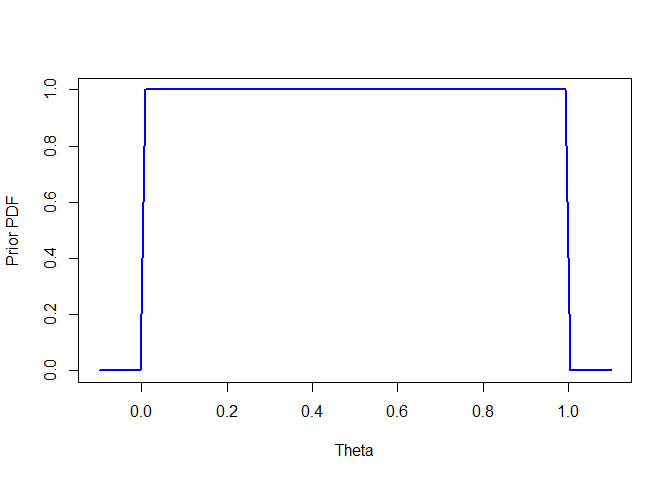<!-- -->

Let us compute the posterior distribution.

``` r
alpha <- y + 1
beta <- n - y + 1
  
curve(dbeta(x, alpha, beta, ncp = 0, log = FALSE), from = -0.1, to = 1.1, 
      col = "blue", lwd = 2, ylab = "Posterior PDF", xlab = "Theta")

abline(v = (y+1)/(n +2), lty = "dotted", lwd = 2, col = "red")
```

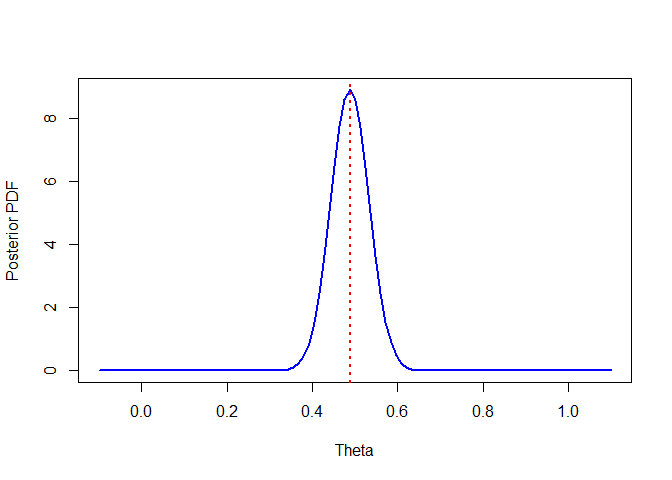<!-- -->

We can observe how incorporating the observed data via the Bayes formula
concentrated the prior distribution of $\theta$. In the figure, we
denoted with red the mean of the posterior distribution beta
$\frac{\alpha}{\alpha + \beta} = \frac{y+1}{n+2} = \frac{61}{125} = 0.488$,
which is almost equal to the standard MLE estimate
$\hat \theta  = \frac{y}{n} = \frac{60}{123} \approx 0.4878$ (the
difference asymptotically disappears for large $n$). We should, however,
keep in mind here that the main result of the Bayesian inference is the
whole posterior distribution, and not just a single point or interval
estimate. We use these to describe properties of the posterior
distribution.

Let us evaluate $P[\theta \geq 0.5]$ based on the posterior
distribution, i.e., the probability that the birth is female greater
than $0.5$.

``` r
pbeta(0.5, alpha, beta, lower.tail = FALSE, log.p = FALSE)
```

    ## [1] 0.3938733

We observe that we would have obtained some evidence that
$\theta < 0.5$, but we would not probably call this evidence conclusive.
Let us look at the data Laplace analyzed.

``` r
n_all <- 241945 + 251527
y_all <- 241945

alpha_all <- y_all + 1
beta_all <- n_all - y_all + 1

curve(dbeta(x, alpha_all, beta_all, ncp = 0, log = FALSE), from = 0.485, to = 0.495, 
      col = "blue", lwd = 2, ylab = "Posterior PDF", xlab = "Theta")

abline(v = (y_all+1)/(n_all +2), lty = "dotted", lwd = 2, col = "red")
```

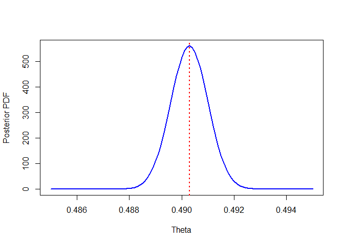<!-- -->

``` r
pbeta(0.5, alpha_all, beta_all, lower.tail = FALSE, log.p = FALSE)
```

    ## [1] 1.146058e-42

We see that the posterior is significantly more concentrated, with the
maximum on a value less than $0.5$, which prompted Laplace to be
“morally certain” that $\theta < 0.5$ (Gelman et al. 1995).

#### Beta prior

Let us now assume that we have obtained additional data on the births of
boys and girls, say, from a neighboring country, and we want to use our
previous result as a prior distribution for this next analysis.
Consequently, we assume that our prior is beta distributed, i.e.,

``` math
p(\theta) \propto  \theta^{a-1} (1-\theta)^{b-1}
```

We can quite easily notice that the posterior for a beta prior is
another beta, specifically,

``` math
p(\theta \mid y) \propto  \theta^{a-1} (1-\theta)^{b-1} \theta^y (1-\theta)^{n-y} = \theta^{a+y-1} (1-\theta)^{b+n-y-1}
```

for $\alpha = y + a$ and $\beta = b + n -y$. When the posterior
distribution is of the same family of distributions as the prior, the
prior is called *conjugate* (Gelman et al. 1995). Hence, we can say that
the beta family of distributions is a conjugate family for the binomial
likelihood.

Conjugate priors are convenient because they yield closed-form
posteriors and allow us to perform Bayesian updating analytically. In
addition, Bayesian updating merely shifts the prior parameters; hence,
when we keep updating, we just need to remember the last values of these
parameters.

Let us demonstrate the usage of a beta prior for binomial data. We
assume that we got new data on child births: 267 boys and 229 girls. Let
us update our previously computed prior (based on the data of 60 girls
and 63 boys). For comparison, we will also compute a beta posterior with
the uniform prior.

``` r
y_new <- 229
n_new <- 229 + 267


alpha_unif <- y_new + 1
beta_unif <- n_new - y_new + 1

alpha_update <- alpha + y_new
beta_update <- beta + n_new - y_new


curve(dbeta(x, alpha_update, beta_update, ncp = 0, log = FALSE), from = 0.3, to = 0.6, 
      col = "red", lwd = 2, ylab = "Posterior PDF", xlab = "Theta")
  
curve(dbeta(x, alpha_unif, beta_unif, ncp = 0, log = FALSE), from = 0.3, to = 0.6, 
      col = "blue", lwd = 2, add = TRUE, ylab = "Posterior PDF", xlab = "Theta")

curve(dbeta(x, alpha, beta, ncp = 0, log = FALSE), from = 0.3, to = 0.6, 
      col = "gray", lwd = 2, add = TRUE, ylab = "Posterior PDF", xlab = "Theta")

abline(v = alpha_update/(alpha_update + beta_update), lty = "dotted", lwd = 2, col = "red")
```

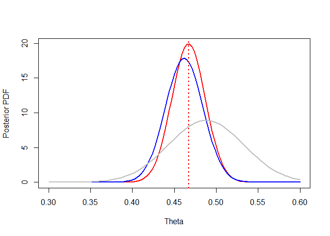<!-- --> The
red distribution is the posterior distribution with the beta (gray)
prior. The blue distribution is the posterior distribution with a
uniform prior. We observe that the red posterior is a bit more
concentrated (since the prior was more specific) and shifted slightly to
the right. The mean of the posterior distribution can be computed as
follows.

``` r
alpha_update/(alpha_update + beta_update)
```

    ## [1] 0.4669887

Let us expand that formula in terms of $n,y$ and the parameters of the
beta prior ($a$ and $b$). Ultimately, we can get the following sum
(Kruschke et al. 2014).

``` math
E(\theta \mid y) = \frac{y}{n}\frac{n}{n+a+b} + \frac{a}{a+b}\frac{a+b}{n+a+b}
```

We can see that the posterior mean of $\theta$ can be written as the
weight sum of the MLE estimate (representing the information we get from
the data) and the mean of the prior. More specifically, it is an affine
combination ($\frac{n}{n+a+b} + \frac{a+b}{n+a+b} = 1$ ), which means
that the posterior mean will always lie between the MLE and the prior
mean. We can also notice that as $n$ increases, the weight of the prior
approaches zero, and the Bayesian inference relies more and more on the
data.

Let us demonstrate these shifts with a simple example; we assume a
dataset with 25 successes and 25 failures. Notice how the posterior
shifts with a “more aggressive” prior.

``` r
y_plot <- 25
n_plot <- 50


alpha_unif <- y_new + 1
beta_unif <- n_new - y_new + 1


alpha1 = 30
beta1 = 5

alpha2 = 5
beta2 = 30

alpha3 = 40
beta3 = 40


alpha_update1 <- alpha1 + y_plot
beta_update1 <- beta1 + n_plot - y_plot


alpha_update2 <- alpha2 + y_plot
beta_update2 <- beta2 + n_plot - y_plot

alpha_update3 <- alpha3 + y_plot
beta_update3 <- beta3 + n_plot - y_plot


curve(dbeta(x, alpha_update3, beta_update3, ncp = 0, log = FALSE), from = 0, to = 1, 
      col = "black", lwd = 2, ylab = "Posterior PDF", xlab = "Theta")

curve(dbeta(x, alpha_update1, beta_update1, ncp = 0, log = FALSE), from = 0, to = 1, 
      col = "red", lwd = 2, add = TRUE, ylab = "Posterior PDF", xlab = "Theta")
curve(dbeta(x, alpha_update2, beta_update2, ncp = 0, log = FALSE), from = 0, to = 1, 
      col = "blue", lwd = 2, add = TRUE, ylab = "Posterior PDF", xlab = "Theta")

  

curve(dbeta(x, alpha1, beta1, ncp = 0, log = FALSE), from = 0, to = 1, 
      col = adjustcolor("red", alpha.f = 0.25), lwd = 2, add = TRUE, ylab = "Posterior PDF", xlab = "Theta")

curve(dbeta(x, alpha2, beta2, ncp = 0, log = FALSE), from = 0, to = 1, 
      col = adjustcolor("blue", alpha.f = 0.25), lwd = 2, add = TRUE, ylab = "Posterior PDF", xlab = "Theta")

curve(dbeta(x, alpha3, beta3, ncp = 0, log = FALSE), from = 0, to = 1, 
      col = adjustcolor("gray", alpha.f = 0.5), lwd = 2, add = TRUE, ylab = "Posterior PDF", xlab = "Theta")
```

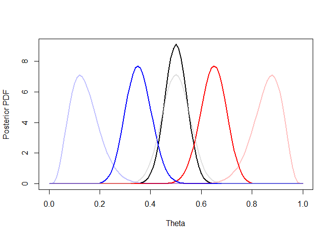<!-- -->
However, as the number of observations increases, the influence of
priors diminishes.

``` r
y_plot <- 250
n_plot <- 500
```

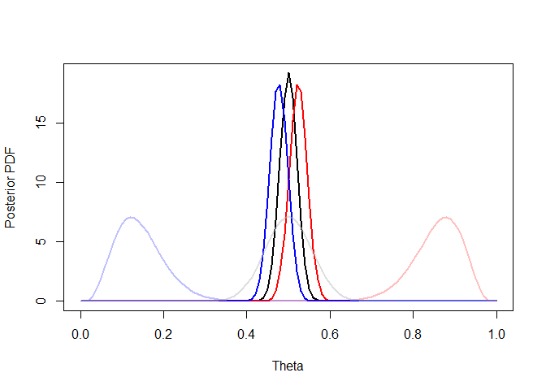<!-- -->

#### Nonconjugate prior

Naturally, we are not restricted to only use conjugate priors. For
example, let us consider the following triangular prior density.

``` r
psym_triangle <- function(x, a, b) {
  mode <- (a + b) / 2
  height <- 2 / (b - a)
  
  ifelse(x >= a & x < mode, (4 * (x - a)) / (b - a)^2,
  ifelse(x >= mode & x <= b, (4 * (b - x)) / (b - a)^2, 0))
}


curve(psym_triangle(x, 0.25, 0.75), from = 0, to = 1, 
      col = "blue", lwd = 2, ylab = "Prior PDF", xlab = "Theta")
```

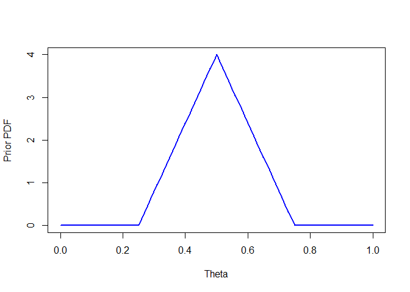<!-- -->

Since we do not know the analytical solution for this prior to the Bayes
updating, we have to compute the posterior distribution numerically. The
easiest approach is probably *grid approximation* (McElreath 2018). In
this approach, we simply evaluate the likelihood and the prior for the
fixed number of values $\theta$ (forming a grid). Since we are
approximating the problem by considering only a finite set of possible
parameter values, computing the normalization is trivial: just sum all
the values and divide probabilities by the result.

``` r
theta_values <- data.frame(theta = seq(0.1, 1, 0.001))

# evaluate the prior on the grid and normalize -> we obtain a discrete approximation of the prior distribution

prior_values <- psym_triangle(theta_values$theta, 0.25, 0.75)
prior_values <- prior_values/sum(prior_values)

# evaluate the likelihood on the grid, multiply the result by the discretized prior, and normalize
posterior_values  <-  dbinom(y_new, n_new, theta_values$theta)*prior_values
posterior_values <- posterior_values/sum(posterior_values)

plot(theta_values$theta,posterior_values, type = 'l', ylab = "Posterior PDF", xlab = "Theta")
```

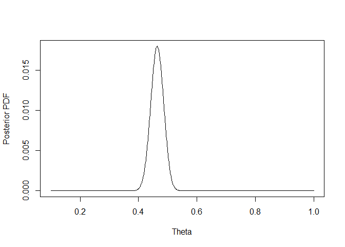<!-- -->

We can then obtain estimates of the posterior mean, mode (the most
probable value), and quantiles.

``` r
# mean
sum(theta_values$theta*posterior_values)
```

    ## [1] 0.463998

``` r
# mode
theta_values$theta[which.max(posterior_values)]
```

    ## [1] 0.464

``` r
# 0.05 quantile
theta_values$theta[which(cumsum(posterior_values) > 0.05)][1]
```

    ## [1] 0.428

``` r
# median
theta_values$theta[which(cumsum(posterior_values) > 0.5)][1]
```

    ## [1] 0.464

``` r
# 0.95 quantile
theta_values$theta[which(cumsum(posterior_values) > 0.95)][1]
```

    ## [1] 0.5

We can also easily sample from this density.

``` r
samples <- sample(theta_values$theta, size = 10000, prob = posterior_values, replace = TRUE)
hist(samples)
```

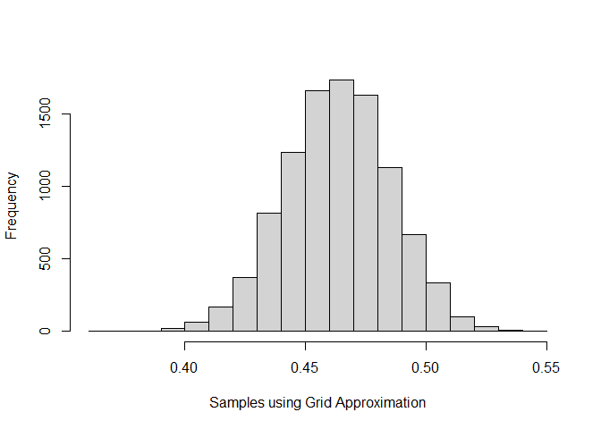<!-- -->

Grid approximation is quite straightforward, but it is unfortunately
infeasible for a large number of parameters due to the curse of
dimensionality. Hence, we often rely on Markov chain Monte Carlo (MCMC)
algorithms to approximate the posterior density by generating large
samples from an accurate approximation of it Kruschke et al. (2014).

We will discuss MCMC algorithms in more detail in a later chapter. For
now, all we need to know is that we can generate these samples using
*Stan* (<https://mc-stan.org>) and the R package *RStan*, which provides
an interface for Stan in R. Now, Stan is a C++ library and a modeling
language in its own right. Hence, we first need to create a model in
Stan.

Again, there is no need to go into details at this moment. The following
code should be quite self-explanatory.

``` default
data {
  int<lower=0> N;          // n
  int<lower=0, upper=N> y; // y
  real a;                  // lower bound of triangular distribution
  real<lower=a> b;         // upper bound of triangular distribution
}

transformed data {
  real c = 0.5 * (a + b);          // mode of triangular distribution 
}

parameters {
  real<lower=a, upper=b> theta; // probability theta is from [a, b]
}

model {
  // symmetric triangular prior (logarithm)
  if (theta <= c) {
    target += log(4) + log(theta - a) - 2 * log(b - a);
  } else {
    target += log(4) + log(b - theta) - 2 * log(b - a);
  }

  // binomial likelihood
  y ~ binomial(N, theta);
}
```

We first declared our data and parameters, and then we defined the prior
distribution for $\theta$ and the likelihood. We now run the MCMC
algorithm using our data.

``` r
library(rstan)

stan_data <- list(
  N = n_new,
  y = y_new,
  a = 0.25,
  b = 0.75
)

fit <- stan(
  file  = "C:/Users/elini/Desktop/nine circles 3/f1_s1.stan",
  data = stan_data,
  chains = 4,
  iter = 4000,
  warmup = 2000,
  seed = 123,
  refresh = 0
)
```

The variable *chains* denotes how many independent MCMC runs we wish to
run (we almost always want to run multiple chains to diagnose the MCMC
algorithm). The variable *iter* denotes the number of MCMC iterations
performed in each chain (and thus the number of samples generated).
Since the MCMC algorithm’s sampling distribution does not *immediately
converge* to the posterior distribution, we need to discard the first
*warmup* samples. Lastly, the *refresh* variable is used to print
progress (0 means print nothing).

We can check that we indeed got $4x(4000-2000) = 8000$ samples.

``` r
length(extract(fit)$theta)
```

    ## [1] 8000

Since these are indeed samples, we can directly obtain the
characteristics of the posterior distribution.

``` r
# mean
mean(extract(fit)$theta)
```

    ## [1] 0.4642738

``` r
# quantiles
quantile(extract(fit)$theta, c(0.05,0.5,0.95))
```

    ##        5%       50%       95% 
    ## 0.4281424 0.4643595 0.5004342

``` r
# density
library(ggplot2)

dens <- density(extract(fit)$theta)
dens_data <- data.frame(x = dens$x, y = dens$y)


ggplot(dens_data, aes(x = x, y = y)) +  geom_line(linewidth = 1) + xlab('Theta') + ylab('Posterior Density')
```

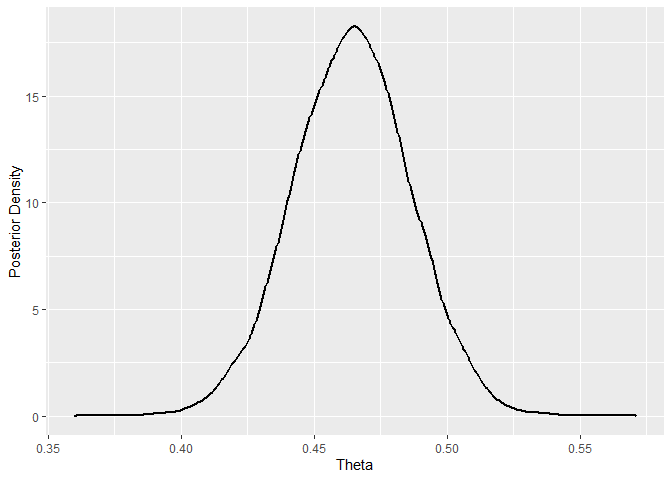<!-- --> The
interval estimates from the posterior distribution are known as
*credible intervals*. One popular choice is the highest posterior
density interval (HDPI); it is the narrowest interval that contains a
specific probability mass of the posterior distribution (McElreath
2018).

``` r
library(HDInterval)
hdi(extract(fit)$theta, credMass = 0.95)
```

    ##     lower     upper 
    ## 0.4210960 0.5073452 
    ## attr(,"credMass")
    ## [1] 0.95

``` r
# HDPI

hdi_low = hdi(extract(fit)$theta, credMass = 0.95)['lower']
hdi_high = hdi(extract(fit)$theta, credMass = 0.95)['upper']


hdi_data <- subset(dens_data, x >= hdi_low & x <= hdi_high)

ggplot(dens_data, aes(x = x, y = y)) + 
  geom_line(linewidth = 1) + 
  geom_area(data = hdi_data, aes(x = x, y = y), fill = "purple", alpha = 0.4) +
  geom_vline(xintercept = c(hdi_low, hdi_high), linetype = "dashed", color = "purple") +
  theme_classic() +
  labs(x = "Theta", y = "Posterior Density")
```

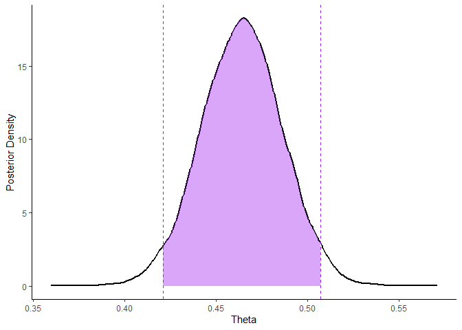<!-- -->

### Poisson Model

Let us move to the Poisson model, which is often used to model counts.
The individual observation has the distribution

``` math
p(y \mid \theta) = \frac{\theta^y e^{-\theta}}{y!}
```

for $y = 0, 1, 2, 3 \ldots$.

Consequently, the likelihood for $y_1, \ldots, y_n$ is (Gelman et al.
1995)

``` math
p(y \mid \theta) = \prod_{i = 1}^n \frac{\theta^{y_i} e^{-\theta}}{y_i!} \propto e^{-n\theta}\theta ^{\sum y_i}.
```

We can guess from the shape of the likelihood that the conjugate prior
must be of the form

``` math
p(\theta)  \propto \theta^{A} e^{B \theta},
```

which corresponds to the gamma distribution

``` math
p(\theta)  = \frac{\beta^\alpha}{\Gamma(\alpha)} \theta^{\alpha-1}e^{-\beta\theta}.
```

We also immediately get the posterior distribution for $\theta$.

``` math
p(\theta \mid y) = \text{Gamma }(\alpha + \sum_i y_i, \beta +n)
```

The Poisson model is sometimes reparametrized to model *rates* rather
than counts.

``` math
y_i \sim \text{Poisson }(x_i \theta),
```

where $x_i$ is called *exposure*, and it corresponds to variables such
as population size, area, or exposure time.

Let us demonstrate the Poisson model using data from
<https://robinryder.wordpress.com/2019/09/13/reproducing-the-kidney-cancer-example-from-bda/>
(based on (Gelman et al. 1995)), which consists of the number of kidney
cancer deaths in U.S. counties between 1980 and 1989. This example also
demonstrates how a prior distribution can serve to regularize our
estimator.

The kidney cancer deaths in the dataset are divided into two time
periods. We will combine them by averaging county populations and adding
the kidney cancer deaths.

``` r
library(usmap)

kidney_cancer = read.csv("C:/Users/elini/Desktop/nine circles 3/KidneyCancer.csv", skip=4)

kidney_cancer$pop_mean <- (kidney_cancer$pop + kidney_cancer$pop.2)/2
kidney_cancer$deaths_all = kidney_cancer$dc + kidney_cancer$dc.2
```

Let us first compute the MLE estimate of the cancer death rate
$\theta_i = \frac{deaths}{population}$. In addition, we will visualize
on a map of U.S. counties for which the rate estimate $\hat\theta$ is
greater than the 0.95 quantile and lower than the 0.05 quantile across
all counties.

``` r
# MLE estimate
kidney_cancer$theta_MLE <-  kidney_cancer$deaths_all / kidney_cancer$pop_mean

# estimates >= 0.95 quantile
kidney_cancer$cancer_high = kidney_cancer$theta_MLE >= quantile(kidney_cancer$theta_MLE, 0.95, na.rm = TRUE)

plot_usmap("counties", data=kidney_cancer, values="cancer_high") + scale_fill_discrete(h.start = 200, 
                      name = "Large rate of kidney cancer deaths")
```

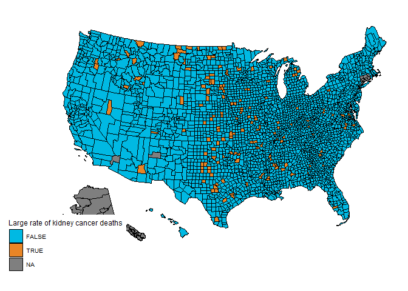<!-- -->

``` r
kidney_cancer$cancer_low = kidney_cancer$theta_MLE <= quantile(kidney_cancer$theta_MLE, 0.05, na.rm = TRUE)


plot_usmap("counties", data=kidney_cancer, values="cancer_low") + scale_fill_discrete(h.start = 200, 
                      name = "Low rate of kidney cancer deaths")
```

<!-- -->

These results are a bit surprising, since we observe both extremes
predominantly in central parts of the USA and almost none near the
coastlines. The reason is that these extremes often correspond to
low-population counties, i.e., the MLE estimates are quite unstable.

``` r
plot(log(kidney_cancer$pop_mean), kidney_cancer$theta_MLE, xlab = 'Log Population', ylab = 'Theta MLE ')
```

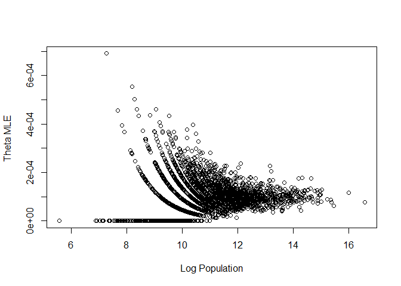<!-- -->

We can use Bayesian estimates to stabilize the estimates for counties
with smaller population. Following (Gelman et al. 1995), we will select
a suitable prior based on the observed rates. This is, naturally, not an
ideal approach; we should not use the data in such an informal way,
since it biases our inference. However, we will introduce in a later
chapter hierarchical models that allow us to estimate the parameters
$\alpha$ and $\beta$ directly.

``` r
alpha <- 5
beta <- 50000

# mean is alpha/beta

hist(kidney_cancer$theta_MLE, prob = TRUE, breaks = 100, ylab = "Prior PDF", xlab = "Theta", main = '')
curve(dgamma(x, alpha, beta, log = FALSE), from = 0, to = 3e-4, 
      col = "red", lwd = 2, add = TRUE)
```

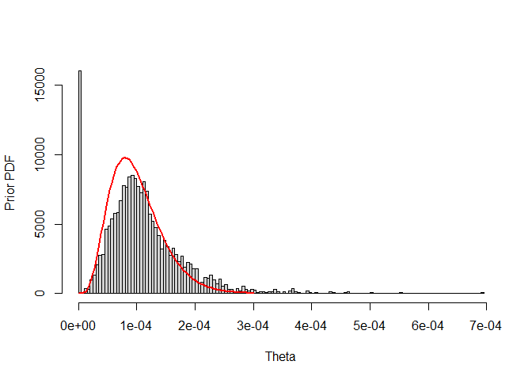<!-- -->

Let us recompute our rate estimates.

``` r
kidney_cancer$theta_Bayes <-  (alpha + kidney_cancer$deaths_all) / (beta + kidney_cancer$pop_mean)
plot(log(kidney_cancer$pop_mean), kidney_cancer$theta_Bayes, xlab = 'Log Population', ylab = 'Theta Bayes')
```

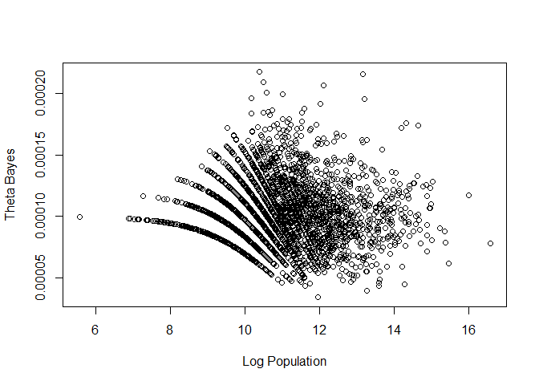<!-- -->

We observe that the estimates for counties with low population are much
more reasonable.

``` r
# Bayes estimates >= 0.95 quantile
kidney_cancer$cancer_high = kidney_cancer$theta_Bayes >= quantile(kidney_cancer$theta_Bayes, 0.95, na.rm = TRUE)

plot_usmap("counties", data=kidney_cancer, values="cancer_high") + scale_fill_discrete(h.start = 200, 
                      name = "Large rate of kidney cancer deaths")
```

<!-- -->

``` r
# Bayes estimates <= 0.05 quantile

kidney_cancer$cancer_low = kidney_cancer$theta_Bayes <= quantile(kidney_cancer$theta_Bayes, 0.05, na.rm = TRUE)


plot_usmap("counties", data=kidney_cancer, values="cancer_low") + scale_fill_discrete(h.start = 200, 
                      name = "Low rate of kidney cancer deaths")
```

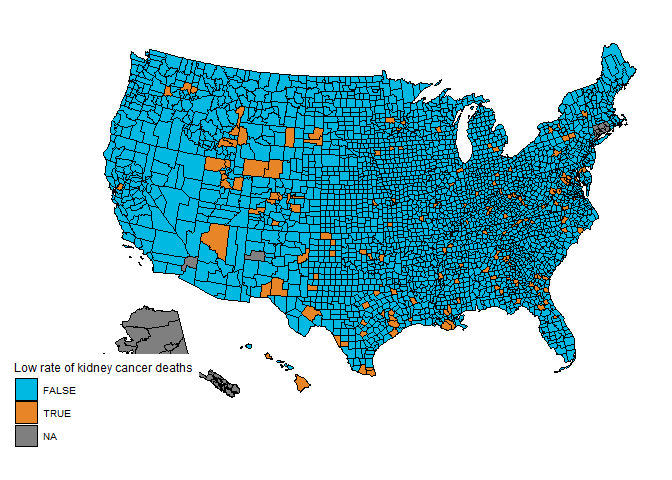<!-- -->

Some extremes now occur in more densely populated coastal regions.

### Exponential Model

The last single-parameter model we will mention in this fart part of our
introduction to Bayesian inference is the exponential model. The
exponential distribution is commonly used to model the time until an
event occurs. The exponential distribution is as follows.

``` math
p(y \mid \theta) = \theta e^{-\theta y}
```

Looking at the distribution, we can quickly infer that the conjugate
prior for the exponential likelihood is a gamma distribution. For
$\text{Gamma }(\alpha, \beta)$ prior, we get the posterior

``` math
p(\theta \mid y) = \text{Gamma }(\alpha + n, \beta + \sum_i y_i).
```

Let us demonstrate the use of the exponential distribution on the call
center dataset
(<https://www.kaggle.com/code/santosjgnd/call-center-dataset/notebook>)
that consists of time differences between successive calls.

``` r
call_center = read.csv("C:/Users/elini/Desktop/nine circles 3/call_center_small.csv", sep = ',')
head(call_center)
```

    ##              datetime interval
    ## 1 2021-01-01 09:12:58        0
    ## 2 2021-01-01 09:47:31     2073
    ## 3 2021-01-01 09:47:31        0
    ## 4 2021-01-01 10:00:29      778
    ## 5 2021-01-01 10:00:29        0
    ## 6 2021-01-01 10:22:05     1296

First, we will check whether the time intervals follow an exponential
distribution (we fit the data with an exponential distribution using the
rate $n/\sum_i y_i$).

``` r
call_center = read.csv("C:/Users/elini/Desktop/nine circles 3/call_center_small.csv", sep = ',')
hist(call_center$interval, prob = TRUE, breaks = 100, ylab = "Density", xlab = "Time Intervals", main = '')
curve(dexp(x, rate = 1/mean(call_center$interval), log = FALSE), from = 0, to = 8000, 
      col = "red", lwd = 2, add = TRUE)
```

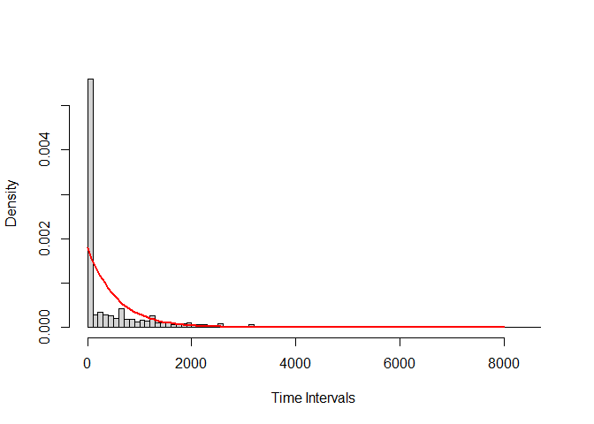<!-- -->

Well, it seems they do not. However, let us repeat the fit only for time
intervals greater than zero.

``` r
call_center = read.csv("C:/Users/elini/Desktop/nine circles 3/call_center_small.csv", sep = ',')
hist(call_center$interval[call_center$interval> 0], prob = TRUE, breaks = 100, ylab = "Density", xlab = "Time Intervals > 0", main = '')
curve(dexp(x, rate = 1/mean(call_center$interval[call_center$interval> 0]), log = FALSE), from = 0, to = 8000, 
      col = "red", lwd = 2, add = TRUE)
```

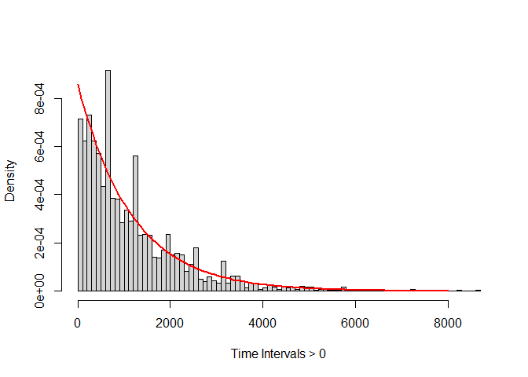<!-- -->

That looks much better. We observe that the data are not purely from the
exponential distribution; there is another process that generates an
“excessive” number of zeros. What is actually happening here is that the
call center cannot process all the calls as they go in, since they have
only so many operators. Hence, when too many people call at once, the
call center has to process them in batches, which appears in the dataset
as a large number of calls that start at the same time.

We have discussed models for data with an excessive number of zeros in
*Fourth Circle: Count Regression*, namely *hurdle models* and
*zero-inflated models*. We will discuss hurdle models here, since the
exponential distribution (unlike, e.g., the Poisson) is a continuous
distribution and hence does not produce exact zeros on its own.

A hurdle model is a simple two-part model. The first part is a Bernoulli
model (with parameter $\theta$) that generates either a zero or a
nonzero response. Provided that the response is nonzero, the response is
generated from a truncated distribution. In our case, it is a
zero-truncated exponential distribution with rate $\lambda$, which is
just an exponential distribution, since the exponential distribution is
continuous.

Let us fit the appropriate Bayesian model. We will assume a beta prior
for $\theta$ and a gamma prior for $\lambda$. The Stan code for a hurdle
model is as follows
(<https://mc-stan.org/docs/2_24/stan-users-guide/zero-inflated-section.html>).

``` default
data {
  int<lower=0> N;          // Number of observations
  vector<lower=0>[N] y;    // Observed lengths of time intervals
  real<lower=0> alpha_b;   // Alpha parameter of beta prior 
  real<lower=0> beta_b;    // Beta parameter of beta prior
  real<lower=0> alpha_g;   // Alpha parameter of gamma prior 
  real<lower=0> beta_g;    // Beta parameter of gamma prior  
}
parameters {
  real<lower=0, upper=1> theta;  // Probability of excess zero
  real<lower=0> lambda;          // Exponential rate parameter
}
model {
  // Priors
  theta ~ beta(alpha_b, beta_b);
  lambda ~ gamma(alpha_g, beta_g);

  // Likelihood
  for (n in 1:N) {
    if (y[n] == 0)
      target += log(theta);
    else
      target += log1m(theta) + exponential_lpdf(y[n] | lambda); // in general we have to truncate!, e.g., add -poisson_lccdf(0 | lambda) for poisson
  }
}
generated quantities {
  vector[N] y_rep;         // Simulated dataset
  
  for (i in 1:N) {
    // Determine if the observation is a structural zero
    int is_zero = bernoulli_rng(theta);
    
    if (is_zero == 1) {
      y_rep[i] = 0;
    } else {
      // Otherwise, draw from the exponential distribution
      y_rep[i] = exponential_rng(lambda);
    }
  }
}
```

Note that we also added a *generated quantities* block that generates
new datasets from the parameter’s posterior draws; we can then compare
these simulated datasets with the observed data to assess how well our
model fits the data. Let us fit the model. We choose uniform prior for
$\theta$ (beta with $\alpha = 1$, $\beta = 1$). For the rate, we choose
$\text{Gamma }(1,0.5)$, since it seems that the non-zero intervals
between calls are quite long (i.e., the rate is probably small).

``` r
curve(dgamma(x, 1, 0.5), from = 0, to = 5, 
      col = "blue", lwd = 2, ylab = "Prior PDF", xlab = "Lambda")
```

<!-- -->

``` r
stan_data <- list(
  N = length(call_center$interval),
  y = call_center$interval,
  alpha_b = 1,
  beta_b = 1,
  alpha_g = 1,
  beta_g = 0.5
)

fit <- stan(
  file  = "C:/Users/elini/Desktop/nine circles 3/f1_s2.stan",
  data = stan_data,
  chains = 4,
  iter = 3000,
  warmup = 2000,
  seed = 123,
  refresh = 0
)
```

The posterior densities of $\theta$ and $\lambda$ are as follows.

``` r
# posterior density theta

dens <- density(extract(fit)$theta)
dens_data <- data.frame(x = dens$x, y = dens$y)

ggplot(dens_data, aes(x = x, y = y)) +  geom_line(linewidth = 1) + xlab('Theta') + ylab('Posterior Density')
```

<!-- -->

``` r
# posterior density lambda

dens <- density(extract(fit)$lambda)
dens_data <- data.frame(x = dens$x, y = dens$y)

ggplot(dens_data, aes(x = x, y = y)) +  geom_line(linewidth = 1) + xlab('Lambda') + ylab('Posterior Density')
```

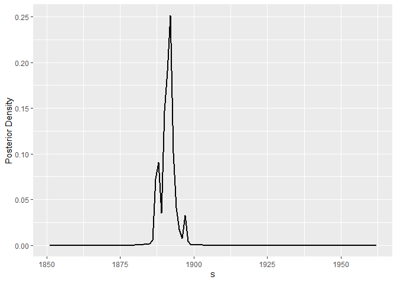<!-- -->

Let us compare our data with datasets generated for parameters sampled
from the posterior distribution.

``` r
y_sim <- extract(fit)$y_rep

par(mfrow = c(1, 2))
hist(call_center$interval, breaks = 100, plot=TRUE, xlab = '', main = 'Observed Dataset')
hist(y_sim[100, 1:length(call_center$interval)], breaks = 100, xlab = '', main = 'Simulated Dataset')
```

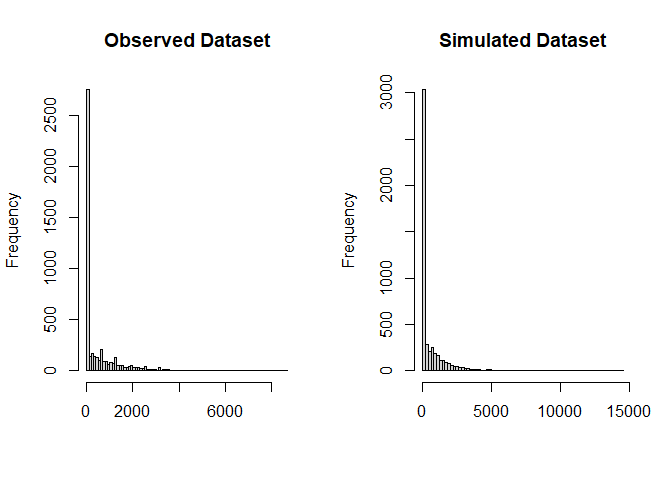<!-- -->

``` r
hist(y_sim[500, 1:length(call_center$interval)], breaks = 100, xlab = '', main = 'Simulated Dataset')
hist(y_sim[1000, 1:length(call_center$interval)], breaks = 100, xlab = '', main = 'Simulated Dataset')
```

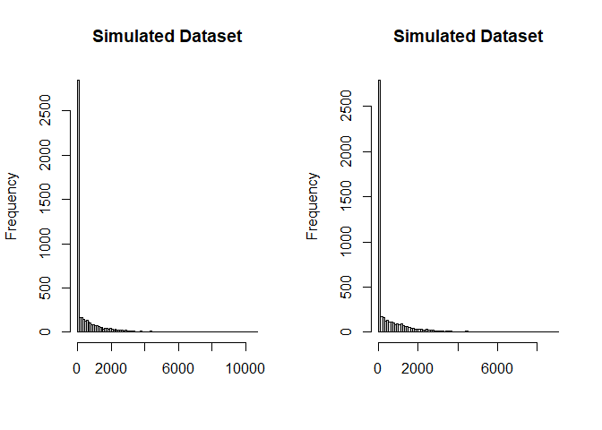<!-- -->

``` r
hist(y_sim[1100, 1:length(call_center$interval)], breaks = 100, xlab = '', main = 'Simulated Dataset')
hist(y_sim[1250, 1:length(call_center$interval)], breaks = 100, xlab = '', main = 'Simulated Dataset')
```

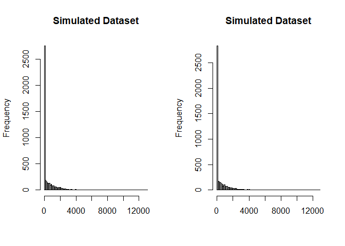<!-- --> We
observe that the simulated datasets are quite close to the observed data
(we will explore Bayesian model diagnostics in some later project).

## German Tank Problem

As the final step in this introduction, we will look at the famous
German tank problem
(<https://en.wikipedia.org/wiki/German_tank_problem>). The task is to
estimate the population size $N$ from a random sample (without
replacement) drawn from ${1, \ldots, N}$. This task is known as the
German tank problem because these estimates were used by the Allies
during the Second World War to estimate German tank production using the
serial numbers of destroyed/captured tanks. It turned out, after
reviewing official records, that these estimates were much more accurate
than the intelligence estimate.

The Stan code for solving the German tank problem is as follows. We
should note here that this is an “approximation”. The code below solves
the problem of estimating a *real* $N_\text{total}$ using samples from
$\text{Uniform} (0, N_\text{total})$. The primary reason to do it this
way is that Stan does not allow sampling of discrete-valued parameters.

The prior in the code is uniform over the interval *\[0, N_max_est\]*.

``` default
data {
  int<lower=0> N;             // Number of observed tanks
  vector[N] y;                // Observed serial numbers
  real<lower=0> N_max_est;    // Prior estimate of N_max
}
parameters {
  real<lower=max(y)> N_total;  // True population size
}

model {
  // Prior for N_total
  N_total ~ uniform(max(y), N_max_est); 
  
  // Likelihood
  for (i in 1:N) {
    y[i] ~ uniform(0, N_total);
  }
}
```

Let us fit the model to observations 19, 40, 42, and 60 (taken from
<https://en.wikipedia.org/wiki/German_tank_problem>).

``` r
stan_data <- list(
  N = 4,
  y = c(19, 40, 42, 60),
  N_max_est = 200
)

fit <- stan(
  file  = "C:/Users/elini/Desktop/nine circles 3/f1_s3.stan",
  data = stan_data,
  chains = 4,
  iter = 4000,
  warmup = 2000,
  seed = 123,
  refresh = 0
)
```

Let us plot the posterior density. The red line denotes the mode, the
purple line denotes the median, and the blue line denotes the mean.

``` r
dens <- density(extract(fit)$N_total)
dens_data <- data.frame(x = dens$x, y = dens$y)

ggplot(dens_data, aes(x = x, y = y)) +  geom_line(linewidth = 1) + xlim(50, 150) +  
  geom_vline(xintercept = mean(extract(fit)$N_total), color = "blue", linetype = "dashed", linewidth  = 1) +
  geom_vline(xintercept = dens$x[which.max(dens$y)], color = "red", linetype = "dashed", linewidth  = 1) +
  geom_vline(xintercept = median(extract(fit)$N_total), color = "purple", linetype = "dashed", linewidth  = 1) +
  xlab('N_total') + ylab('Posterior Density') +
  annotate(geom = "text", x = mean(extract(fit)$N_total), y = +Inf, 
           label = round(mean(extract(fit)$N_total),2), color = "blue", 
           vjust = 1.5, hjust = -0.1) + 
  annotate(geom = "text", x = dens$x[which.max(dens$y)], y = +Inf, 
           label = round(dens$x[which.max(dens$y)],2), color = "red", 
           vjust = 1.5, hjust = -0.1) +
 annotate(geom = "text", x = median(extract(fit)$N_total), y = +Inf, 
           label = round(median(extract(fit)$N_total),2), color = "purple",  
           vjust = 1.5, hjust = -0.1)
```

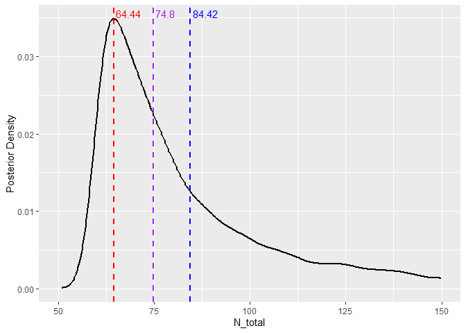<!-- -->

We observe that these estimators are quite in line with those on
<https://en.wikipedia.org/wiki/German_tank_problem> for the discrete
problem (e.g., the minimum-variance unbiased estimator is 74).

The last thing we will mention in this part is one important
observation. Up to this point, all our priors were *proper* probability
densities However, we can look at the Bayes formula purely
algebraically, and we can always compute posterior distribution provided
that $p(y \mid \theta)p(\theta)$ has finite integral (i.e., can be
normalized to one) regardless whether $p(\theta)$ is a density or not.

Hence, we can suppose $p(\theta) = 1$ (flat prior) and run Stan code
like this

``` default
data {
  int<lower=0> N;             // Number of observed tanks
  vector[N] y;                // Observed serial numbers
}
parameters {
  real<lower=max(y)> N_total;  // True population size
}

model {
  // Likelihood for a continuous uniform draw and no prior! (i.e., prior = 1)
  for (i in 1:N) {
    y[i] ~ uniform(1, N_total);
  }
}
```

and get a reasonable result.

``` r
stan_data <- list(
  N = 4,
  y = c(19, 40, 42, 60)
)

fit <- stan(
  file  = "C:/Users/elini/Desktop/nine circles 3/f1_s4.stan",
  data = stan_data,
  chains = 4,
  iter = 4000,
  warmup = 2000,
  seed = 123,
  refresh = 0
)
```

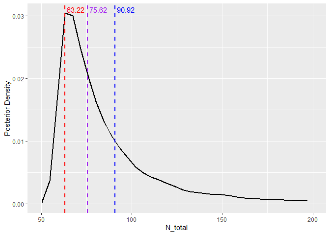<!-- --> 

We should, however, note that using these very flat priors is generally not
recommended (see
<https://github.com/stan-dev/stan/wiki/prior-choice-recommendations>).
For example, they allow unreasonable parameter values, which makes MCMC
sampling more difficult.

    ## [1] 2246.976

# References

<div id="refs" class="references csl-bib-body hanging-indent"
entry-spacing="0">

<div id="ref-gelman1995bayesian" class="csl-entry">

Gelman, Andrew, John B Carlin, Hal S Stern, and Donald B Rubin. 1995.
*Bayesian Data Analysis*. Chapman; Hall/CRC.

</div>

<div id="ref-kruschke2014doing" class="csl-entry">

Kruschke, John et al. 2014. *Doing Bayesian Data Analysis*. Vol. 2.
Elsevier.

</div>

<div id="ref-mcelreath2018statistical" class="csl-entry">

McElreath, Richard. 2018. *Statistical Rethinking: A Bayesian Course
with Examples in r and Stan*. Chapman; Hall/CRC.

</div>

</div>
