# The First Circle: Introduction to Bayesian Statistics, Part Two
<big></big>
<span style="font-size:large;"> **Simple Multiparameter Models** </span>

<br/>
Jiří Fejlek

2026-06-22
<br/>

<br/> In the second part of our introduction to Bayesian Statistics, 
we will continue our presentation by demonstrating simple multiparameter 
models. More specifically, we will focus primarily on two fundamental 
models with known conjugate priors: the normal and multinomial models. 
However, we will provide some examples of multiparameter models that 
must be estimated numerically at the end. <br/>

## Table of Contents
- [Normal Model](#normal-model)
- [Multinomial Model](#multinomial-model)
- [Bioassay Experiment](#bioassay-experiment)
- [Binomial Model with Unknown Probability and Sample
  Size](#binomial-model-with-unknown-probability-and-sample-size)
- [Coal Mining Disasters](#coal-mining-disasters)
- [References](#references)

``` r
library(rstan)
library(ggplot2)
library(HDInterval)
```

## Normal Model

We will start with the simplest (and probably the most important)
multiparameter model: the model for independent observations from a
normal distribution with unknown mean and variance, i.e., the
distribution of a single observation $y$ is

``` math
p(y, \mid \mu, \sigma) = \frac{1}{\sqrt{2\pi\sigma^2}} e^{-\frac{(y-\mu)^2}{2\sigma^2}}.
```

#### Conjugate Prior for Unknown $\mu$

Let us start with cases when one of the parameters is actually known.
First, we will assume that the mean $\mu$ is not known, but the variance
$\sigma^2$ is known. From the shape of the likelihood, we can guess that
the conjugate prior for the mean is also normal, i.e., let us assume a
prior

``` math
p(\mu) \propto  e^{-\frac{(\mu -\mu_0)^2}{2\tau^2_0}}
```

After we multiply the prior by the likelihood (for a single observation)
and complete the square, we obtain (Gelman et al. 1995)

``` math
p(\mu \mid y) \propto e^{-\frac{(y-\mu)^2}{2\sigma^2} - \frac{(\mu-\mu_0)^2}{2\tau^2_0}} \propto e^{-\frac{(y-\mu_1)^2}{2\tau^2_1}},
```

i.e., we derive that $\mu \mid y \sim N(\mu_1, \tau_1^2)$, where

``` math
\mu_1 =  \frac{\frac{\mu_0}{\tau_0^2} + \frac{y}{\sigma^2}}{\frac{1}{\sigma^2} + \frac{1}{\tau^2_0}}
```

and where

``` math
\frac{1}{\tau^2_1} = \frac{1}{\sigma^2} + \frac{1}{\tau^2_0}.
```

The derivation for multiple observations is analogous. The posterior
mean meets

``` math
\mu_n =  \frac{\frac{\mu_0}{\tau_0^2} + \frac{n\bar y}{\sigma^2}}{\frac{n}{\sigma^2} + \frac{1}{\tau^2_0}},
```

where

``` math
\frac{1}{\tau^2_n} = \frac{n}{\sigma^2} + \frac{1}{\tau^2_0}.
```

The crucial observation here is that for large $n$, we get
$\mu \mid y \approx N(\bar y, \frac{\sigma^2}{n})$, which is a Bayesian
analogue to the standard result about sampling distribution of mean
$\bar y \mid \mu, \sigma^2 \sim N(\mu, \sigma^2/n)$.

#### Conjugate Prior for Unknown $\sigma$

Let’s switch things around and assume that the unknown parameter is
$\sigma^2$. Hence, we can write the likelihood for multiple observations
as

``` math
p(y \mid \sigma^2) \propto (\sigma^2){^{-n/2}}\text{exp}\left(\frac{nv}{2\sigma^2} \right),
```

where $v = \frac{1}{n}\sum_i (y_i - \mu)^2$. In this form, we should
recognize the distribution as gamma, but the variable is $1/\sigma^2$
instead of $\sigma^2$. Thence, the conjugate prior for $\sigma^2$ is
actually *inverse-gamma* (Gelman et al. 1995)

``` math
p(\sigma^2)  = \frac{\beta^\alpha}{\Gamma(\alpha)} (1/\sigma^2)^{\alpha+1}e^{-\beta/\sigma^2}.
```

It useful to reparametrize the distribution into an *inverse*
$\chi^2$-*squared distribution* with $\nu_0$ degrees of freedom and a
scale parameter $\sigma_0^2$ (we will use a notation
$\text{Inv-}\chi^2 (\nu_0, \sigma_0^2)$ )

``` math
p(\sigma)  \propto (1/\sigma^2)^{\nu_0/2+1}e^{-\nu_0\sigma_0^2/2\sigma^2},
```

because then, the posterior is

``` math
p(\sigma \mid y) \propto (1/\sigma^2)^{(n+\nu_0)/2+1} \text{exp }\left(-\frac{1}{2\sigma^2}(\nu_0\sigma_0^2 + nv )\right)
```

which is also inverse $\chi^2$-squared distribution (with $n+\nu_0$
degrees of freedom and the scale parameter
$\frac{\nu_0\sigma_0^2 + nv}{n+\nu_0}$) (Gelman et al. 1995).

#### Noninformative Prior for Unknown $\mu$ and $\sigma$

We will now use the results from the previous subsections to construct a
Bayesian estimate for a more typical situation in which both the mean
and variance are unknown. First, we will consider a *noninformative
prior*, which corresponds to the posteriors for large $n$ that we can
force (even for small $n$) by setting $\tau_0 \rightarrow  +\infty$ and
$\nu_0 = 0$. Consequently, we obtain the priors (Gelman et al. 1995)

``` math
\begin{align*}
p(\mu) & \propto 1\\
p(\sigma^2) & \propto 1/\sigma^2,
\end{align*}
```

which we combine assuming the prior independence as

``` math
p(\mu,\sigma^2)  \propto 1/\sigma^2.
```

The posterior is

``` math
p(\mu, \sigma \mid y) \propto (\sigma^2)^{n/2+1} e^{-\frac{\sum_i (y_i-\mu)^2}{2\sigma^2}} = (\sigma^2)^{n/2+1} \text{exp }\left({-\frac{1}{2\sigma^2}((n-1)s^2 + n(\bar y - \mu)^2)} \right),
```

where $s = \frac{1}{n-1}\sum_i (y_i - \bar y)^2$. To draw samples from
the posterior, we first draw $\sigma^2$ from its marginal posterior

``` math
\sigma^2 \mid y \sim \text{Inv-}\chi^2 (n-1, s^2)
```

(which we can derive from the joint posterior by integrating over
$\mu$). By the way, this formula is very similar to the standard
frequentist result $\frac{(n-1) s^2}{\sigma^2} \sim \chi^2_{n-1}$. We
then draw $\mu$ from
$\mu \mid y, \sigma^2 \sim N(\bar y, \sigma^2 / n)$. Here we are using
that
$p(\mu, \sigma^2 \mid y) = p(\mu \mid y,\sigma^2)p(\sigma^2 \mid y)$.We
can also obtain marginal density $\mu \mid y$ by integrating out
$\sigma^2$, which leads to (Gelman et al. 1995)

``` math
\frac{\mu - \bar y}{s / \sqrt{n}} \sim t_{n-1}.
```

This is another crossover with frequentist statistics, from which we
know that
$\frac{\bar y - \mu}{s/\sqrt{n}} \mid \mu, \sigma^2 \sim t_{n-1}$.

#### Conjugate Prior for Unknown $\mu$ and $\sigma$

As the last step, let us have a look at the conjugate prior for $\mu$
and $\sigma$, which can be stated as (Gelman et al. 1995)

``` math
\begin{align*}
\mu \mid \sigma^2  &\sim N(\mu_0, \sigma^2 \ \kappa_0)\\
\sigma^2 &\sim \text{Inv-}\chi^2 (\nu_0, \sigma^2_0)
\end{align*}
```

and it is known as a *normal-gamma* distribution. It can be shown that
the Bayes update of parameters is as follows.

``` math
\begin{align*}
\mu_n & = \frac{\kappa_0}{\kappa_0 + n}\mu_0 + \frac{n}{\kappa_0 + n }\bar y\\
\kappa_n &= \kappa_0 + n\\
\nu_n &= \nu_0 + n\\
\nu_n\sigma^2_n &= \nu_0\sigma^2_0 + (n-1)s^2 + \frac{\kappa_0n}{\kappa_0 + n}(\bar y-\mu_0)^2.
\end{align*}
```

The marginal densities are

``` math
\sigma^2 \mid y \sim \text{Inv-}\chi^2 (\nu_n, \sigma^2_n)
```

and

``` math
\mu \mid y \sim t_{\nu_n}(\mu_n, \sigma^2_n/\kappa_n),
```

where $t$ denotes scaled and shifted Student’s t distribution.

#### Measurements of the Speed of Light

To demonstrate the normal model, we will use data from Simon Newcomb’s
1882 experiments (Gelman et al. 1995), in which he measured the time it
took light to travel about 7,400 meters (with deviations from $24800$
nanoseconds).

``` r
y = c(28, 26, 33, 24, 34, -44, 27, 16, 40, -2, 29, 22, 24, 21, 25, 30, 23, 29, 31, 19, 24, 20, 36, 32, 36, 28, 25, 21, 28, 29,
37, 25, 28, 26, 30, 32, 36, 26, 30, 22, 36, 23, 27, 27, 28, 27, 31, 27, 26, 33, 26, 32, 32, 24, 39, 28, 24, 25, 32, 25,
29, 27, 28, 29, 16, 23)

hist(y, main = '', xlab = 'Time in nanoseconds', breaks = 100)
```

<!-- -->

The data seems to be fairly normal except for two outliers.

``` r
qqnorm(y)
qqline(y)
```

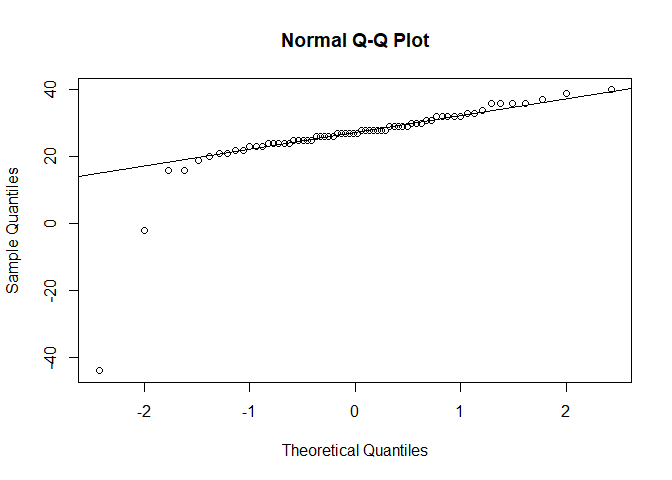<!-- -->

Let us first use the noninformative priors.

``` default
data {
  int<lower=0> N;          // Number of observations
  vector[N] y;             // Target variable
}

parameters {
  real mu;                 // Mean parameter
  real<lower=0> sigma;     // Standard deviation parameter
}

model {
  
  // Prior for mu is flat, hence target += 0

  // Prior for sigma^2 ~ 1/sigma^2
  target += -2*log(sigma);

  // Likelihood
  y ~ normal(mu, sigma);
}
```

``` r
stan_data <- list(
  N = length(y[y>0]),
  y = y[y>0]
)

fit <- stan(
  file  = "C:/Users/elini/Desktop/nine circles 3/f1_s5.stan",
  data = stan_data,
  chains = 4,
  iter = 4000,
  warmup = 2000,
  seed = 123,
  refresh = 0
)
```

Let us plot the samples from the marginal posterior densities.

``` r
mu_sample <- extract(fit)$mu

dens <- density(mu_sample)
dens_data <- data.frame(x = dens$x, y = dens$y)

ggplot(dens_data, aes(x = x, y = y)) +  geom_line(linewidth = 1) + xlab('Mu') + ylab('Posterior Density')
```

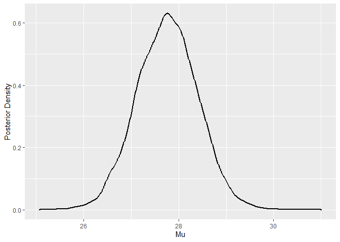<!-- -->

``` r
sigma_sample <- extract(fit)$sigma

dens <- density(sigma_sample)
dens_data <- data.frame(x = dens$x, y = dens$y)

ggplot(dens_data, aes(x = x, y = y)) +  geom_line(linewidth = 1) + xlab('Sigma') + ylab('Posterior Density')
```

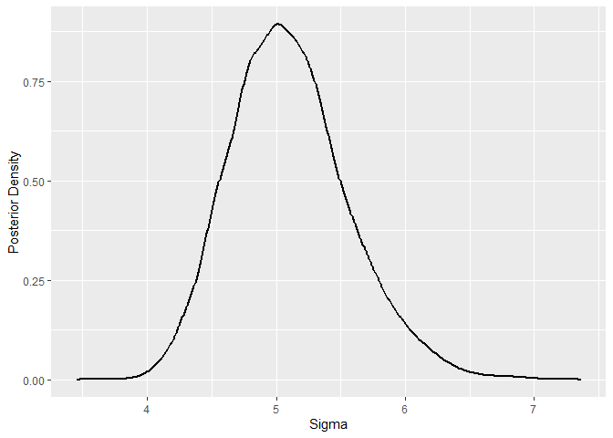<!-- -->

Let us check the theoretical results. We stated that
$\frac{\mu - \bar y}{s / \sqrt{n}} \mid y \sim t_{n-1}.$

``` r
n <- length(y[y>0])
s2 <- var(y[y>0])

dens <- density((mu_sample - mean(y[y>0]))/(sqrt(s2)/sqrt(n))) # standardize mu
dens_data <- data.frame(x = dens$x, y = dens$y)
ggplot(dens_data, aes(x = x, y = y)) +  geom_line(linewidth = 1) + xlab('Std. Mu') + ylab('Posterior Density') + stat_function(fun = dt, args = list(df = n- 1), color = "red", linewidth = 1, linetype = "dashed") # student distribution with (n-1) degrees of freedom
```

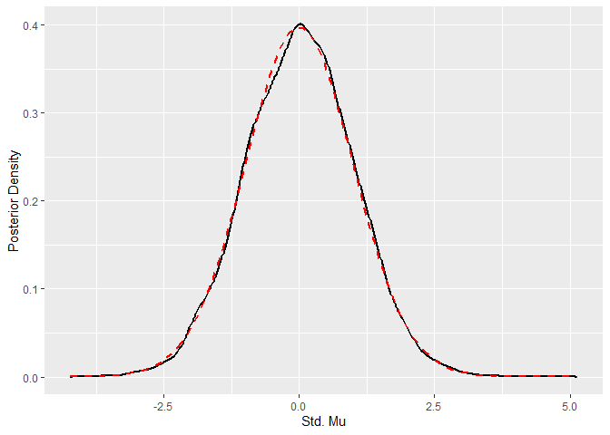<!-- -->

We observe that samples of $\mu$ closely follow the theoretical
distribution. We also know that
$\sigma^2 \mid y \sim \text{Inv-}\chi^2 (n-1, s^2)$.

``` r
library(extraDistr)

dens <- density(sigma_sample^2) 
dens_data <- data.frame(x = dens$x, y = dens$y)
ggplot(dens_data, aes(x = x, y = y)) +  geom_line(linewidth = 1) + xlab('Sigma^2') + ylab('Posterior Density') + stat_function(fun = dinvchisq, args = list(nu = n- 1, tau = s2), color = "red", linewidth = 1, linetype = "dashed") # Inverse chi-squared: nu = degrees of freedom, tau = scale parameter
```

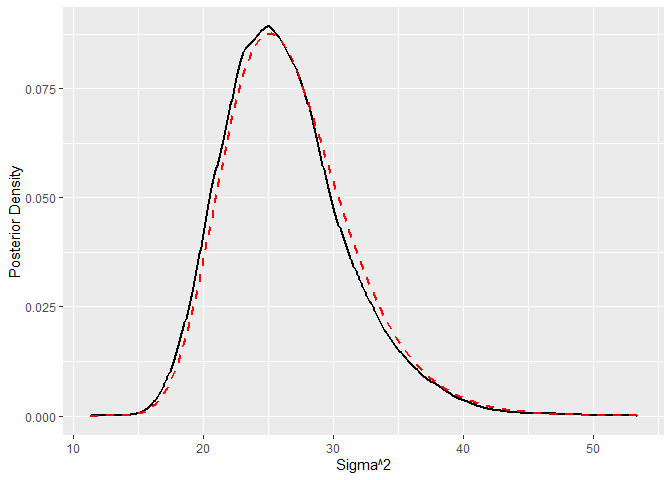<!-- -->

Again, the samples are quite close to the theory.

As far as the estimate of the speed of light is concerned, provided that
we use the simple mean as the point estimate

``` r
mean(mu_sample)
```

    ## [1] 27.75988

we get the speed of light

``` r
distance = 7442 # distance in meters
time = (mean(mu_sample) + 24800)*10^(-9) # time in seconds
distance/time
```

    ## [1] 299745125

which is pretty close to the actual speed of light in the air
$299702547 \text{ ms}^{-1}$.

Next, we move to the conjugate prior.

``` default
data {
  int<lower=0> N;          // Number of observations
  vector[N] y;             // Target variable
  
  // Prior parameters
  real mu0;
  real<lower=0> kappa0;
  real<lower=0> nu0;
  real<lower=0> sigma0;
}

parameters {
  real mu;                  // Mean parameter
  real<lower=0> sigma2;     // Variance parameter
}

transformed parameters {
  real<lower=0> sigma = sqrt(sigma2);
}

model {

  // Prior for sigma^2
  sigma2 ~ scaled_inv_chi_square(nu0, sigma0); // Inverse chi-squared in stan is parametrized by (nu, sigma)!

  // Prior for mu
  mu ~ normal(mu0, kappa0*sigma);

  // Likelihood
  y ~ normal(mu, sigma);
}
```

We will consider several priors for variance.

``` r
curve(dinvchisq(x, nu = 5, tau = 20),  from = 0.001, to = 250, col = "blue", lwd = 2)
curve(dinvchisq(x, nu = 10, tau = 50),  from = 0.001, to = 250, col = "purple", lwd = 2, add = TRUE)
curve(dinvchisq(x, nu = 20, tau = 100),  from = 0.001, to = 250, col = "red", lwd = 2, add = TRUE)
curve(dinvchisq(x, nu = 30, tau = 150),  from = 0.001, to = 250, col = "green", lwd = 2, add = TRUE)
```

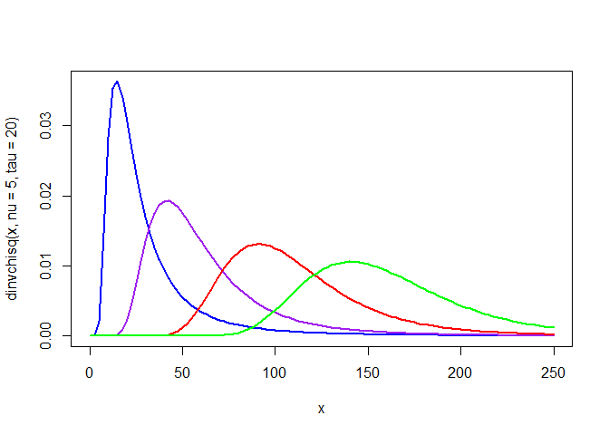<!-- -->

Other than that, we set the prior mean as $\mu_0 = 0$, and
$\kappa_0 = 1$. Let us fit the models.

``` r
stan_data1 <- list(N = n, y = y[y>0], mu0 = 0, kappa0 = 1, nu0 = 5, sigma0 = sqrt(20))
stan_data2 <- list(N = n, y = y[y>0], mu0 = 0, kappa0 = 1, nu0 = 10, sigma0 = sqrt(50))
stan_data3 <- list(N = n, y = y[y>0], mu0 = 0, kappa0 = 1, nu0 = 20, sigma0 = sqrt(100))
stan_data4 <- list(N = n, y = y[y>0], mu0 = 0, kappa0 = 1, nu0 = 30, sigma0 = sqrt(150))


fit1 <- stan( file  = "C:/Users/elini/Desktop/nine circles 3/f1_s6.stan", data = stan_data1, chains = 4, iter = 4000, warmup = 2000, seed = 123, refresh = 0)

fit2 <- stan( file  = "C:/Users/elini/Desktop/nine circles 3/f1_s6.stan", data = stan_data2, chains = 4, iter = 4000, warmup = 2000, seed = 123, refresh = 0)

fit3 <- stan( file  = "C:/Users/elini/Desktop/nine circles 3/f1_s6.stan", data = stan_data3, chains = 4, iter = 4000, warmup = 2000, seed = 123, refresh = 0)

fit4 <- stan( file  = "C:/Users/elini/Desktop/nine circles 3/f1_s6.stan", data = stan_data4, chains = 4, iter = 4000, warmup = 2000, seed = 123, refresh = 0)
```

Next, we plot the marginal posterior densities.

``` r
dens1 <- density(extract(fit1)$mu)
dens_data1 <- data.frame(x = dens1$x, y = dens1$y)
dens2 <- density(extract(fit2)$mu)
dens_data2 <- data.frame(x = dens2$x, y = dens2$y)
dens3 <- density(extract(fit3)$mu)
dens_data3 <- data.frame(x = dens3$x, y = dens3$y)
dens4 <- density(extract(fit4)$mu)
dens_data4 <- data.frame(x = dens4$x, y = dens4$y)

ggplot() +  geom_line(data = dens_data1, aes(x = x, y = y), linewidth = 1, color = 'blue') + geom_line(data = dens_data2, aes(x = x, y = y), linewidth = 1, color = 'purple') + geom_line(data = dens_data3, aes(x = x, y = y), linewidth = 1, color = 'red') + geom_line(data = dens_data4, aes(x = x, y = y), linewidth = 1, color = 'green') + xlab('Mu') + ylab('Posterior Density')
```

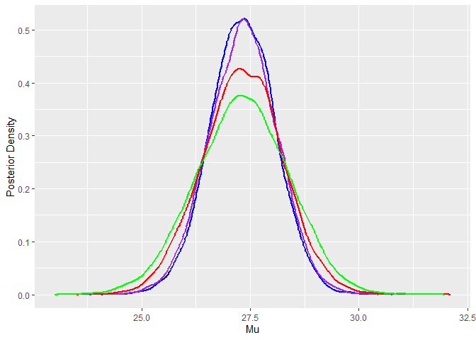<!-- -->

``` r
dens1 <- density(extract(fit1)$sigma2)
dens_data1 <- data.frame(x = dens1$x, y = dens1$y)
dens2 <- density(extract(fit2)$sigma2)
dens_data2 <- data.frame(x = dens2$x, y = dens2$y)
dens3 <- density(extract(fit3)$sigma2)
dens_data3 <- data.frame(x = dens3$x, y = dens3$y)
dens4 <- density(extract(fit4)$sigma2)
dens_data4 <- data.frame(x = dens4$x, y = dens4$y)


ggplot() +  geom_line(data = dens_data1, aes(x = x, y = y), linewidth = 1, color = 'blue') + geom_line(data = dens_data2, aes(x = x, y = y), linewidth = 1, color = 'purple') + geom_line(data = dens_data3, aes(x = x, y = y), linewidth = 1, color = 'red') + geom_line(data = dens_data4, aes(x = x, y = y), linewidth = 1, color = 'green') + xlab('Sigma^2') + ylab('Posterior Density')
```

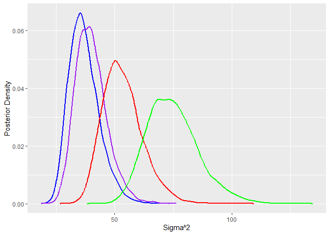<!-- -->

We observe that the marginal posterior density for $\mu$ is quite
similar. The marginal posterior density of $\sigma^2$ varies somewhat
because accurately estimating the variance requires more data; hence,
the priors have more influence on the result.

We can check the theoretical formulas again. First, we derive the
marginal posterior for $\sigma^2$.

``` r
mu0 <- 0
kappa0 <- 1
nu0 <- c(5,10,20,30)
sigma_sq0 <- c(20,50,100,150)

nu_n <- nu0 + n
sigma_sqn <- 1/nu_n*(nu0*sigma_sq0 + (n-1)*s2 + kappa0*n/(kappa0 + n)*(mean(y[y>0]) - mu0)^2)

curve(dinvchisq(x, nu = nu_n[1], tau = sigma_sqn[1]),  from = 0, to = 150, col = "blue", lwd = 2, xlab = 'Sigma^2', ylab = 'Posterior Density')
curve(dinvchisq(x, nu = nu_n[2], tau = sigma_sqn[2]),  from = 0, to = 150, col = "purple", lwd = 2, add = TRUE)
curve(dinvchisq(x, nu = nu_n[3], tau = sigma_sqn[3]),  from = 0, to = 150, col = "red", lwd = 2, add = TRUE)
curve(dinvchisq(x, nu = nu_n[4], tau = sigma_sqn[4]),  from = 0, to = 150, col = "green", lwd = 2, add = TRUE)
```

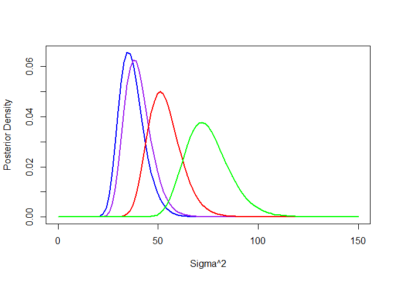<!-- -->

Then, we compute the marginal posterior for the mean.

``` r
kappa_n <- kappa0 + n
mu_n = kappa0/(kappa0+n)*mu0 + n/(kappa0+n)*mean(y[y>0])

#  Location-scale version of the t-distribution -> dlst
curve(dlst(x, df = nu_n, mu = mu_n, sigma = sqrt(sigma_sqn[1]/kappa_n)),  from = 22.5, to = 32.5, col = "blue", lwd = 2, xlab = 'Mu', ylab = 'Posterior Density')
curve(dlst(x, df = nu_n, mu = mu_n, sigma = sqrt(sigma_sqn[2]/kappa_n)),  from = 22.5, to = 32.5, col = "purple", lwd = 2, add = TRUE)
curve(dlst(x, df = nu_n, mu = mu_n, sigma = sqrt(sigma_sqn[3]/kappa_n)),  from = 22.5, to = 32.5, col = "red", lwd = 2, add = TRUE)
curve(dlst(x, df = nu_n, mu = mu_n, sigma = sqrt(sigma_sqn[4]/kappa_n)),  from = 22.5, to = 32.5, col = "green", lwd = 2, add = TRUE)
```

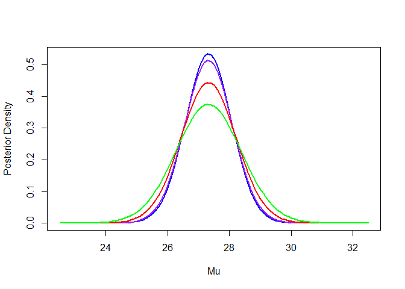<!-- -->

We have obtained the expected densities. Just for completeness, the
estimated speeds of light are all very similar.

``` r
means <- c(mean(extract(fit1)$mu), mean(extract(fit2)$mu), mean(extract(fit3)$mu), mean(extract(fit4)$mu))
times <- (means + 24800)*10^(-9) 
distance/times
```

    ## [1] 299750358 299750327 299750490 299750577

The credible intervals would differ, though. The *central credible
intervals* (Gelman et al. 1995), which are based on symmetrically chosen
quantiles, are as follows.

``` r
hdis <- rbind(
  quantile(extract(fit)$mu, c(0.025, 0.975)),
  quantile(extract(fit1)$mu, c(0.025, 0.975)),
  quantile(extract(fit2)$mu, c(0.025, 0.975)),
  quantile(extract(fit3)$mu, c(0.025, 0.975)),
  quantile(extract(fit4)$mu, c(0.025, 0.975))
)

colnames(hdis) <-  c('lower', 'upper')
rownames(hdis) <- c('Noninformative Prior', 'Conjugate Prior 1', 'Conjugate Prior 2', 'Conjugate Prior 3', 'Conjugate Prior 4' )
hdis
```

    ##                         lower    upper
    ## Noninformative Prior 26.51784 28.99794
    ## Conjugate Prior 1    25.83932 28.78311
    ## Conjugate Prior 2    25.76607 28.84240
    ## Conjugate Prior 3    25.50939 29.11233
    ## Conjugate Prior 4    25.20710 29.35730

These correspond to the following estimates of the speed of light (we
are using here that quantiles are invariant under monotone
transformations).

``` r
times = (hdis + 24800)*10^(-9) 
speeds <- cbind(distance/times[,2], distance/times[,1])
colnames(speeds) <- c('lower', 'upper')
speeds
```

    ##                          lower     upper
    ## Noninformative Prior 299730179 299760121
    ## Conjugate Prior 1    299732773 299768314
    ## Conjugate Prior 2    299732057 299769199
    ## Conjugate Prior 3    299728798 299772298
    ## Conjugate Prior 4    299725841 299775948

The actual speed of light in air, $299702547 \text{ ms}^{-1}$, is not
within these intervals; hence, we can speculate that Simon Newcomb’s
measurements had some systematic errors.

## Multinomial Model

The second important multiparameter model that has a known analytic
solution is the multinomial model for categorical data, which has
likelihood (Gelman et al. 1995)

``` math
p(y \mid  \theta) \propto \prod_j \theta_j^{y_j},
```

where $\theta_j$ is the probability of $j$ th category and $y_j$ is the
observed count. The conjugate prior for the multinomial model is

``` math
p(\theta) \propto \prod_j \theta_j^{\alpha_j},
```

which is known as the *Dirichlet* distribution. The resulting posterior
is thus Dirichlet with parameters $\alpha_j + y_j$.

Let us assume the data from the CBS News survey on the upcoming
presidential election in October, 1988 (Gelman et al. 1995). Out of 1447
persons, 727 supported George H. W. Bush, 583 supported Michael Dukakis,
and 137 supported other candidates or expressed no opinion. Let’s, for
simplicity’s sake, assume that the data were collected using random
sampling (in practice, survey data are collected in a more complex
manner, since collecting data from randomly selected individuals from
the population is unfeasible).

Let us estimate the difference between the support for George H. W. Bush
and Michael Dukakis. The Stan code is pretty straightforward.

``` default
data {
  int<lower=1> K;                   // Number of categories
  array[K] int<lower=0> y;          // Observed counts
  vector<lower=0>[K] alpha;         // Dirichlet prior parameters
}
parameters {
  simplex[K] theta;                 // Category probabilities must sum to one
}
model {
  // Prior on theta
  theta ~ dirichlet(alpha);
  
  // Multinomial likelihood
  y ~ multinomial(theta);
}
```

We will assume a simple uninformative Dirichlet prior
$\alpha = (1, 1, 1)$.

``` r
stan_data <- list(
  K = 3,
  y = array(c(727,583,137)),
  alpha = c(1,1,1)
)

fit <- stan(
  file  = "C:/Users/elini/Desktop/nine circles 3/f1_s7.stan",
  data = stan_data,
  chains = 4,
  iter = 4000,
  warmup = 2000,
  seed = 123,
  refresh = 0
)
```

We can simply plot the posterior samples of the difference
$\theta_1-\theta_2$ to get a clear comparison.

``` r
mu_sample <- extract(fit)$theta[,1] - extract(fit)$theta[,2]

dens <- density(mu_sample)
dens_data <- data.frame(x = dens$x, y = dens$y)

ggplot(dens_data, aes(x = x, y = y)) +  geom_line(linewidth = 1) + xlab('Theta_1 - Theta_2') + ylab('Posterior Density')
```

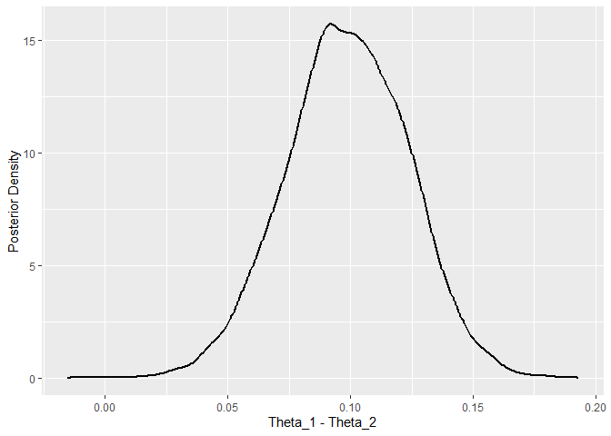<!-- -->

We observe that Bush would be clearly favored based on this particular
survey.

## Bioassay Experiment

We will consider several simple nonconjugate multiparameter models to
further illustrate the Bayesian framework. We start with the Bioassay
Experiment dataset from (Gelman et al. 1995) and
<https://avehtari.github.io/Bayesian-Workflow/bioassay/bioassay.html>. A
bioassay is an experiment that measures the effect of a substance on
living tissues, cells, or organisms. Specifically, we will model the
probability of an animal’s death as a function of dose.

``` r
bioassay <- read.csv("C:/Users/elini/Desktop/nine circles 3/bioassay.csv")
bioassay
```

    ##    dose batch_size deaths
    ## 1 -0.86          5      0
    ## 2 -0.30          5      1
    ## 3 -0.05          5      3
    ## 4  0.73          5      5

``` r
plot(bioassay$dose, bioassay$deaths, xlab = "Dose log(g/ml)", ylab = "# of deaths", type = "p", pch = 16)
```

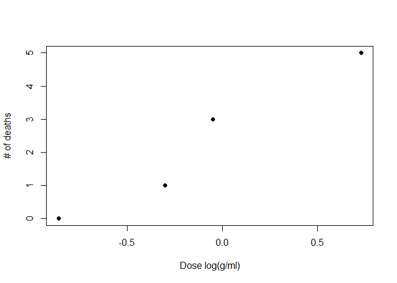<!-- -->

Our model of the number of deaths is binomial, i.e.,
$y_i \mid \theta_i \sim \text{Binomial}(n_i, \theta_i)$, where $y_i$ is
the number of deaths, $n$ is the total number of animals, and $\theta_i$
is the probability of death for animals given dose $x_i$. We expect that
$\theta_i$ depends on the dose; hence, we will assume a logistic
regression model
$\text{logit }\theta_i = \log\frac{\theta_i}{1-\theta_i} = \alpha + \beta x_i$.

To get a better idea about the magnitudes of $\alpha$ and $\beta$, let
us fit a standard logistic regression model.

``` r
logit_model <- glm(cbind(deaths, batch_size - deaths)  ~ dose, family = binomial, bioassay)
summary(logit_model)
```

    ## 
    ## Call:
    ## glm(formula = cbind(deaths, batch_size - deaths) ~ dose, family = binomial, 
    ##     data = bioassay)
    ## 
    ## Coefficients:
    ##             Estimate Std. Error z value Pr(>|z|)
    ## (Intercept)   0.8466     1.0191   0.831    0.406
    ## dose          7.7488     4.8728   1.590    0.112
    ## 
    ## (Dispersion parameter for binomial family taken to be 1)
    ## 
    ##     Null deviance: 15.791412  on 3  degrees of freedom
    ## Residual deviance:  0.054742  on 2  degrees of freedom
    ## AIC: 7.9648
    ## 
    ## Number of Fisher Scoring iterations: 7

We will fit the Bayesian logistic model with normal priors as follows.

``` default
data {
  int<lower=0> N_obs;                         // Number of observations      
  vector[N_obs] x;                            // Dose
  array[N_obs] int<lower=0> N;                // Number of animals          
  array[N_obs] int<lower=0, upper=N> y;       // Number of deaths
  real mu;                                    // Mean of normal prior
  real<lower=0> sigma;                        // Variance of normal prior
}
parameters {
  real a;
  real<lower=0> b;
}
model {
  {a, b} ~ normal(mu, sigma);   
  y ~ binomial_logit(N, a + b * x);
}
```

We select a somewhat weakly informative normal prior for coefficients
$a$ and $b$.

``` r
stan_data <- list(
  N_obs = 4,                                           
  x = bioassay$dose,                               
  N = bioassay$batch_size,                 
  y = bioassay$deaths,            
  mu = 0,                                      
  sigma = 10
)

fit <- stan(
  file  = "C:/Users/elini/Desktop/nine circles 3/f1_s8.stan",
  data = stan_data,
  chains = 4,
  iter = 4000,
  warmup = 2000,
  seed = 123,
  refresh = 0
)
```

Let us plot the marginal posterior densities.

``` r
dens <- density(extract(fit)$a)
dens_data <- data.frame(x = dens$x, y = dens$y)

ggplot(dens_data, aes(x = x, y = y)) +  geom_line(linewidth = 1) + xlab('a') + ylab('Posterior Density')
```

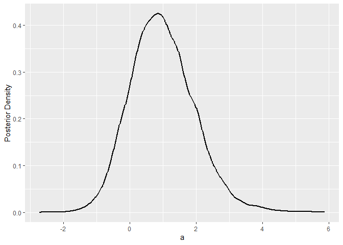<!-- -->

``` r
dens <- density(extract(fit)$b)
dens_data <- data.frame(x = dens$x, y = dens$y)

ggplot(dens_data, aes(x = x, y = y)) +  geom_line(linewidth = 1) + xlab('b') + ylab('Posterior Density')
```

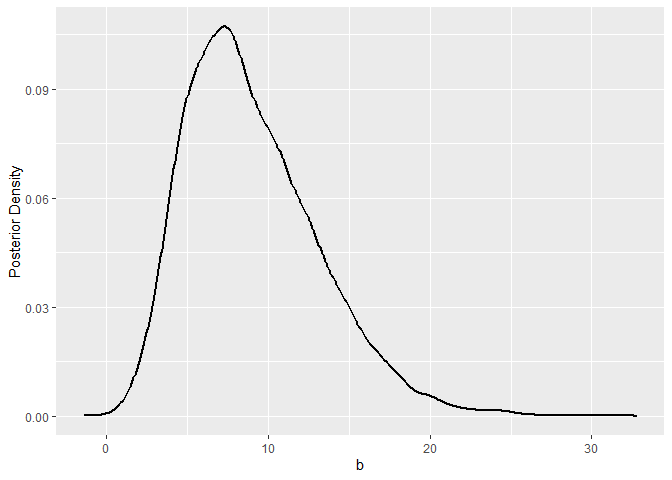<!-- -->

We observe that the posteriors mostly correspond to the MLE estimates.

``` r
summary(extract(fit)$a)
```

    ##    Min. 1st Qu.  Median    Mean 3rd Qu.    Max. 
    ## -2.2993  0.3203  0.9265  0.9871  1.5830  5.4646

``` r
summary(extract(fit)$b)
```

    ##    Min. 1st Qu.  Median    Mean 3rd Qu.    Max. 
    ##  0.4253  5.9912  8.3334  8.9872 11.4256 30.9751

We can plot the fitted models based on the posterior draws
(<https://avehtari.github.io/Bayesian-Workflow/bioassay/bioassay.html>).

``` r
plot(bioassay$dose, bioassay$deaths/bioassay$batch_size, xlab = "Dose log(g/ml)", ylab = "# of deaths", type = "p", pch = 16)

invlogit <- plogis
for (s in sample(2000, 30)) {
  curve(invlogit(extract(fit)$a[s] + extract(fit)$b[s] * x), col = "red", lwd = 0.5, add = TRUE)
}
curve(invlogit(mean(extract(fit)$a) + mean(extract(fit)$b) * x), col = "blue", lwd = 2, add = TRUE)
```

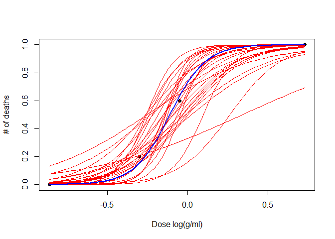<!-- -->

One quantity that is often of interest in this context is LD50: the dose
level at which the probability of death is 50%, i.e.,
$0 = \text{logit} \frac{0.5}{1-0.5} = a + bx$, i.e., $x = -a/b.$ Of
course, this value only makes sense when $b>0$.

``` r
sum(extract(fit)$b >= 0)/length(extract(fit)$b)
```

    ## [1] 1

Based on our model, it definitely is. Our estimate of L50 is as follows.

``` r
dens <- density(-extract(fit)$a/extract(fit)$b)
dens_data <- data.frame(x = dens$x, y = dens$y)

ggplot(dens_data, aes(x = x, y = y)) +  geom_line(linewidth = 1) + xlab('Mu') + ylab('Posterior Density')
```

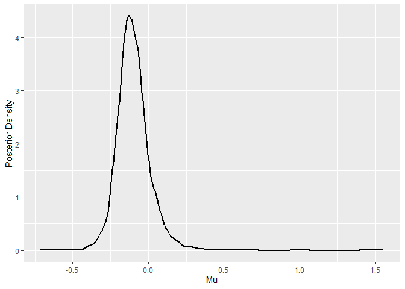<!-- -->

``` r
summary(-extract(fit)$a/extract(fit)$b)
```

    ##     Min.  1st Qu.   Median     Mean  3rd Qu.     Max. 
    ## -0.67002 -0.16739 -0.10932 -0.09984 -0.04498  1.51176

## Binomial Model with Unknown Probability and Sample Size

An interesting twist on the textbook problem of estimating the
probability of success in binomial data is to assume that the number of
trials $N$ is also an unknown parameter to be estimated. Let us generate
some data.

``` r
set.seed(123)
z = rbinom(20,200,0.3)
z
```

    ##  [1] 58 60 83 53 75 52 65 57 47 65 72 55 65 65 59 66 62 60 56 56

Now, one issue we need to address, which we mentioned when solving the
German tank problem, is that Stan cannot sample discrete parameters (due
to the particular MCMC algorithm it uses). Thence, we will again use a
continuous approximation; we will assume that $N$ is continuous and use
the Stan function lchoose to evaluate “generalized binomial
coefficients”
(<https://mc-stan.org/docs/2_19/functions-reference/betafun.html>).
Other than that, we will assume a beta prior for $p$ and a gamma prior
for $N$.

``` default
data {
  int<lower=1> N_obs;                // Number of observations
  array[N_obs] int<lower=0> x;       // Observed successes
  real<lower=0> alpha_beta;          // Parameters of prior distributions 
  real<lower=0> beta_beta;
  real<lower=0> alpha_gamma;
  real<lower=0> beta_gamma;
}

parameters {
  real<lower=max(x)> N;               // Number of trials (continuous approximation)
  real<lower=0, upper=1> p;          // Success probability
}

model {

  // Priors
  N ~ gamma(alpha_gamma, beta_gamma);     
  p ~ beta(alpha_beta, beta_beta);                    

  // Continuous binomial approximation
  for (i in 1:N_obs) {
    target += lchoose(N, x[i]) + x[i] * log(p) + (N - x[i]) * log1m(p);
  }
}
```

Let us assume, a priori (falsely), that the probability is close to 0.5.
Consequently, based on the mean number of successes,

``` r
mean(z)
```

    ## [1] 61.55

$N$ should be close to 120. Let us use somewhat informative
corresponding priors.

``` r
curve(dgamma(x, shape = 6, rate = 0.05),  from = 0.001, to = 500, col = "blue", lwd = 2, xlab = 'N')
```

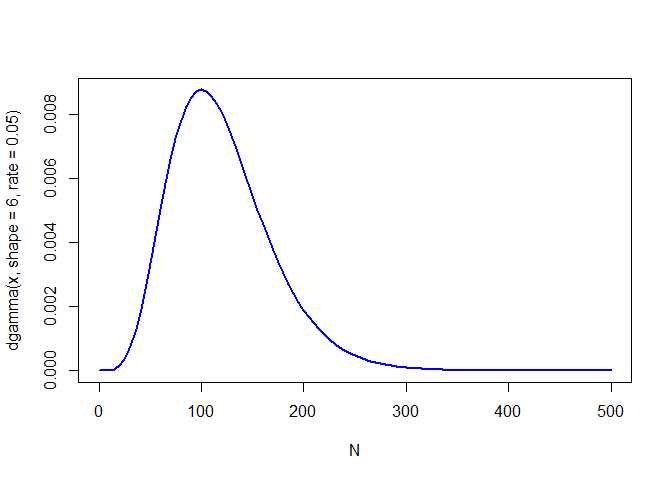<!-- -->

``` r
curve(dbeta(x, shape1 = 5, shape2 = 5),  from = 0, to = 1, col = "blue", lwd = 2, xlab = 'p')
```

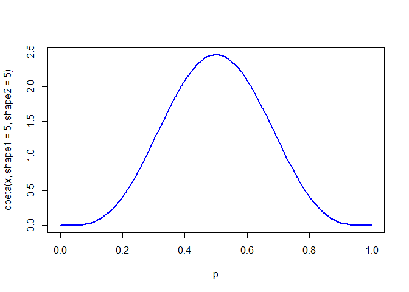<!-- -->

Let us fit the model.

``` r
stan_data <- list(
  N_obs = length(z),                                           
  x = z,
  alpha_gamma = 6,
  beta_gamma = 0.05,
  alpha_beta = 5,
  beta_beta = 5
)

fit <- stan(
  file  = "C:/Users/elini/Desktop/nine circles 3/f1_s9.stan",
  data = stan_data,
  chains = 4,
  iter = 4000,
  warmup = 2000,
  seed = 123,
  refresh = 0
)
```

We observe that the posterior samples disprove our prior assumptions.

``` r
dens <- density(extract(fit)$N)
dens_data <- data.frame(x = dens$x, y = dens$y)

ggplot(dens_data, aes(x = x, y = y)) +  geom_line(linewidth = 1) + xlab('N') + ylab('Posterior Density') + stat_function(fun = dgamma, args = list(shape = 6, rate = 0.05), color = "red", linewidth = 1, linetype = "dashed")
```

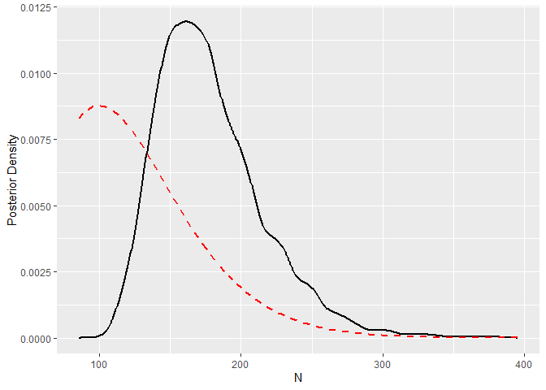<!-- -->

``` r
summary(extract(fit)$N)
```

    ##    Min. 1st Qu.  Median    Mean 3rd Qu.    Max. 
    ##   101.5   150.7   171.9   177.9   198.2   379.6

``` r
hdi(extract(fit)$N, credMass = 0.95)
```

    ##    lower    upper 
    ## 115.1508 251.6567 
    ## attr(,"credMass")
    ## [1] 0.95

``` r
dens <- density(extract(fit)$p)
dens_data <- data.frame(x = dens$x, y = dens$y)

ggplot(dens_data, aes(x = x, y = y)) +  geom_line(linewidth = 1) + xlab('p') + ylab('Posterior Density') +  stat_function(fun = dbeta, args = list(shape1 = 5, shape2 = 5), color = "red", linewidth = 1, linetype = "dashed")
```

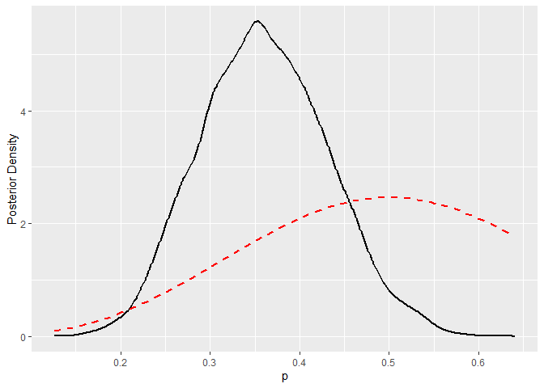<!-- -->

``` r
summary(extract(fit)$p)
```

    ##    Min. 1st Qu.  Median    Mean 3rd Qu.    Max. 
    ##  0.1581  0.3101  0.3579  0.3605  0.4085  0.6090

``` r
hdi(extract(fit)$p, credMass = 0.95)
```

    ##     lower     upper 
    ## 0.2208374 0.4910154 
    ## attr(,"credMass")
    ## [1] 0.95

We observe that the probability of success is likely less than 0.5.

## Coal Mining Disasters

To conclude the second part of our introduction to Bayesian statistics,
we will consider a model of coal mining disasters in the U.K. for the
years 1851–1962
(<https://mc-stan.org/docs/stan-users-guide/latent-discrete.html#change-point.section>).

``` r
coal_mining_disasters <- read.csv("C:/Users/elini/Desktop/nine circles 3/COAL MINING DISASTERS UK.csv",sep= ";")
head(coal_mining_disasters)
```

    ##   Year Count
    ## 1 1851     4
    ## 2 1852     5
    ## 3 1853     4
    ## 4 1854     1
    ## 5 1855     0
    ## 6 1856     4

``` r
plot(coal_mining_disasters$Year, coal_mining_disasters$Count, xlab = 'Year', ylab = '# Coal Mining Disasters')
```

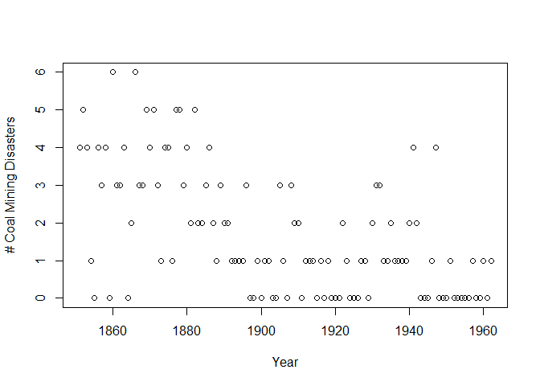<!-- -->

The data clearly show that the number of disasters decreased over time.
To model change, we will consider a *change point model* from
<https://mc-stan.org/docs/stan-users-guide/latent-discrete.html#change-point.section>.
We will assume that, early on, the number of disasters had a Poisson
distribution with the parameter $e$.

``` math
\begin{align*}
D_t & \sim \text{Poisson }(e) \\
e & \sim \text{Exp }(r_e)
\end{align*}
```

Later on, this distribution changed to a Poisson distribution with the
parameter $l$.

``` math
\begin{align*}
D_t & \sim \text{Poisson }(l) \\

\end{align*}
```

We will assume that the switch occurred at time $s$ under a uniform
prior.

``` math
s \sim \text{uniform }(1, T)
```

In addition, we will assume exponential priors for $e$ and $l$. Overall,
we get the following model.

``` math
\begin{align*}
e & \sim \text{Exp }(r_e) \\
l & \sim \text{Exp }(l_e) \\
s &\sim \text{uniform }(1, T) \\
D_t & \sim \text{Poisson }(t < s \text{ ? } e : l) 
\end{align*}
```

The expression $D_t \sim \text{Poisson }(t < s \text{ ? } e : l)$ is
from C++ and denotes the condition, if $t < s$ then $e$ otherwise $l$
(<https://mc-stan.org/docs/stan-users-guide/latent-discrete.html#change-point.section>).

The following Stan code describes our model. The implementation is a bit
more complicated because Stan does not allow discrete parameters; hence,
$s$ must be marginalized out (see
<https://mc-stan.org/docs/stan-users-guide/latent-discrete.html#change-point.section>
for details).

``` default
data {
  real<lower=0> r_e;
  real<lower=0> r_l;

  int<lower=1> T;
  array[T] int<lower=0> D;
}
transformed data {
  real log_unif;
  log_unif = -log(T);
}
parameters {
  real<lower=0> e;
  real<lower=0> l;
}
transformed parameters {
  vector[T] lp;
  lp = rep_vector(log_unif, T);
  for (s in 1:T) {
    for (t in 1:T) {
      lp[s] = lp[s] + poisson_lpmf(D[t] | t < s ? e : l);
    }
  }
}
model {
  e ~ exponential(r_e);
  l ~ exponential(r_l);
  target += log_sum_exp(lp);
}
```

Let us run the MCMC algorithm to estimate $s$, $e$, and $l$.

``` r
stan_data <- list(
  D = coal_mining_disasters$Count,
  T = length(coal_mining_disasters$Count),
  r_e = 2,
  r_l = 1
)


fit <- stan(
  file  = "C:/Users/elini/Desktop/nine circles 3/stan2.stan",
  data = stan_data,
  chains = 4,
  iter = 4000,
  warmup = 2000,
  seed = 123,
  refresh = 0
)
```

The sampled posteriors of $e$ and $l$ are as follows.

``` r
dens <- density(extract(fit)$e)
dens_data <- data.frame(x = dens$x, y = dens$y)
ggplot(dens_data, aes(x = x, y = y)) +  geom_line(linewidth = 1) + labs(x = "e", y = "Posterior Density")
```

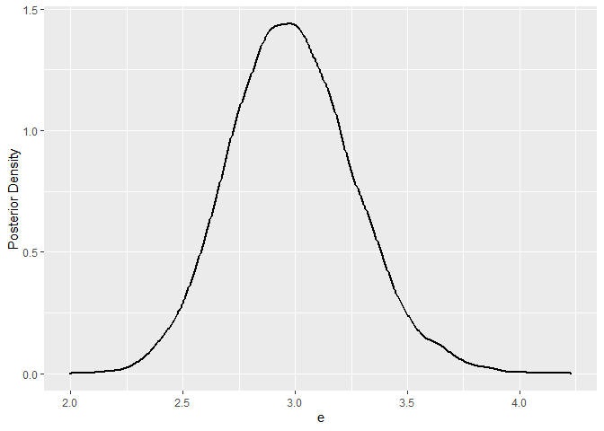<!-- -->

``` r
dens <- density(extract(fit)$l)
dens_data <- data.frame(x = dens$x, y = dens$y)
ggplot(dens_data, aes(x = x, y = y)) +  geom_line(linewidth = 1) + labs(x = "l", y = "Posterior Density")
```

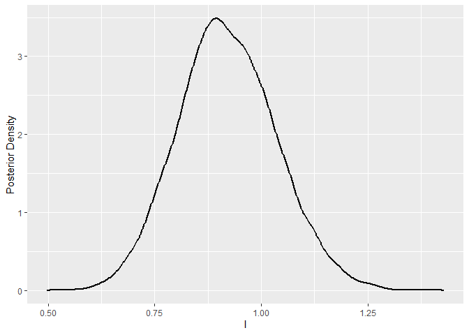<!-- -->

We clearly observe that $e$ is significantly higher than $l$. The
posterior of $s$ must be computed from the lp, which represents a
posterior draw of $\log p(s,D \mid e,l)$
(<https://mc-stan.org/docs/stan-users-guide/latent-discrete.html#change-point.section>)

``` r
p_sd <- extract(fit)$lp
p_s <- colSums(exp(p_sd))
p_s <- p_s/sum(p_s)

dens_data <- data.frame(x = coal_mining_disasters$Year, y = log(p_s))

ggplot(dens_data, aes(x = x, y = y)) +  geom_line(linewidth = 1) + labs(x = "s", y = "Log Posterior Density") 
```

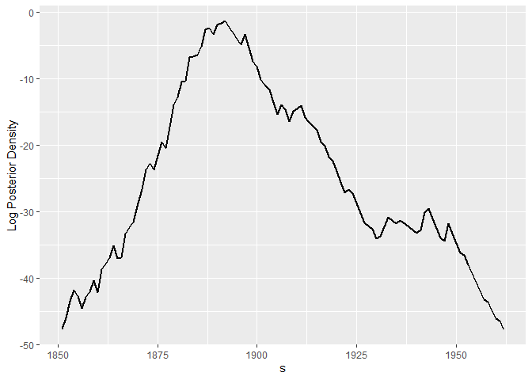<!-- -->

``` r
p_sd <- extract(fit)$lp
p_s <- colSums(exp(p_sd))
p_s <- p_s/sum(p_s)


dens_data <- data.frame(x = coal_mining_disasters$Year, y = p_s)

ggplot(dens_data, aes(x = x, y = y)) +  geom_line(linewidth = 1) + labs(x = "s", y = "Posterior Density") 
```

<!-- -->

We estimate that the change in frequency occurred between 1885 and 1900.

## References

<div id="refs" class="references csl-bib-body hanging-indent"
entry-spacing="0">

<div id="ref-gelman1995bayesian" class="csl-entry">

Gelman, Andrew, John B Carlin, Hal S Stern, and Donald B Rubin. 1995.
*Bayesian Data Analysis*. Chapman; Hall/CRC.

</div>

</div>
