# The First Circle: Introduction to Bayesian Statistics, Part Three
<span style="font-size:large;"> **Introduction to Hierarchical Models** </span>

<br/>
Jiří Fejlek

2026-06-29
<br/>

<br/> In the third part of our introduction to Bayesian statistics, we will
have our first look at *hierarchical models*. Hierarchical models deal
with datasets that have some nested structure, such as block
experimental designs or panel data. In these cases, observations are no
longer independent; the data from the same “group” are related, and thus
standard regression approaches are often inappropriate. The reason we
point out hierarchical models specifically in the Bayesian context is
that Bayesian inference handles hierarchical structure quite naturally. <br/>


## Table of Contents

- [Rat Tumor Dataset](#rat-tumor-dataset)
  - [Pooled model](#pooled-model)
  - [No Pooling](#no-pooling)
  - [Partial Pooling](#partial-pooling)
  - [Selecting Sigma](#Selecting-Sigma)
    - [Pareto Smoothed Importance Sampling](#pareto-smoothed-importance-sampling)
    - [Performing PSIS in R](#performing-psis-in-r)
    - [Diagnostics of PSIS](#diagnostics-of-psis)
    - [Estimating Sigma by Setting Its Prior](#estimating-sigma-by-setting-its-prior)
- [Hierarchical Normal Model with Known
  Variance](#hierarchical-normal-model-with-known-variance)
- [SAT Dataset](#sat-dataset)
- [References](#references)

``` r
library(rstan)
library(ggplot2)
library(HDInterval)
library(faraway)
```

## Rat Tumor Dataset

As a motivational example, let us consider the dataset from (Gelman et
al. 1995) that contains information on the probability of a tumor in a
population of female laboratory rats.

``` r
rat <- read.csv("C:/Users/elini/Desktop/nine circles 3/rat.csv", sep = ',')
head(rat)
```

    ##   y  N
    ## 1 0 20
    ## 2 0 20
    ## 3 0 20
    ## 4 0 20
    ## 5 0 20
    ## 6 0 20

``` r
ggplot(rat, aes(x = 1:length(y), y = y/N)) +  geom_point() + xlab('Rat Group') + ylab('Tumor Probability')
```

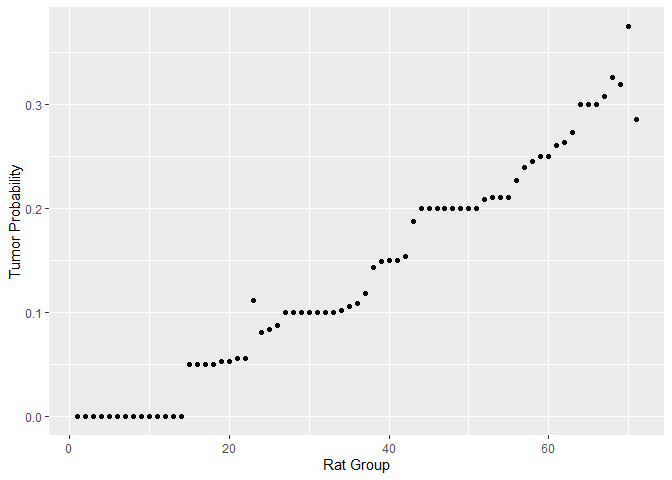<!-- -->

### Pooled model

Now, the key observation is that the rats are split into 71 groups. We
could stack the data together, i.e., ignore the grouping, and create one
*pooled* model. Since we are modeling proportions, we use a binomial
model (we use the logit parametrization $p/(1-p)$ instead of $p$) and a
normal prior with parameters $\mu$ and $\sigma$.

``` default
data {
  int<lower=1> N_groups;                            // Number of groups                    
  array[N_groups] int<lower=0> trials;              // Number of trials in a group      
  array[N_groups] int<lower=0> y;                   // Number of successes in a group
  real mu;                                          // Prior mu
  real<lower=0> sigma;                              // Prior sigma
} 

parameters {
  real logit_p;                                     // Probability logit of success (pooled)                 
}

model {
  // Prior
  logit_p ~ normal(mu, sigma);

  // Likelihood
  for (i in 1:N_groups) {
    y[i] ~ binomial_logit(trials[i], logit_p);
  }
}
```

``` r
stan_data <- list(
  N_groups = length(rat$y),
  trials = rat$N,
  y = rat$y,
  mu = 0,
  sigma = 1.5
)

fit <- stan(
  file  = "C:/Users/elini/Desktop/nine circles 3/f1_s10.stan",
  data = stan_data,
  chains = 4,
  iter = 4000,
  warmup = 2000,
  seed = 123,
  refresh = 0
)
```

The estimated probability of a tumor in a population is as follows.

``` r
logit_p_pooled <- extract(fit)$logit_p

dens <- density(ilogit(logit_p_pooled))
dens_data <- data.frame(x = dens$x, y = dens$y)
ggplot(dens_data, aes(x = x, y = y)) +  geom_line(linewidth = 1) + xlab('Tumor Probability') + ylab('Posterior Density')
```

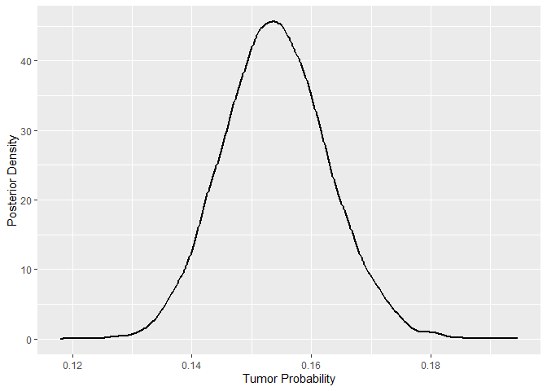<!-- -->

``` r
mean(ilogit(logit_p_pooled))
```

    ## [1] 0.1540295

We can also compute the highest density credible intervals.

``` r
hdi_p_pooled <- hdi(ilogit(logit_p_pooled), credMass = 0.95)
hdi_p_pooled
```

    ##     lower     upper 
    ## 0.1375158 0.1716718 
    ## attr(,"credMass")
    ## [1] 0.95

Let us use the following plot to illustrate the pooling model (the black
dots denote the observed proportion and the red dot denotes the pooled
estimate with its credible interval).

``` r
ggplot(rat, aes(x = 1:length(y), y = y/N)) +  geom_point() + xlab('Rat Group') + ylab('Tumor Probability') + geom_point(aes(y = mean(ilogit(logit_p_pooled))), color = 'red') + geom_errorbar(aes(ymin=hdi_p_pooled[1], ymax=hdi_p_pooled[2]), color = 'red')
```

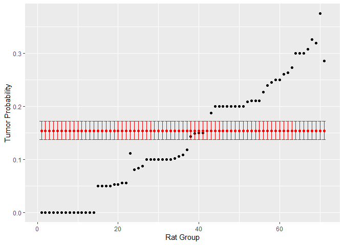<!-- -->

The pooled model is simple and provided us with an estimate of the
overall tumor probability. However, by stacking all the data together,
we assumed that all the groups are “the same”. But our data show that
the groups differ markedly in tumor incidence. Consequently, the tumor
incidence for a given specific group might be quite distant from the
overall mean

### No Pooling

To model this observed heterogeneity between groups, we could consider
modeling each group separately, treating each group as its own dataset
and creating a model with no pooling.

``` default
data {
  int<lower=1> N_groups;                            // Number of groups                    
  array[N_groups] int<lower=0> trials;              // Number of trials in a group      
  array[N_groups] int<lower=0> y;                   // Number of successes in a group
  real mu;                                          // Prior for mu
  real<lower=0> sigma;                              // Prior for sigma    
} 

parameters {
  array[N_groups] real logit_p;                     // Probability logit of success (no pooling)                 
}

model {
  // Prior
  for (i in 1:N_groups) {
    logit_p[i] ~ normal(mu, sigma);
  }

  // Likelihood
  for (i in 1:N_groups) {
    y[i] ~ binomial_logit(trials[i], logit_p[i]);
  }
}
```

``` r
stan_data <- list(
  N_groups = length(rat$y),
  trials = rat$N,
  y = rat$y,
  mu = 0,
  sigma = 1.5
)

fit <- stan(
  file  = "C:/Users/elini/Desktop/nine circles 3/f1_s11.stan",
  data = stan_data,
  chains = 4,
  iter = 4000,
  warmup = 2000,
  seed = 123,
  refresh = 0
)
```

In this model, each group has its own estimate of $p$.

``` r
p_no_pooling <- ilogit(extract(fit)$logit_p)
mean_p_no_pooling <- apply(p_no_pooling , 2, mean)
mean_p_no_pooling
```

    ##  [1] 0.06535817 0.06433990 0.06472985 0.06498370 0.06542276 0.06451740
    ##  [7] 0.06427650 0.06755981 0.06715635 0.06778884 0.06640139 0.07059378
    ## [13] 0.07129274 0.07228469 0.10341477 0.10202795 0.10214117 0.10234994
    ## [19] 0.10647655 0.10611824 0.11085088 0.11123284 0.14170079 0.11729411
    ## [25] 0.12284695 0.12610124 0.14333817 0.14256194 0.14224055 0.14370976
    ## [31] 0.14380308 0.14371321 0.17504740 0.12045394 0.14978505 0.12816130
    ## [37] 0.16412670 0.15889617 0.16519474 0.18374139 0.18465827 0.20341242
    ## [43] 0.20011541 0.21221915 0.22954070 0.22879746 0.22789363 0.22883881
    ## [49] 0.22915789 0.23022858 0.22782261 0.22016347 0.23826146 0.24002611
    ## [55] 0.24025569 0.25149624 0.25053828 0.25505109 0.27291950 0.27268030
    ## [61] 0.27879412 0.28591183 0.28992623 0.31734050 0.31712966 0.31739425
    ## [67] 0.31456371 0.33243855 0.32548470 0.38374820 0.31607617

``` r
hdi_p_no_pooling <- apply(p_no_pooling , 2, function (x) hdi(x, credMass = 0.95))

ggplot(rat, aes(x = 1:length(y), y = y/N)) +  geom_point() + xlab('Rat Group') + ylab('Tumor Probability') + geom_point(aes(y = mean(ilogit(logit_p_pooled))), color = 'red') + geom_errorbar(aes(ymin=hdi_p_pooled[1], ymax=hdi_p_pooled[2]), color = 'red') +
geom_point(aes(y = mean_p_no_pooling), color = 'blue') + geom_errorbar(aes(ymin=hdi_p_no_pooling[1,], ymax=hdi_p_no_pooling[2,]), color = 'blue')
```

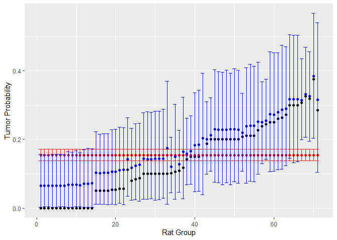<!-- -->

We should note here that the upward shift toward a 0.5 probability
observed in the estimates (blue ones) is due to our choice of prior. If
we increase $\sigma$, which causes the prior to have more mass far away
from 0 on the logit scale, and hence more mass near 0 and 1 on the
probability scale, the Bayesian estimates will be much closer to the
observed proportions.

``` r
stan_data <- list(
  N_groups = length(rat$y),
  trials = rat$N,
  y = rat$y,
  mu = 0,
  sigma = 5
)

fit <- stan(
  file  = "C:/Users/elini/Desktop/nine circles 3/f1_s11.stan",
  data = stan_data,
  chains = 4,
  iter = 4000,
  warmup = 2000,
  seed = 123,
  refresh = 0
)
```

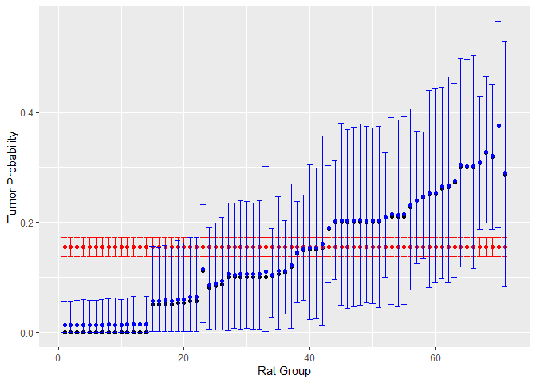<!-- -->

Similarly, by decreasing $\sigma$, the shift toward 0.5 becomes even
more pronounced.

``` r
stan_data <- list(
  N_groups = length(rat$y),
  trials = rat$N,
  y = rat$y,
  mu = 0,
  sigma = 0.25
)

fit <- stan(
  file  = "C:/Users/elini/Desktop/nine circles 3/f1_s11.stan",
  data = stan_data,
  chains = 4,
  iter = 4000,
  warmup = 2000,
  seed = 123,
  refresh = 0
)
```

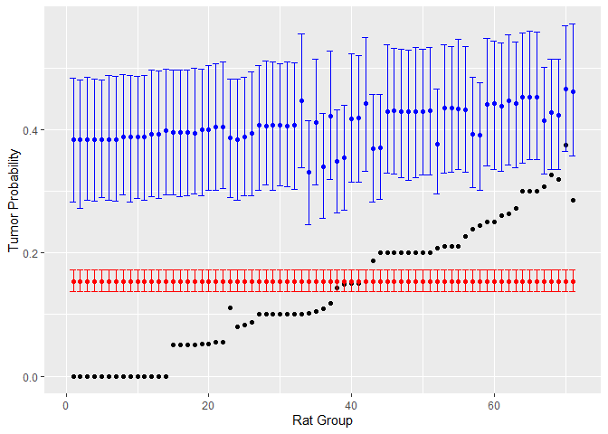<!-- --> 

The key takeaway is that with no pooling, we estimate the proportions in
each group independently of others. There are two major issues with this
approach. First, since we are estimating independently within each
group, we have significantly fewer observations to estimate $p$. We can
clearly observe the consequence of this fact in much wider credible
intervals. The second, probably even more significant issue is that,
imagine a task of predicting tumor incidence in a new group of rats.
Since this is a new, unobserved group, the model without pooling
provides no estimate. The pooled model gave us the average proportion at
least.

### Partial Pooling

A hierarchical model provides a compromise between the pooled and
no-pooling models; it achieves so-called *partial pooling* (McElreath
2018). The idea is to model some of the commonalities between the
groups.

In the no pooling model, we assumed a prior for each group on the
probability logit $p_i/(1-p_i) \sim N(\mu, \sigma^2)$ and parameters of
these priors $mu$, $\sigma^2$ were chosen and fixed for each prior (we
picked the same values in each group). Now, let us assume instead that
$\mu$ has its own prior. Hence, we get the following hierarchical
structure.

``` math
\begin{align*}
p_i/(1-p_i) &\sim N(\mu_1, \sigma_1^2)\\
\mu_1 & \sim N(\mu_2, \sigma_2^2)
\end{align*}
```

Let us pick $\mu_2 = 0$ and $\sigma_2 = 1.5$ and have a look at how our
estimates change depending on the value of $\sigma_1$. Let us start with
a very small $\sigma_1$.

``` default
data {
  int<lower=1> N_groups;                            // Number of groups                    
  array[N_groups] int<lower=0> trials;              // Number of trials in a group      
  array[N_groups] int<lower=0> y;                   // Number of successes in a group

  real mu_hyper;                                    // Prior mean for mu
  real<lower=0> sigma_hyper;                        // Prior sigma for mu
  real<lower=0> sigma_logit;                        // Prior sigma for probability logit   
} 

parameters {
  array[N_groups] real logit_p;                     // Probability logit of success
  real mu;                                          // Prior mu for probability logit     
}

model {
  // Priors
  mu ~ normal(mu_hyper, sigma_hyper);

  for (i in 1:N_groups) {
    logit_p[i] ~ normal(mu,sigma_logit);
  }

  // Likelihood
  for (i in 1:N_groups) {
    y[i] ~ binomial_logit(trials[i], logit_p[i]);
  }
}
```

``` r
stan_data <- list(
  N_groups = length(rat$y),
  trials = rat$N,
  y = rat$y,
  mu_hyper = 0,
  sigma_hyper = 1.5,
  sigma_logit = 0.1
)

fit <- stan(
  file  = "C:/Users/elini/Desktop/nine circles 3/f1_s12.stan",
  data = stan_data,
  chains = 4,
  iter = 6000,
  warmup = 2000,
  seed = 123,
  refresh = 0
)
```

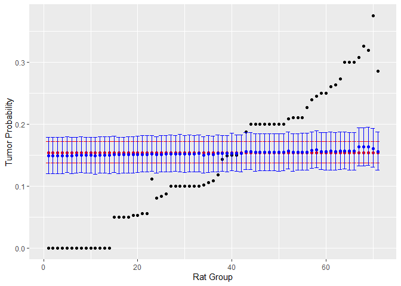<!-- -->

The result is very different from the case in which $\mu_1$ was a fixed
parameter. We observe that our estimates are very close to the overall
mean. By setting $\sigma _1$ very small, we are assuming that all the
probability logits $p_i/(1-p_i)$ are the same regardless of what $\mu_1$
is randomly drawn. In other words, groups do not matter, and hence, we
are assuming a pooled model.

We can also look at the posterior distribution of $\mu_1$, which is
concentrated on the value of the overall observed proportion.

``` r
logit_p_partial_pooled <- extract(fit)$mu

dens <- density(ilogit(logit_p_partial_pooled))
dens_data <- data.frame(x = dens$x, y = dens$y)
ggplot(dens_data, aes(x = x, y = y)) +  geom_line(linewidth = 1) + xlab('Mu_1') + ylab('Posterior Density')
```

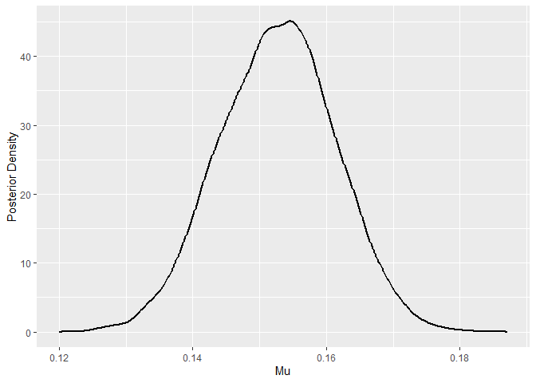<!-- -->

The probabilities of a tumor per group are almost the same.

``` r
library(dplyr)
library(purrr)

p_individual <- ilogit(extract(fit)$logit_p)
dens <- apply(p_individual, 2, density)

plot_data <- imap_dfr(dens, function(df, name) {
  tibble(x = df$x, y = df$y, group = name)
})

plot_data = plot_data[plot_data$group == c(5,10, 15,20,25,30,35,40,45,60,65,70),]

ggplot(plot_data, aes(x = x, y = y, group = group, color = group)) +
  geom_line(linewidth = 1) +  
  labs(x = "Group Tumor Probabilities", y = "Posterior Densities")
```

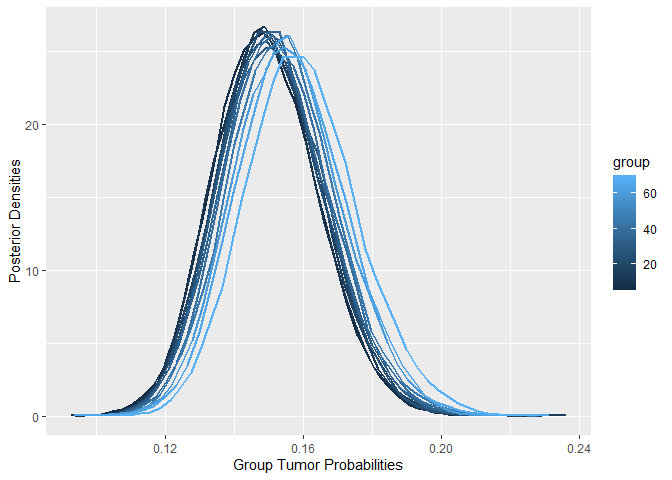<!-- -->

Let us now choose a very large $\ sigma_1$.

``` r
stan_data <- list(
  N_groups = length(rat$y),
  trials = rat$N,
  y = rat$y,
  mu_hyper = 0,
  sigma_hyper = 1.5,
  sigma_logit = 10
)

fit <- stan(
  file  = "C:/Users/elini/Desktop/nine circles 3/f1_s12.stan",
  data = stan_data,
  chains = 4,
  iter = 6000,
  warmup = 2000,
  seed = 123,
  refresh = 0
)
```

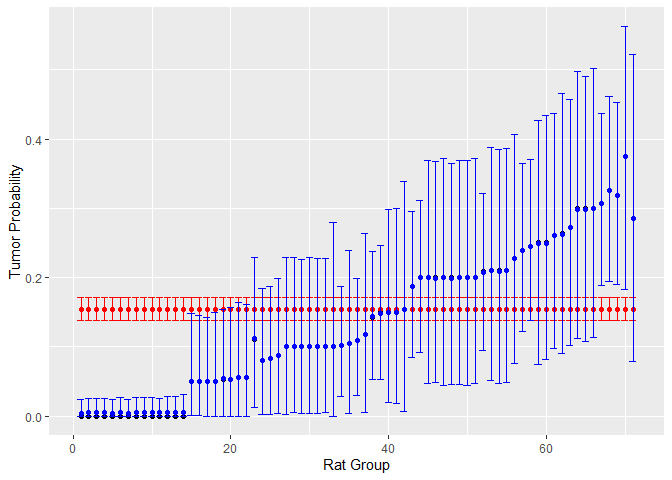<!-- -->

Now, the estimates are very close to the observed proportions in each
group; we got a model with almost no pooling. By setting $\sigma_1$
large, we are assuming that $p_i/(1-p_i)$ varies a lot from group to
group. Hence, the groups have almost nothing in common; $\mu_1$, which
represents the “common part,” is almost zero.

``` r
logit_p_partial_pooled <- extract(fit)$mu

dens <- density(ilogit(logit_p_partial_pooled))
dens_data <- data.frame(x = dens$x, y = dens$y)
ggplot(dens_data, aes(x = x, y = y)) +  geom_line(linewidth = 1) + xlab('Mu_1') + ylab('Posterior Density')
```

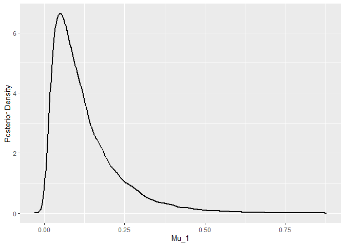<!-- -->

Consequently, the individual logits vary a lot.

``` r
p_individual <- ilogit(extract(fit)$logit_p)
dens <- apply(p_individual, 2, density)


plot_data <- imap_dfr(dens, function(df, name) {
  tibble(x = df$x, y = df$y, group = name)
})
plot_data = plot_data[plot_data$group == c(15,20,25,30,35,40,45,60,65,70),]

ggplot(plot_data, aes(x = x, y = y, group = group, color = group)) +
  geom_line(size = 1) +  
  labs(x = "Group Tumor Probabilities", y = "Posterior Densities")
```

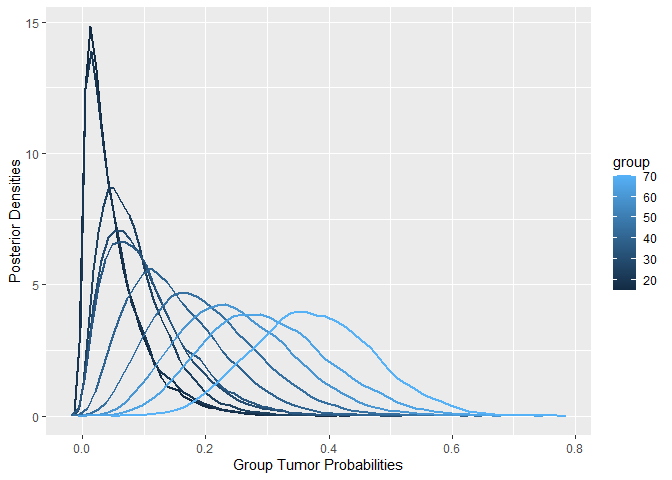<!-- -->

We do not need to pick only the extreme values of $\ sigma_1$. Let us
pick a moderate value.

``` r
stan_data <- list(
  N_groups = length(rat$y),
  trials = rat$N,
  y = rat$y,
  mu_hyper = 0,
  sigma_hyper = 1,
  sigma_logit = 0.5
)

fit <- stan(
  file  = "C:/Users/elini/Desktop/nine circles 3/f1_s12.stan",
  data = stan_data,
  chains = 4,
  iter = 6000,
  warmup = 2000,
  seed = 123,
  refresh = 0
)
```

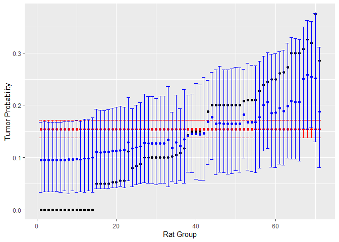<!-- -->

The estimates still vary across groups, but they are pulled toward the
mean. The common part $\mu_1$ is slightly smaller than the pooled
estimate, but much larger than that of the model with almost no pooling.

``` r
logit_p_partial_pooled <- extract(fit)$mu

dens <- density(ilogit(logit_p_partial_pooled))
dens_data <- data.frame(x = dens$x, y = dens$y)
ggplot(dens_data, aes(x = x, y = y)) +  geom_line(linewidth = 1) + xlab('Mu_1') + ylab('Posterior Density')
```

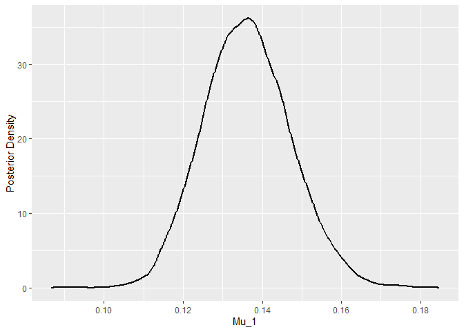<!-- -->

The individual group probability logits are somewhat similar, but there
is still some variability between groups.

``` r
p_individual <- ilogit(extract(fit)$logit_p)
dens <- apply(p_individual, 2, density)

plot_data <- imap_dfr(dens, function(df, name) {
  tibble(x = df$x, y = df$y, group = name)
})
plot_data = plot_data[plot_data$group == c(1, 5,10, 15,20,25,30,35,40,45,60,65,70),]

ggplot(plot_data, aes(x = x, y = y, group = group, color = group)) +
  geom_line(size = 1) +  
  labs(title = "Multiple Densities", x = "Group Tumor Probabilities", y = "Posterior Densities")
```

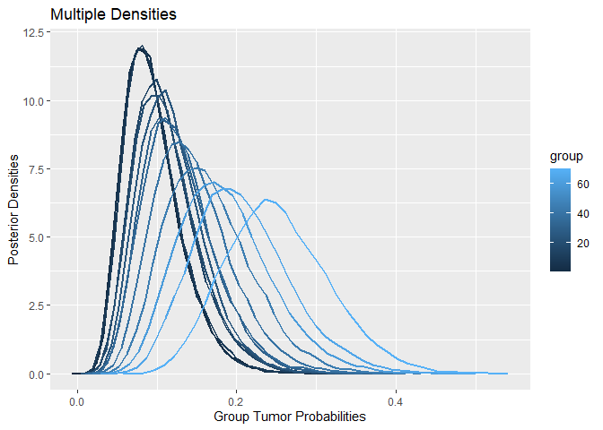<!-- -->

### Selecting Sigma

The next obvious question is how to choose $\sigma_1$: whether to prefer
more pooling or less pooling. One method that is pretty universal and we
used in the past to estimate such hyperparameter values is
cross-validation, which estimates a model’s predictive performance on
unseen data.

The principle of cross-validation of a Bayesian model is very similar to
non-Bayesian ones. We split the data and fit a Bayesian model using the
training sample $y$. Then we estimate the predictive performance by
evaluating the model on the held-out sample $\tilde y$ by computing log
predictive density $\sum_{\tilde y} \log \int p(\tilde y \mid \theta)p_\text{post}(\theta)\text{ d}\theta$ (Gelman et al. 1995), where $p_\text{post}$ denotes the posterior density for $\theta$. We can then repeat the process for various splits.

Fitting Bayesian models is usually a bit more computationally expensive
than the traditional regression models, and hence, the cross-validation
(namely the leave-one-out cross-validation) is often approximated using
Pareto Smoothed Importance Sampling (PSIS)
(<https://cran.r-project.org/web/packages/loo/vignettes/loo2-with-rstan.html>).

#### Pareto Smoothed Importance Sampling

When performing a leave-one-out cross-validation, we are basically
computing posterior estimates of $\theta$ with $y_i$ observation
omitted: $p_\text{post}(\theta) = p(\theta \mid y_{[-i]})$ for each $i$,
from which we can then estimate *expected log pointwise predictive density (ELPD)* (Gelman et al. 1995)

``` math
\text{ELPD}_\text{loo-cv} =  \sum_{i = 1}^n \log \int p(y_i \mid \theta) p(\theta \mid y_{[-i]})\text{ d}\theta
```

However, we can derive that

``` math
p(\theta \mid y) = p(\theta \mid y_{[-i]}, y_i) = \frac{p(y_i \mid \theta,  y_{[-i]} ) p(\theta \mid  y_{[-i]})}{p(y_i \mid  y_{[-i]})} = \frac{p(y_i \mid \theta) p(\theta \mid  y_{[-i]})}{p(y_i \mid  y_{[-i]})}
```

And hence,

``` math
p(\theta \mid  y_{[-i]}) \propto \frac{p(\theta \mid y)}{p(y_i \mid \theta)}.
```

Let us denote $w_i = \frac{1}{p(y_i \mid \theta)}$; these are known as
the *importance weights*, because we can now use *importance sampling*
(<https://en.wikipedia.org/wiki/Importance_sampling>) to estimate
$\text{ELPD}_\text{loo-cv}$ using posterior samples
$\theta_1, \ldots, \theta_S$ from $p(\theta \mid y)$.

Namely, importance sampling is based on the formula

``` math
\mathbb{E}_pf(X) = \mathbb{E}_q \left[f(Y) \frac{p(Y)}{q(Y)}\right] =  \mathbb{E}_q \left[f(Y) w(Y)\right].
```

The point is to replace the computation of expectation wrt. $p$ (which
is hard to sample, in our case $p(\theta \mid  y_{[-i]})$ ) by
expectation wrt. $q$ (which is easy to sample, in our case
$p(\theta \mid  y)$ ). Let’s assume that $y_1, \ldots, y_S$ are samples
from $q$. Then we can estimate $\mathbb{E}_q \left[f(Y) r(Y)\right]$ as

``` math
\mathbb{E}_q f(X) \approx \frac{\sum_{s= 1}^S f(y_s)w(y_s) }{S}.
```

However, we often do not know the normalization of $f$ (as in our case),
and then we need to use *self-normalized importance sampling* (Paananen
et al. 2021).

``` math
\mathbb{E}_q f(X) \approx \frac{\sum_{s= 1}^S f(y_s)w(y_s) }{\sum_{s= 1}^S w(y_s)}
```

We pick $p = p(\theta \mid  y_{[-i]})$, $q = p(\theta \mid y)$,
$f =  p(y_i \mid \theta)$ and get the following approximation.

``` math
\log \int p(y_i \mid \theta) p(\theta \mid y_{[-i]})\text{ d}\theta \approx \log \frac{\sum_{s = 1}^S  p(y_i \mid \theta^s)w_i^s}{\sum_{s = 1}^S w_i^s} = \log \frac{S}{\sum_{s = 1}^S w_i^s}
```

The major issue with this direct approach is that $p(\theta \mid y)$ is
likely to have a smaller variance and thinner tails than
$p(\theta \mid  y_{[-i]})$, which means that the importance weights
$w_i = \frac{1}{p(y_i \mid \theta)}$ might be very large (their variance
can be even infinite!), which can lead to a poor approximations of
$\text{ELPD}_\text{loo-cv}$ (Vehtari, Gelman, and Gabry 2017).

The solution proposed in (Vehtari et al. 2024) (Pareto Smoothed
Importance Sampling or PSIS) fits a generalized Pareto distribution on
20% of the largest importance weights for every observation $y_i$ (we
know, for example, from *Nine Circles of Statistical Modeling, The Sixth
Circle: Extreme Value Analysis* that the generalized Pareto distribution
is the asymptotic distribution for the distribution of excesses over a
sufficiently large threshold). Then, the largest importance weights are
stabilized by replacing their original values with expected values under
the Pareto model (which are then also truncated).

#### Performing PSIS in R

We can compute PSIS in R as follows. First, we need to modify the
Stan code slightly to explicitly save the log-likelihood values for MCMC
samples.

``` default
data {
  int<lower=1> N_groups;                            // Number of groups                    
  array[N_groups] int<lower=0> trials;              // Number of trials in a group      
  array[N_groups] int<lower=0> y;                   // Number of successes in a group

  real mu_hyper;                                    // Prior mean for hyperparameter mu
  real<lower=0> sigma_hyper;                        // Prior sigma for hyperparameter mu
  real<lower=0> sigma_logit;                        // Prior sigma for probability logit   
} 

parameters {
  array[N_groups] real logit_p;                     // Probability logit of success
  real mu;                                          // Prior mu for probability logit     
}

model {
  // Priors
  mu ~ normal(mu_hyper, sigma_hyper);

  for (i in 1:N_groups) {
    logit_p[i] ~ normal(mu,sigma_logit);
  }

  // Likelihood
  for (i in 1:N_groups) {
    y[i] ~ binomial_logit(trials[i], logit_p[i]);
  }
}

generated quantities {
  vector[N_groups] log_lik;
  for (i in 1:N_groups) {
    log_lik[i] = binomial_logit_lpmf(y[i] | trials[i], logit_p[i]);
  }
}
```

Next, we will refit the model.

``` r
stan_data <- list(
  N_groups = length(rat$y),
  trials = rat$N,
  y = rat$y,
  mu_hyper = 0,
  sigma_hyper = 1,
  sigma_logit = 0.5
)

fit <- stan(
  file  = "C:/Users/elini/Desktop/nine circles 3/f1_s12alt.stan",
  data = stan_data,
  chains = 4,
  iter = 6000,
  warmup = 2000,
  seed = 123,
  refresh = 0
)
```

Finally, we obtain the PSIS results using the package *loo* as follows.

``` r
library(loo)
log_lik_matrix <- extract_log_lik(fit, merge_chains = FALSE)
r_eff <- relative_eff(exp(log_lik_matrix))
loo_fit <- loo(log_lik_matrix, r_eff = r_eff)
loo_fit
```

    ## 
    ## Computed from 16000 by 71 log-likelihood matrix.
    ## 
    ##          Estimate   SE
    ## elpd_loo   -159.2  5.7
    ## p_loo        32.0  3.1
    ## looic       318.4 11.5
    ## ------
    ## MCSE of elpd_loo is NA.
    ## MCSE and ESS estimates assume MCMC draws (r_eff in [0.4, 1.4]).
    ## 
    ## Pareto k diagnostic values:
    ##                          Count Pct.    Min. ESS
    ## (-Inf, 0.7]   (good)     66    93.0%   611     
    ##    (0.7, 1]   (bad)       5     7.0%   <NA>    
    ##    (1, Inf)   (very bad)  0     0.0%   <NA>    
    ## See help('pareto-k-diagnostic') for details.

The output consists of three values: *elpd_loo* is the estimate of log
pointwise predictive density, *p_loo* is the estimate of *effective
number of parameters* based on the difference between *elpd_loo* and the
non-cross-validated log posterior predictive density
$\log\int p(y \mid \theta)p_\text{post}(\theta)\text{ d}\theta$. The
last output is an information criterion, *looic* = -2*elpd_loo*
(<https://mc-stan.org/loo/reference/loo-glossary.html>).

We observe that the principles are very similar to the AIC for standard
frequentist models. The main difference is that we usually knew the
effective number of parameters $k$ straight away, and hence we could
estimate leave-one-out cross-validation simply from a model’s
log-likelihood: $AIC = 2k - 2\log L$.

#### Diagnostics of PSIS

The second part of the output concerns diagnostics for Pareto importance
sampling. The value $k$ corresponds to the shape parameter of the
generalized Pareto distribution fitted on the tails of the importance
weights. For $k < 1/2$, the tails are light enough so that the variance
of the raw importance ratios is finite, and hence the estimate of
$\text{ELPD}\text{loo-cv}$ for a given observation should be accurate
(Vehtari, Gelman, and Gabry 2017). Provided that $1/2 < k < 1$, the
variance of importance weights is infinite, but the mean exists. Hence,
the estimate of $\text{ELPD}\text{loo-cv}$ still converges, albeit more
slowly (performance is observed to be satisfactory for $k < 0.7$ in
practice (Vehtari, Gelman, and Gabry 2017)). For $k>1$, importance
weights do not even have a mean.

The diagnostics indicate that the estimate of $\text{ELPD}\text{loo-cv}$
for some observations might be inaccurate. To improve accuracy, *loo*
also implements a moment matching correction
(<https://cran.r-project.org/web/packages/loo/vignettes/loo2-moment-matching.html>),
which is based on (Paananen et al. 2021). The idea is to apply a moment
matching algorithm that iteratively adjusts the posterior draws from
$p(\theta \mid y)$ to better approximate the estimate of leave-one-out
posterior $p(\theta \mid y{[-i]})$. Specifically, the algorithm computes
the weights $w_i^s$ and computes $k$. Provided that $k$ is too large, it
uses $w_i^s$ to compute transformed posterior samples
$\theta^\star_1, \ldots, \theta^\star_S$. Next, it recomputes posterior densities
$p(\theta^\star \mid y)$ and $p(y \mid \theta^\star)$. Lastly, it computes new
weights and repeats the step.

``` r
loo_moment_match(fit, loo_fit)
```

    ## 
    ## Computed from 16000 by 71 log-likelihood matrix.
    ## 
    ##          Estimate   SE
    ## elpd_loo   -159.2  5.8
    ## p_loo        32.1  3.2
    ## looic       318.5 11.6
    ## ------
    ## MCSE of elpd_loo is 0.1.
    ## MCSE and ESS estimates assume MCMC draws (r_eff in [0.4, 1.4]).
    ## 
    ## All Pareto k estimates are good (k < 0.7).
    ## See help('pareto-k-diagnostic') for details.

The diagnostics indicate no further problems. Let us use the PSIS
to compare models with various values of $\sigma_1$.

``` r
sigmas <- c(0.1, 0.25, 0.5, 0.8, 1, 1.2, 1.5, 2, 3)
loo_scores <- numeric(length(sigmas))
loo_scores_no_matching <- numeric(length(sigmas))
  
for (i in 1:length(sigmas)) {
  
  stan_data <- list(
    N_groups = length(rat$y),
    trials = rat$N,
    y = rat$y,
    mu_hyper = 0,
    sigma_hyper = 1.5,
    sigma_logit = sigmas[i]
    )
  
  fit <- stan(
    file  = "C:/Users/elini/Desktop/nine circles 3/f1_s12alt.stan",
    data = stan_data,
    chains = 4,
    iter = 6000,
    warmup = 2000,
    seed = 123,
    refresh = 0
    )
  
  log_lik_matrix <- extract_log_lik(fit, merge_chains = FALSE)
  r_eff <- relative_eff(exp(log_lik_matrix))
  loo_fit <- loo(log_lik_matrix, r_eff = r_eff)
  loo_scores_no_matching[i] <- loo_fit$estimates[3]
  loo_scores[i] <- loo_moment_match(fit, loo_fit)$estimates[3]
}
```

``` r
plot(sigmas, loo_scores, xlab = 'sigma',  ylab = 'looic')
```

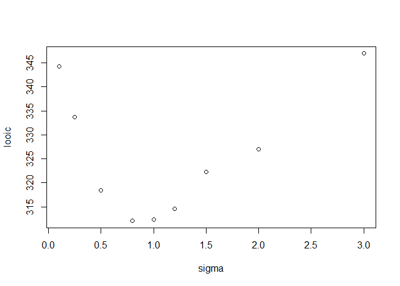<!-- -->

``` r
sigmas[which.min(loo_scores)]
```

    ## [1] 0.8

We observe that optimal $\sigma_1$ wrt. *looic* scores are around 0.8.
Let’s also check, for comparison, the *looic* scores without a moment
matching correction.

``` r
plot(sigmas, loo_scores_no_matching, xlab = 'sigma',  ylab = 'looic')
```

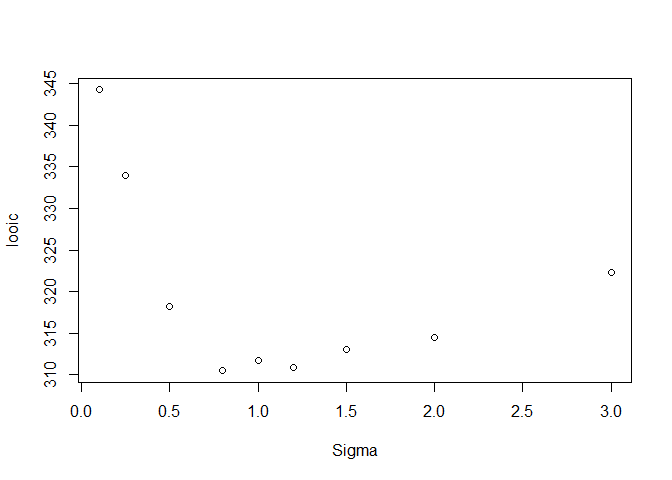<!-- -->

``` r
sigmas[which.min(loo_scores_no_matching)]
```

    ## [1] 0.8

We notice that the minimum is still at 0.8, but the shape of the minimum
is less pronounced, since the *looic* scores for larger $\sigma_1$ are
underestimated.

#### Estimating Sigma by Setting Its Prior

Let us try a different, model-based approach. We will now consider
$\sigma_1$ as another parameter to estimate with its own prior. In the
following implementation, we will use an exponential distribution.

``` default
data {
  int<lower=1> N_groups;                            // Number of groups                    
  array[N_groups] int<lower=0> trials;              // Number of trials in a group      
  array[N_groups] int<lower=0> y;                   // Number of successes in a group

  real mu_hyper;                                    // Prior mean for hyperparameter mu
  real<lower=0> sigma_hyper;                        // Prior sigma for hyperparameter mu   
} 

parameters {
  array[N_groups] real logit_p;                     // Probability logit of success
  real mu;                                          // Prior mu for probability logit
  real<lower=0> sigma_logit;                        // Prior sigma for probability logit     
}

model {
  // Priors
  mu ~ normal(mu_hyper, sigma_hyper);
  sigma_logit ~ exponential(1);

  for (i in 1:N_groups) {
    logit_p[i] ~ normal(mu,sigma_logit);
  }

  // Likelihood
  for (i in 1:N_groups) {
    y[i] ~ binomial_logit(trials[i], logit_p[i]);
  }
}
```

``` r
stan_data <- list(
  N_groups = length(rat$y),
  trials = rat$N,
  y = rat$y,
  mu_hyper = 0,
  sigma_hyper = 1.5
)

fit <- stan(
  file  = "C:/Users/elini/Desktop/nine circles 3/f1_s13.stan",
  data = stan_data,
  chains = 4,
  iter = 6000,
  warmup = 2000,
  seed = 123,
  refresh = 0
)
```

``` r
sigma_logit <- extract(fit)$sigma_logit

dens <- density(sigma_logit)
dens_data <- data.frame(x = dens$x, y = dens$y)
ggplot(dens_data, aes(x = x, y = y)) +  geom_line(linewidth = 1) + xlab('Sigma_1') + ylab('Posterior Density')
```

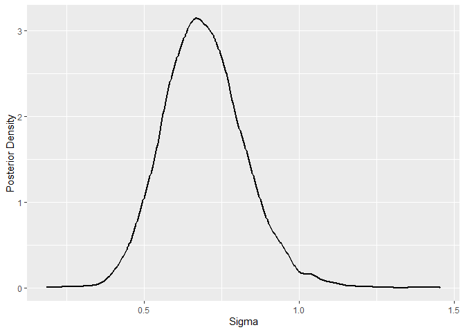<!-- -->

``` r
mean(sigma_logit)
```

    ## [1] 0.6929258

We observe that we obtained a result quite similar to that based on PSIS. 
Hence, we could save quite a bit of time and space by skipping
PSIS/leave-one-out cross-validation. Still, it served a purpose
as a validation tool of the obtained model. Plus, applications of
cross-validation go way further; hence, we need to cover it sooner or
later anyway.

Lastly, let us review our final model with partial pooling.

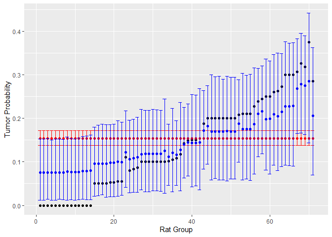<!-- -->

``` r
logit_p_partial_pooled <- extract(fit)$mu

dens <- density(ilogit(logit_p_partial_pooled))
dens_data <- data.frame(x = dens$x, y = dens$y)
ggplot(dens_data, aes(x = x, y = y)) +  geom_line(linewidth = 1) + xlab('Mu_1') + ylab('Posterior Density')
```

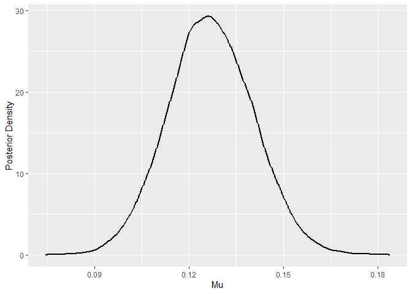<!-- -->

## Hierarchical Normal Model with Known Variance

Let us now consider a hierarchical model for which we can derive most of
the posteriors analytically to get a better idea of what is going on.
Namely, we will have a look at $J$ independent experiments, in which
$y_{ij} \mid \theta_j \sim N(\theta_j, \sigma^2)$ for
$i = 1, \ldots, n_j$, $j = 1, \ldots J$. Further, we will assume that
the variance $\sigma^2$ is *known*. This, of course, occurs rarely in
practice, but for a sufficiently large dataset, this is a reasonable
approximation (Gelman et al. 1995).

We denote the sample mean for each group
$\bar y_{\cdot j} =  \sum_i^{n_j} y_{ij}/n_j$ and sampling variances
$\sigma^2_j = \sigma^2/n_j$. As we observed in the previous example, we
can assume no pooling and estimate $\theta_j$ in each group by its
sample mean.

``` math
\hat \theta_j = \bar y_{\cdot j}
```

The second option is to pool the data and estimate each $\theta_j$ using
the overall sample mean, which we can compute from $\bar y_{\cdot j}$ as
follows (Gelman et al. 1995).

``` math
\hat \theta_j = \bar y_{\cdot\cdot} = \frac{\sum_j^J\bar y_{\cdot j}/\sigma^2_j}{\sum_j^J 1/\sigma^2_j}
```

Instead of choosing just between these two models, we can consider
partial pooling, in which the estimate of $\theta_j$ lies between no
pooling and pooling. Hence, we can write it as follows.

``` math
\hat \theta_j = \lambda_j\bar y_{\cdot\cdot} + (1-\lambda_j)\bar y_{\cdot j}
```

We want to obtain these estimates using Bayesian modeling, so the
question is which priors yield the corresponding estimates. Well, we
know that to get no pooling, we need to consider independent priors for
each $\theta_j$ and to get posterior that exactly peaks at
$\bar y_{\cdot j}$, we want to consider uniform (improper) prior
$p(\theta_j) \propto 1$. We get a pooled estimate $\bar y_{\cdot\cdot}$
by assuming that all $\theta_j\text{s}$ are equal and again by setting a
uniform prior on $\theta = \theta_1 = \cdots = \theta_J$. So, how to get
partial pooling?

Well by following our first example, we will assume $\theta_j$ drawn
from $N(\mu, \tau^2)$, where $\mu$ and $\tau$ are the hyperparameters.

``` math
p(\theta_1, \ldots, \theta_j \mid \mu, \tau) = \prod_{j = 1}^J N(\theta_j \mid \mu, \tau^2)
```

From our previous example, we also know that we need to set priors for
$\mu$ and $\tau$. We will assume an uniform prior for $p(\mu)$, i.e.,

``` math
p(\mu,\tau) =  p(\mu\mid \tau)p(\tau) \propto p(\tau)
```

Hence, the posterior distribution for all parameters/hyperparameters is
as follows (Gelman et al. 1995).

``` math
p(\theta_1, \ldots, \theta_j, \mu, \tau \mid y) \propto p(\mu,\tau) \prod_{j = 1}^J N(\theta_j \mid \mu, \tau^2)p(y\mid \theta) \propto p(\tau) \prod_{j = 1}^J N(\theta_j \mid \mu, \tau^2)p(y\mid \theta) \prod_{j = 1}^J N(\bar y_{\cdot j} \mid \theta_j, \sigma_j^2)
```

It can be derived from this posterior that

``` math
\theta_j \mid \mu, \tau, y \sim  N(\hat \theta_j, V),
```

where
$\hat \theta_j = \frac{1/\sigma^2_j \bar y_{\cdot j} + \mu/\tau^2}{1/\sigma^2_j + 1/ \tau^2}$
and $V = \frac{1}{1/\sigma^2_j + 1/ \tau^2}$. In addition, it can be
shown that

``` math
\mu \mid \tau,y = N(\hat \mu, V_\mu),
```

where
$\hat \mu = \frac{\sum_j  \bar y_{\cdot j}/(\sigma^2_j+ \tau^2)}{1/(\sigma^2_j+ \tau^2)}$
and $V^{-1}_\mu = \sum_j{1/(\sigma^2_j+ \tau^2)}$.

The only conditional posterior for a parameter that does not have a
simple analytical solution is the one for $\tau$, which meets

``` math
p(\tau \mid y) \propto p(\tau) V_\mu^{1/2}\prod_j(\sigma_j^2+\tau^2)^{-1/2}\exp\left(-\frac{( y_{\cdot j}- \hat\mu )^2}{2(\sigma_j^2+\tau^2)}\right) 
```

## SAT Dataset

Let us apply the results from the previous chapter to the dataset that
consists of estimated effects with no pooling (y corresponds to
$y_{\cdot j}$ and s to $\sigma_j$) (Gelman et al. 1995).

``` r
y <- c(28,8,-3,7,-1,1,18,12)
s <- c(15,10,16,11,9,11,10,18)
```

These data represent results from randomized experiments that estimated
the effects of coaching programs for the SAT-V (Scholastic Aptitude
Test-Verbal) in eight high schools. The estimated coaching effect for
each school was obtained by linear regression with PSAT-M and PSAT-V as
control variables (Preliminary SAT Mathematics and Verbal results). The
sample size in each school was over 30. Consequently, we can assume that
elements of $y$ have approximately normal distributions with sampling
variances that are known.

Let us plot the distributions of no pooling effects.

``` r
library(tidyr)
x <- seq(-40, 60, length.out = 500)
df_sep <- mapply(function(y, s, x) dnorm(x, y, s), y, s, MoreArgs = list(x = x)) %>%
  as.data.frame() %>%
  setNames(LETTERS[1:8]) %>%
  cbind(x) 

df_long <- pivot_longer(df_sep, cols = -x, names_to = "School", values_to = "pdf")

ggplot(df_long, aes(x = x, y = pdf, color = School)) +
  geom_line(linewidth = 1.25) + xlab('No Pooling Effects') + ylab('Posterior Densities')
```

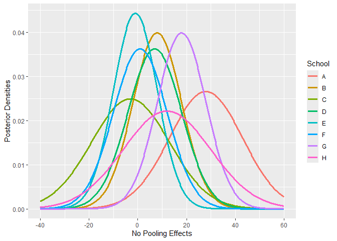<!-- -->

We observe considerable variability across schools, and the variance of
the estimates without pooling is significant. Next, let us combine the
results into a single pooled estimate using the formulas from the
previous chapter.

``` r
df_pool <- data.frame(x = x, p = dnorm(x, sum(y/s^2)/sum(1/s^2), sqrt(1/sum(1/s^2))))
df_sep <- df_sep  %>% cbind(Pooled = df_pool$p) 
df_long <- pivot_longer(df_sep, cols = -x, names_to = "School", values_to = "pdf")

ggplot(df_long, aes(x = x, y = pdf, color = School)) +
  geom_line(linewidth = 1.25) + xlab('No Pooling Coaching Programs Effect + Pooled Estimate') + ylab('Posterior Densities')
```

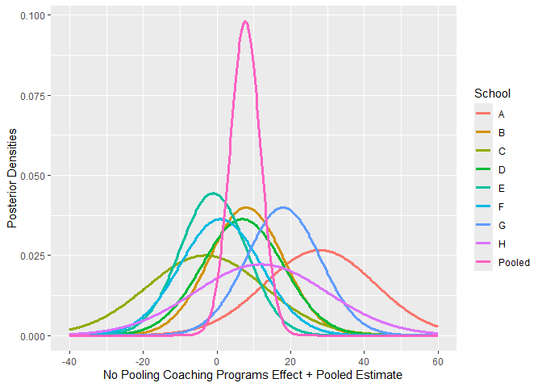<!-- -->

The pooled estimate predicts a slightly positive effect of coaching
programs overall. But again, it seems that schools are quite different.
Hence, let us model this heterogeneity and fit a hierarchical model.

We will use the conditional posterior densities from the previous
section. First, we need to pick a prior for $\tau$. For simplicity’s
sake, let us consider a uniform prior. Then, we will produce samples
from the posterior $\tau \mid y$ using grid approximation.

``` r
# tau posterior
mu_hat <- sum(y/s^2)/sum(1/s^2)
tau_posterior <- function(tau) {(sum(1/(s^2+tau^2))^(-1/2)) * prod((s^2+tau^2)^(-1/2)*exp(-1/2*(y-mu_hat)^2/(s^2 + tau^2)))}


# grid approximation
tau_grid <- seq(0.001,30,0.001)
tau_prob <- numeric(length(tau_grid))

for (i in 1:length(tau_prob)){
  
  tau_prob[i] <- tau_posterior(tau_grid[i])
  
}
tau_prob <- tau_prob/sum(tau_prob)


# sample from grid approximation
tau_sample <- sample(tau_grid, size = 10000, prob = tau_prob, replace = TRUE)

plot(tau_grid,tau_prob, xlab = 'Tau', ylab = 'Posterior Density')
```

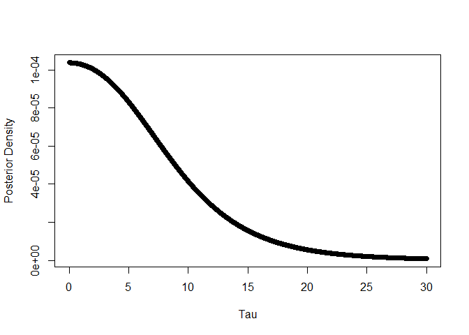<!-- -->

It seems that we got a reasonable posterior density. Next, we will
sample $\mu$ from the posterior $\mu \mid y, \tau$.

``` r
mu_sample <- numeric(length(tau_sample))


for (i in 1:length(tau_sample)){
  V_mu <- 1/sum(1/(s^2 + tau_sample[i]^2))
  mu_sample[i] <- rnorm(1, mu_hat, sqrt(V_mu))
}

hist(mu_sample, breaks = 100, main = '', xlab = 'Mu', ylab = 'Posterior Density', prob = TRUE)
```

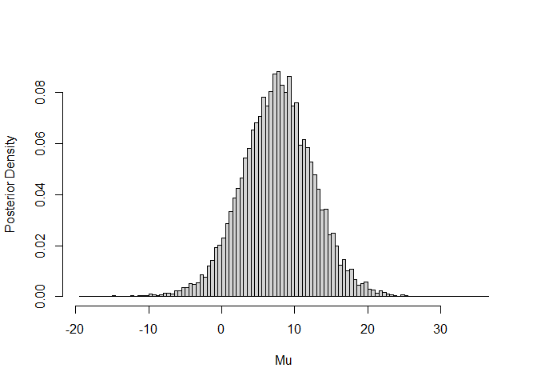<!-- -->

``` r
quantile(mu_sample, c(0.05, 0.1, 0.25, 0.5, 0.75, 0.9, 0.95))
```

    ##         5%        10%        25%        50%        75%        90%        95% 
    ## -0.5340809  1.3663346  4.3660994  7.6508746 10.9736384 14.0904254 15.9257813

``` r
mean(mu_sample)
```

    ## [1] 7.692236

We observe that $\mu$ is most likely positive. Lastly, we need to sample
$\theta_j\text{s}$ from $\theta_j \mid y, \tau, \mu$.

``` r
theta_sample <- matrix(0,length(tau_sample),8)


for (j in 1:8){
  for (i in 1:length(tau_sample)){
    
    hat_theta <- (y[j]/s[j]^2 + mu_sample[i]/tau_sample[i]^2)/(1/s[j]^2 + 1/tau_sample[i]^2)
    V  <- 1/(1/s[j]^2 + 1/tau_sample[i]^2)

    theta_sample[i,j] <- rnorm(1, hat_theta, sqrt(V))
}
}

colnames(theta_sample) <- c('A', 'B', 'C', 'D', 'E', 'F', 'G', 'H')


dens <- apply(theta_sample, 2, density)


dens <- apply(theta_sample, 2, density)
plot_data <- imap_dfr(dens, function(df, name) {
  tibble(x = df$x, y = df$y, group = name)
})

ggplot(plot_data, aes(x = x, y = y, group = group, color = group)) +
  geom_line(linewidth = 1) +  
  labs(x = "Partial Pooling Estimates of Coaching Programs Effect", y = "Posterior Densities")
```

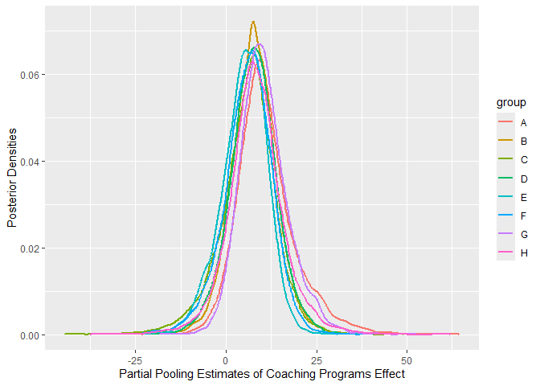<!-- -->

``` r
apply(theta_sample, 2, function(x) quantile(x, c(0.05, 0.1, 0.25, 0.5, 0.75, 0.9, 0.95)))
```

    ##               A          B         C          D         E         F          G
    ## 5%  -0.04554279 -2.4687751 -7.528867 -3.2097446 -6.314054 -5.654951  0.6399872
    ## 10%  2.20239411  0.1061624 -3.502470 -0.4703367 -3.233473 -2.334331  2.6124192
    ## 25%  5.89122435  3.9237123  1.708064  3.4752590  1.222991  2.254052  5.9705286
    ## 50% 10.14588678  7.7837237  6.499365  7.4689157  5.433422  6.440099  9.8816652
    ## 75% 15.28541401 11.7137589 10.821186 11.6030301  9.295532 10.439315 14.3569577
    ## 90% 21.92802496 15.5155238 14.819929 15.5982304 12.515415 13.923512 19.0944059
    ## 95% 26.68817333 18.0111919 17.681955 18.1300431 14.677056 16.308414 22.2220642
    ##              H
    ## 5%  -4.2130802
    ## 10% -0.7674147
    ## 25%  3.6927975
    ## 50%  7.9990608
    ## 75% 12.5530139
    ## 90% 17.5978761
    ## 95% 21.3356437

We observe that our partial pooling model is quite close to the pooling
model. So we would conclude that the effect of coaching programs seems
to be slightly positive regardless of the school. In addition,

## References

<div id="refs" class="references csl-bib-body hanging-indent"
entry-spacing="0">

<div id="ref-gelman1995bayesian" class="csl-entry">

Gelman, Andrew, John B Carlin, Hal S Stern, and Donald B Rubin. 1995.
*Bayesian Data Analysis*. Chapman; Hall/CRC.

</div>

<div id="ref-mcelreath2018statistical" class="csl-entry">

McElreath, Richard. 2018. *Statistical Rethinking: A Bayesian Course
with Examples in r and Stan*. Chapman; Hall/CRC.

</div>

<div id="ref-paananen2021implicitly" class="csl-entry">

Paananen, Topi, Juho Piironen, Paul-Christian Bürkner, and Aki Vehtari.
2021. “Implicitly Adaptive Importance Sampling.” *Statistics and
Computing* 31 (2): 16.

</div>

<div id="ref-vehtari2017practical" class="csl-entry">

Vehtari, Aki, Andrew Gelman, and Jonah Gabry. 2017. “Practical Bayesian
Model Evaluation Using Leave-One-Out Cross-Validation and WAIC.”
*Statistics and Computing* 27 (5): 1413–32.

</div>

<div id="ref-vehtari2024pareto" class="csl-entry">

Vehtari, Aki, Daniel Simpson, Andrew Gelman, Yuling Yao, and Jonah
Gabry. 2024. “Pareto Smoothed Importance Sampling.” *Journal of Machine
Learning Research* 25 (72): 1–58.

</div>

</div>
