# The Second Circle: Checking, Evaluating, and Comparing Bayesian Models, Part One
<big>**MCMC Diagnostics**</big>

<br/>
Jiří Fejlek

2026-07-04
<br/>

## Table of Contents

- [Markov Chain Monte Carlo](#markov-chain-monte-carlo)
  - [Metropolis Algorithm](#metropolis-algorithm)
  - [Hamiltonian MCMC](#hamiltonian-mcmc)
- [Therapeutic Touch Dataset](#therapeutic-touch-dataset)
- [MCMC diagnostics tool](#mcmc-diagnostics-tool)
  - [Trace Plots, Rank Plots, ECDF
    Plots](#trace-plots-rank-plots-ecdf-plots)
  - [ESS, Rhat](#ess-rhat)
- [Hamiltonian MCMC diagnostics](#hamiltonian-mcmc-diagnostics)
  - [Non-centered Parametrization](#non-centered-parametrization)
- [Rat Tumor Dataset Revisited](#rat-tumor-dataset-revisited)
- [References](#references)

``` r
library(rstan)
library(ggplot2)
library(HDInterval)
library(dplyr)
library(faraway)
```

## Markov Chain Monte Carlo

In the first circle of this cycle about Bayesian modeling, we have
learned that the main step that represents “fitting” a Bayesian model is
the computation of the posterior probability

``` math
p(\theta \mid y) = \frac{p(y, \theta)}{p(y)} = \frac{p(y \mid \theta)p(\theta)}{\int p(y \mid \theta)p(\theta) \mathrm{d}\theta},
```

where $y$ denotes observed data, $\theta$ are parameters of the model to
be estimated, and $p(\theta)$ is a prior distribution for $\theta$. The
hard step in this computation is to determine the normalization constant
$\int p(y \mid \theta)p(\theta) \mathrm{d}\theta$, since this is a
multivariate integral that almost never has an analytic solution.

When the dimensionality of $\theta$ is not “large” (let’s say smaller
than 4), we can use grid approximation: we assume that $\theta$ is
restricted to a grid ${\theta_1, \ldots \theta_N}$ and then, we can
approximate the normalization as

``` math
p(\theta_i \mid y) =  \frac{p(y \mid \theta_i)p(\theta_i)}{\sum_{j=1}^N p(y \mid \theta_j)p(\theta_j)}.
```

In other cases, we relied on approximate sampling from the posterior
using some *Markov Chain Monte Carlo* (MCMC) algorithms. Let us have a
look at them a bit closer.

### Metropolis Algorithm

We will start by introducing the fundamental MCMC algorithm: the
Metropolis algorithm. Let us assume that we want to sample from a
density $\theta \sim p$, i.e., create a sequence of samples (a so-called
chain) $\theta_1, \theta_2, \ldots$ from $p$ . The Metropolis algorithm
creates samples sequentially via a jumping distribution
$J(\theta_1 \mid \theta_2)$ that generates candidates for the next
sample from the last sample in the sequence. We will assume that
$J(\theta_1 \mid \theta_2)$ is symmetric:
$J(\theta_1 \mid \theta_2) = J(\theta_2 \mid \theta_1)$. In addition, we
will also assume that $J(\theta^* \mid \theta)>0$ for any valid values
of $\theta$ and $\theta^*$. This condition ensures that the chain can,
at any moment, generate any candidate from $p(\theta)$.

The Metropolis algorithm has the following steps (Gelman et al. 1995).

1.  Select an initial $\theta_0$ for which $p(\theta_0) >0$
2.  For $t = 1, 2, \ldots$ do
    1.  Sample a proposal $\theta^*$ from the jumping distribution
        $J(\theta \mid \theta_{t-1})$
    2.  Calculate an *acceptance ratio*
        $r = p(\theta^*)/p(\theta_{t-1})$
    3.  Set $\theta_t = \theta^*$ with probability $\min(r,1)$,
        otherwise set $\theta_t = \theta_{t-1}$

We should note that we can generalize to a non-symmetric jumping
distribution $J$ by modifying the acceptance ratio as

``` math
r = \frac{J(\theta_{t-1} \mid \theta^*)p(\theta^*)}{J(\theta^* \mid \theta_{t-1})p(\theta_{t-1})}.
```

To illustrate that the Metropolis Algorithm works, we will implement a
simple Metropolis algorithm for sampling from a 1D density with a normal
jumping distribution.

``` r
metropolis_mcmc <- function(n_iter, start_value, proposal_sd, target_density) {
  
  mcmc_chain <- numeric(n_iter)
  mcmc_chain[1] <- start_value
  
  for (t in 2:n_iter) {
    current_state <- mcmc_chain[t - 1]
    
    # proposal
    proposal <- rnorm(1, mean = current_state, sd = proposal_sd)
    # acceptance ratio
    r <- target_density(proposal) / target_density(current_state)
    
    if (runif(1) < r) {
      mcmc_chain[t] <- proposal      
    } else {
      mcmc_chain[t] <- current_state 
    }
  }
  
  return(mcmc_chain)
}
```

Let’s consider sampling from $\text{Beta}(12,2)$.

``` r
set.seed(123)
metropolis_samples <- metropolis_mcmc(n_iter = 50000, start_value = 0.75, proposal_sd = 0.25, target_density = function(x) dbeta(x, 12, 2))

hist(metropolis_samples, probability = TRUE, breaks  = 100, main = '', xlab = 'Theta', ylab = 'Density')
curve(dbeta(x, 12, 2, ncp = 0, log = FALSE), from = 0, to = 1, 
      col = "red", lwd = 2, add = TRUE, ylab = "Posterior PDF", xlab = "Theta")
```

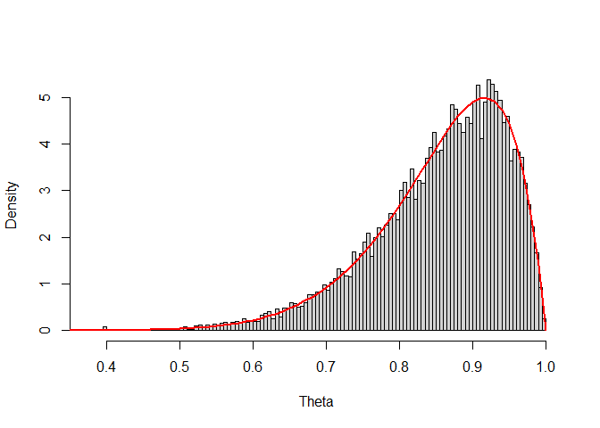<!-- -->

We observe that we indeed got samples that are quite close to the target
distribution.

One important thing to notice is that the Metropolis Algorithm depends
on $p(\theta)$ only through acceptance ratio
$p(\theta^*)/p(\theta_{t-1})$, i.e., we do not need to know the correct
normalization to sample from $p(\theta)$. This is what we need for
Bayesian modeling! So what’s the issue with the Metropolis Algorithm?
Well, the main issue is that the Metropolis Algorithm samples from a
given $p(\theta)$ for any suitable $J(\theta_1 \mid \theta_2)$ only in a
limit. For finite samples, the selection of $J(\theta_1 \mid \theta_2)$
plays a crucial role in obtaining a good performance from the Metropolis
Algorithm.

``` r
# too large steps proposal_sd
set.seed(123)
metropolis_samples <- metropolis_mcmc(n_iter = 50000, start_value = 0.75, proposal_sd = 50, target_density = function(x) dbeta(x, 12, 2))

hist(metropolis_samples, probability = TRUE, breaks  = 100, main = '', xlab = 'Theta', ylab = 'Density')
curve(dbeta(x, 12, 2, ncp = 0, log = FALSE), from = 0, to = 1, 
      col = "red", lwd = 2, add = TRUE, ylab = "Posterior PDF", xlab = "Theta")
```

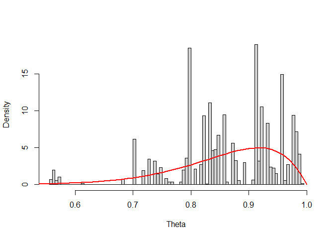<!-- -->

``` r
# too small steps proposal_sd
set.seed(123)
metropolis_samples <- metropolis_mcmc(n_iter = 50000, start_value = 0.75, proposal_sd = 0.0025, target_density = function(x) dbeta(x, 12, 2))
hist(metropolis_samples, probability = TRUE, breaks = seq(0, 1, by = 0.01), main = '', xlab = 'Theta', ylab = 'Density')
curve(dbeta(x, 12, 2, ncp = 0, log = FALSE), from = 0, to = 1, 
      col = "red", lwd = 2, add = TRUE, ylab = "Posterior PDF", xlab = "Theta")
```

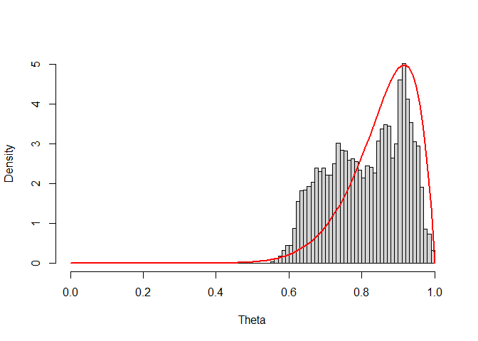<!-- -->

If the “step” *proposal_sd *is too large, the majority of the proposals
are outside of the typical values of the density, and they will be
rejected, and the sampling algorithm stands still. For small steps, the
samples will generally be accepted, but subsequent samples will be
highly correlated, and the algorithm will explore the entire support of
the target density very slowly. These issues become even more pronounced
across multiple dimensions, where the optimal step in each direction may
differ and can even change rapidly with $\theta$ due to the curvature of
the target density. Note that this issue can be partially remedied by
using a *Gibbs sampler*, in which we draw each dimension separately
using a conditional distribution
$p(\theta_i \mid \theta_1, \ldots, \theta_{i-1}, \theta_{i+1}, \ldots)$
(we encountered this strategy in the past when we used multiple
imputation via chained equations).

Consequently, if we encounter difficulties with the Metropolis
Algorithm, we will need many samples to obtain a representative view of
the target density. In addition, we need to be able to determine that
“we are not there yet”, i.e., the sample we got is not yet
representative of the target density we are sampling from! Before we
address how to assess the quality of MCMC chains, let us describe
another MCM algorithm that we have used in Stan up to this point:
*Hamiltonian MCMC*.

### Hamiltonian MCMC

Hamiltonian MCMC is an extension of the Metropolis algorithm that aims
to improve sampling efficiency by combining Metropolis-like random-walk
exploration with deterministic exploration inspired by simulations of
physical systems (Gelman et al. 1995). Hence, we need to first do a
quick review of Hamiltonian mechanics.

Let us assume a mechanical system described by vectors of *generalized
positions* $q$ and *generalized momentum* $p$. These coordinates are
called *generalized* because they are not necessarily tied to the
standard Cartesian coordinates. For example, let us assume a simple
pendulum of length $l$ and mass $m$. The generalized position for a
simple pendulum is an angle $q = \phi = \text{arctan}(-x/y)$ ($x$ and
$y$ are Cartesian coordinates of the pendulum’s weight), and the
generalized momentum is its angular momentum $p = ml^2\dot{\phi}$. The
Hamiltonian $\mathcal{H}(p,q)$ is the total energy of a dynamical
system. For the pendulum, its Hamiltonian is

``` math
\mathcal{H}(p,q) = \frac{p}{ml^2} + mgl(1-\cos q).
```

Importantly, the Hamiltonian is the sum of the pendulum’s kinetic energy
$T= \frac{p}{ml^2}$ and the pendulum’s potential energy
$U = mgl(1-\cos q).$

One of the fundamental results of mechanics is that the evolution of the
system meets *Hamilton’s equations*

``` math
\begin{align*}
\dot{q} & = \frac{\partial \mathcal H}{\partial p}
\dot{p} & = -\frac{\partial \mathcal H}{\partial q}.
\end{align*}
```

Hence, for the simple pendulum, we obtain the following equations of
motion.

``` math
\begin{align*}
\dot{q} & = \frac{p}{ml^2}\\
\dot{p} & = -mgl\sin q
\end{align*}
```

Now, let us tie Hamiltonian mechanics with MCMC. As we have mentioned
earlier, MCMC uses physics-inspired simulations to generate samples. It
does so as follows. Let us assume that the parameters $\theta$
correspond to the generalized positions of the mechanical system $q$ and
let the logarithm of the posterior density $-\log p(\theta \mid y)$ be
its potential energy $U$. We will denote this density in this section as
$\pi(q)$. This is the target density of the MCMC algorithm we want to
sample from.

Next, we also need to define a generalized momentum to complete the
definition of a mechanical system. Hence, we will define auxiliary
variables $\phi$ that will serve this purpose, and we will define the
Hamiltonian of the system as (Betancourt 2017)

``` math
\mathcal {H}(q,p) = -\text{log }\pi(q,p) = - \text{log }\pi(p \mid q) - \text{log }\pi(q),
```

i.e., the Hamiltonian is equal to the joint probability of $\theta$ and
$\phi$ and the kinetic energy of this auxiliary mechanical system
corresponds to the conditional probability $\pi(p \mid q)$, i.e.,
$\phi \mid \theta$.

Now, let us assign some random momentum $\phi$ to the position $\theta$.
If we assign a very small momentum, the evolution of the Hamiltonian
system will simply stay still in the minimum of the potential energy
(i.e., a mode of the distribution $\pi(q)$). If we assign a very large
momentum, the evolution will lie almost outside of the potential field
and, hence, it will end up in a position that corresponds to a very low
probability $\pi(q)$. However, if we select the typical value from the
phase space $(p,q)$, the simulation will explore the typical set for
$\pi(q)$ by following the energy level set $H(q,p) = C$ (due to
conservation of total energy). In other words, it will draw an orbit
around a mode of $\pi(q)$ (Betancourt 2017).

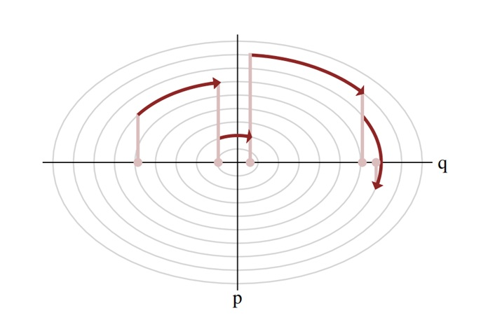<!-- -->

These observations motivate a definition of sampling via the Hamiltonian
MCMC. The algorithm first randomly selects the momentum $\phi$ and then
explores the corresponding energy level. In particular, the Hamiltonian
MCMC algorithm can be written as follows (Gelman et al. 1995).

1.  Select initial $\theta_0$ for which $p(\theta_0)>0$
2.  For $t = 1, 2, \ldots$ do
    1.  Randomly draw $\phi$ from $\pi(p \mid q)$
    2.  Simulate Hamiltonian system $(\theta, \phi)$ from
        $(\theta_{t-1}, \phi)$ to some $(\theta^*, \phi^*)$
    3.  Accept $\theta_t = \theta^*$ with probability
        

``` math
\min(1, \text{exp}(\mathcal{H}(\theta_{t-1}, \phi) - \mathcal{H}(\theta^*, -\phi^*)))
```

<br/> One might be surprised by the inclusion of the acceptance step from the Metropolis Algorithm, since the evolution of the Hamiltonian equations
should conserve the total energy, i.e., the acceptance probability
should always be 1. However, the Hamiltonian system must be integrated
numerically in practice, and hence, there will be some integration
errors. The random acceptance, thence, serves as a correction for the
bias caused by the integrator. We can also notice that the sign for the
momentum in $\mathcal{H}(\theta^, -\phi^)$ is opposite. This is because
the denominator in the acceptance ratio
$r = \frac{J(\theta_{t-1} \mid \theta^)p(\theta^)}{J(\theta^* \mid \theta_{t-1})p(\theta_{t-1})}$
corresponds to the probability of the “reverse” jump, and to make the
reverse jump in Hamiltonian dynamics, we have to a reverse the direction
of the momentum (Betancourt 2017).

Now, we skipped one important implementation detail, how to find a
suitable distribution for $\phi$, i.e., how to choose the kinetic
energy. Stan uses Euclidean-Gaussian kinetic energy

``` math
K(q,p) = \frac{1}{2}p^T M^{-1} p + \text{log } M + \text{const.},
```

i.e., $p \sim N(0, M)$ (which is independent of $q$!), where $M$ is the
*mass matrix*

``` math
M^{-1} = \text{diag }\mathbb{E} (\theta-\mathbb{E}\theta)(\theta-\mathbb{E}\theta)^T,
```

that is estimated during the warm-up phase, see
<https://mc-stan.org/docs/2_29/reference-manual/hamiltonian-monte-carlo.html>
for more details.

The last modification that we will mention here is NUTS (no-U-turn
sampler). One can imagine that, provided we simulate the Hamiltonian
system long enough, the simulation will end where it started. NUTS
ensures that this does not happen by simulating the Hamiltonian system
both forwards and backward, and it stops once it detects a U-turn (or
exceeds the maximum number of simulation steps). The proposal is then
selected randomly from the generated trajectory (Hoffman, Gelman, et al.
2014).

Let us illustrate how Hamiltonian MCMC works via a simple implementation
(without NUTS). We first need an integrator for Hamiltonian systems. The
algorithm that is usually used for this purpose is the Leapfrog
algorithm (<https://en.wikipedia.org/wiki/Leapfrog_integration>) (the
reason why it is used is because it is a symplectic integrator
(Betancourt 2017), it is energy stable; the total energy of the system
oscillate during the integration, but it will not usually explode or
vanish over the long time span, which can happen for other forward
integrators such us Euler or Runge-Kutta).

``` r
# q: generalized position, p: generalized momentum, grad_U: gradient of potential energy
leapfrog <- function(q, p, eps, grad_U, M_inv, L) {
  for (i in seq_len(L)) {
    p <- p - 0.5 * eps * grad_U(q)
    q <- q + eps * M_inv %*% p
    p <- p - 0.5 * eps * grad_U(q)
  }
  list(q = q, p = p)
}
```

We will consider sampling from a 2D normal density with covariance
``` math
\Sigma = \begin{pmatrix}
1 & 0.95 \\
0.95 & 1
\end{pmatrix}.
```
``` r
library(MASS)
# target normal distribution
sigma <- matrix(c(1, 0.95, 0.95, 1), 2, 2)
rnomr_samples = mvrnorm(50000, numeric(2), sigma)
plot(rnomr_samples[,1], rnomr_samples[,2], xlab = 'x1', ylab = 'x2')
```

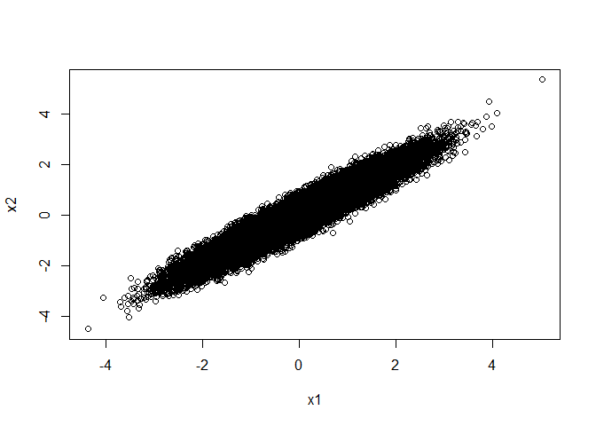<!-- -->

``` r
t(rnomr_samples - mean(rnomr_samples)) %*% (rnomr_samples - mean(rnomr_samples))/50000
```

    ##           [,1]      [,2]
    ## [1,] 1.0034015 0.9540135
    ## [2,] 0.9540135 1.0046968

We implement the Hamiltonian MCMC sampler as follows.

``` r
# compute potential energy
sigma_inv <- solve(sigma)
U <- function(q) as.numeric(0.5 * t(q) %*% sigma_inv %*% q)
grad_U <- function(q) as.vector(sigma_inv %*% q)


# define mass
M = matrix(c(1, 0, 0, 1), 2, 2)
M_inv = matrix(c(1, 0, 0, 1), 2, 2)

# Hamiltonian MCMC step
hmc_step <- function(q, eps, grad_U, M, M_inv, L) {
  
  p     <- mvrnorm(1, numeric(length(q)), M)
  end   <- leapfrog(q, p, eps, grad_U, M_inv, L)
  H_old <- U(q)     + 0.5 * t(p) %*% M_inv %*% p 
  H_new <- U(end$q) + 0.5 * t(end$p) %*% M_inv %*% end$p
  if (runif(1) < exp(H_old - H_new)) end$q else q
}

# simulation
set.seed(123)
n_sample <- 50000
hmc_chain    <- matrix(NA, n_sample, 2)
hmc_chain[1, ] <- c(0, 0)
for (i in 2:n_sample) hmc_chain[i, ] <- hmc_step(hmc_chain[i - 1, ], eps = 0.3, grad_U, M, M_inv, L = 20)
plot(hmc_chain[,1], hmc_chain[,2], xlab = 'x1', ylab = 'x2')
```

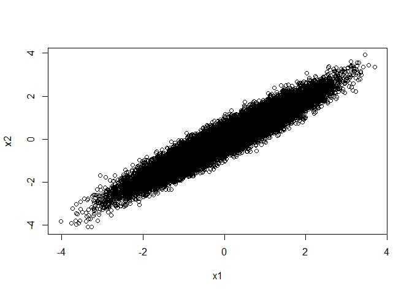<!-- -->

``` r
t(hmc_chain - mean(hmc_chain)) %*% (hmc_chain - mean(hmc_chain))/50000
```

    ##          [,1]     [,2]
    ## [1,] 1.004218 0.953956
    ## [2,] 0.953956 1.004159

Let us now consider a normal density with covariance
``` math
\Sigma = \begin{pmatrix}
5 & 0.95 \\
0.95 & 1
\end{pmatrix}.
```
``` r
# target normal distribution
sigma <- matrix(c(5, 0.95, 0.95, 1), 2, 2)
rnomr_samples = mvrnorm(50000, numeric(2), sigma)
plot(rnomr_samples[,1], rnomr_samples[,2], xlab = 'x1', ylab = 'x2')
```

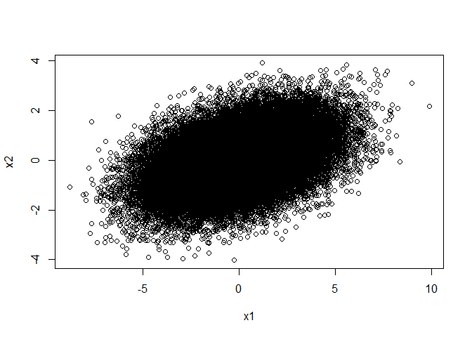<!-- -->

``` r
t(rnomr_samples - mean(rnomr_samples)) %*% (rnomr_samples - mean(rnomr_samples))/50000
```

    ##           [,1]      [,2]
    ## [1,] 5.0048837 0.9479693
    ## [2,] 0.9479693 0.9961164

Now, we can set the mass matrix as $M^{-1} = \text{diag } \Sigma$.

``` r
# compute potential energy
sigma_inv <- solve(sigma)
U <- function(q) as.numeric(0.5 * t(q) %*% sigma_inv %*% q)
grad_U <- function(q) as.vector(sigma_inv %*% q)

# define mass
M = matrix(c(1/5, 0, 0, 1), 2, 2)
M_inv = matrix(c(5, 0, 0, 1), 2, 2)

# simulation
set.seed(123)
n_sample <- 50000
hmc_chain    <- matrix(NA, n_sample, 2)
hmc_chain[1, ] <- c(0, 0)
for (i in 2:n_sample) hmc_chain[i, ] <- hmc_step(hmc_chain[i - 1, ], eps = 0.3, grad_U, M, M_inv, L = 20)
plot(hmc_chain[,1], hmc_chain[,2])
```

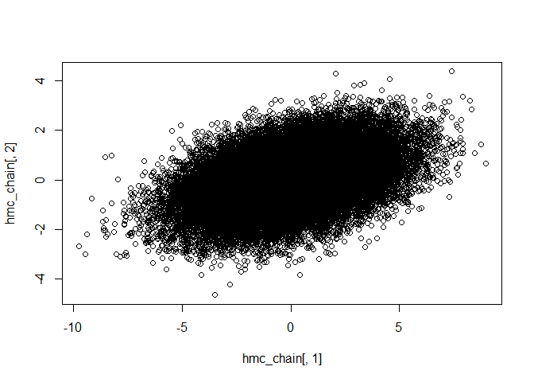<!-- -->

``` r
t(hmc_chain - mean(hmc_chain)) %*% (hmc_chain - mean(hmc_chain))/n_sample
```

    ##           [,1]      [,2]
    ## [1,] 5.0801982 0.9833482
    ## [2,] 0.9833482 1.0118420

We observe that in both cases, Hamiltonian MCMC successfully sampled the
target density.

## Therapeutic Touch Dataset

We will now move on to the dataset we will use to demonstrate
diagnostics for MCMC chains. The dataset is from (Kruschke et al. 2014)
and it is based on the experiment by (Rosa et al. 1998). The goal of
this experiment was to test the abilities of practitioners of
“theraupetic touches” that allegedly manipulate the “energy field” of a
patient who is suffering from a disease. The goal of this experiment was
to determine whether a practitioner is able to sense which of their
hands is near another person’s hand without being able to see them.

Principally speaking, this dataset is an analog of the Rat Tumor Dataset
from the previous circle. It is a binomial model of probability of
success with observations with a single group factor: in this case, an
individual practitioner.

``` r
TherapeuticTouch <- read.csv("C:/Users/elini/Desktop/nine circles 3/TherapeuticTouchData.csv", sep = ',')
head(TherapeuticTouch)
```

    ##   y   s
    ## 1 1 S01
    ## 2 0 S01
    ## 3 0 S01
    ## 4 0 S01
    ## 5 0 S01
    ## 6 0 S01

The dataset is in the form of a “long table”. Let us first group the
data by the practitioners.

``` r
TherapeuticTouch_binomial <- TherapeuticTouch %>% group_by(s) %>% summarize(Succ = sum(y == 1), Fail  = sum(y == 0))
head(TherapeuticTouch_binomial)
```

    ## # A tibble: 6 × 3
    ##   s      Succ  Fail
    ##   <chr> <int> <int>
    ## 1 S01       1     9
    ## 2 S02       2     8
    ## 3 S03       3     7
    ## 4 S04       3     7
    ## 5 S05       3     7
    ## 6 S06       3     7

Now, the dataset is in the same format as our previous Rat Tumor
Dataset. We will follow the same steps as with the Rat Tumor Dataset in
the previous circles. First, we will fit a pooled model. We can even
reuse the Stan code.

``` default
data {
  int<lower=1> N_groups;                            // Number of groups                    
  array[N_groups] int<lower=0> trials;              // Number of trials in a group      
  array[N_groups] int<lower=0> y;                   // Number of successes in a group
  real mu;                                          // Prior mu
  real<lower=0> sigma;                              // Prior sigma
} 

parameters {
  real logit_p;                                     // Probability logit of success (pooled)                 
}

model {
  // Prior
  logit_p ~ normal(mu, sigma);

  // Likelihood
  for (i in 1:N_groups) {
    y[i] ~ binomial_logit(trials[i], logit_p);
  }
}
```

``` r
stan_data <- list(
  N_groups = length(TherapeuticTouch_binomial$s),
  trials = TherapeuticTouch_binomial$Succ + TherapeuticTouch_binomial$Fail,
  y = TherapeuticTouch_binomial$Succ,
  mu = 0,
  sigma = 1.5
)

fit <- stan(
  file  = "C:/Users/elini/Desktop/nine circles 3/f1_s10.stan",
  data = stan_data,
  chains = 4,
  iter = 4000,
  warmup = 2000,
  seed = 123,
  refresh = 0
)
```

``` r
logit_p_pooled <- extract(fit)$logit_p

dens <- density(ilogit(logit_p_pooled))
dens_data <- data.frame(x = dens$x, y = dens$y)
ggplot(dens_data, aes(x = x, y = y)) +  geom_line(linewidth = 1) + xlab('Probability of Correct Guess') + ylab('Posterior Density')
```

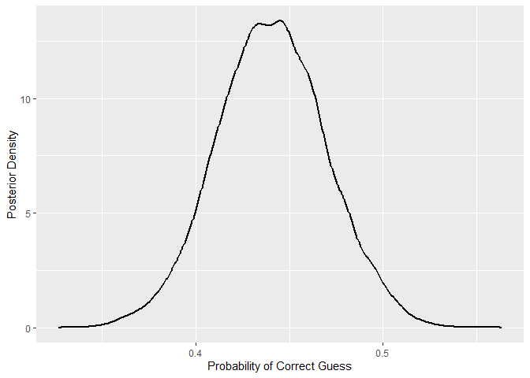<!-- -->

We observe that the pooled probability of success is below 0.5, so it
seems that the practitioners performed worse than by chance. We again
suspect that there might be some variability between the practitioners ,
and hence, let us consider a hierarchical model

``` math
\begin{align*}
p_i/(1-p_i) &\sim N(\mu_1, \sigma_1^2) \\
\mu_1 & \sim N(\mu_2, \sigma_2^2) \\
\sigma_1 & \sim \text{Exp }(\lambda).
\end{align*}
```

We will fit the model for $\lambda = 1$.

``` default
data {
  int<lower=1> N_groups;                            // Number of groups                    
  array[N_groups] int<lower=0> trials;              // Number of trials in a group      
  array[N_groups] int<lower=0> y;                   // Number of successes in a group

  real mu_hyper;                                    // Prior mean for hyperparameter mu
  real<lower=0> sigma_hyper;                        // Prior sigma for hyperparameter mu
  real<lower=0> lambda;                             // Prior lambda for sigma_logit
} 

parameters {
  array[N_groups] real logit_p;                     // Probability logit of success
  real mu;                                          // Prior mu for probability logit
  real<lower=0> sigma_logit;                        // Prior sigma for probability logit     
}

model {
  // Priors
  mu ~ normal(mu_hyper, sigma_hyper);
  sigma_logit ~ exponential(lambda);

  for (i in 1:N_groups) {
    logit_p[i] ~ normal(mu,sigma_logit);
  }

  // Likelihood
  for (i in 1:N_groups) {
    y[i] ~ binomial_logit(trials[i], logit_p[i]);
  }
}
```

``` r
stan_data <- list(
  N_groups = length(TherapeuticTouch_binomial$s),
  trials = TherapeuticTouch_binomial$Succ + TherapeuticTouch_binomial$Fail,
  y = TherapeuticTouch_binomial$Succ,
  mu_hyper = 0,
  sigma_hyper = 1.5,
  lambda = 1
)

fit <- stan(
  file  = "C:/Users/elini/Desktop/nine circles 3/f2_s1.stan",
  data = stan_data,
  chains = 4,
  iter = 4000,
  warmup = 2000,
  seed = 123,
  refresh = 0
)
```
``` r
p_no_pooling <- ilogit(extract(fit)$logit_p)
mean_p_no_pooling <- apply(p_no_pooling , 2, mean)
hdi_p_no_pooling <- apply(p_no_pooling , 2, function (x) hdi(x, credMass = 0.95))
hdi_p_pooled <- hdi(ilogit(logit_p_pooled), credMass = 0.95)


ggplot(TherapeuticTouch_binomial, aes(x = 1:length(s), y = Succ/(Succ+Fail))) +  geom_point() + xlab('Practicioner') + ylab('Probability of Correct Guess') + geom_point(aes(y = mean(ilogit(logit_p_pooled))), color = 'red') + geom_errorbar(aes(ymin=hdi_p_pooled[1], ymax=hdi_p_pooled[2]), color = 'red') +
geom_point(aes(y = mean_p_no_pooling), color = 'blue') + geom_errorbar(aes(ymin=hdi_p_no_pooling[1,], ymax=hdi_p_no_pooling[2,]), color = 'blue')
```

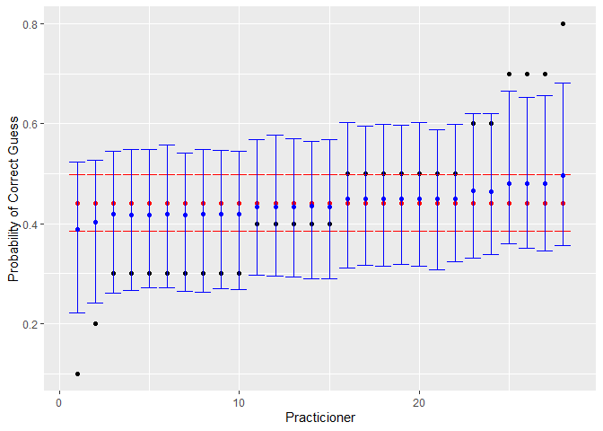<!-- -->

We observe that the model is very close to the pooled model. Let us
check the posterior form $\sigma_1.$

``` r
sigma_logit <- extract(fit)$sigma_logit

dens <- density(sigma_logit)
dens_data <- data.frame(x = dens$x, y = dens$y)
ggplot(dens_data, aes(x = x, y = y)) +  geom_line(linewidth = 1) + xlab('Sigma_1') + ylab('Posterior Density')
```

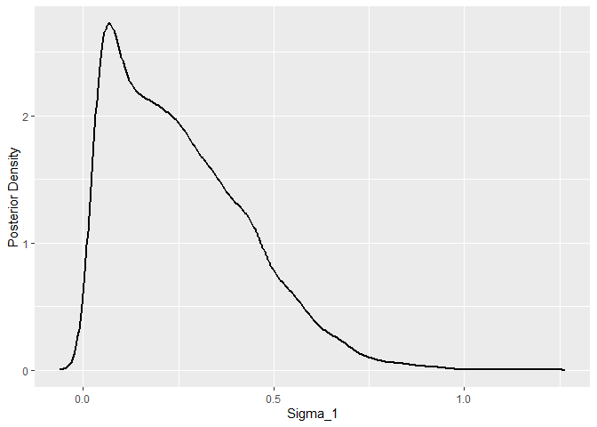<!-- -->

``` r
hdi(sigma_logit)
```

    ##     lower     upper 
    ## 0.0185877 0.5868342 
    ## attr(,"credMass")
    ## [1] 0.95

We want to make sure that our estimate of $\sigma_1$ (which determines
the degree of pooling) is not overly influenced by our choice of prior.
Let us now select a less informative prior with $\lambda = 0.01$.

``` r
stan_data <- list(
  N_groups = length(TherapeuticTouch_binomial$s),
  trials = TherapeuticTouch_binomial$Succ + TherapeuticTouch_binomial$Fail,
  y = TherapeuticTouch_binomial$Succ,
  mu_hyper = 0,
  sigma_hyper = 1.5,
  lambda = 0.01
)

fit2 <- stan(
  file  = "C:/Users/elini/Desktop/nine circles 3/f2_s1.stan",
  data = stan_data,
  chains = 4,
  iter = 4000,
  warmup = 2000,
  seed = 123,
  refresh = 0
)
```

``` r
p_no_pooling <- ilogit(extract(fit2)$logit_p)
mean_p_no_pooling <- apply(p_no_pooling , 2, mean)
hdi_p_no_pooling <- apply(p_no_pooling , 2, function (x) hdi(x, credMass = 0.95))
hdi_p_pooled <- hdi(ilogit(logit_p_pooled), credMass = 0.95)


ggplot(TherapeuticTouch_binomial, aes(x = 1:length(s), y = Succ/(Succ+Fail))) +  geom_point() + xlab('Practicioner') + ylab('Probability of Correct Guess') + geom_point(aes(y = mean(ilogit(logit_p_pooled))), color = 'red') + geom_errorbar(aes(ymin=hdi_p_pooled[1], ymax=hdi_p_pooled[2]), color = 'red') +
geom_point(aes(y = mean_p_no_pooling), color = 'blue') + geom_errorbar(aes(ymin=hdi_p_no_pooling[1,], ymax=hdi_p_no_pooling[2,]), color = 'blue')
```

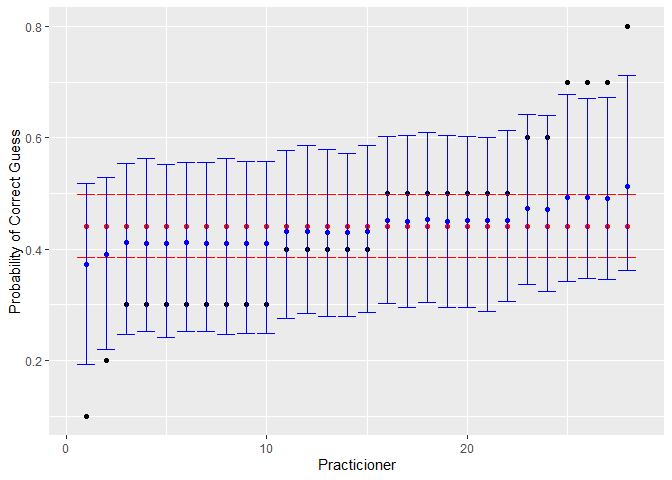<!-- -->

``` r
sigma_logit <- extract(fit2)$sigma_logit

dens <- density(sigma_logit)
dens_data <- data.frame(x = dens$x, y = dens$y)
ggplot(dens_data, aes(x = x, y = y)) +  geom_line(linewidth = 1) + xlab('Sigma_1') + ylab('Posterior Density')
```

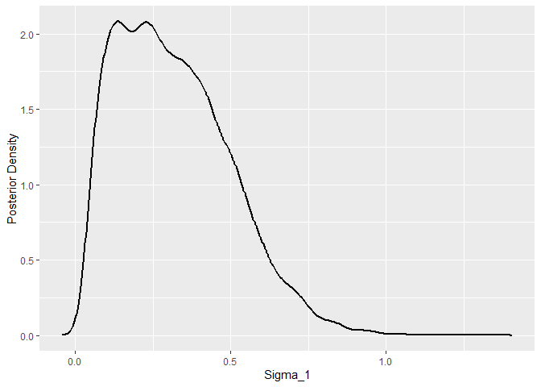<!-- -->

``` r
hdi(sigma_logit)
```

    ##      lower      upper 
    ## 0.03812368 0.64234162 
    ## attr(,"credMass")
    ## [1] 0.95

We indeed observe a slight increase in value of $\sigma_1$. Let us try
even more flat prior.

``` r
stan_data <- list(
  N_groups = length(TherapeuticTouch_binomial$s),
  trials = TherapeuticTouch_binomial$Succ + TherapeuticTouch_binomial$Fail,
  y = TherapeuticTouch_binomial$Succ,
  mu_hyper = 0,
  sigma_hyper = 1.5,
  lambda = 0.00001
)

fit3 <- stan(
  file  = "C:/Users/elini/Desktop/nine circles 3/f2_s1.stan",
  data = stan_data,
  chains = 4,
  iter = 4000,
  warmup = 2000,
  seed = 123,
  refresh = 0
)
```

``` r
sigma_logit <- extract(fit3)$sigma_logit

dens <- density(sigma_logit)
dens_data <- data.frame(x = dens$x, y = dens$y)
ggplot(dens_data, aes(x = x, y = y)) +  geom_line(linewidth = 1) + xlab('Sigma_1') + ylab('Posterior Density')
```

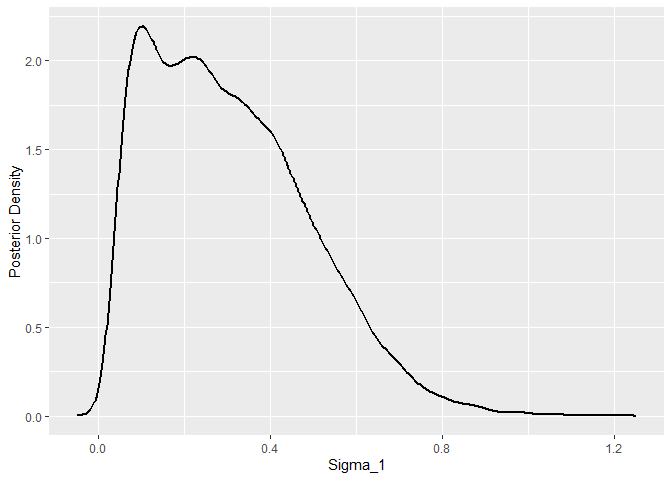<!-- -->

``` r
hdi(sigma_logit)
```

    ##      lower      upper 
    ## 0.03837561 0.64223530 
    ## attr(,"credMass")
    ## [1] 0.95

The estimate of $\sigma_1$ does not seem to increase further, so we can
probably stop here and consider the model with $\lambda = 0.01$ as our
final model.

## MCMC diagnostics tool

When we use samples generated by an MCMC algorithm, we need to ensure
that the chains are drawn from the target distribution. Hence, let us go
through some methods that are used to assess the quality of MCMC chains.
We start with methods that are applicable to all MCMC methods.

Let us remind ourselves of our final model.

``` r
stan_data <- list(
  N_groups = length(TherapeuticTouch_binomial$s),
  trials = TherapeuticTouch_binomial$Succ + TherapeuticTouch_binomial$Fail,
  y = TherapeuticTouch_binomial$Succ,
  mu_hyper = 0,
  sigma_hyper = 1.5,
  lambda = 0.01
)

fit <- stan(
  file  = "C:/Users/elini/Desktop/nine circles 3/f2_s1.stan",
  data = stan_data,
  chains = 4,
  iter = 4000,
  warmup = 2000,
  seed = 123,
  refresh = 0
)
```

### Trace Plots, Rank Plots, ECDF Plots

The simplest diagnostic tools for MCMC chains are trace plots, which
show the trajectories of each chain. Provided that the MCMC algorithm
samples the target distribution successfully, each individual chain
should sample the same density, the target distribution, and hence, they
should be indistinguishable.

Let us plot the trace plots for various parameters of our model ($\mu$,
$\sigma_1$, $\text{ilogit } p_1$, $\text{ilogit } p_2, \ldots$). We will
also plot the trace plot of lp\_\_, which is a (unnormalized)
log-posterior density of the model.

``` r
library(bayesplot)
color_scheme_set("brewer-Spectral")
mcmc_trace(fit, pars = 'mu')
```

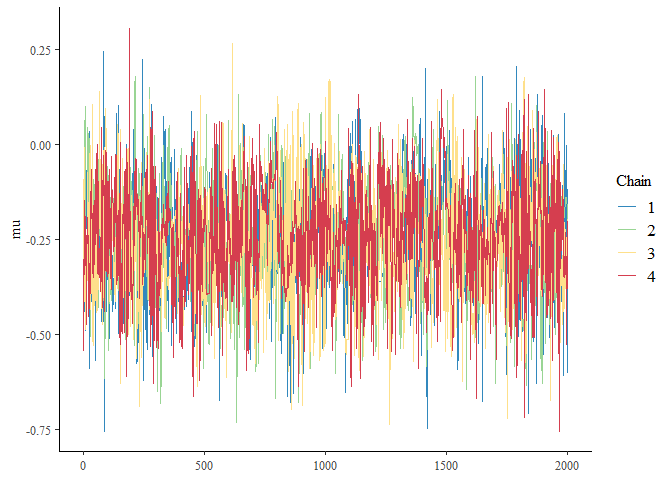<!-- -->

``` r
mcmc_trace(fit, pars = 'sigma_logit')
```

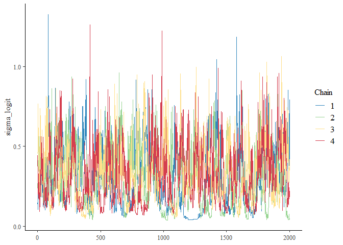<!-- -->

``` r
mcmc_trace(fit, pars = c('logit_p[1]','logit_p[2]','logit_p[3]','logit_p[4]'))
```

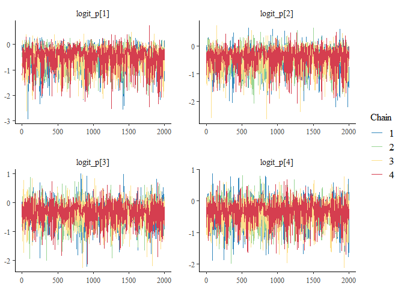<!-- -->

``` r
mcmc_trace(fit, pars = c('logit_p[5]','logit_p[6]','logit_p[7]','logit_p[8]'))
```

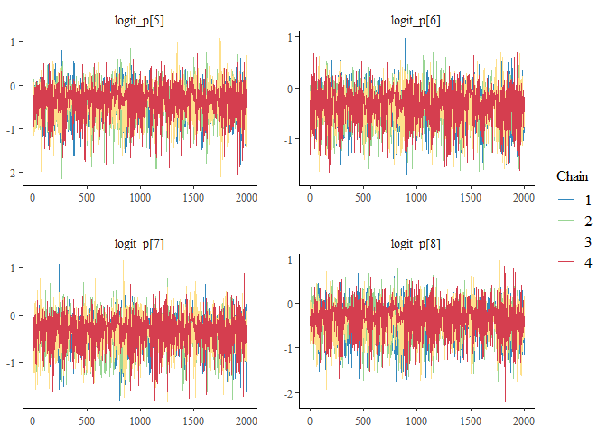<!-- -->

``` r
mcmc_trace(fit, pars = 'lp__')
```

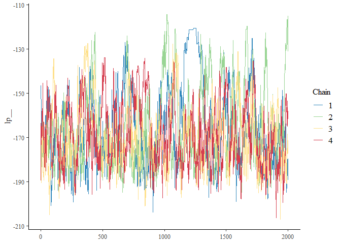<!-- -->

We can see from these plots alone that something is not quite right.
Specifically, notice the weird transitions of $\sigma_1$ (i.e.,
*sigma_logit*) for low values of $\sigma_1$. We observe a similar
pattern in the trace plot of \*lp\_\_\*.

The trace plots can be a bit hard to read, and hence, we can plot *rank
plots* instead. In the rank plot, the chains are pooled, and each value
is assigned a rank. Then, these ranks are plotted into a histogram. If
the chains are exploring the same target distribution, the rank
histograms should overall be roughly flat.

``` r
mcmc_rank_hist(fit, pars = 'mu', n_bins  = 25)
```

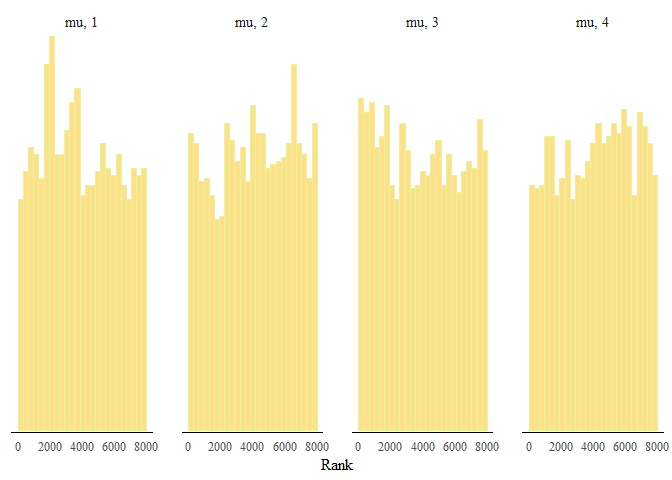<!-- -->

``` r
mcmc_rank_hist(fit, pars = 'sigma_logit', n_bins  = 25)
```

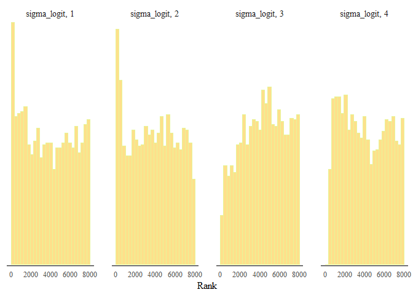<!-- -->

``` r
mcmc_rank_hist(fit, pars = 'lp__', n_bins  = 25)
```

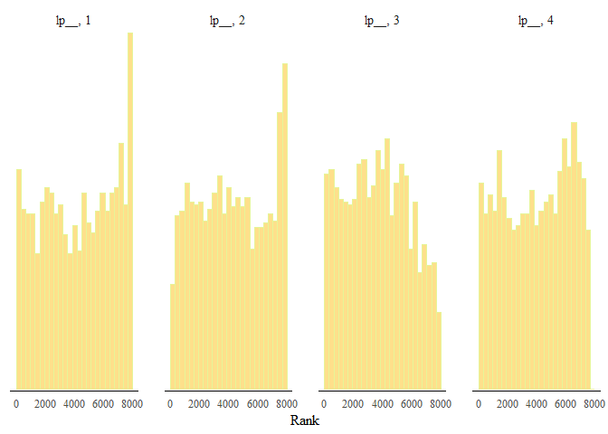<!-- -->

We observe that this is definitely not the case for $\sigma_1$ and
lp\_\_. The rank histograms are often plotted into a single overlay plot
to be more easily readable.

``` r
mcmc_rank_overlay(fit, pars = 'mu', n_bins  = 25)
```

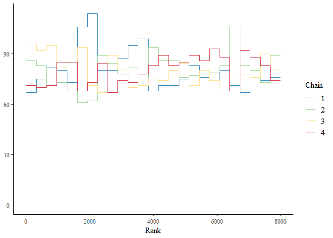<!-- -->

``` r
mcmc_rank_overlay(fit, pars = 'sigma_logit', n_bins  = 25)
```

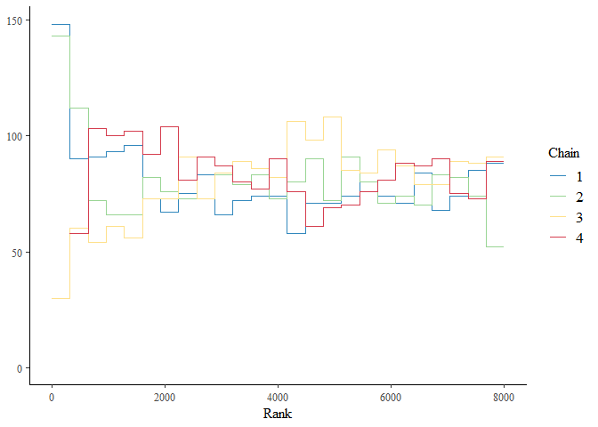<!-- -->

``` r
mcmc_rank_overlay(fit, pars = c('logit_p[1]','logit_p[2]','logit_p[3]','logit_p[4]'), n_bins  = 25)
```

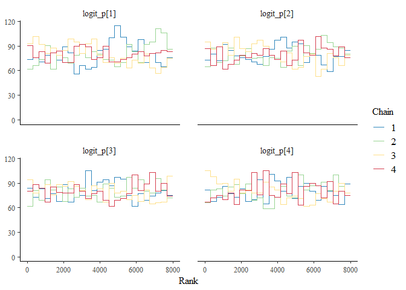<!-- -->

``` r
mcmc_rank_overlay(fit, pars = c('logit_p[5]','logit_p[6]','logit_p[7]','logit_p[8]'), n_bins  = 25)
```

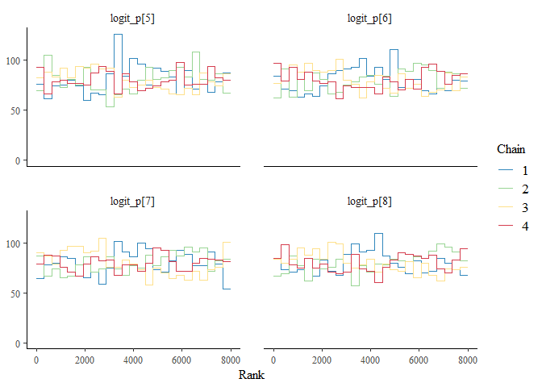<!-- -->

``` r
mcmc_rank_overlay(fit, pars = 'lp__', n_bins  = 25)
```

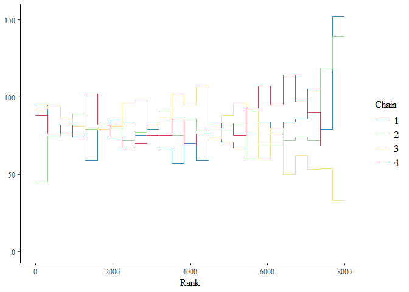<!-- -->

The last tool we will mention for comparing the chains is plotting the
difference between the empirical cumulative distribution functions of
rank-normalized draws. These plots also include 0.99 confidence bands
computed using the method from (Säilynoja, Bürkner, and Vehtari 2022).

``` r
mcmc_rank_ecdf(fit, pars = 'mu', plot_diff = TRUE)
```

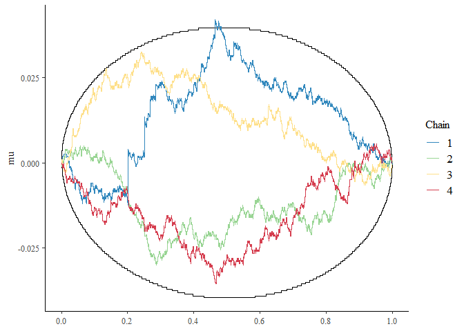<!-- -->

``` r
mcmc_rank_ecdf(fit, pars = 'logit_p[1]', plot_diff = TRUE)
```

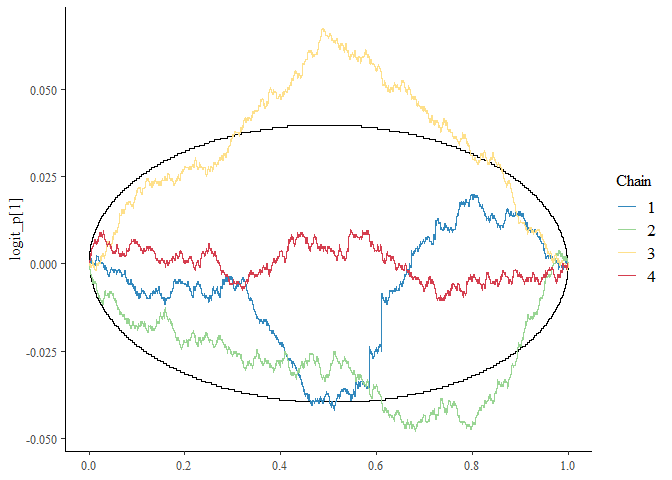<!-- -->

``` r
mcmc_rank_ecdf(fit, pars = 'logit_p[2]', plot_diff = TRUE)
```

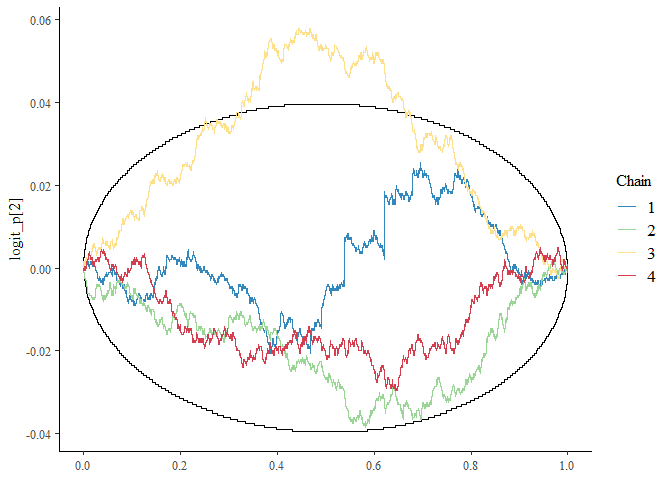<!-- -->

``` r
mcmc_rank_ecdf(fit, pars = 'sigma_logit', plot_diff = TRUE)
```

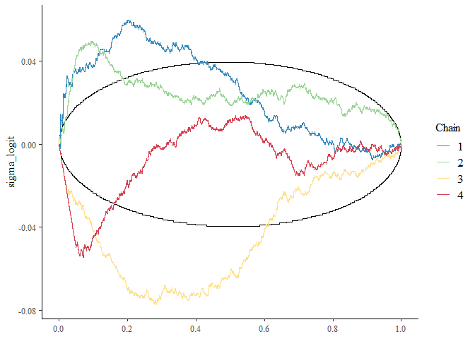<!-- -->

``` r
mcmc_rank_ecdf(fit, pars = 'lp__',plot_diff = TRUE)
```

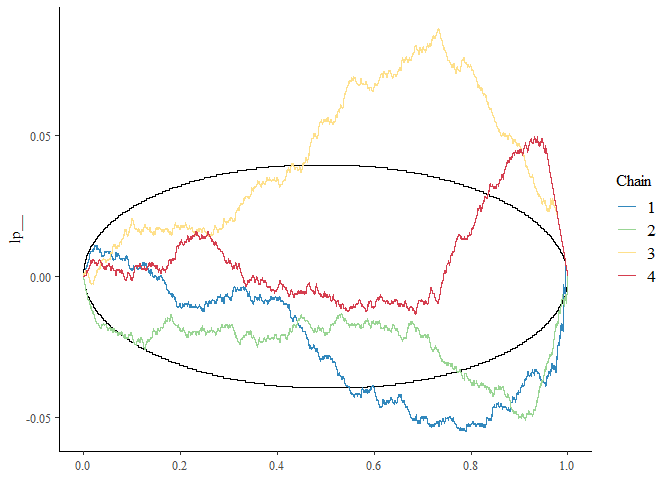<!-- -->

We again observe notable differences in chains for $\sigma_1$ and
\*lp\_\_\*.

### ESS, Rhat

We can obtain additional diagnostics by printing the *summary* of our
fit.

``` r
print(fit, pars = c('logit_p','mu','sigma_logit','lp__'),  digits_summary = 2)
```

    ## Inference for Stan model: anon_model.
    ## 4 chains, each with iter=4000; warmup=2000; thin=1; 
    ## post-warmup draws per chain=2000, total post-warmup draws=8000.
    ## 
    ##                mean se_mean    sd    2.5%     25%     50%     75%   97.5% n_eff
    ## logit_p[1]    -0.54    0.01  0.39   -1.49   -0.75   -0.46   -0.26    0.04   809
    ## logit_p[2]    -0.46    0.01  0.36   -1.30   -0.64   -0.40   -0.23    0.10  1125
    ## logit_p[3]    -0.37    0.01  0.33   -1.11   -0.54   -0.33   -0.16    0.23  2672
    ## logit_p[4]    -0.37    0.01  0.33   -1.14   -0.54   -0.34   -0.16    0.21  2344
    ## logit_p[5]    -0.38    0.01  0.34   -1.15   -0.55   -0.34   -0.17    0.21  2213
    ## logit_p[6]    -0.37    0.01  0.32   -1.12   -0.54   -0.33   -0.16    0.21  2500
    ## logit_p[7]    -0.37    0.01  0.32   -1.13   -0.55   -0.34   -0.17    0.19  2287
    ## logit_p[8]    -0.37    0.01  0.34   -1.16   -0.55   -0.33   -0.16    0.24  2810
    ## logit_p[9]    -0.37    0.01  0.33   -1.17   -0.55   -0.33   -0.16    0.21  2243
    ## logit_p[10]   -0.37    0.01  0.33   -1.12   -0.54   -0.34   -0.17    0.22  2482
    ## logit_p[11]   -0.28    0.00  0.31   -0.95   -0.45   -0.27   -0.10    0.33  4701
    ## logit_p[12]   -0.28    0.00  0.31   -0.94   -0.45   -0.28   -0.10    0.34  4430
    ## logit_p[13]   -0.29    0.00  0.31   -0.94   -0.45   -0.28   -0.10    0.33  5437
    ## logit_p[14]   -0.29    0.00  0.31   -0.93   -0.46   -0.28   -0.10    0.31  4648
    ## logit_p[15]   -0.28    0.00  0.31   -0.94   -0.45   -0.27   -0.09    0.33  4306
    ## logit_p[16]   -0.20    0.00  0.30   -0.80   -0.38   -0.21   -0.03    0.45  4420
    ## logit_p[17]   -0.20    0.00  0.32   -0.81   -0.39   -0.22   -0.03    0.48  4106
    ## logit_p[18]   -0.19    0.00  0.31   -0.80   -0.37   -0.21   -0.02    0.48  4189
    ## logit_p[19]   -0.20    0.00  0.31   -0.83   -0.38   -0.21   -0.03    0.47  5004
    ## logit_p[20]   -0.20    0.00  0.31   -0.80   -0.39   -0.21   -0.03    0.48  4477
    ## logit_p[21]   -0.20    0.00  0.31   -0.84   -0.38   -0.21   -0.03    0.48  4879
    ## logit_p[22]   -0.20    0.00  0.31   -0.81   -0.38   -0.21   -0.03    0.48  4333
    ## logit_p[23]   -0.11    0.01  0.32   -0.67   -0.32   -0.14    0.06    0.61  2071
    ## logit_p[24]   -0.11    0.01  0.32   -0.70   -0.31   -0.15    0.06    0.62  2016
    ## logit_p[25]   -0.03    0.01  0.36   -0.61   -0.27   -0.09    0.16    0.83  1160
    ## logit_p[26]   -0.03    0.01  0.35   -0.59   -0.26   -0.09    0.16    0.80  1062
    ## logit_p[27]   -0.03    0.01  0.35   -0.59   -0.27   -0.09    0.15    0.79  1237
    ## logit_p[28]    0.06    0.01  0.39   -0.52   -0.22   -0.02    0.27    0.99   813
    ## mu            -0.25    0.00  0.14   -0.53   -0.34   -0.25   -0.16    0.02  1464
    ## sigma_logit    0.32    0.01  0.18    0.06    0.17    0.29    0.43    0.71   292
    ## lp__        -167.10    1.25 16.39 -191.30 -179.35 -170.31 -157.50 -128.09   172
    ##             Rhat
    ## logit_p[1]  1.01
    ## logit_p[2]  1.00
    ## logit_p[3]  1.00
    ## logit_p[4]  1.00
    ## logit_p[5]  1.00
    ## logit_p[6]  1.00
    ## logit_p[7]  1.00
    ## logit_p[8]  1.00
    ## logit_p[9]  1.00
    ## logit_p[10] 1.00
    ## logit_p[11] 1.00
    ## logit_p[12] 1.00
    ## logit_p[13] 1.00
    ## logit_p[14] 1.00
    ## logit_p[15] 1.00
    ## logit_p[16] 1.00
    ## logit_p[17] 1.00
    ## logit_p[18] 1.00
    ## logit_p[19] 1.00
    ## logit_p[20] 1.00
    ## logit_p[21] 1.00
    ## logit_p[22] 1.00
    ## logit_p[23] 1.00
    ## logit_p[24] 1.00
    ## logit_p[25] 1.00
    ## logit_p[26] 1.00
    ## logit_p[27] 1.00
    ## logit_p[28] 1.01
    ## mu          1.00
    ## sigma_logit 1.02
    ## lp__        1.04
    ## 
    ## Samples were drawn using NUTS(diag_e) at Sat Jul  4 18:35:32 2026.
    ## For each parameter, n_eff is a crude measure of effective sample size,
    ## and Rhat is the potential scale reduction factor on split chains (at 
    ## convergence, Rhat=1).

The first value to point out is *n_eff*, the estimated effective sample
size (Gelman et al. 1995). We have encountered this term before in the
context of estimating how much information we actually have in the
dataset, when we dealt with correlated data. The concept here is
identical. We already know that the MCMC generates samples by jumping
from one value of the parameter to the next. This means that subsequent
samples are often positively correlated, and the correlation is more
severe when the sampling algorithm struggles to explore the posterior
density. We have simulated 2000 samples in 4 chains, i.e, we have
obtained 8000 samples. However, our estimated effective sample size for
$\sigma_1$ is 292, i.e, our 8000 samples are approximately “worth” 292
independent observations! To see why, let us plot the autocorrelation
functions for $\sigma_1$ for each chain.

``` r
mcmc_acf_bar(fit, pars = 'sigma_logit')
```

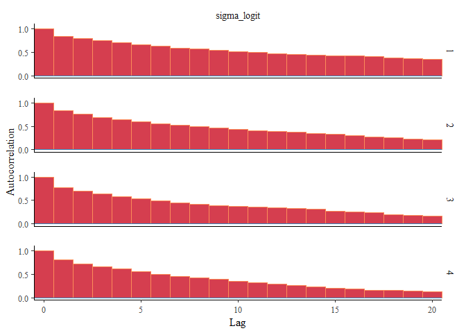<!-- -->

We observe that subsequent samples are extremely correlated. The story
is very similar for \*lp\_\_\*.

``` r
mcmc_acf_bar(fit, pars = 'lp__')
```

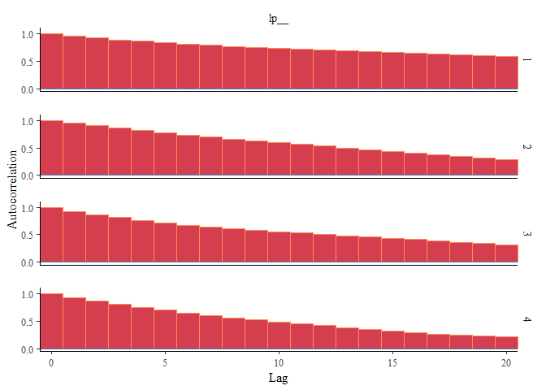<!-- -->

We can conclude that the Hamiltonian MCMC struggles extremely to explore
the posterior density.

The second diagnostic mentioned in the *summary* is *Rhat* (potential
scale reduction factor). The *Rhat* assesses the convergence of chains
based on within-chain variance and between-chain variance (see (Gelman
et al. 1995) for more details). The basic rule-of-thumb is that
$\hat R < 1.01$ (Kruschke et al. 2014), which is clearly not for
$\sigma_1$ and \*lp\_\_\*. This indicated that the chains did not
sufficiently converge.

## Hamiltonian MCMC diagnostics

The Hamiltonian MCMC has several additional diagnostic plots tied to its
Hamiltonian simulations. The first plot compares the marginal energy
distribution $\pi(E)$ (i.e, energies of the generated samples) with the
energy transition distribution $\pi(E \mid q)$ (i.e., energies generated
by the momentum sampler). Ideally, these two densities match.

``` r
np <- nuts_params(fit)
mcmc_nuts_energy(np, merge_chains = TRUE, bins = 50)
```

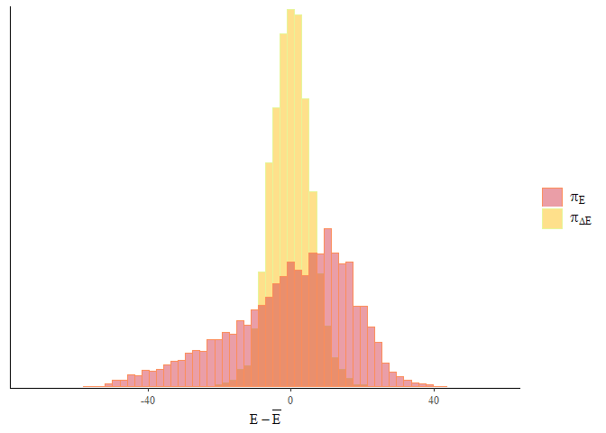<!-- -->

We notice that $\pi(E)$ has much heavier tails than $\pi(E \mid q)$.
This indicates that the Hamiltonian MCMC struggles to explore
high-energy parts (i.e., tails) of the target distribution (Betancourt
2017). This graphical comparison is tied to *E-BFMI* statistics
(Energy-Bayesian Fraction of Missing Information), which is defined as
$$\text{E-BFMI} = \frac{\text{var } E\mid q }{\text{var } E}$$

``` r
get_bfmi(fit)
```

    ## [1] 0.08361140 0.09002793 0.13421807 0.14227768

We observe that these values are quite low (the empirical rule-of-thumb
is $\text{E-BFMI} > 0.3$ (Betancourt 2017)). The second important
diagnostic is concerned with tree depth, i.e., the number of steps that
the NUTS algorithm has taken. We should ensure that the NUTS algorithm
does not terminate simulations prematurely by exceeding the maximum
number of simulation steps.

``` r
mcmc_nuts_treedepth(np, log_posterior(fit))
```

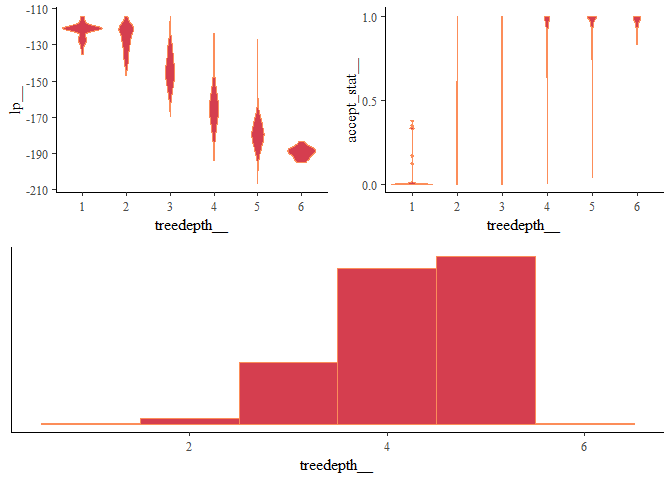<!-- --><!-- -->

The default tree depth is 10; hence, we observe no problems here. The
last important diagnostic we will mention here is concerned with
*divergences*.

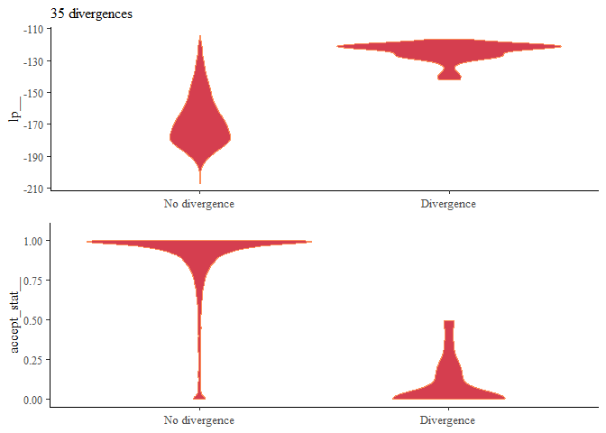<!-- -->

Divergences indicate failed Hamiltonian simulations; the simulation
became unstable, and the energy exploded. It essentially indicates that
in some parts of the phase space, the curvature is highly complicated,
and hence the integration of the the Hamiltonian system is very
difficult. We can plot the divergences against the parameter values to
observe which parts of the posterior they correspond to.

``` r
mcmc_parcoord(fit, pars = c('mu','sigma_logit'), np = np)
```

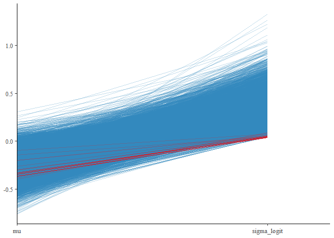<!-- -->

We observe that all divergences occurred for values of $\sigma_1$ close
to zero. Overall, we conclude that our Hamiltonian MCMC chains are not
reliable and, hence, should not be used for inference.

### Non-centered Parametrization

Well, it turned out that the posterior samples were actually quite bad.
Fortunately, what we observed is a a common behavior of hierarchical
models, tied to the *centered parametrization* we used.

``` math
\begin{align*}
p_i/(1-p_i) &\sim N(\mu_1, \sigma_1^2) \\
\mu_1 & \sim N(\mu_2, \sigma_2^2) \\
\sigma_1 & \sim \text{Exp }(\lambda).
\end{align*}
```

It turns out that centered parametrization in which
$\sigma_1 \rightarrow 0$ causes a “funnel” shape in the posterior
distribution since it forces $\theta_i \rightarrow \mu$ for all $i$ (see
<https://mc-stan.org/docs/2_18/stan-users-guide/reparameterization-section.html>,
image is from
<https://brendanhasz.github.io/2018/11/15/hmm-vs-gp-part2.html>). Such
sharp funnels are very hard to explore for the MCMC algorithms.

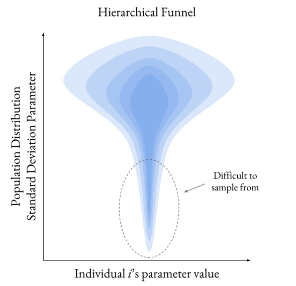<!-- -->

The simple fix is to use the non-centered parametrization instead, in
which we no longer sample $\theta_i$ directly.

``` math
\begin{align*}
p_i/(1-p_i) &\sim N(\mu_1, \sigma_1^2) \\
\mu_1 & = \mu_2 + \sigma_2 z\\
z & \sim N(0, I)\\
\sigma_1 & \sim \text{Exp }(\lambda).
\end{align*}
```

Let us refit our model.

``` default
data {
  int<lower=1> N_groups;                            // Number of groups                    
  array[N_groups] int<lower=0> trials;              // Number of trials in a group      
  array[N_groups] int<lower=0> y;                   // Number of successes in a group

  real mu_hyper;                                    // Prior mean for hyperparameter mu
  real<lower=0> sigma_hyper;                        // Prior sigma for hyperparameter mu
  real<lower=0> lambda;                             // Prior lambda for sigma_logit
} 

parameters {
  vector[N_groups] z;                               // Vector of N(0,1)
  real mu;                                          // Prior mu for probability logit
  real<lower=0> sigma_logit;                        // Prior sigma for probability logit     
}

transformed parameters {
  vector[N_groups] logit_p;                         // Probability logit of success
  logit_p = mu + sigma_logit * z;                   // Non-centered parametrization
}

model {
  // Priors
  mu ~ normal(mu_hyper, sigma_hyper);
  sigma_logit ~ exponential(lambda);
  z ~ std_normal();

  // Likelihood
  for (i in 1:N_groups) {
    y[i] ~ binomial_logit(trials[i], logit_p[i]);
  }
}
```

``` r
stan_data <- list(
  N_groups = length(TherapeuticTouch_binomial$s),
  trials = TherapeuticTouch_binomial$Succ + TherapeuticTouch_binomial$Fail,
  y = TherapeuticTouch_binomial$Succ,
  mu_hyper = 0,
  sigma_hyper = 1.5,
  lambda = 0.01
)

fit <- rstan::stan(
  file  = "C:/Users/elini/Desktop/nine circles 3/f2_s2.stan",
  data = stan_data,
  chains = 4,
  iter = 4000,
  warmup = 2000,
  seed = 123,
  refresh = 0
)
```
Let’s quickly go through the diagnostics to check that the problem was
indeed solved.

``` r
print(fit, pars = c('logit_p','mu','sigma_logit','lp__'),  digits_summary = 2)
```

    ## Inference for Stan model: anon_model.
    ## 4 chains, each with iter=4000; warmup=2000; thin=1; 
    ## post-warmup draws per chain=2000, total post-warmup draws=8000.
    ## 
    ##                mean se_mean   sd    2.5%     25%     50%     75%   97.5% n_eff
    ## logit_p[1]    -0.52    0.01 0.40   -1.49   -0.72   -0.44   -0.25    0.04  4870
    ## logit_p[2]    -0.44    0.00 0.34   -1.26   -0.61   -0.38   -0.21    0.11  6183
    ## logit_p[3]    -0.36    0.00 0.32   -1.13   -0.52   -0.32   -0.17    0.19  7343
    ## logit_p[4]    -0.36    0.00 0.31   -1.09   -0.52   -0.32   -0.17    0.18  8235
    ## logit_p[5]    -0.36    0.00 0.32   -1.12   -0.52   -0.32   -0.16    0.21  7953
    ## logit_p[6]    -0.35    0.00 0.32   -1.08   -0.51   -0.32   -0.16    0.22  8513
    ## logit_p[7]    -0.36    0.00 0.32   -1.12   -0.52   -0.32   -0.16    0.20  8023
    ## logit_p[8]    -0.36    0.00 0.32   -1.11   -0.52   -0.32   -0.16    0.20  8406
    ## logit_p[9]    -0.36    0.00 0.32   -1.12   -0.52   -0.32   -0.16    0.20  8242
    ## logit_p[10]   -0.36    0.00 0.32   -1.08   -0.52   -0.32   -0.17    0.21  7702
    ## logit_p[11]   -0.28    0.00 0.30   -0.93   -0.44   -0.27   -0.11    0.31  9993
    ## logit_p[12]   -0.28    0.00 0.31   -0.96   -0.44   -0.27   -0.10    0.32 10296
    ## logit_p[13]   -0.28    0.00 0.30   -0.94   -0.44   -0.27   -0.11    0.32 10067
    ## logit_p[14]   -0.28    0.00 0.30   -0.94   -0.44   -0.27   -0.11    0.32  9526
    ## logit_p[15]   -0.28    0.00 0.29   -0.90   -0.44   -0.27   -0.10    0.32  9520
    ## logit_p[16]   -0.20    0.00 0.30   -0.79   -0.37   -0.22   -0.03    0.44  9826
    ## logit_p[17]   -0.21    0.00 0.30   -0.81   -0.38   -0.22   -0.04    0.44  9983
    ## logit_p[18]   -0.20    0.00 0.30   -0.78   -0.37   -0.21   -0.03    0.44  9302
    ## logit_p[19]   -0.20    0.00 0.29   -0.78   -0.37   -0.21   -0.05    0.43  9470
    ## logit_p[20]   -0.20    0.00 0.30   -0.79   -0.38   -0.21   -0.04    0.45  9764
    ## logit_p[21]   -0.21    0.00 0.30   -0.82   -0.38   -0.22   -0.04    0.43  8604
    ## logit_p[22]   -0.20    0.00 0.30   -0.79   -0.37   -0.22   -0.05    0.45  9947
    ## logit_p[23]   -0.13    0.00 0.32   -0.68   -0.32   -0.16    0.04    0.61  7600
    ## logit_p[24]   -0.12    0.00 0.32   -0.67   -0.32   -0.16    0.04    0.61  8302
    ## logit_p[25]   -0.04    0.00 0.35   -0.59   -0.27   -0.11    0.13    0.78  6103
    ## logit_p[26]   -0.04    0.00 0.35   -0.57   -0.27   -0.10    0.14    0.81  6208
    ## logit_p[27]   -0.04    0.00 0.34   -0.58   -0.27   -0.11    0.14    0.77  6229
    ## logit_p[28]    0.03    0.01 0.38   -0.51   -0.23   -0.05    0.24    0.99  5227
    ## mu            -0.25    0.00 0.14   -0.52   -0.34   -0.25   -0.16    0.02  7441
    ## sigma_logit    0.29    0.00 0.19    0.01    0.14    0.27    0.42    0.71  2737
    ## lp__        -205.08    0.11 5.00 -215.18 -208.41 -204.97 -201.57 -195.67  2138
    ##             Rhat
    ## logit_p[1]     1
    ## logit_p[2]     1
    ## logit_p[3]     1
    ## logit_p[4]     1
    ## logit_p[5]     1
    ## logit_p[6]     1
    ## logit_p[7]     1
    ## logit_p[8]     1
    ## logit_p[9]     1
    ## logit_p[10]    1
    ## logit_p[11]    1
    ## logit_p[12]    1
    ## logit_p[13]    1
    ## logit_p[14]    1
    ## logit_p[15]    1
    ## logit_p[16]    1
    ## logit_p[17]    1
    ## logit_p[18]    1
    ## logit_p[19]    1
    ## logit_p[20]    1
    ## logit_p[21]    1
    ## logit_p[22]    1
    ## logit_p[23]    1
    ## logit_p[24]    1
    ## logit_p[25]    1
    ## logit_p[26]    1
    ## logit_p[27]    1
    ## logit_p[28]    1
    ## mu             1
    ## sigma_logit    1
    ## lp__           1
    ## 
    ## Samples were drawn using NUTS(diag_e) at Sat Jul  4 18:36:50 2026.
    ## For each parameter, n_eff is a crude measure of effective sample size,
    ## and Rhat is the potential scale reduction factor on split chains (at 
    ## convergence, Rhat=1).

We observe that sampling efficiency has improved dramatically; all
*Rhat*s are now 1.

``` r
mcmc_rank_ecdf(fit, pars = 'mu', plot_diff = TRUE)
```

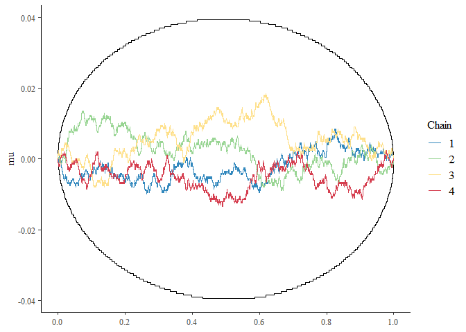<!-- -->

``` r
mcmc_rank_ecdf(fit, pars = 'sigma_logit', plot_diff = TRUE)
```

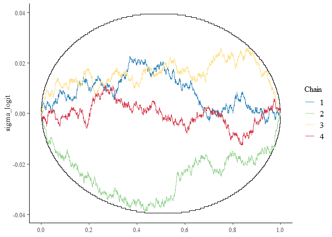<!-- -->

``` r
mcmc_rank_ecdf(fit, pars = 'lp__', plot_diff = TRUE)
```

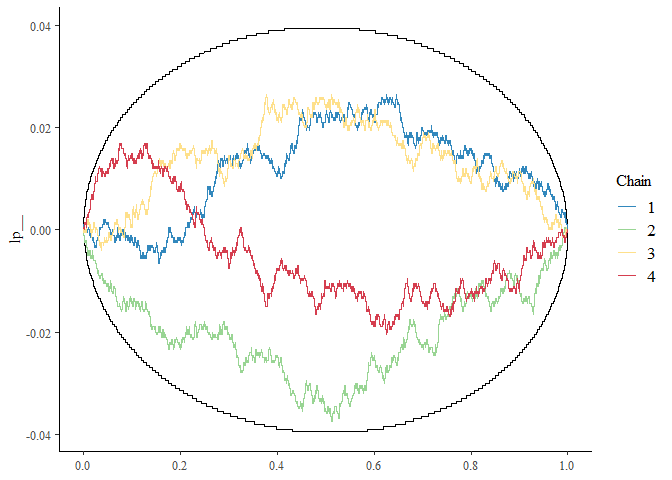<!-- -->

The differences between chains are now much smaller.

``` r
np <- nuts_params(fit)
mcmc_nuts_energy(np, merge_chains = TRUE, bins = 50)
```

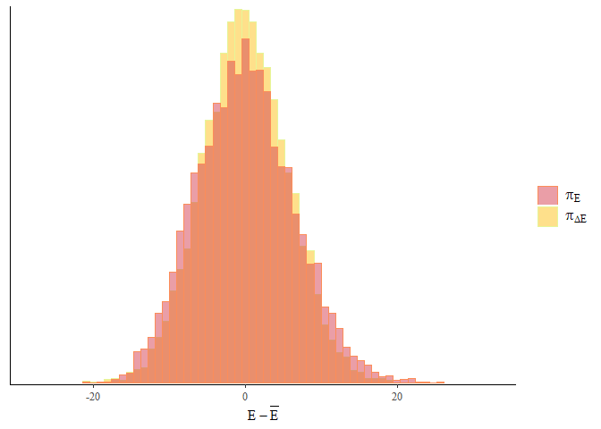<!-- -->

The energy distributions overlap as they should.

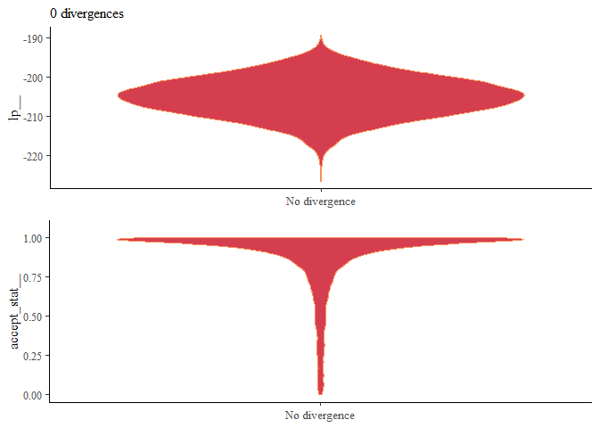<!-- -->

And there are no divergences. We can conclude that Hamiltonian MCMC
converged properly.

Let us review the predictions of our model.

``` r
sigma_logit <- extract(fit)$sigma_logit

dens <- density(sigma_logit)
dens_data <- data.frame(x = dens$x, y = dens$y)
ggplot(dens_data, aes(x = x, y = y)) +  geom_line(linewidth = 1) + xlab('Sigma_1') + ylab('Posterior Density')
```

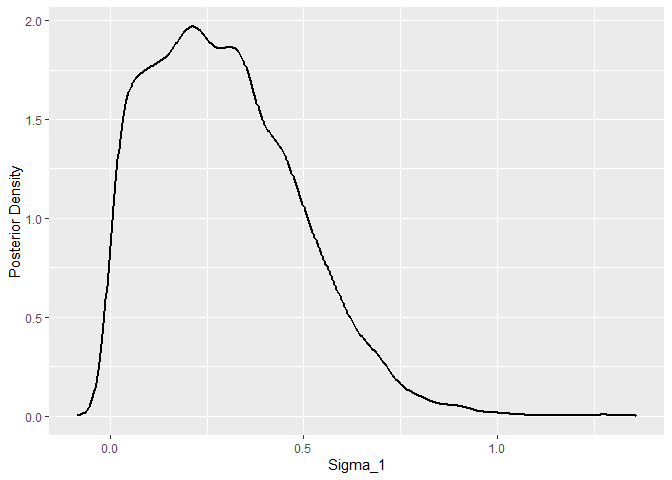<!-- -->

``` r
hdi(sigma_logit)
```

    ##        lower        upper 
    ## 0.0002873456 0.6367874469 
    ## attr(,"credMass")
    ## [1] 0.95

``` r
p_no_pooling <- ilogit(extract(fit2)$logit_p)
mean_p_no_pooling <- apply(p_no_pooling , 2, mean)
hdi_p_no_pooling <- apply(p_no_pooling , 2, function (x) hdi(x, credMass = 0.95))
hdi_p_pooled <- hdi(ilogit(logit_p_pooled), credMass = 0.95)


ggplot(TherapeuticTouch_binomial, aes(x = 1:length(s), y = Succ/(Succ+Fail))) +  geom_point() + xlab('Practicioner') + ylab('Probability of Correct Guess') + geom_point(aes(y = mean(ilogit(logit_p_pooled))), color = 'red') + geom_errorbar(aes(ymin=hdi_p_pooled[1], ymax=hdi_p_pooled[2]), color = 'red') +
geom_point(aes(y = mean_p_no_pooling), color = 'blue') + geom_errorbar(aes(ymin=hdi_p_no_pooling[1,], ymax=hdi_p_no_pooling[2,]), color = 'blue')
```

<!-- -->

We observe that, despite our original sampling being definitely subpar,
our estimates did not suffer that much.

## Rat Tumor Dataset Revisited

Let us return to the Rat Tumor Dataset, since we did not perform the
diagnostics, and we observe that centered parametrization can cause
problems.

``` r
rat <- read.csv("C:/Users/elini/Desktop/nine circles 3/rat.csv", sep = ',')
head(rat)
```

    ##   y  N
    ## 1 0 20
    ## 2 0 20
    ## 3 0 20
    ## 4 0 20
    ## 5 0 20
    ## 6 0 20

Let us fit our model from the previous circle.

``` r
stan_data <- list(
  N_groups = length(rat$y),
  trials = rat$N,
  y = rat$y,
  mu_hyper = 0,
  sigma_hyper = 1.5,
  lambda = 1
)

fit_rat <- stan(
  file  = "C:/Users/elini/Desktop/nine circles 3/f2_s1.stan",
  data = stan_data,
  chains = 6,
  iter = 4000,
  warmup = 2000,
  seed = 123,
  refresh = 0
)
```

``` r
print(fit_rat, pars = c('logit_p','mu','sigma_logit','lp__'),  digits_summary = 2)
```

    ## Inference for Stan model: anon_model.
    ## 6 chains, each with iter=4000; warmup=2000; thin=1; 
    ## post-warmup draws per chain=2000, total post-warmup draws=12000.
    ## 
    ##                mean se_mean   sd    2.5%     25%     50%     75%   97.5% n_eff
    ## logit_p[1]    -2.65    0.01 0.60   -3.95   -3.02   -2.60   -2.23   -1.59 10527
    ## logit_p[2]    -2.65    0.01 0.59   -3.89   -3.02   -2.61   -2.24   -1.61 10781
    ## logit_p[3]    -2.65    0.01 0.59   -3.92   -3.00   -2.61   -2.24   -1.62 10214
    ## logit_p[4]    -2.65    0.01 0.59   -3.93   -3.02   -2.61   -2.25   -1.62 10791
    ## logit_p[5]    -2.65    0.01 0.59   -3.91   -3.02   -2.60   -2.24   -1.61  9748
    ## logit_p[6]    -2.65    0.01 0.59   -3.91   -3.01   -2.60   -2.23   -1.59  9705
    ## logit_p[7]    -2.64    0.01 0.59   -3.92   -3.01   -2.61   -2.24   -1.60 10813
    ## logit_p[8]    -2.63    0.01 0.60   -3.94   -3.01   -2.58   -2.21   -1.56  9946
    ## logit_p[9]    -2.62    0.01 0.58   -3.88   -2.99   -2.58   -2.22   -1.58  9892
    ## logit_p[10]   -2.63    0.01 0.60   -3.92   -2.99   -2.58   -2.21   -1.56 10736
    ## logit_p[11]   -2.63    0.01 0.61   -3.94   -3.00   -2.59   -2.21   -1.56 11005
    ## logit_p[12]   -2.60    0.01 0.59   -3.88   -2.97   -2.56   -2.20   -1.54 11147
    ## logit_p[13]   -2.60    0.01 0.59   -3.87   -2.97   -2.57   -2.19   -1.57 10502
    ## logit_p[14]   -2.58    0.01 0.59   -3.89   -2.94   -2.55   -2.17   -1.53 11619
    ## logit_p[15]   -2.36    0.00 0.53   -3.49   -2.70   -2.32   -1.98   -1.40 12671
    ## logit_p[16]   -2.36    0.00 0.55   -3.51   -2.70   -2.33   -1.98   -1.37 13792
    ## logit_p[17]   -2.36    0.00 0.54   -3.48   -2.70   -2.33   -1.99   -1.38 15096
    ## logit_p[18]   -2.36    0.00 0.55   -3.55   -2.70   -2.33   -1.98   -1.37 13947
    ## logit_p[19]   -2.33    0.00 0.54   -3.46   -2.67   -2.30   -1.96   -1.36 14869
    ## logit_p[20]   -2.34    0.00 0.54   -3.48   -2.67   -2.30   -1.97   -1.37 15106
    ## logit_p[21]   -2.31    0.00 0.55   -3.48   -2.66   -2.28   -1.93   -1.30 15262
    ## logit_p[22]   -2.31    0.00 0.54   -3.43   -2.65   -2.29   -1.94   -1.34 14851
    ## logit_p[23]   -2.05    0.00 0.45   -2.99   -2.35   -2.03   -1.74   -1.23 21421
    ## logit_p[24]   -2.23    0.00 0.49   -3.27   -2.55   -2.20   -1.89   -1.32 16459
    ## logit_p[25]   -2.20    0.00 0.48   -3.20   -2.51   -2.18   -1.87   -1.31 16640
    ## logit_p[26]   -2.18    0.00 0.49   -3.20   -2.49   -2.16   -1.84   -1.28 16637
    ## logit_p[27]   -2.10    0.00 0.50   -3.16   -2.42   -2.08   -1.76   -1.18 19720
    ## logit_p[28]   -2.10    0.00 0.50   -3.14   -2.43   -2.08   -1.75   -1.17 19971
    ## logit_p[29]   -2.10    0.00 0.51   -3.17   -2.42   -2.07   -1.76   -1.16 18729
    ## logit_p[30]   -2.11    0.00 0.51   -3.17   -2.43   -2.09   -1.75   -1.19 19686
    ## logit_p[31]   -2.10    0.00 0.50   -3.15   -2.42   -2.08   -1.76   -1.18 20212
    ## logit_p[32]   -2.10    0.00 0.51   -3.15   -2.43   -2.08   -1.75   -1.17 18900
    ## logit_p[33]   -2.06    0.00 0.57   -3.23   -2.41   -2.04   -1.67   -1.00 20187
    ## logit_p[34]   -2.13    0.00 0.39   -2.93   -2.38   -2.12   -1.86   -1.42 19794
    ## logit_p[35]   -2.07    0.00 0.51   -3.13   -2.39   -2.05   -1.73   -1.12 19574
    ## logit_p[36]   -2.08    0.00 0.39   -2.88   -2.33   -2.07   -1.82   -1.36 19626
    ## logit_p[37]   -2.01    0.00 0.52   -3.10   -2.34   -1.99   -1.66   -1.05 20298
    ## logit_p[38]   -1.86    0.00 0.36   -2.59   -2.09   -1.85   -1.61   -1.19 22948
    ## logit_p[39]   -1.82    0.00 0.37   -2.56   -2.07   -1.81   -1.58   -1.14 20133
    ## logit_p[40]   -1.87    0.00 0.48   -2.88   -2.17   -1.85   -1.54   -0.98 21808
    ## logit_p[41]   -1.86    0.00 0.47   -2.83   -2.17   -1.84   -1.53   -0.98 21424
    ## logit_p[42]   -1.88    0.00 0.53   -2.97   -2.22   -1.86   -1.51   -0.88 21761
    ## logit_p[43]   -1.61    0.00 0.34   -2.30   -1.83   -1.60   -1.38   -0.97 23325
    ## logit_p[44]   -1.53    0.00 0.33   -2.19   -1.75   -1.52   -1.31   -0.91 23691
    ## logit_p[45]   -1.65    0.00 0.47   -2.60   -1.96   -1.64   -1.34   -0.76 21801
    ## logit_p[46]   -1.65    0.00 0.46   -2.60   -1.95   -1.64   -1.34   -0.79 22078
    ## logit_p[47]   -1.65    0.00 0.46   -2.59   -1.95   -1.64   -1.33   -0.78 22424
    ## logit_p[48]   -1.65    0.00 0.46   -2.58   -1.95   -1.63   -1.33   -0.77 24092
    ## logit_p[49]   -1.65    0.00 0.46   -2.60   -1.95   -1.64   -1.33   -0.76 22482
    ## logit_p[50]   -1.65    0.00 0.46   -2.58   -1.95   -1.64   -1.34   -0.79 22408
    ## logit_p[51]   -1.66    0.00 0.46   -2.60   -1.96   -1.65   -1.34   -0.79 23547
    ## logit_p[52]   -1.49    0.00 0.33   -2.16   -1.71   -1.49   -1.27   -0.87 21762
    ## logit_p[53]   -1.62    0.00 0.47   -2.55   -1.93   -1.61   -1.30   -0.72 24161
    ## logit_p[54]   -1.61    0.00 0.46   -2.54   -1.91   -1.60   -1.30   -0.75 24280
    ## logit_p[55]   -1.62    0.00 0.46   -2.56   -1.92   -1.61   -1.30   -0.73 20480
    ## logit_p[56]   -1.53    0.00 0.44   -2.40   -1.82   -1.52   -1.23   -0.67 21976
    ## logit_p[57]   -1.35    0.00 0.32   -2.01   -1.56   -1.34   -1.12   -0.73 21188
    ## logit_p[58]   -1.31    0.00 0.31   -1.93   -1.52   -1.30   -1.09   -0.71 19056
    ## logit_p[59]   -1.45    0.00 0.44   -2.34   -1.74   -1.44   -1.15   -0.61 22030
    ## logit_p[60]   -1.45    0.00 0.44   -2.34   -1.74   -1.44   -1.15   -0.60 22684
    ## logit_p[61]   -1.38    0.00 0.42   -2.21   -1.66   -1.37   -1.09   -0.59 21299
    ## logit_p[62]   -1.41    0.00 0.45   -2.31   -1.71   -1.40   -1.11   -0.56 19521
    ## logit_p[63]   -1.34    0.00 0.42   -2.16   -1.62   -1.34   -1.06   -0.55 20234
    ## logit_p[64]   -1.27    0.00 0.44   -2.15   -1.56   -1.26   -0.98   -0.44 18942
    ## logit_p[65]   -1.27    0.00 0.43   -2.13   -1.56   -1.26   -0.99   -0.44 19244
    ## logit_p[66]   -1.27    0.00 0.43   -2.14   -1.55   -1.26   -0.98   -0.42 18352
    ## logit_p[67]   -1.02    0.00 0.29   -1.60   -1.21   -1.02   -0.82   -0.47 16334
    ## logit_p[68]   -0.96    0.00 0.30   -1.56   -1.16   -0.96   -0.76   -0.38 16683
    ## logit_p[69]   -0.99    0.00 0.30   -1.58   -1.20   -0.98   -0.78   -0.42 15990
    ## logit_p[70]   -0.95    0.00 0.40   -1.75   -1.22   -0.95   -0.68   -0.18 14594
    ## logit_p[71]   -1.41    0.00 0.49   -2.41   -1.74   -1.41   -1.09   -0.45 20908
    ## mu            -1.94    0.00 0.12   -2.19   -2.01   -1.93   -1.85   -1.71  6114
    ## sigma_logit    0.69    0.00 0.13    0.46    0.61    0.69    0.78    0.97  2723
    ## lp__        -713.89    0.20 9.33 -732.49 -720.08 -713.78 -707.65 -695.64  2121
    ##             Rhat
    ## logit_p[1]     1
    ## logit_p[2]     1
    ## logit_p[3]     1
    ## logit_p[4]     1
    ## logit_p[5]     1
    ## logit_p[6]     1
    ## logit_p[7]     1
    ## logit_p[8]     1
    ## logit_p[9]     1
    ## logit_p[10]    1
    ## logit_p[11]    1
    ## logit_p[12]    1
    ## logit_p[13]    1
    ## logit_p[14]    1
    ## logit_p[15]    1
    ## logit_p[16]    1
    ## logit_p[17]    1
    ## logit_p[18]    1
    ## logit_p[19]    1
    ## logit_p[20]    1
    ## logit_p[21]    1
    ## logit_p[22]    1
    ## logit_p[23]    1
    ## logit_p[24]    1
    ## logit_p[25]    1
    ## logit_p[26]    1
    ## logit_p[27]    1
    ## logit_p[28]    1
    ## logit_p[29]    1
    ## logit_p[30]    1
    ## logit_p[31]    1
    ## logit_p[32]    1
    ## logit_p[33]    1
    ## logit_p[34]    1
    ## logit_p[35]    1
    ## logit_p[36]    1
    ## logit_p[37]    1
    ## logit_p[38]    1
    ## logit_p[39]    1
    ## logit_p[40]    1
    ## logit_p[41]    1
    ## logit_p[42]    1
    ## logit_p[43]    1
    ## logit_p[44]    1
    ## logit_p[45]    1
    ## logit_p[46]    1
    ## logit_p[47]    1
    ## logit_p[48]    1
    ## logit_p[49]    1
    ## logit_p[50]    1
    ## logit_p[51]    1
    ## logit_p[52]    1
    ## logit_p[53]    1
    ## logit_p[54]    1
    ## logit_p[55]    1
    ## logit_p[56]    1
    ## logit_p[57]    1
    ## logit_p[58]    1
    ## logit_p[59]    1
    ## logit_p[60]    1
    ## logit_p[61]    1
    ## logit_p[62]    1
    ## logit_p[63]    1
    ## logit_p[64]    1
    ## logit_p[65]    1
    ## logit_p[66]    1
    ## logit_p[67]    1
    ## logit_p[68]    1
    ## logit_p[69]    1
    ## logit_p[70]    1
    ## logit_p[71]    1
    ## mu             1
    ## sigma_logit    1
    ## lp__           1
    ## 
    ## Samples were drawn using NUTS(diag_e) at Sat Jul  4 18:37:02 2026.
    ## For each parameter, n_eff is a crude measure of effective sample size,
    ## and Rhat is the potential scale reduction factor on split chains (at 
    ## convergence, Rhat=1).

We observe that our model was actually decent from the get-go.

``` r
mcmc_rank_ecdf(fit_rat, pars = 'mu', plot_diff = TRUE)
```

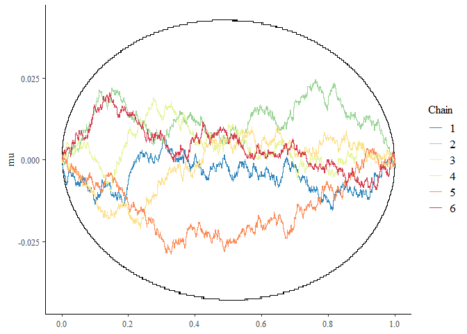<!-- -->

``` r
mcmc_rank_ecdf(fit_rat, pars = 'sigma_logit', plot_diff = TRUE)
```

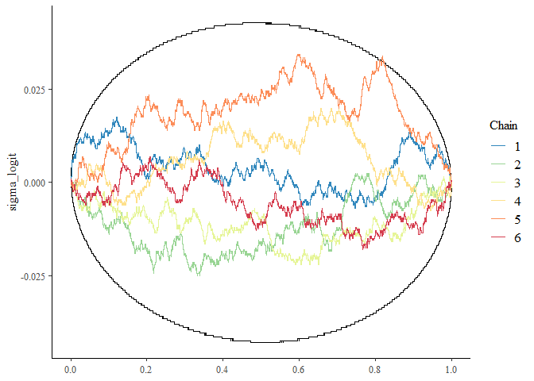<!-- -->

``` r
mcmc_rank_ecdf(fit_rat, pars = 'lp__', plot_diff = TRUE)
```

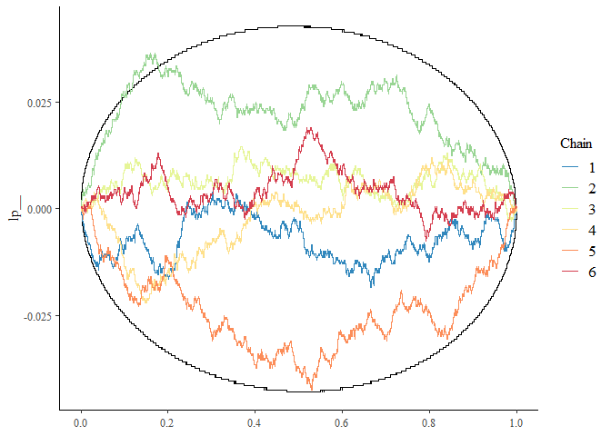<!-- -->

``` r
np <- nuts_params(fit_rat)
mcmc_nuts_energy(np, merge_chains = TRUE, bins = 50)
```

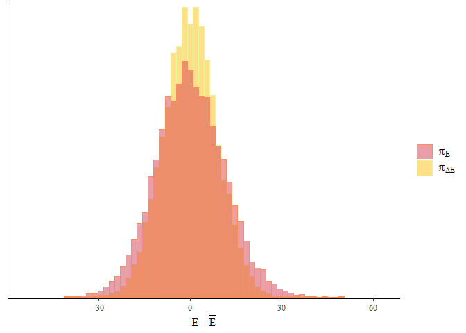<!-- -->

``` r
mcmc_nuts_divergence(np, log_posterior(fit_rat))
```

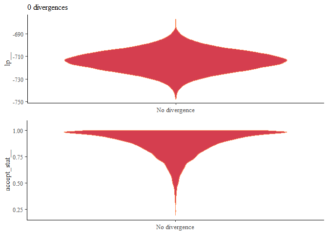<!-- -->

The reason is that we have much more observations per group than with
the Therapeutic Touch Dataset (which has 10 observations per
practitioner), which makes estimating the variance easier (the posterior
of variance is quite robustly separated from zero, and hence, we have no
funnel behavior).

``` r
rat$N
```

    ##  [1] 20 20 20 20 20 20 20 19 19 19 19 18 18 17 20 20 20 20 19 19 18 18 27 25 24
    ## [26] 23 20 20 20 20 20 20 10 49 19 46 17 49 47 20 20 13 48 50 20 20 20 20 20 20
    ## [51] 20 48 19 19 19 22 46 49 20 20 23 19 22 20 20 20 52 46 47 24 14

``` r
sigma_logit <- extract(fit_rat)$sigma_logit

dens <- density(sigma_logit)
dens_data <- data.frame(x = dens$x, y = dens$y)
ggplot(dens_data, aes(x = x, y = y)) +  geom_line(linewidth = 1) + xlab('Sigma_1') + ylab('Posterior Density')
```

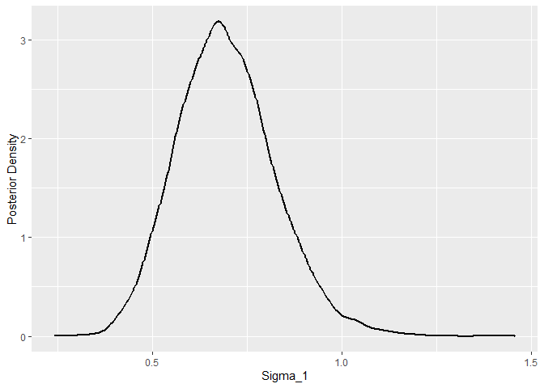<!-- -->

## References

<div id="refs" class="references csl-bib-body hanging-indent"
entry-spacing="0">

<div id="ref-betancourt2017conceptual" class="csl-entry">

Betancourt, Michael. 2017. “A Conceptual Introduction to Hamiltonian
Monte Carlo.” *arXiv Preprint arXiv:1701.02434*.

</div>

<div id="ref-gelman1995bayesian" class="csl-entry">

Gelman, Andrew, John B Carlin, Hal S Stern, and Donald B Rubin. 1995.
*Bayesian Data Analysis*. Chapman; Hall/CRC.

</div>

<div id="ref-hoffman2014no" class="csl-entry">

Hoffman, Matthew D, Andrew Gelman, et al. 2014. “The No-u-Turn Sampler:
Adaptively Setting Path Lengths in Hamiltonian Monte Carlo.” *J. Mach.
Learn. Res.* 15 (1): 1593–623.

</div>

<div id="ref-kruschke2014doing" class="csl-entry">

Kruschke, John et al. 2014. *Doing Bayesian Data Analysis*. Vol. 2.
Elsevier.

</div>

<div id="ref-rosa1998close" class="csl-entry">

Rosa, Linda, Emily Rosa, Larry Sarner, and Stephen Barrett. 1998. “A
Close Look at Therapeutic Touch.” *Jama* 279 (13): 1005–10.

</div>

<div id="ref-sailynoja2022graphical" class="csl-entry">

Säilynoja, Teemu, Paul-Christian Bürkner, and Aki Vehtari. 2022.
“Graphical Test for Discrete Uniformity and Its Applications in
Goodness-of-Fit Evaluation and Multiple Sample Comparison.” *Statistics
and Computing* 32 (2): 32.

</div>

</div>
