# The Second Circle: Checking, Evaluating, and Comparing Bayesian Models, Part Two
<big>**Posterior Predictive Checking**</big>

<br/>
Jiří Fejlek

2026-07-08
<br/>


We will continue the Second Circle dedicated to the diagnostics of
Bayesian models with tools for model checking.  


## Table of Contents

- [Model Checking](#model-checking)
- [Discrepancy Measures](#discrepancy-measures)
- [Probability Integral Transform (PIT)
  Values](#probability-integral-transform-pit-values)
- [Measurements of the Speed of Light
  Revisited](#measurements-of-the-speed-of-light-revisited)
- [Primate Milk Dataset](#primate-milk-dataset)
  - [MCMC diagnostics](#mcmc-diagnostics)
  - [Prior Sensitivity Analysis](#prior-sensitivity-analysis)
  - [Posterior Predictive Checking](#posterior-predictive-checking)
- [Sleep Study Dataset](#sleep-study-dataset)
  - [MCMC diagnostics](#mcmc-diagnostics-1)
  - [Prior Sensitivity Analysis](#prior-sensitivity-analysis-1)
  - [Posterior Predictive Checking](#posterior-predictive-checking-1)
- [Stochastic Learning in Dogs
  Dataset](#stochastic-learning-in-dogs-dataset)
  - [MCMC diagnostics](#mcmc-diagnostics-2)
  - [Prior Sensitivity Analysis](#prior-sensitivity-analysis-2)
  - [Posterior Predictive Checking](#posterior-predictive-checking-2)
- [References](#references)

``` r
library(tidyr)
library(rstan)
library(ggplot2)
library(HDInterval)
library(dplyr)
library(loo)
library(faraway)
library(bayesplot)
color_scheme_set("brewer-Spectral")
```

## Model Checking

We will continue the Second Circle dedicated to the diagnostics of
Bayesian models with tools for model checking.  

The basic tool for checking the fit of a Bayesian model is to test
whether the data generated from the posterior are similar to the
observed data. We replicate the dataset using the posterior
$p(\theta \mid y)$ as follows (Gelman et al. 1995).

``` math
p(y^\text{rep} \mid y) =  \int p(y^\text{rep} \mid \theta) p(\theta \mid y) \text{ d}\theta
```

Then we can simply compare the distributions of the replicated datasets
with that of the original dataset. Let us revisit the *Measurements of
the Speed of Light dataset* based on Simon Newcomb’s experiments (Gelman
et al. 1995).

``` r
y = c(28, 26, 33, 24, 34, -44, 27, 16, 40, -2, 29, 22, 24, 21, 25, 30, 23, 29, 31, 19, 24, 20, 36, 32, 36, 28, 25, 21, 28, 29,
37, 25, 28, 26, 30, 32, 36, 26, 30, 22, 36, 23, 27, 27, 28, 27, 31, 27, 26, 33, 26, 32, 32, 24, 39, 28, 24, 25, 32, 25,
29, 27, 28, 29, 16, 23)

hist(y, main = '', xlab = 'Time in nanoseconds', breaks = 100)
```

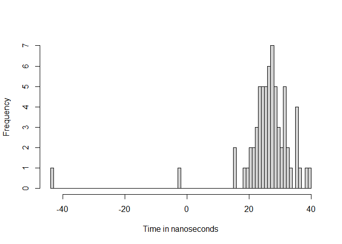<!-- -->

In *First Circle, Part Two*, we removed two outliers to make the
Gaussian model appropriate for the data. Let us not do that, and let us
see whether we recognize that the model is ill-fitted.

We need to remember to add the *generated quantities* part to the Stan
code, to generate new datasets (we also saved the log-likelihood of the
posterior, which we will use later).

``` default
data {
  int<lower=0> N;          // Number of observations
  vector[N] y;             // Target variable
}

parameters {
  real mu;                 // Mean parameter
  real<lower=0> sigma;     // Standard deviation parameter
}

model {
  
  // Prior for mu is flat
  
  // Prior for sigma^2 ~ 1/sigma^2
  target += -2*log(sigma);

  // Likelihood
  y ~ normal(mu, sigma);
}

generated quantities {
  vector[N] log_lik;       // Log-lik
  vector[N] y_rep;         // Simulated dataset

  for (i in 1:N) {
    log_lik[i] = normal_lpdf(y[i] | mu, sigma);
  }

  for (i in 1:N) {
    y_rep[i] = normal_rng(mu, sigma);
    }  
}
```

``` r
stan_data <- list(
  N = length(y),
  y = y
)

fit <- stan(
  file  = "C:/Users/elini/Desktop/nine circles 3/f2_s3.stan",
  data = stan_data,
  chains = 4,
  iter = 2500,
  warmup = 2000,
  seed = 123,
  refresh = 0
)
```

Now, we can compare the histogram of the observed data with some
generated datasets.

``` r
y_sim <- extract(fit)$y_rep

par(mfrow = c(2, 2))
hist(y, breaks = 100, plot=TRUE, xlab = '', main = 'Observed Dataset')
hist(y_sim[100, ], breaks = 100, xlab = '', main = 'Simulated Dataset')
hist(y_sim[250, ], breaks = 100, xlab = '', main = 'Simulated Dataset')
hist(y_sim[500, ], breaks = 100, xlab = '', main = 'Simulated Dataset')
```

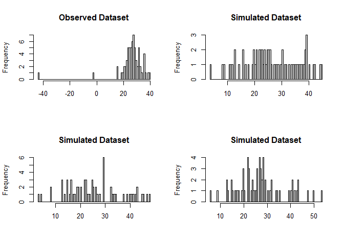<!-- -->

We observe that the simulated data does not even come close to the
extremely negative observation -44 from the original dataset. Comparing
histograms can be a bit tricky. Hence, we will again use the package
*bayesplot*, which includes *ppc_dens_overlay*, which plots kernel
density estimates of simulated datasets alongside the original dataset.

``` r
ppc_dens_overlay(y, y_sim[1:250,])
```

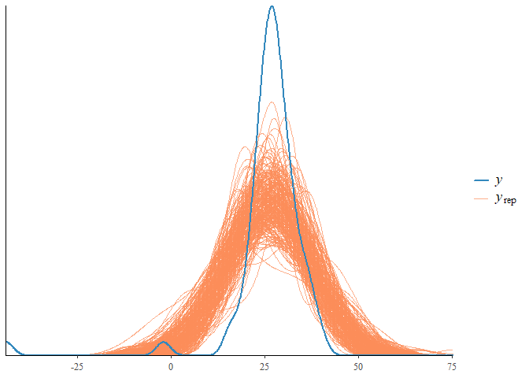<!-- -->

We clearly observe that (due to the influence of two outlying
observations), the posterior normal distributions have significantly
larger variance than the peak of the observed data. We also notice that
the normal model cannot really produce the large negative value observed
in the original dataset. We can also compare the empirical cumulative
distribution functions

``` r
ppc_ecdf_overlay(y, y_sim[1:250,])
```

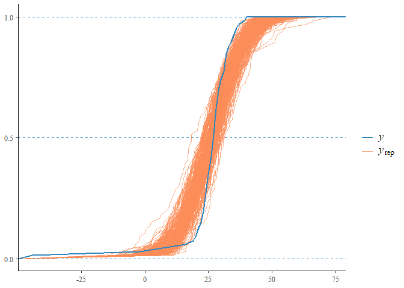<!-- -->

and scatter plots simulated vs observed.

``` r
ppc_scatter(y, y_sim[1:6,])+geom_abline()
```

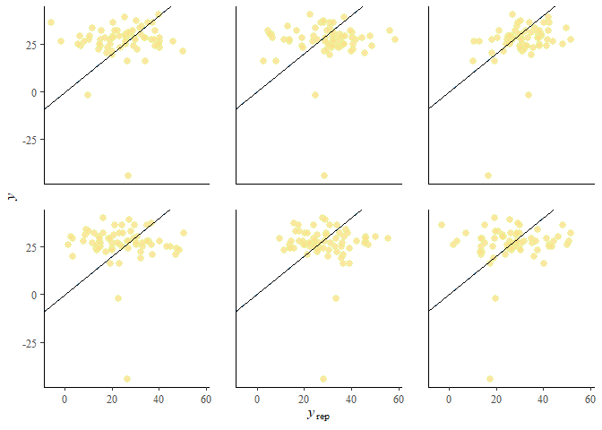<!-- -->

## Discrepancy Measures

In this simple example, almost any diagnostic plot would reveal the
issue. But in more complex settings, we can create a *discrepancy
measure* $T(y, \theta)$, which serves a purpose similar to that of the
test statistic $T(y)$ in standard frequentist statistics (Gelman et al.
1995). Notice that $T(y, \theta)$ can explicitly depend on the value
$\theta$, since we have the posterior $p(\theta \mid y)$ available in
the Bayesian setting. Similarly to frequentist statistics, we can then
compute *posterior predictive p-value* (Gelman et al. 1995)

``` math
p_B = P(T(y^\text{rep}, \theta ) \geq T(y, \theta) \mid y),
```

that helps us to asses how extreme is the value $T(y, \theta)$ with
respect to $T(y^\text{rep}, \theta)$.

Let us try to construct some discrepancy measures. The first measure one
would probably consider checking is the mean of the distributions.

``` r
mean_posterior <- apply(y_sim,1,mean)
dens <- density(mean_posterior)
dens_data <- data.frame(x = dens$x, y = dens$y)

ggplot(dens_data, aes(x = x, y = y)) +  geom_line(linewidth = 1) + xlab('Mean of Simulated Datasets') + ylab('Posterior Density') + geom_vline(xintercept = mean(y), color = "red")
```

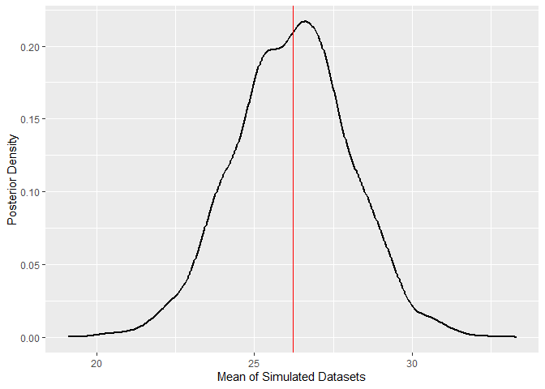<!-- -->

``` r
# p-value
mean(abs(mean_posterior) > mean(y))
```

    ## [1] 0.5055

We see that the observed mean is quite typical among the means of
replicated datasets. The reason is that the mean is closely tied to our
model’s parameter $\mu$, which is optimized to fit the dataset. Hence,
our model would have to be extraordinarily poor to not even get it
right.

``` r
mu_posterior <- extract(fit)$mu

dens2 <- density(mu_posterior)
dens_data2 <- data.frame(x = dens2$x, y = dens2$y)

ggplot() +  
  geom_line(aes(x = dens_data$x, y = dens_data$y, colour= "Mean of Simulated Datasets"), linewidth = 1) + 
  geom_line(aes(x = dens_data2$x, y = dens_data2$y,colour= "Posterior of Mu"), linewidth = 1) + 
  scale_color_manual(name = "Densities", values = c("Mean of Simulated Datasets" = "black", "Posterior of Mu" = "blue")) +
  xlab('Mu') + ylab('Posterior Density') +
  geom_vline(xintercept = mean(y), color = "red")  
```

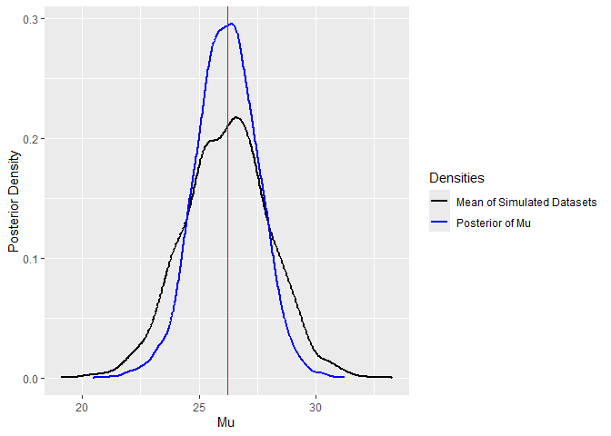<!-- -->

The standard deviation/sample variance will give us a similar result.

``` r
sd_posterior <- apply(y_sim,1,sd)
dens <- density(sd_posterior)
dens_data <- data.frame(x = dens$x, y = dens$y)

sigma_posterior <- extract(fit)$sigma
dens2 <- density(sigma_posterior)
dens_data2 <- data.frame(x = dens2$x, y = dens2$y)


ggplot() +  
  geom_line(aes(x = dens_data$x, y = dens_data$y, colour= "Std. Dev. of Simulated Datasets"), linewidth = 1) + 
  geom_line(aes(x = dens_data2$x, y = dens_data2$y,colour= "Posterior of Sigma"), linewidth = 1) + 
  scale_color_manual(name = "Densities", values = c("Std. Dev. of Simulated Datasets" = "black", "Posterior of Sigma" = "blue")) +
  xlab('Sigma') + ylab('Posterior Density') +
  geom_vline(xintercept = sd(y), color = "red")  
```

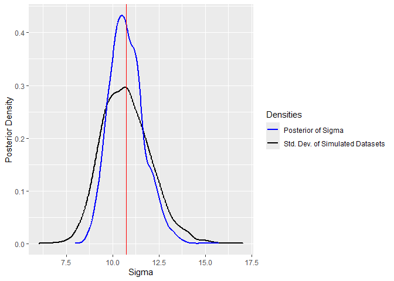<!-- -->

``` r
# p-value
mean(sd_posterior > sd(y))
```

    ## [1] 0.474

The thing is, we are not limited to these standard test statistics,
which we employ all the time due to their “nice” sampling distributions.
Instead of the standard deviation, let us consider the interquartile
range, i.e., the difference between the 75th and 25th quantiles.

``` r
iqr_posterior <- apply(y_sim,1,function(x) quantile(x,0.75) - quantile(x,0.25))

dens <- density(iqr_posterior)
dens_data <- data.frame(x = dens$x, y = dens$y)

ggplot() +  
  geom_line(aes(x = dens_data$x, y = dens_data$y), linewidth = 1, color = 'blue') + 
  xlab('IQR') + ylab('Posterior Density') +
  geom_vline(xintercept = quantile(y,0.75)- quantile(y,0.25), color = "red")  
```

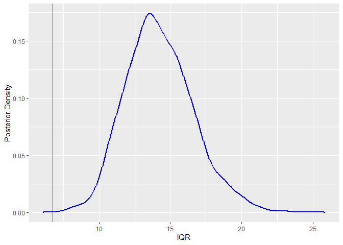<!-- -->

``` r
# p-value
mean(iqr_posterior > (quantile(y,0.75)- quantile(y,0.25)))
```

    ## [1] 1

We finally observe a strong discrepancy between the observed data and
the dataset simulated from the posterior. Other statistics we could
consider include the minimum and maximum.

``` r
min_posterior <- apply(y_sim,1,min)

dens <- density(min_posterior)
dens_data <- data.frame(x = dens$x, y = dens$y)

ggplot() +  
  geom_line(aes(x = dens_data$x, y = dens_data$y), linewidth = 1, color = 'blue') + 
  xlab('Min') + ylab('Posterior Density') +
  geom_vline(xintercept = min(y), color = "red")  
```

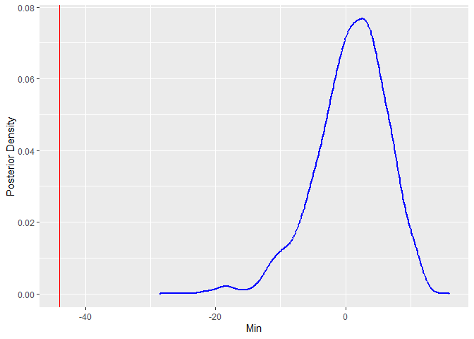<!-- -->

``` r
# p-value
mean(min_posterior > min(y))
```

    ## [1] 1

``` r
max_posterior <- apply(y_sim,1,max)

dens <- density(max_posterior)
dens_data <- data.frame(x = dens$x, y = dens$y)

ggplot() +  
  geom_line(aes(x = dens_data$x, y = dens_data$y), linewidth = 1, color = 'blue') + 
  xlab('Max') + ylab('Posterior Density') +
  geom_vline(xintercept = max(y), color = "red")  
```

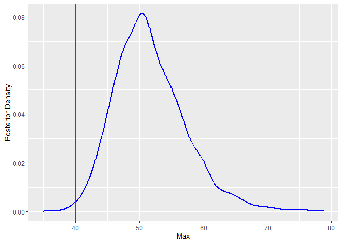<!-- -->

``` r
# p-value
mean(max_posterior > max(y))
```

    ## [1] 0.997

Lastly, we should mention that we can obtain these plots using
*ppc_stat* from the *bayesplot* package.

``` r
library(patchwork)
p1 <- ppc_stat(y, y_sim, stat="min")
p2 <- ppc_stat(y, y_sim, stat="max")

iqr <- function(y) {
  quantile(y, 0.75) - quantile(y, 0.25)
}

p3 <- ppc_stat(y, y_sim, stat="iqr")

(p1 + p2 + p3) + plot_layout(ncol = 3)
```

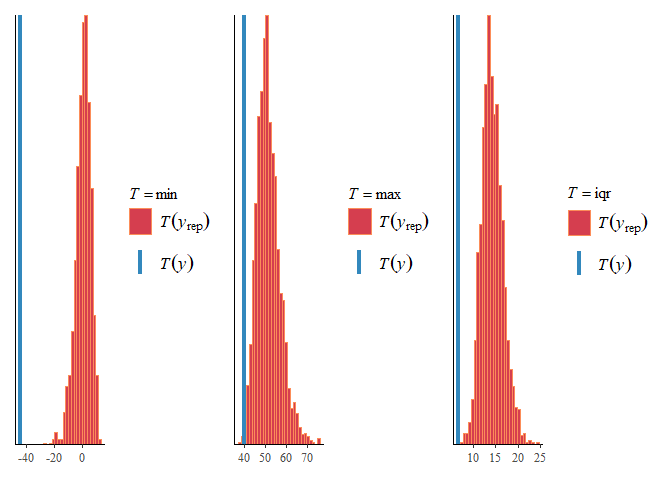<!-- -->

## Probability Integral Transform (PIT) Values

The *probability integral transform* refers to an important statistical
observation: given a continuous random variable $X$ with an invertible
cumulative distribution function (cdf) $F$, then $F(X) \sim U(0,1)$.
Hence, let us assume that $y_1, \ldots, y_N$ are independent
observations that we model with a distribution whose cdf is $F$. We
define PIT values as (Tesso and Vehtari 2026)

``` math
p_i = F(y_i) = \int_{-\infty}^{y_i} \text{d}F(x) = \int_{-\infty}^{y_i} f(x) \text{ d}x,
```

where we denoted the corresponding probability density of $F$ as $f$. If
$F$ is the distribution of from which $y_1, \ldots, y_N$ are generated,
then $p_i$ should have a uniform distribution.

Provided that this integral is intractable, we can approximate the PIT
value using some random draws $x_1, \ldots, x_S$ from $F$ as

``` math
\hat p_i = \frac{1}{S}\sum_{j = 1}^S I(x_j \leq y_i).
```

We can now apply this framework to generated datasets, in which
$x_1, \ldots, x_S$ are the observed data and $y_i$ are the replicated
datasets.

``` r
pit_values <- numeric(length(y))
for (i in 1:length(y)) {
  pit_values[i] <- mean(y_sim[, i] <= y[i]) # we average over the generated datasets
}

ggplot(data.frame(pit = pit_values), aes(x = pit)) +
  geom_histogram(breaks = seq(0, 1, by = 0.1), color = "black", fill = "lightblue") +
  theme_minimal() +
  labs(title = '', x = 'PIT Values', y = 'Frequency')
```

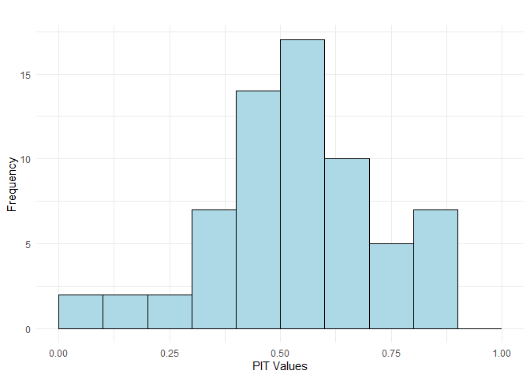<!-- -->

We observe that the distribution of posterior PIT values appears to
deviate substantially from the uniform distribution.

One issue with posterior PIT values (and other posterior predictive
checks in general) is that we use the same data twice (first for fitting
the model, then for model checking), which makes the results inherently
more optimistic. A natural solution is a held-out sample or
cross-validation. In the case of PIT-values, it is natural to use
leave-one-out (LOO) cross-validation, which we can approximate using
Pareto Smoothed Importance Sampling (PSIS)
(<https://cran.r-project.org/web/packages/loo/vignettes/loo2-example.html>,
<https://mc-stan.org/bayesplot/reference/PPC-loo.html>).

We can compute the LOO-PIT values using PSIS as follows. First, we
compute the PSIS scores.

``` r
loo_fit <- loo(fit, save_psis = TRUE , moment_match = TRUE)
loo_fit
```

    ## 
    ## Computed from 2000 by 66 log-likelihood matrix.
    ## 
    ##          Estimate   SE
    ## elpd_loo   -265.2 35.6
    ## p_loo        19.6 18.6
    ## looic       530.3 71.2
    ## ------
    ## MCSE of elpd_loo is 0.1.
    ## MCSE and ESS estimates assume MCMC draws (r_eff in [0.8, 0.9]).
    ## 
    ## All Pareto k estimates are good (k < 0.7).
    ## See help('pareto-k-diagnostic') for details.

Then we extract the importance-sampling weights and compare LOO-PIT
values with those from a uniform distribution. We can also compare LOO
prediction intervals.

``` r
psis_object <- loo_fit$psis_object
lw <- weights(psis_object)


p1 <- ppc_loo_pit_overlay(y, y_sim, lw = lw)
p2 <- ppc_loo_pit_qq(y, y_sim, lw = lw)
p3 <- ppc_loo_pit_ecdf(y, y_sim, lw = lw, plot_diff = TRUE)
p4 <-ppc_loo_intervals(y, y_sim, psis_object = psis_object, prob = 0.75, prob_outer = 0.99)

(p1 + p2 + p3 + p4) + plot_layout(ncol = 2)
```

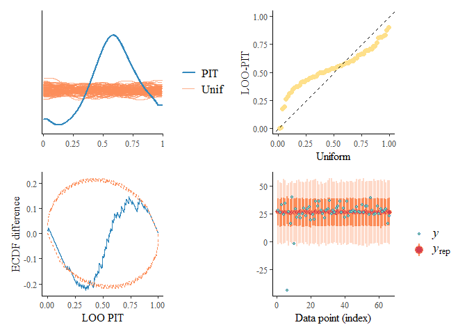<!-- -->

We observe notable discrepancies between LOO-PIT values and their
expected uniform distribution. 

Overall, our model diagnostics indicate that the normal
model is not appropriate for the dataset.

## Measurements of the Speed of Light Revisited

Let’s compare the results with a Gaussian model after removing two
outliers. Let us first examine the distributions of the simulated
datasets and our discrepancy measures.

``` r
stan_data <- list(
  N = length(y[y>0]),
  y = y[y>0]
)

fit2 <- stan(
  file  = "C:/Users/elini/Desktop/nine circles 3/f2_s3.stan",
  data = stan_data,
  chains = 4,
  iter = 2500,
  warmup = 2000,
  seed = 123,
  refresh = 0
)
```

``` r
y2 <- y[y>0]
y_sim2 <- extract(fit2)$y_rep
ppc_dens_overlay(y2, y_sim2[1:250,])
```

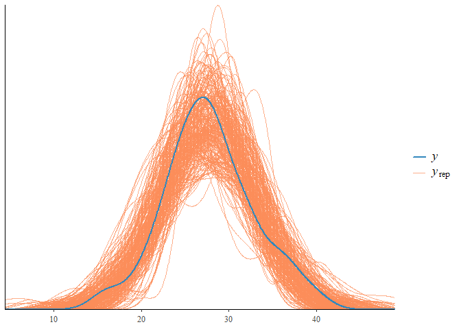<!-- -->

``` r
ppc_scatter(y2, y_sim2[1:6,])+geom_abline()
```

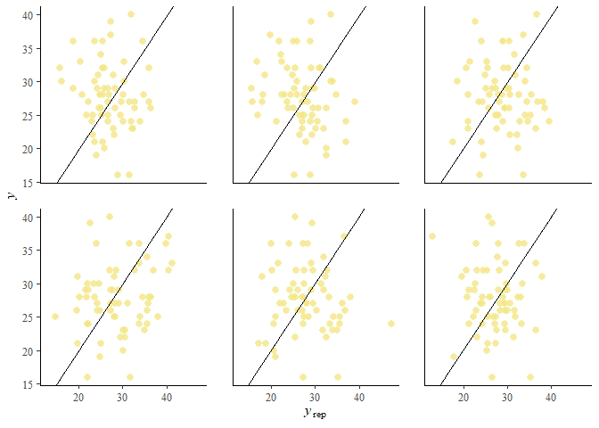<!-- -->

``` r
p1 <- ppc_stat(y2, y_sim2, stat="min")
p2 <- ppc_stat(y2, y_sim2, stat="max")
p3 <- ppc_stat(y2, y_sim2, stat="iqr")

(p1 + p2 + p3) + plot_layout(ncol = 3)
```

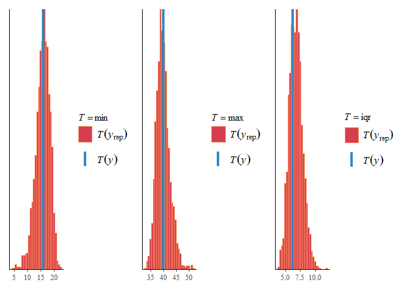<!-- -->

Next, we will check the PIT scores. We start with non-cross-validated
scores.

``` r
pit_values <- numeric(length(y2))
for (i in 1:length(y2)) {
  pit_values[i] <- mean(y_sim2[, i] <= y2[i]) # we average over the generated datasets
}

ggplot(data.frame(pit = pit_values), aes(x = pit)) +
  geom_histogram(breaks = seq(0, 1, by = 0.1), color = "black", fill = "lightblue") +
  theme_minimal() +
  labs(title = '', x = 'PIT Values', y = 'Frequency')
```

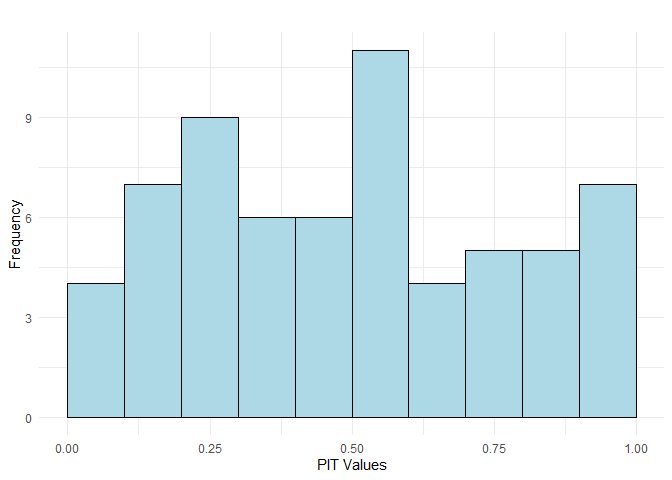<!-- -->

Let us also compute LOO-PIT scores.

``` r
loo_fit2 <- loo(fit2, save_psis = TRUE , moment_match = TRUE)
psis_object2 <- loo_fit2$psis_object
lw2 <- weights(psis_object2)

p1 <- ppc_loo_pit_overlay(y2, y_sim2, lw = lw2)
p2 <- ppc_loo_pit_qq(y2, y_sim2, lw = lw2)
p3 <- ppc_loo_pit_ecdf(y2, y_sim2, lw = lw2, plot_diff = TRUE)
p4 <- ppc_loo_intervals(y2, y_sim2, psis_object = psis_object2, prob = 0.75, prob_outer = 0.99)

(p1 + p2 + p3 + p4) + plot_layout(ncol = 2)
```

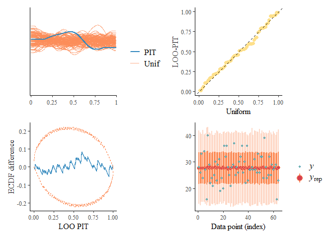<!-- -->

We observe that after ignoring two outliers, the normal model seems
appropriate. However, we do not need to delete the outliers to fit a
model. We can consider a distribution with heavier tails that better
accommodates extreme observations. Namely, we will consider Student’s
t-distribution. We will use mostly the same Stan code; we will just
replace the normal distribution with the t-distribution. We also need to
set a prior for the number of degrees of freedom $\nu$, which determines
how heavy the tails of the t-distribution are.

``` default
data {
  int<lower=0> N;          // Number of observations
  vector[N] y;             // Target variable
}

parameters {
  real mu;                 // Location parameter
  real<lower=0> nu;        // Degrees of freedom 
  real<lower=0> sigma;     // Scale parameter
}

model {
  
  // Prior for mu is flat

  // Prior for degrees of freedom
  nu ~ exponential(0.01);
  
  // Prior for sigma^2 ~ 1/sigma^2
  target += -2*log(sigma);

  // Likelihood
  y ~ student_t(nu, mu, sigma);
}

generated quantities {
  vector[N] log_lik;       // Log-lik
  vector[N] y_rep;         // Simulated dataset

  for (i in 1:N) {
    log_lik[i] = student_t_lpdf(y[i] | nu, mu, sigma);
  }

  for (i in 1:N) {
    y_rep[i] = student_t_rng(nu, mu, sigma);
    }
    
}
```

``` r
stan_data <- list(
  N = length(y),
  y = y
)

fit3 <- stan(
  file  = "C:/Users/elini/Desktop/nine circles 3/f2_s4.stan",
  data = stan_data,
  chains = 4,
  iter = 2500,
  warmup = 2000,
  seed = 123,
  refresh = 0
)
```

Let us check the fit.

``` r
mu_sample <- extract(fit3)$mu

dens <- density(mu_sample)
dens_data <- data.frame(x = dens$x, y = dens$y)

ggplot(dens_data, aes(x = x, y = y)) +  geom_line(linewidth = 1) + xlab('Location Parameter') + ylab('Posterior Density')
```

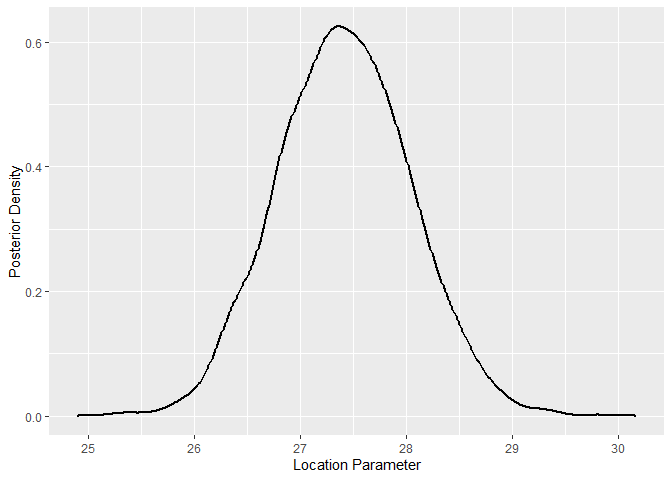<!-- -->

``` r
nu_sample <- extract(fit3)$nu

dens <- density(nu_sample)
dens_data <- data.frame(x = dens$x, y = dens$y)

ggplot(dens_data, aes(x = x, y = y)) +  geom_line(linewidth = 1) + xlab('Degrees of Freedom') + ylab('Posterior Density')
```

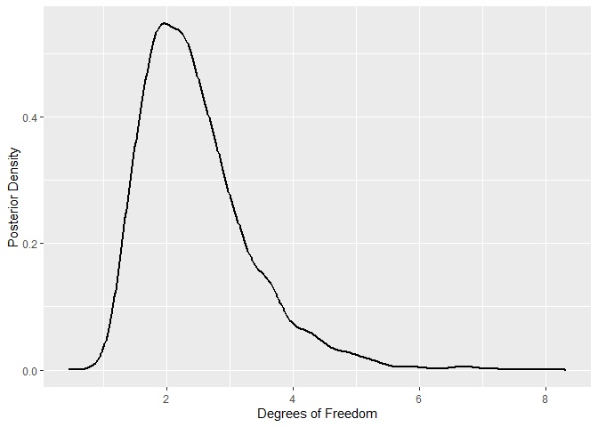<!-- -->

``` r
sigma_sample <- extract(fit3)$sigma

dens <- density(sigma_sample)
dens_data <- data.frame(x = dens$x, y = dens$y)

ggplot(dens_data, aes(x = x, y = y)) +  geom_line(linewidth = 1) + xlab('Scale Parameter') + ylab('Posterior Density')
```

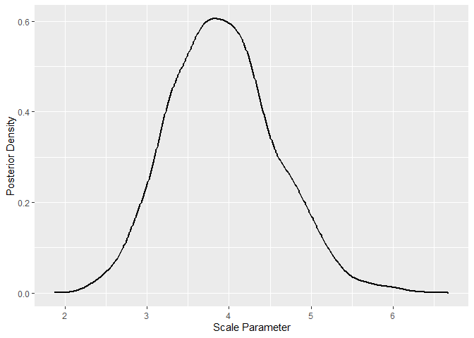<!-- -->

Thanks to the heavy tails of the t-distribution, the model is
appropriate for the dataset.

``` r
y_sim3 <- extract(fit3)$y_rep

p1 <- ppc_dens_overlay(y, y_sim3[1:250,])
p2 <- ppc_stat(y, y_sim3, stat="min")
p3 <- ppc_stat(y, y_sim3, stat="max")
p4 <- ppc_stat(y, y_sim3, stat="iqr")

(p1 + p2 + p3 + p4) + plot_layout(ncol = 2)
```

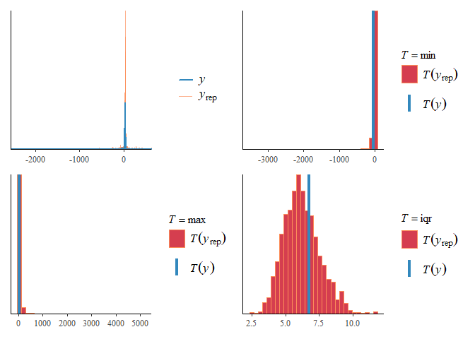<!-- -->

``` r
pit_values <- numeric(length(y))
for (i in 1:length(y)) {
  pit_values[i] <- mean(y_sim3[, i] <= y[i]) # we average over the generated datasets
}

ggplot(data.frame(pit = pit_values), aes(x = pit)) +
  geom_histogram(breaks = seq(0, 1, by = 0.1), color = "black", fill = "lightblue") +
  theme_minimal() +
  labs(title = '', x = 'PIT Values', y = 'Frequency')
```

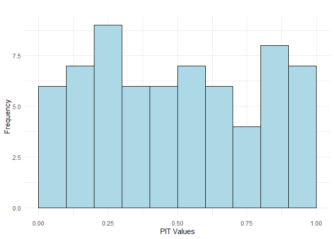<!-- -->

``` r
loo_fit3 <- loo(fit3, save_psis = TRUE , moment_match = TRUE)
psis_object3 <- loo_fit3$psis_object
lw3 <- weights(psis_object3)

p1 <- ppc_loo_pit_overlay(y, y_sim3, lw = lw3)
p2 <- ppc_loo_pit_qq(y, y_sim3, lw = lw3)
p3 <- ppc_loo_pit_ecdf(y, y_sim3, lw = lw3, plot_diff = TRUE)
p4 <- ppc_loo_intervals(y, y_sim3, psis_object = psis_object3, prob = 0.75, prob_outer = 0.99)

(p1 + p2 + p3 + p4) + plot_layout(ncol = 2)
```

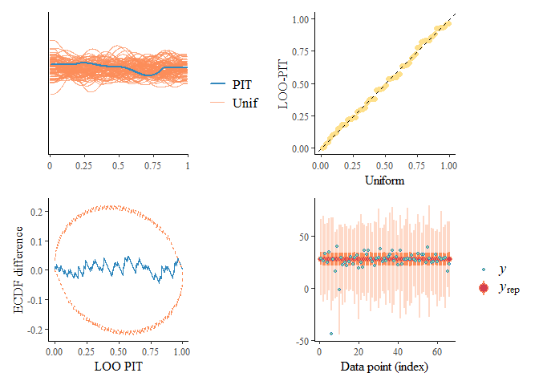<!-- -->

Finally, we should note that, in terms of the predicted speed of light,
the normal model (without outliers) and the model with a t-distribution
do not differ much.

``` r
hdis <- rbind(
  quantile(extract(fit)$mu, c(0.025, 0.975)),
  quantile(extract(fit2)$mu, c(0.025, 0.975)),
  quantile(extract(fit3)$mu, c(0.025, 0.975))
)

colnames(hdis) <-  c('lower', 'upper')
rownames(hdis) <- c('Normal distribution (all observations)', 'Normal distribution (without outliers)', "Student's t-distribution")
hdis
```

    ##                                           lower    upper
    ## Normal distribution (all observations) 23.51511 28.67565
    ## Normal distribution (without outliers) 26.52357 28.99946
    ## Student's t-distribution               26.23942 28.64165

``` r
distance = 7442
times = (hdis + 24800)*10^(-9) 
speeds <- cbind(distance/times[,2], distance/times[,1])
colnames(speeds) <- c('lower', 'upper')
speeds
```

    ##                                            lower     upper
    ## Normal distribution (all observations) 299734070 299796381
    ## Normal distribution (without outliers) 299730161 299760052
    ## Student's t-distribution               299734480 299763483

## Primate Milk Dataset

Let us consider the Primate Milk Dataset from (McElreath 2018). The goal
of this dataset is to investigate whether primates with larger brains
produce milk that is more energetically dense.

``` r
primate_milk <- read.csv("C:/Users/elini/Desktop/nine circles 3/milk.csv", sep = ',')
head(primate_milk)
```

    ##   X            clade            species kcal.per.g perc.fat perc.protein
    ## 1 1    Strepsirrhine     Eulemur fulvus       0.49    16.60        15.42
    ## 2 2    Strepsirrhine           E macaco       0.51    19.27        16.91
    ## 3 3    Strepsirrhine           E mongoz       0.46    14.11        16.85
    ## 4 4    Strepsirrhine      E rubriventer       0.48    14.91        13.18
    ## 5 5    Strepsirrhine        Lemur catta       0.60    27.28        19.50
    ## 6 6 New World Monkey Alouatta seniculus       0.47    21.22        23.58
    ##   perc.lactose mass neocortex.perc
    ## 1        67.98 1.95          55.16
    ## 2        63.82 2.09             NA
    ## 3        69.04 2.51             NA
    ## 4        71.91 1.62             NA
    ## 5        53.22 2.19             NA
    ## 6        55.20 5.25          64.54

There are some missing rows with missing **neocortex.perc** We will
ignore these. In addition, we will rescale **neocortex.perc** from
percentages to fractions.

``` r
primate_milk_cc <- primate_milk[rowSums(is.na(primate_milk)) == 0,]
primate_milk_cc$neocortex.perc <- primate_milk_cc$neocortex.perc/100
primate_milk_cc
```

    ##     X            clade                 species kcal.per.g perc.fat perc.protein
    ## 1   1    Strepsirrhine          Eulemur fulvus       0.49    16.60        15.42
    ## 6   6 New World Monkey      Alouatta seniculus       0.47    21.22        23.58
    ## 7   7 New World Monkey              A palliata       0.56    29.66        23.46
    ## 8   8 New World Monkey            Cebus apella       0.89    53.41        15.80
    ## 10 10 New World Monkey              S sciureus       0.92    50.58        22.33
    ## 11 11 New World Monkey        Cebuella pygmaea       0.80    41.35        20.85
    ## 12 12 New World Monkey       Callimico goeldii       0.46     3.93        25.30
    ## 13 13 New World Monkey      Callithrix jacchus       0.71    38.38        20.09
    ## 16 16 Old World Monkey     Miopithecus talpoin       0.68    40.15        18.08
    ## 18 18 Old World Monkey               M mulatta       0.97    55.51        13.17
    ## 20 20 Old World Monkey               Papio spp       0.84    54.31        10.97
    ## 22 22              Ape           Hylobates lar       0.62    34.51        12.57
    ## 24 24              Ape          Pongo pygmaeus       0.54    37.78         7.37
    ## 25 25              Ape Gorilla gorilla gorilla       0.49    27.18        16.29
    ## 27 27              Ape            Pan paniscus       0.48    21.18        11.68
    ## 28 28              Ape           P troglodytes       0.55    36.84         9.54
    ## 29 29              Ape            Homo sapiens       0.71    50.49         9.84
    ##    perc.lactose  mass neocortex.perc
    ## 1         67.98  1.95         0.5516
    ## 6         55.20  5.25         0.6454
    ## 7         46.88  5.37         0.6454
    ## 8         30.79  2.51         0.6764
    ## 10        27.09  0.68         0.6885
    ## 11        37.80  0.12         0.5885
    ## 12        70.77  0.47         0.6169
    ## 13        41.53  0.32         0.6032
    ## 16        41.77  1.55         0.6997
    ## 18        31.32  3.24         0.7041
    ## 20        34.72 12.30         0.7340
    ## 22        52.92  5.37         0.6753
    ## 24        54.85 35.48         0.7126
    ## 25        56.53 79.43         0.7260
    ## 27        67.14 40.74         0.7024
    ## 28        53.62 33.11         0.7630
    ## 29        39.67 54.95         0.7549

Now, this is our first dataset on which we employ a regression model. We
technically did not cover the Bayesian regression, but after covering so
many frequentist models, we should be fine. We will use the *brms*
package to fit the regression models, which allows us to do so without
writing Stan code explicitly.

We will fit the Bayesian linear regression as follows: we will consider 
a linear model
``` math
\mathbb{E}\text{ neocortex.perc} = \alpha + \beta \cdot \text{log(mass)}
```
and we will specify a prior for the coefficient on log(mass) and let *brms* pick its default choices for the rest.

``` r
library(brms)
milk_lr <- brm(kcal.per.g ~ neocortex.perc + log(mass), family = gaussian(),  prior = prior(normal(0,1), coef = 'logmass'), data = primate_milk_cc, refresh = 0, silent = 2, seed = 123)
```

We can check the resulting Stan code

``` r
stancode(milk_lr)
```

    ## // generated with brms 2.23.0
    ## functions {
    ## }
    ## data {
    ##   int<lower=1> N;  // total number of observations
    ##   vector[N] Y;  // response variable
    ##   int<lower=1> K;  // number of population-level effects
    ##   matrix[N, K] X;  // population-level design matrix
    ##   int<lower=1> Kc;  // number of population-level effects after centering
    ##   int prior_only;  // should the likelihood be ignored?
    ## }
    ## transformed data {
    ##   matrix[N, Kc] Xc;  // centered version of X without an intercept
    ##   vector[Kc] means_X;  // column means of X before centering
    ##   for (i in 2:K) {
    ##     means_X[i - 1] = mean(X[, i]);
    ##     Xc[, i - 1] = X[, i] - means_X[i - 1];
    ##   }
    ## }
    ## parameters {
    ##   vector[Kc] b;  // regression coefficients
    ##   real Intercept;  // temporary intercept for centered predictors
    ##   real<lower=0> sigma;  // dispersion parameter
    ## }
    ## transformed parameters {
    ##   // prior contributions to the log posterior
    ##   real lprior = 0;
    ##   lprior += normal_lpdf(b[2] | 0, 1);
    ##   lprior += student_t_lpdf(Intercept | 3, 0.6, 2.5);
    ##   lprior += student_t_lpdf(sigma | 3, 0, 2.5)
    ##     - 1 * student_t_lccdf(0 | 3, 0, 2.5);
    ## }
    ## model {
    ##   // likelihood including constants
    ##   if (!prior_only) {
    ##     target += normal_id_glm_lpdf(Y | Xc, Intercept, b, sigma);
    ##   }
    ##   // priors including constants
    ##   target += lprior;
    ## }
    ## generated quantities {
    ##   // actual population-level intercept
    ##   real b_Intercept = Intercept - dot_product(means_X, b);
    ## }

and the priors.

``` r
prior_summary(milk_lr)
```

    ##                   prior     class           coef group resp dpar nlpar lb ub
    ##                  (flat)         b                                           
    ##            normal(0, 1)         b        logmass                            
    ##                  (flat)         b neocortex.perc                            
    ##  student_t(3, 0.6, 2.5) Intercept                                           
    ##    student_t(3, 0, 2.5)     sigma                                       0   
    ##  tag       source
    ##           default
    ##              user
    ##      (vectorized)
    ##           default
    ##           default

We should note that the value 0.6 in the prior for intercept corresponds
to the median of the response variable; 2.5 is just the minimal value
for scale parameters that *brms* uses.

``` r
median(primate_milk_cc$kcal.per.g)
```

    ## [1] 0.62

Overall, we fitted the following model.

``` math
\begin{align*}
\text{neocortex.perc} &\sim N(\mu, \sigma^2)\\
\mu &= \alpha + \beta \cdot \text{log(mass)}\\
\alpha &\sim \text{Student}_3(0.6, 2.5)\\
\beta & \sim N(0,1)\\
\sigma & \sim  \text{Half-Student}_3(0, 2.5)
\end{align*}
```

Let us check the results.

``` r
summary(milk_lr)
```

    ##  Family: gaussian 
    ##   Links: mu = identity 
    ## Formula: kcal.per.g ~ neocortex.perc + log(mass) 
    ##    Data: primate_milk_cc (Number of observations: 17) 
    ##   Draws: 4 chains, each with iter = 2000; warmup = 1000; thin = 1;
    ##          total post-warmup draws = 4000
    ## 
    ## Regression Coefficients:
    ##                Estimate Est.Error l-95% CI u-95% CI Rhat Bulk_ESS Tail_ESS
    ## Intercept         -1.09      0.60    -2.26     0.06 1.00     2022     1951
    ## neocortex.perc     2.80      0.93     1.01     4.64 1.00     1970     1934
    ## logmass           -0.10      0.03    -0.16    -0.04 1.00     1963     2104
    ## 
    ## Further Distributional Parameters:
    ##       Estimate Est.Error l-95% CI u-95% CI Rhat Bulk_ESS Tail_ESS
    ## sigma     0.14      0.03     0.09     0.21 1.00     2306     1975
    ## 
    ## Draws were sampled using sampling(NUTS). For each parameter, Bulk_ESS
    ## and Tail_ESS are effective sample size measures, and Rhat is the potential
    ## scale reduction factor on split chains (at convergence, Rhat = 1).

We can compare the results with those from the OLS model.

``` r
summary(lm(kcal.per.g ~ neocortex.perc + log(mass), data = primate_milk_cc))
```

    ## 
    ## Call:
    ## lm(formula = kcal.per.g ~ neocortex.perc + log(mass), data = primate_milk_cc)
    ## 
    ## Residuals:
    ##       Min        1Q    Median        3Q       Max 
    ## -0.250574 -0.039212  0.000633  0.072997  0.201985 
    ## 
    ## Coefficients:
    ##                Estimate Std. Error t value Pr(>|t|)   
    ## (Intercept)    -1.08525    0.51528  -2.106  0.05372 . 
    ## neocortex.perc  2.79306    0.80151   3.485  0.00364 **
    ## log(mass)      -0.09640    0.02475  -3.895  0.00162 **
    ## ---
    ## Signif. codes:  0 '***' 0.001 '**' 0.01 '*' 0.05 '.' 0.1 ' ' 1
    ## 
    ## Residual standard error: 0.1265 on 14 degrees of freedom
    ## Multiple R-squared:  0.5317, Adjusted R-squared:  0.4648 
    ## F-statistic: 7.948 on 2 and 14 DF,  p-value: 0.004939

We observe that the results are very similar. Let’s diagnose our
Bayesian model.

### MCMC diagnostics

First, we need to check the MCMC chains.

``` r
summary(as_draws_df(milk_lr))
```

    ## # A tibble: 7 × 10
    ##   variable            mean  median      sd     mad     q5     q95  rhat ess_bulk
    ##   <chr>              <dbl>   <dbl>   <dbl>   <dbl>  <dbl>   <dbl> <dbl>    <dbl>
    ## 1 b_Intercept      -1.09   -1.08   0.596   0.538   -2.07  -0.154   1.00    2022.
    ## 2 b_neocortex.perc  2.80    2.78   0.931   0.839    1.32   4.31    1.00    1970.
    ## 3 b_logmass        -0.0965 -0.0957 0.0290  0.0260  -0.143 -0.0508  1.00    1963.
    ## 4 sigma             0.139   0.135  0.0300  0.0260   0.100  0.194   1.00    2306.
    ## 5 Intercept         0.657   0.657  0.0349  0.0337   0.601  0.715   1.00    2880.
    ## 6 lprior           -4.07   -4.07   0.00353 0.00267 -4.07  -4.06    1.00    2038.
    ## 7 lp__              4.18    4.56   1.67    1.40     0.995  6.07    1.00    1427.
    ## # ℹ 1 more variable: ess_tail <dbl>

``` r
dim(as_draws_df(milk_lr))
```

    ## [1] 4000   10

We observe that *ESS* and *RHat* seem pretty good for all parameters.
Let’s visualize the chains.

``` r
p1 <-mcmc_rank_overlay(as_draws_df(milk_lr), pars = 'b_Intercept', n_bins  = 25)
p2 <-mcmc_rank_overlay(as_draws_df(milk_lr), pars = 'b_neocortex.perc', n_bins  = 25)
p3 <-mcmc_rank_overlay(as_draws_df(milk_lr), pars = 'b_logmass', n_bins  = 25)
p4 <-mcmc_rank_overlay(as_draws_df(milk_lr), pars = 'lp__', n_bins  = 25)

(p1 + p2 + p3 + p4) + plot_layout(ncol = 2)
```

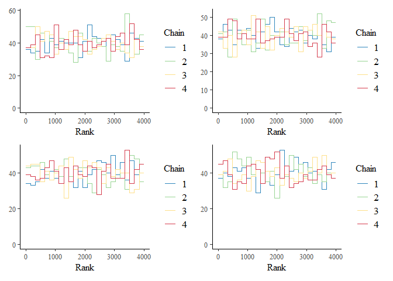<!-- -->

``` r
p1 <- mcmc_rank_ecdf(as_draws_df(milk_lr), pars = 'b_Intercept',plot_diff = TRUE)
p2 <- mcmc_rank_ecdf(as_draws_df(milk_lr), pars = 'b_neocortex.perc',plot_diff = TRUE)
p3 <- mcmc_rank_ecdf(as_draws_df(milk_lr), pars = 'b_logmass',plot_diff = TRUE)
p4 <- mcmc_rank_ecdf(as_draws_df(milk_lr), pars = 'lp__',plot_diff = TRUE)
(p1 + p2 + p3 + p4) + plot_layout(ncol = 2)
```

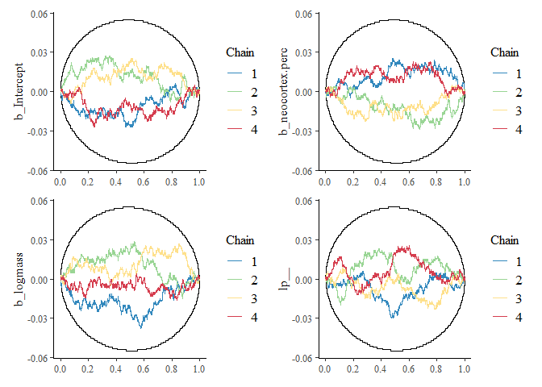<!-- -->

We see no obvious problems. Lastly, we will check Hamiltonian
MCMC-specific diagnostics.

``` r
np <- nuts_params(milk_lr)
p1 <- mcmc_nuts_energy(np, merge_chains = TRUE, bins = 50)
p2 <-mcmc_nuts_divergence(np, log_posterior(milk_lr))

(p1 + p2) + plot_layout(ncol = 2)
```

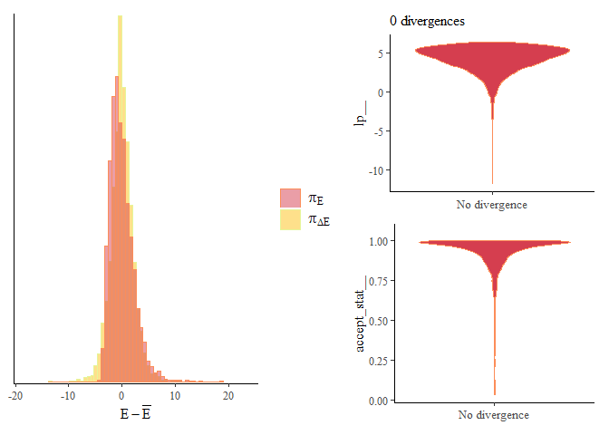<!-- -->

We have no divergences, and the algorithm seems to explore the energy
levels well.

### Prior Sensitivity Analysis

Next, we should check whether our choice of priors disproportionately
affects our results. We will use package *priorsense* for that purpose.
The package investigates the perturbation of priors
$p(\theta) \rightarrow p(\theta)^\alpha$ and likelihoods
$p(y \mid \theta) \rightarrow p(y \mid \theta)^\alpha$ on the result;
see
<https://cran.r-project.org/web/packages/priorsense/vignettes/powerscaling.html>
for details.

    ## Sensitivity based on cjs_dist
    ## Prior selection: all priors
    ## Likelihood selection: all data
    ## 
    ##          variable prior likelihood diagnosis
    ##       b_Intercept 0.000      0.145         -
    ##  b_neocortex.perc 0.000      0.146         -
    ##         b_logmass 0.001      0.177         -
    ##             sigma 0.001      0.361         -

The result indicates no problems. We can visualize the effect of
perturbations as follows.

``` r
powerscale_plot_dens(milk_lr, variable = c('b_Intercept', 'b_neocortex.perc', 'b_logmass', 'sigma'), side_plots = FALSE, help_text = FALSE)
```

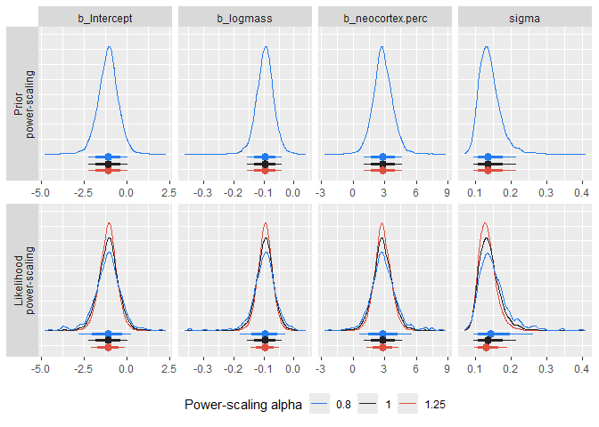<!-- -->

We observe that perturbations to the priors have almost no effect on the
estimates.

### Posterior Predictive Checking

Let us perform posterior predictive checking next. First, we generate a
new dataset from the posterior distribution.

``` r
y_sim <- posterior_predict(milk_lr)
dim(y_sim)
```

    ## [1] 4000   17

We can check the overall distribution of the data.

``` r
ppc_dens_overlay(get_y(milk_lr), y_sim[1:250,])
```

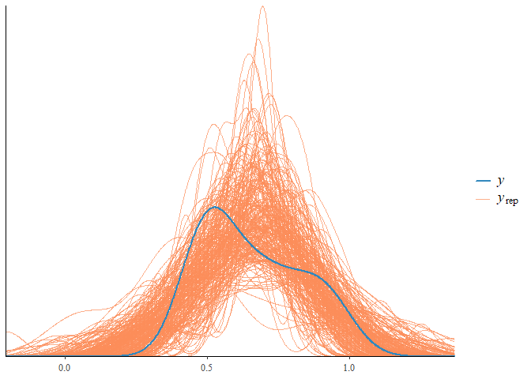<!-- -->

``` r
p1 <- ppc_stat(get_y(milk_lr), y_sim, stat="min")
p2 <- ppc_stat(get_y(milk_lr), y_sim, stat="max")
p3 <- ppc_stat(get_y(milk_lr), y_sim, stat="iqr")
(p1 + p2 + p3) + plot_layout(ncol = 3)
```

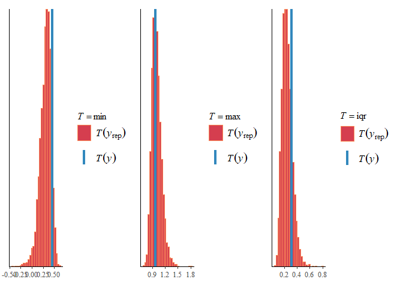<!-- -->

These are less useful for regression models, since the outcome
distributions vary with covariate values. Hence, let us look at the PIT
values. The non-cross-validated PITs are as follows.

``` r
pit_values <- numeric(length(get_y(milk_lr)))
for (i in 1:length(get_y(milk_lr))) {
  pit_values[i] <- mean(y_sim[, i] <= get_y(milk_lr)[i]) # we average over the generated datasets
}

ggplot(data.frame(pit = pit_values), aes(x = pit)) +
  geom_histogram(breaks = seq(0, 1, by = 0.1), color = "black", fill = "lightblue") +
  theme_minimal() +
  labs(title = '', x = 'PIT Values', y = 'Frequency')
```

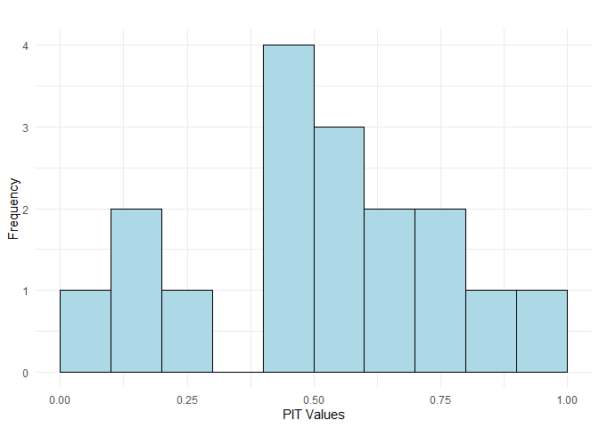<!-- -->

We need to remember that we have only 17 observations, so the uniformity
of the PIT values might not appear as strong. Let us also compute the
LOO-PIT values.

``` r
loo_fit <- loo(milk_lr, save_psis = TRUE, moment_match = TRUE)
loo_fit
```

    ## 
    ## Computed from 4000 by 17 log-likelihood matrix.
    ## 
    ##          Estimate  SE
    ## elpd_loo      8.2 2.7
    ## p_loo         3.3 0.9
    ## looic       -16.5 5.3
    ## ------
    ## MCSE of elpd_loo is 0.1.
    ## MCSE and ESS estimates assume MCMC draws (r_eff in [0.5, 1.0]).
    ## 
    ## All Pareto k estimates are good (k < 0.7).
    ## See help('pareto-k-diagnostic') for details.

We observe no problems with Pareto Smoothed Importance Sampling.

``` r
psis_object <- loo_fit$psis_object
lw <- weights(psis_object)

p1 <- ppc_loo_pit_overlay(get_y(milk_lr), y_sim, lw = lw)
p2 <- ppc_loo_pit_qq(get_y(milk_lr), y_sim, lw = lw)
p3 <- ppc_loo_pit_ecdf(get_y(milk_lr), y_sim, lw = lw, plot_diff = TRUE)
p4 <- ppc_loo_intervals(get_y(milk_lr), y_sim, psis_object = psis_object, prob = 0.75, prob_outer = 0.99)


(p1 + p2 + p3 + p4) + plot_layout(ncol = 2)
```

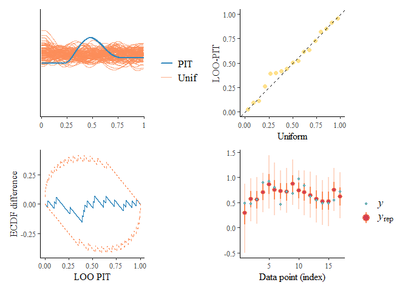<!-- -->

We indeed observe that the PIT values are not far from those of some
simulations of a uniform distribution with 17 samples. Overall, we
observe no major issues.

In frequentist modeling, we usually use residuals to diagnose the model.
We can extract posterior residuals as follows.

``` r
residuals(milk_lr, summary = TRUE)
```

    ##           Estimate Est.Error        Q2.5      Q97.5
    ##  [1,]  0.101147170 0.1720854 -0.23006155 0.44211164
    ##  [2,] -0.088376779 0.1485584 -0.37855427 0.20788576
    ##  [3,]  0.007217101 0.1515965 -0.29540092 0.30802802
    ##  [4,]  0.177105257 0.1476930 -0.10590279 0.47917069
    ##  [5,]  0.044858906 0.1593777 -0.27668748 0.35389426
    ##  [6,]  0.039159591 0.1569586 -0.28208776 0.35283024
    ##  [7,] -0.245786765 0.1515491 -0.54844377 0.05105903
    ##  [8,] -0.000978065 0.1554828 -0.31817628 0.30537373
    ##  [9,] -0.145987939 0.1544410 -0.45662351 0.15899240
    ## [10,]  0.203447431 0.1491960 -0.09338863 0.49811020
    ## [11,]  0.118442081 0.1539266 -0.19255321 0.42842091
    ## [12,] -0.020141637 0.1458572 -0.30558049 0.26702421
    ## [13,] -0.020270095 0.1535122 -0.32565984 0.28184269
    ## [14,] -0.029676694 0.1581462 -0.34155881 0.28727494
    ## [15,] -0.036768961 0.1560769 -0.34711828 0.27473009
    ## [16,] -0.161439375 0.1552663 -0.46760524 0.15598911
    ## [17,]  0.072964397 0.1580097 -0.23474507 0.39698181

Similar to PIT values, we can use Pareto Smoothed Importance Sampling to
compute LOO (expected) posterior residuals.

``` r
lood_ypred <- loo_epred(milk_lr)

qqnorm(lood_ypred[,]-get_y(milk_lr))
qqline(lood_ypred[,]-get_y(milk_lr))
```

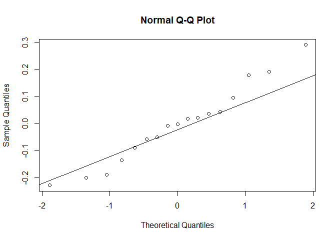<!-- -->

We observe that the residuals are approximately normal as expected. We
should note that we do not have compute just expected values. We can,
for example, get LOO quantiles as follows.

``` r
quantiles_loo <- loo_predict(
  object = milk_lr,
  type = "quantile",
  probs = c(0.05, 0.95)
)

quantiles_loo
```

    ##                q5       q95
    ##  [1,] -0.09229347 0.6187314
    ##  [2,]  0.31299214 0.8106118
    ##  [3,]  0.30389089 0.8031672
    ##  [4,]  0.46456174 0.9233929
    ##  [5,]  0.59063144 1.1468308
    ##  [6,]  0.47457810 1.0252669
    ##  [7,]  0.54522526 0.9660032
    ##  [8,]  0.44304491 0.9720811
    ##  [9,]  0.61012023 1.1174100
    ## [10,]  0.51210209 0.9717023
    ## [11,]  0.45487732 0.9598050
    ## [12,]  0.37995395 0.8917534
    ## [13,]  0.30917861 0.8276051
    ## [14,]  0.24630846 0.7994156
    ## [15,]  0.25583526 0.7856245
    ## [16,]  0.50467069 0.9968952
    ## [17,]  0.36066414 0.8931009

## Sleep Study Dataset

The next dataset we will consider here is the Sleep Study Dataset from
<https://rdrr.io/cran/lme4/man/sleepstudy.html> based on (Belenky et al.
2003).

``` r
data("sleepstudy", package = "lme4")
head(sleepstudy)
```

    ##   Reaction Days Subject
    ## 1 249.5600    0     308
    ## 2 258.7047    1     308
    ## 3 250.8006    2     308
    ## 4 321.4398    3     308
    ## 5 356.8519    4     308
    ## 6 414.6901    5     308

The study investigated the effect of sleep deprivation on reaction
times. We will ignore the first two days (days 0 and 1 were adaptation
and training, see <https://rdrr.io/cran/lme4/man/sleepstudy.html>).

``` r
sleepstudy <- sleepstudy[sleepstudy$Days>=2,]
sleepstudy
```

    ##     Reaction Days Subject
    ## 3   250.8006    2     308
    ## 4   321.4398    3     308
    ## 5   356.8519    4     308
    ## 6   414.6901    5     308
    ## 7   382.2038    6     308
    ## 8   290.1486    7     308
    ## 9   430.5853    8     308
    ## 10  466.3535    9     308
    ## 13  202.9778    2     309
    ## 14  204.7070    3     309
    ## 15  207.7161    4     309
    ## 16  215.9618    5     309
    ## 17  213.6303    6     309
    ## 18  217.7272    7     309
    ## 19  224.2957    8     309
    ## 20  237.3142    9     309
    ## 23  234.3200    2     310
    ## 24  232.8416    3     310
    ## 25  229.3074    4     310
    ## 26  220.4579    5     310
    ## 27  235.4208    6     310
    ## 28  255.7511    7     310
    ## 29  261.0125    8     310
    ## 30  247.5153    9     310

The dataset contains repeated measurements for particular subjects;
hence, we need to use a hierarchical model. We will consider a *random
slope model*.

``` r
sleep_lr <- brm(Reaction ~ Days + (Days|Subject), family = gaussian(), data = sleepstudy, refresh = 0, silent = 2, save_pars = save_pars(all = TRUE), seed = 123)
```

Let us check the priors.

``` r
prior_summary(sleep_lr)
```

    ##                      prior     class      coef   group resp dpar nlpar lb ub
    ##                     (flat)         b                                        
    ##                     (flat)         b      Days                              
    ##  student_t(3, 303.2, 65.5) Intercept                                        
    ##       lkj_corr_cholesky(1)         L                                        
    ##       lkj_corr_cholesky(1)         L           Subject                      
    ##      student_t(3, 0, 65.5)        sd                                    0   
    ##      student_t(3, 0, 65.5)        sd           Subject                  0   
    ##      student_t(3, 0, 65.5)        sd      Days Subject                  0   
    ##      student_t(3, 0, 65.5)        sd Intercept Subject                  0   
    ##      student_t(3, 0, 65.5)     sigma                                    0   
    ##  tag       source
    ##           default
    ##      (vectorized)
    ##           default
    ##           default
    ##      (vectorized)
    ##           default
    ##      (vectorized)
    ##      (vectorized)
    ##      (vectorized)
    ##           default

Again, the value 303.2 corresponds to the median response. The value
65.5 is the median absolute deviation (MAD) of the response.

``` r
median(sleepstudy$Reaction)
```

    ## [1] 303.2256

``` r
mad(sleepstudy$Reaction)
```

    ## [1] 65.45657

Our model is as follows.

``` math
\begin{align*}
\text{Reaction} &\sim N(\mu, \sigma^2)\\
\mu &= \alpha + \alpha_{\text{Subject}} + \beta \cdot \text{Days} + \beta_{\text{Subject}}\cdot \text{Days}\\
\\
&\text{Population Level:}\\
\alpha &\sim \text{Student}_3(303.2, 65.5)\\
\beta & \sim 1\\
\sigma & \sim  \text{Half-Student}_3(0, 2.5)\\
\\
&\text{Group Level:}\\
\begin{bmatrix}
\alpha_{\text{Subject}}  \\
\beta_{\text{Subject}}
\end{bmatrix} & \sim N (0, \Sigma) \\


\Sigma  & = \left(\begin{array}{cc}\sigma_\alpha & 0 \\ 0 & \sigma_\beta\end{array}\right) Q_{\alpha,\beta} \left(\begin{array}{cc}\sigma_\alpha & 0 \\ 0 & \sigma_\beta\end{array}\right) \\\\
\sigma_\alpha &\sim \text{Half-Student}_3(0, 65.5)\\
\sigma_\beta &\sim \text{Half-Student}_3(0, 65.5)\\
Q_{\alpha,\beta} & \sim \mathrm{LKJ}(1)
\end{align*}
```

We can split the model into a population level, which corresponds to
ordinary linear regression, and a group level (i.e., **Subject** level),
which models the effect of each individual. The model corresponds to a
*random effects model*, which we know from frequentist statistics, and
it is called a random-slope model because the individual effects
influence both the intercept and the slopes.

LKJ stands for *Lewandowski-Kurowicka-Joe distribution*
(<https://mc-stan.org/docs/2_18/functions-reference/lkj-correlation.html>)
of random positive definite symmetric matrices with unit diagonals ,
i.e., it is used to generate a random correlation matrix. The
distribution depends on parameter $\eta$: it favors a near identity
matrix for $\eta >1$ (it favors weak correlations), and it favors
strong/extreme correlations for $0 <\eta <1$. For $\eta = 1$, the
distribution is uniform.

Since we are dealing with 2x2 matrices, we can rewrite the priors on
variance terms as follows.

``` math
\begin{align*}
\Sigma  & = \left(\begin{array}{cc}\sigma_\alpha^2 & \rho \sigma_\alpha\sigma_\beta \\ \rho \sigma_\alpha\sigma_\beta  & \sigma_\beta^2\end{array}\right) \\\\
\sigma_\alpha &\sim \text{Half-Student}_3(0, 65.5)\\
\sigma_\beta &\sim \text{Half-Student}_3(0, 65.5)\\
\rho &\sim U(-1,1)
\end{align*}
```

In general, we would get the following distribution for $\rho$.

``` math
p(\rho) \propto (1-\rho^2)^{\eta-1}
```

Let us plot the LKJ densities for 2x2 matrices.

``` r
library(rethinking)
library(tidyr)

eta <- c(0.25, 0.5, 0.75, 0.5, 1, 3, 5, 8)
n_sample <- 100000

samples = matrix(0, n_sample, length(eta))


 for (i in 1:length(eta)) {
   
   samples[,i] = rlkjcorr(n = n_sample, K = 2, eta = eta[i])[,1,2]
   
 }


colnames(samples) <- eta

data_long <- as.data.frame(samples) %>%
  pivot_longer(cols = everything(), names_to = "Eta", values_to = "LKJ Density")


ggplot(data_long, aes(x = `LKJ Density`, fill = Eta)) +
  geom_density(alpha = 0.4, bounds = c(-1, 1)) + 
  theme_minimal() +
  labs(x = "Correlation", y = "LKJ Density")
```

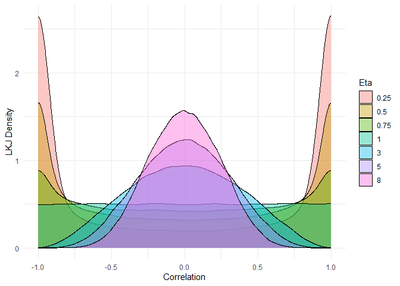<!-- -->

Let us check the results of the fit.

``` r
summary(sleep_lr)
```

    ##  Family: gaussian 
    ##   Links: mu = identity 
    ## Formula: Reaction ~ Days + (Days | Subject) 
    ##    Data: sleepstudy (Number of observations: 144) 
    ##   Draws: 4 chains, each with iter = 2000; warmup = 1000; thin = 1;
    ##          total post-warmup draws = 4000
    ## 
    ## Multilevel Hyperparameters:
    ## ~Subject (Number of levels: 18) 
    ##                     Estimate Est.Error l-95% CI u-95% CI Rhat Bulk_ESS Tail_ESS
    ## sd(Intercept)          32.15      9.71    15.07    52.80 1.00     1185     1148
    ## sd(Days)                7.25      1.79     4.34    11.29 1.00     1434     2410
    ## cor(Intercept,Days)    -0.11      0.33    -0.66     0.63 1.00      983     1614
    ## 
    ## Regression Coefficients:
    ##           Estimate Est.Error l-95% CI u-95% CI Rhat Bulk_ESS Tail_ESS
    ## Intercept   245.00      9.55   225.67   263.63 1.00     3063     2455
    ## Days         11.36      1.98     7.28    15.27 1.00     1832     1848
    ## 
    ## Further Distributional Parameters:
    ##       Estimate Est.Error l-95% CI u-95% CI Rhat Bulk_ESS Tail_ESS
    ## sigma    26.09      1.83    22.94    30.12 1.00     2537     2950
    ## 
    ## Draws were sampled using sampling(NUTS). For each parameter, Bulk_ESS
    ## and Tail_ESS are effective sample size measures, and Rhat is the potential
    ## scale reduction factor on split chains (at convergence, Rhat = 1).

We can compare the Bayesian model with its frequentist counterpart.

``` r
library(lme4)
lmer_model <- lmer(Reaction ~ Days + (Days|Subject), sleepstudy)
summary(lmer_model)
```

    ## Linear mixed model fit by REML ['lmerMod']
    ## Formula: Reaction ~ Days + (Days | Subject)
    ##    Data: sleepstudy
    ## 
    ## REML criterion at convergence: 1404.1
    ## 
    ## Scaled residuals: 
    ##     Min      1Q  Median      3Q     Max 
    ## -4.0157 -0.3541  0.0069  0.4681  5.0732 
    ## 
    ## Random effects:
    ##  Groups   Name        Variance Std.Dev. Corr 
    ##  Subject  (Intercept) 992.69   31.507        
    ##           Days         45.77    6.766   -0.25
    ##  Residual             651.59   25.526        
    ## Number of obs: 144, groups:  Subject, 18
    ## 
    ## Fixed effects:
    ##             Estimate Std. Error t value
    ## (Intercept)  245.097      9.260  26.468
    ## Days          11.435      1.845   6.197
    ## 
    ## Correlation of Fixed Effects:
    ##      (Intr)
    ## Days -0.454

Again, the results are pretty similar.

For a reason that will become obvious soon, let us check the model’s
predictions.

``` r
loo_fit <- loo(sleep_lr, save_psis = TRUE, moment_match = TRUE)
loo_fit
```

    ## 
    ## Computed from 4000 by 144 log-likelihood matrix.
    ## 
    ##          Estimate   SE
    ## elpd_loo   -693.6 22.1
    ## p_loo        32.5  9.4
    ## looic      1387.3 44.3
    ## ------
    ## MCSE of elpd_loo is NA.
    ## MCSE and ESS estimates assume MCMC draws (r_eff in [0.4, 1.2]).
    ## 
    ## Pareto k diagnostic values:
    ##                          Count Pct.    Min. ESS
    ## (-Inf, 0.7]   (good)     143   99.3%   88      
    ##    (0.7, 1]   (bad)        0    0.0%   <NA>    
    ##    (1, Inf)   (very bad)   1    0.7%   <NA>    
    ## See help('pareto-k-diagnostic') for details.

We notice that Pareto diagnostics for one observation remain poor, even
after moment matching. Hence, we need to evaluate LOO for this
observation directly.

``` r
sleep_lr <- add_criterion(sleep_lr, criterion = "loo", save_psis = TRUE, reloo = TRUE)
```

``` r
sleep_lr$criteria$loo
```

    ## 
    ## Computed from 4000 by 144 log-likelihood matrix.
    ## 
    ##          Estimate   SE
    ## elpd_loo   -693.9 22.3
    ## p_loo        32.8  9.6
    ## looic      1387.9 44.7
    ## ------
    ## MCSE of elpd_loo is 0.6.
    ## MCSE and ESS estimates assume MCMC draws (r_eff in [0.4, 1.2]).
    ## 
    ## All Pareto k estimates are good (k < 0.7).
    ## See help('pareto-k-diagnostic') for details.

Let us check the posterior predictions.

``` r
y_sim <- posterior_predict(sleep_lr)
psis_object <- sleep_lr$criteria$loo$psis_object
lw <- weights(psis_object)

ppc_loo_intervals(get_y(sleep_lr), y_sim, psis_object = psis_object, prob = 0.75, prob_outer = 0.99)
```

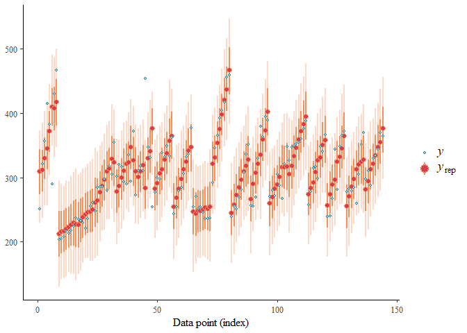<!-- -->

We observe some outliers in the normal model. Consequently, the
Student’s distribution of errors might be more appropriate for this
dataset.

``` r
sleep_lr_student <- brm(Reaction ~ Days + (Days|Subject), family = student(), data = sleepstudy, refresh = 0, silent = 2, seed = 123)
```

``` r
prior_summary(sleep_lr_student)
```

    ##                      prior     class      coef   group resp dpar nlpar lb ub
    ##                     (flat)         b                                        
    ##                     (flat)         b      Days                              
    ##  student_t(3, 303.2, 65.5) Intercept                                        
    ##       lkj_corr_cholesky(1)         L                                        
    ##       lkj_corr_cholesky(1)         L           Subject                      
    ##              gamma(2, 0.1)        nu                                    1   
    ##      student_t(3, 0, 65.5)        sd                                    0   
    ##      student_t(3, 0, 65.5)        sd           Subject                  0   
    ##      student_t(3, 0, 65.5)        sd      Days Subject                  0   
    ##      student_t(3, 0, 65.5)        sd Intercept Subject                  0   
    ##      student_t(3, 0, 65.5)     sigma                                    0   
    ##  tag       source
    ##           default
    ##      (vectorized)
    ##           default
    ##           default
    ##      (vectorized)
    ##           default
    ##           default
    ##      (vectorized)
    ##      (vectorized)
    ##      (vectorized)
    ##           default

Our model is now as follows.

``` math
\begin{align*}
\text{Reaction} &\sim \text{Student}_\nu(\mu, \sigma)\\
\mu &= \alpha + \alpha_{\text{Subject}} + \beta \cdot \text{Days} + \beta_{\text{Subject}}\cdot \text{Days}\\
\\
&\text{Population Level:}\\
\alpha &\sim \text{Student}_3(303.2, 65.5)\\
\beta & \sim 1\\
\nu & \sim \text{Gamma}(2, 0.1)\\
\sigma & \sim  \text{Half-Student}_3(0, 2.5)\\
\\
&\text{Group Level:}\\
\begin{bmatrix}
\alpha_{\text{Subject}}  \\
\beta_{\text{Subject}}
\end{bmatrix} & \sim N (0, \Sigma) \\


\Sigma  & = \left(\begin{array}{cc}\sigma_\alpha & 0 \\ 0 & \sigma_\beta\end{array}\right) Q_{\alpha,\beta} \left(\begin{array}{cc}\sigma_\alpha & 0 \\ 0 & \sigma_\beta\end{array}\right) \\\\
\sigma_\alpha &\sim \text{Half-Student}_3(0, 65.5)\\
\sigma_\beta &\sim \text{Half-Student}_3(0, 65.5)\\
Q_{\alpha,\beta} & \sim \mathrm{LKJ}(1)
\end{align*}
```

``` r
summary(sleep_lr_student)
```

    ##  Family: student 
    ##   Links: mu = identity 
    ## Formula: Reaction ~ Days + (Days | Subject) 
    ##    Data: sleepstudy (Number of observations: 144) 
    ##   Draws: 4 chains, each with iter = 2000; warmup = 1000; thin = 1;
    ##          total post-warmup draws = 4000
    ## 
    ## Multilevel Hyperparameters:
    ## ~Subject (Number of levels: 18) 
    ##                     Estimate Est.Error l-95% CI u-95% CI Rhat Bulk_ESS Tail_ESS
    ## sd(Intercept)          39.99      8.36    26.83    58.94 1.00     1430     2244
    ## sd(Days)                8.36      1.73     5.62    12.40 1.00     1186     1257
    ## cor(Intercept,Days)    -0.30      0.24    -0.69     0.20 1.00      948     1770
    ## 
    ## Regression Coefficients:
    ##           Estimate Est.Error l-95% CI u-95% CI Rhat Bulk_ESS Tail_ESS
    ## Intercept   245.22     10.17   224.77   265.12 1.00     1423     2010
    ## Days         11.65      2.13     7.31    15.82 1.00     1074     1555
    ## 
    ## Further Distributional Parameters:
    ##       Estimate Est.Error l-95% CI u-95% CI Rhat Bulk_ESS Tail_ESS
    ## sigma    12.22      1.73     9.03    15.73 1.00     2051     2716
    ## nu        2.62      0.76     1.50     4.35 1.00     3357     2379
    ## 
    ## Draws were sampled using sampling(NUTS). For each parameter, Bulk_ESS
    ## and Tail_ESS are effective sample size measures, and Rhat is the potential
    ## scale reduction factor on split chains (at convergence, Rhat = 1).

We can compare our normal model for errors with Student’s distribution.

``` r
library(extraDistr)

x <- seq(-200, 200, length.out = 200)
y_norm <- dnorm(x, mean  = 0, sd = 26.09)
y_t <- dlst(x, mu = 0, sigma = 12.22, df = 2.62)

ggplot() + geom_line(aes(x = x, y = y_t,colour="Student's Model"), linewidth = 1) + geom_line(aes(x = x, y = y_norm,colour="Normal Model"), linewidth = 1) + scale_color_manual(name = "Posterior of Errors", values = c("Student's Model" = "red", "Normal Model" = "blue"))
```

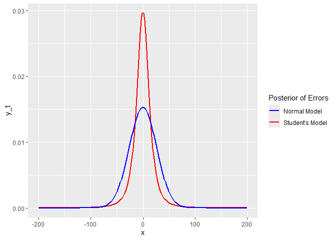<!-- -->

We observe that the shift to a Student’s distribution yielded a much
narrower distribution of errors overall (the variance of the normal
model is much more influenced by extreme observations).

``` r
loo_fit <- loo(sleep_lr_student, save_psis = TRUE)
loo_fit
```

    ## 
    ## Computed from 4000 by 144 log-likelihood matrix.
    ## 
    ##          Estimate   SE
    ## elpd_loo   -652.4 14.1
    ## p_loo        43.2  3.6
    ## looic      1304.9 28.2
    ## ------
    ## MCSE of elpd_loo is 0.2.
    ## MCSE and ESS estimates assume MCMC draws (r_eff in [0.4, 1.3]).
    ## 
    ## All Pareto k estimates are good (k < 0.7).
    ## See help('pareto-k-diagnostic') for details.

``` r
y_sim <- posterior_predict(sleep_lr_student)
psis_object <- loo_fit$psis_object
lw <- weights(psis_object)
ppc_loo_intervals(get_y(sleep_lr_student), y_sim, psis_object = psis_object, prob = 0.75, prob_outer = 0.99)
```

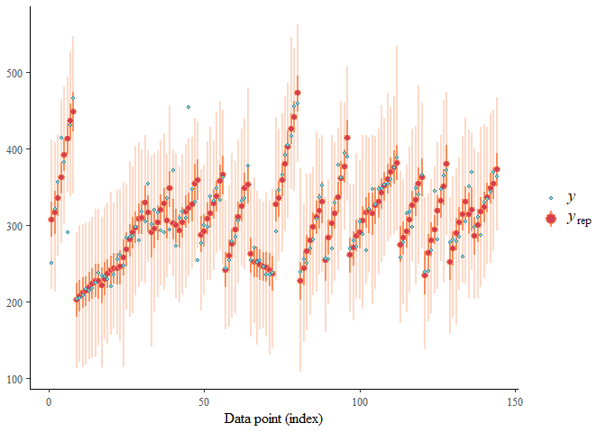<!-- -->

### MCMC diagnostics

Let us quickly go through the remaining diagnostics. MCMC diagnostics
are first.

``` r
sleep_lr_student |>
  as_draws_df() |>
  select(.chain, .iteration, .draw, b_Intercept, b_Days, sd_Subject__Intercept, sd_Subject__Days, cor_Subject__Intercept__Days, sigma, nu, lp__) |>
  summarise_draws()
```

    ## # A tibble: 8 × 10
    ##   variable           mean   median     sd   mad       q5      q95  rhat ess_bulk
    ##   <chr>             <dbl>    <dbl>  <dbl> <dbl>    <dbl>    <dbl> <dbl>    <dbl>
    ## 1 b_Intercept     245.     245.    10.2   9.75   229.     262.     1.00    1423.
    ## 2 b_Days           11.7     11.7    2.13  2.02     8.03    15.1    1.00    1074.
    ## 3 sd_Subject__I…   40.0     38.9    8.36  7.95    28.4     55.2    1.00    1430.
    ## 4 sd_Subject__D…    8.36     8.15   1.73  1.57     5.93    11.5    1.00    1186.
    ## 5 cor_Subject__…   -0.299   -0.323  0.236 0.242   -0.645    0.128  1.00     948.
    ## 6 sigma            12.2     12.2    1.73  1.76     9.48    15.1    1.00    2051.
    ## 7 nu                2.62     2.51   0.759 0.661    1.65     3.98   1.00    3357.
    ## 8 lp__           -693.    -693.     6.67  6.65  -705.    -683.     1.00     697.
    ## # ℹ 1 more variable: ess_tail <dbl>

``` r
p1 <-mcmc_rank_overlay(as_draws_df(sleep_lr_student), pars = 'b_Intercept', n_bins  = 25)
p2 <-mcmc_rank_overlay(as_draws_df(sleep_lr_student), pars = 'b_Days', n_bins  = 25)
p3 <-mcmc_rank_overlay(as_draws_df(sleep_lr_student), pars = 'sd_Subject__Intercept', n_bins  = 25)
p4 <-mcmc_rank_overlay(as_draws_df(sleep_lr_student), pars = 'sd_Subject__Days', n_bins  = 25)
(p1 + p2 + p3 + p4) + plot_layout(ncol = 2)
```

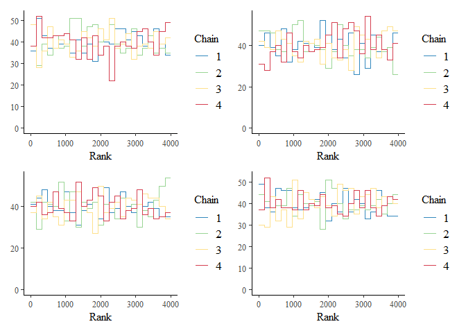<!-- -->

``` r
p1 <-mcmc_rank_overlay(as_draws_df(sleep_lr_student), pars = 'cor_Subject__Intercept__Days', n_bins  = 25)
p2 <-mcmc_rank_overlay(as_draws_df(sleep_lr_student), pars = 'sigma', n_bins  = 25)
p3 <-mcmc_rank_overlay(as_draws_df(sleep_lr_student), pars = 'nu', n_bins  = 25)
p4 <-mcmc_rank_overlay(as_draws_df(sleep_lr_student), pars = 'lp__', n_bins  = 25)
(p1 + p2 + p3 + p4) + plot_layout(ncol = 2)
```

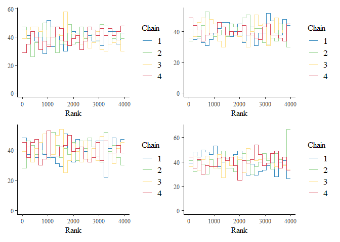<!-- -->

``` r
p1 <- mcmc_rank_ecdf(as_draws_df(sleep_lr_student), pars = 'b_Intercept',plot_diff = TRUE)
p2 <- mcmc_rank_ecdf(as_draws_df(sleep_lr_student), pars = 'b_Days',plot_diff = TRUE)
p3 <- mcmc_rank_ecdf(as_draws_df(sleep_lr_student), pars = 'sd_Subject__Intercept',plot_diff = TRUE)
p4 <- mcmc_rank_ecdf(as_draws_df(sleep_lr_student), pars = 'sd_Subject__Days',plot_diff = TRUE)
(p1 + p2 + p3 + p4) + plot_layout(ncol = 2)
```

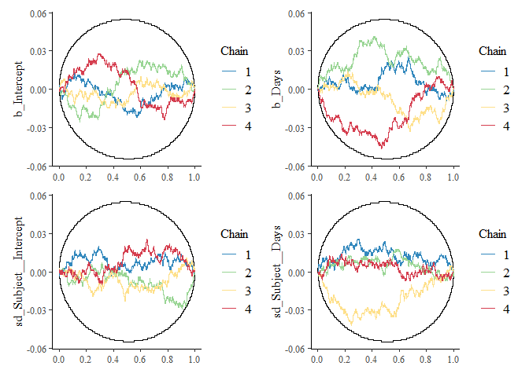<!-- -->

``` r
p1 <- mcmc_rank_ecdf(as_draws_df(sleep_lr_student), pars = 'cor_Subject__Intercept__Days',plot_diff = TRUE)
p2 <- mcmc_rank_ecdf(as_draws_df(sleep_lr_student), pars = 'sigma',plot_diff = TRUE)
p3 <- mcmc_rank_ecdf(as_draws_df(sleep_lr_student), pars = 'nu',plot_diff = TRUE)
p4 <- mcmc_rank_ecdf(as_draws_df(sleep_lr_student), pars = 'lp__',plot_diff = TRUE)
(p1 + p2 + p3 + p4) + plot_layout(ncol = 2)
```

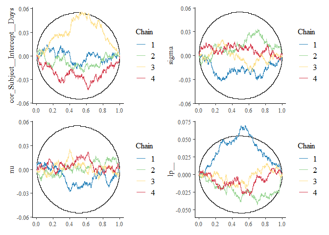<!-- -->

``` r
np <- nuts_params(sleep_lr_student)
p1 <- mcmc_nuts_energy(np, merge_chains = TRUE, bins = 50)
p2 <-mcmc_nuts_divergence(np, log_posterior(sleep_lr_student))

(p1 + p2) + plot_layout(ncol = 2)
```

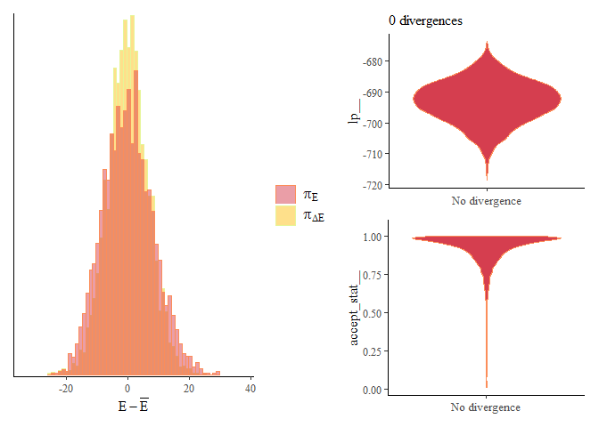<!-- -->

The diagnostics seem pretty good.

### Prior Sensitivity Analysis

Prior sensitivity analysis is next.

``` r
powerscale_sensitivity(sleep_lr_student, variable = c('b_Intercept', 'b_Days', 'sd_Subject__Intercept', 'sd_Subject__Days', 'cor_Subject__Intercept__Days', 'nu', 'sigma'))
```

    ## Sensitivity based on cjs_dist
    ## Prior selection: all priors
    ## Likelihood selection: all data
    ## 
    ##                      variable prior likelihood diagnosis
    ##                   b_Intercept 0.006      0.045         -
    ##                        b_Days 0.003      0.027         -
    ##         sd_Subject__Intercept 0.026      0.105         -
    ##              sd_Subject__Days 0.006      0.058         -
    ##  cor_Subject__Intercept__Days 0.004      0.130         -
    ##                            nu 0.043      0.583         -
    ##                         sigma 0.023      0.611         -

``` r
powerscale_plot_dens(sleep_lr_student, variable = c('b_Intercept', 'b_Days', 'sd_Subject__Intercept', 'sd_Subject__Days'))
```

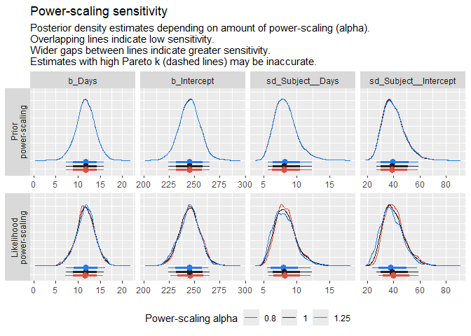<!-- -->

``` r
powerscale_plot_dens(sleep_lr_student, variable = c('cor_Subject__Intercept__Days', 'nu', 'sigma'))
```

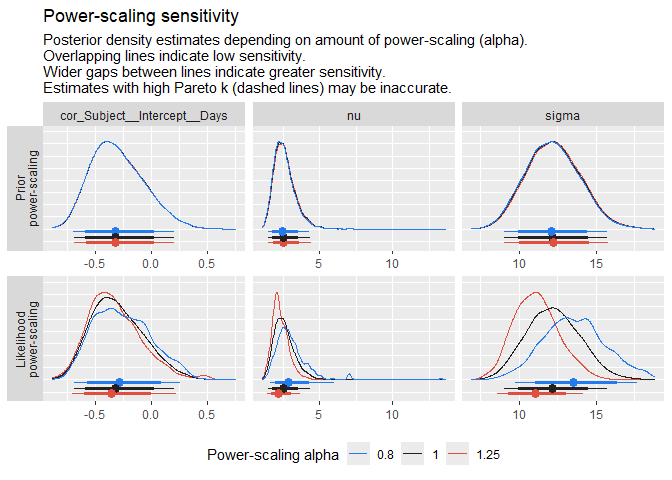<!-- -->

The results seem pretty robust to small perturbations in the priors.

### Posterior Predictive Checking

Lastly, we complete the posterior predictive check.

``` r
y_sim <- posterior_predict(sleep_lr_student)
ppc_dens_overlay(get_y(sleep_lr_student), y_sim[1:250,])
```

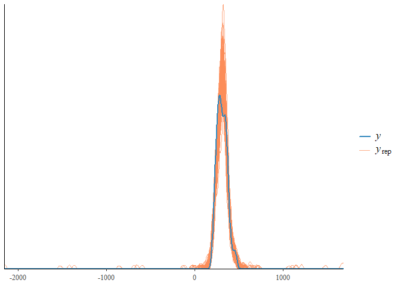<!-- -->

``` r
p1 <- ppc_stat(get_y(sleep_lr_student), y_sim, stat="min")
p2 <- ppc_stat(get_y(sleep_lr_student), y_sim, stat="max")
p3 <- ppc_stat(get_y(sleep_lr_student), y_sim, stat="iqr")
(p1 + p2 + p3) + plot_layout(ncol = 3)
```

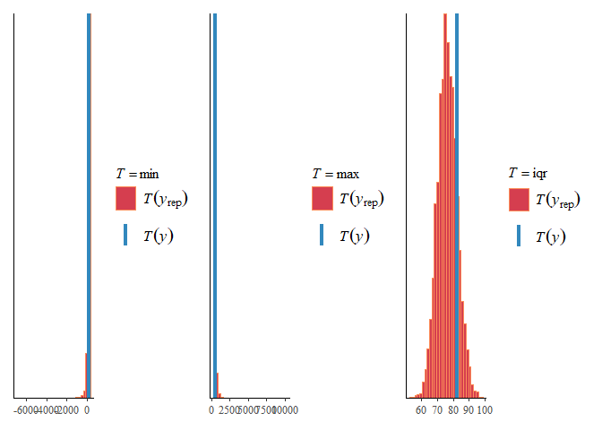<!-- -->

``` r
pit_values <- numeric(length(get_y(sleep_lr_student)))
for (i in 1:length(get_y(sleep_lr_student))) {
  pit_values[i] <- mean(y_sim[, i] <= get_y(sleep_lr_student)[i]) # we average over the generated datasets
}

ggplot(data.frame(pit = pit_values), aes(x = pit)) +
  geom_histogram(breaks = seq(0, 1, by = 0.1), color = "black", fill = "lightblue") +
  theme_minimal() +
  labs(title = '', x = 'PIT Values', y = 'Frequency')
```

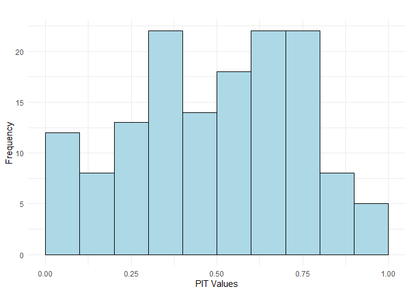<!-- -->

``` r
psis_object <- loo_fit$psis_object
lw <- weights(psis_object)

p1 <- ppc_loo_pit_overlay(get_y(sleep_lr_student), y_sim, lw = lw)
p2 <- ppc_loo_pit_qq(get_y(sleep_lr_student), y_sim, lw = lw)
p3 <- ppc_loo_pit_ecdf(get_y(sleep_lr_student), y_sim, lw = lw, plot_diff = TRUE)
p4 <- ppc_loo_intervals(get_y(sleep_lr_student), y_sim, psis_object = psis_object, prob = 0.75, prob_outer = 0.99)


(p1 + p2 + p3 + p4) + plot_layout(ncol = 2)
```

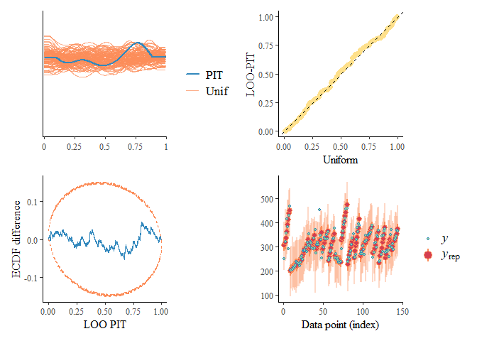<!-- -->

We observe no obvious issues.

``` r
lood_ypred <- loo_epred(sleep_lr_student)

qqnorm(lood_ypred[,]-get_y(sleep_lr_student))
qqline(lood_ypred[,]-get_y(sleep_lr_student))
```

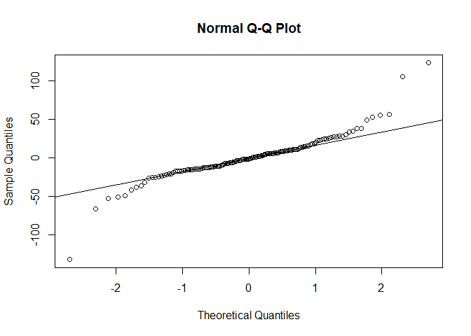<!-- -->

We observe that the residuals indeed have a bit heavier tails, and
hence, Student’s t-distribution seems more appropriate.

``` r
residuals_data <- data.frame(residuals = lood_ypred[,] -get_y(sleep_lr_student))
ggplot(residuals_data, aes(sample = residuals)) +
  stat_qq(distribution = qt, dparams = list(df = 2.62), color = "darkblue", size = 2) +
  stat_qq_line(distribution = qt, dparams =  list(df = 2.62), color = "red", linewidth = 1) +
  labs(
    title = "Student's t-distribution Q-Q Plot",
    x = "Theoretical Quantiles",
    y = "Sample Quantiles"
  ) 
```

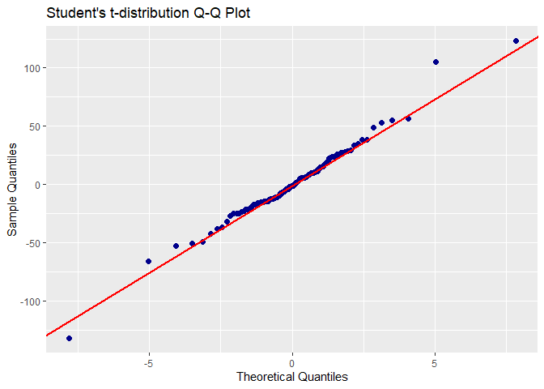<!-- -->

## Stochastic Learning in Dogs Dataset

Lastly, we will consider the Stochastic Learning in Dogs Dataset from
<https://avehtari.github.io/Bayesian-Workflow/dogs/dogs_stan.html> and
<https://github.com/avehtari/Bayesian-Workflow/blob/main/dogs/dogs.R>.
The data come from an experiment in which a dog was shocked if it did
not jump out in time, a few seconds after a light signal went on. After
25 tries, all of the dogs learned to jump and avoid the shock.

``` r
dogs <- read.csv("C:/Users/elini/Desktop/nine circles 3/dogs.csv", sep = ',')
head(dogs)
```

    ##   Dog X0 X1 X2 X3 X4 X5 X6 X7 X8 X9 X10 X11 X12 X13 X14 X15 X16 X17 X18 X19 X20
    ## 1  13  S  S  .  S  .  S  .  .  .  .   .   .   .   .   .   .   .   .   .   .   .
    ## 2  16  S  S  S  S  S  S  S  .  S  S   S   S   S   S   .   .   .   .   .   .   .
    ## 3  17  S  S  S  S  S  .  .  S  .  .   S   S   .   .   S   .   S   .   .   .   .
    ## 4  18  S  .  .  S  S  .  .  .  .  S   .   S   .   S   .   .   .   .   .   .   .
    ## 5  21  S  S  S  S  S  S  S  S  .  .   .   .   .   .   .   .   .   .   .   .   .
    ## 6  27  S  S  S  S  S  S  .  .  .  .   S   S   .   S   .   .   .   .   .   .   .
    ##   X21 X22 X23 X24
    ## 1   .   .   .   .
    ## 2   .   .   .   .
    ## 3   .   .   .   .
    ## 4   .   .   .   .
    ## 5   .   .   .   .
    ## 6   .   .   .   .

The goal here is to model the probability of a shock as a function of
the trial number.

``` r
shock <- ifelse(as.matrix(dogs[, 3:26]) == "S", 1, 0)
shock
```

    ##       X1 X2 X3 X4 X5 X6 X7 X8 X9 X10 X11 X12 X13 X14 X15 X16 X17 X18 X19 X20
    ##  [1,]  1  0  1  0  1  0  0  0  0   0   0   0   0   0   0   0   0   0   0   0
    ##  [2,]  1  1  1  1  1  1  0  1  1   1   1   1   1   0   0   0   0   0   0   0
    ##  [3,]  1  1  1  1  0  0  1  0  0   1   1   0   0   1   0   1   0   0   0   0
    ##  [4,]  0  0  1  1  0  0  0  0  1   0   1   0   1   0   0   0   0   0   0   0
    ##  [5,]  1  1  1  1  1  1  1  0  0   0   0   0   0   0   0   0   0   0   0   0
    ##  [6,]  1  1  1  1  1  0  0  0  0   1   1   0   1   0   0   0   0   0   0   0
    ##  [7,]  1  1  1  1  0  1  1  1  1   1   1   0   0   0   0   0   0   0   0   0
    ##  [8,]  1  1  1  1  1  1  0  0  1   1   0   0   0   0   0   0   0   0   0   0
    ##  [9,]  1  1  1  1  0  1  0  1  0   0   1   0   1   1   1   0   0   0   0   0
    ## [10,]  1  1  1  0  1  1  0  0  1   0   1   0   0   0   0   0   0   0   0   0
    ## [11,]  1  1  1  1  1  1  1  1  1   0   0   0   0   0   0   1   0   0   0   0
    ## [12,]  1  1  1  1  0  0  0  0  0   1   1   0   0   0   0   0   0   0   0   0
    ## [13,]  1  1  0  0  1  0  1  1  0   0   0   0   0   0   0   0   0   0   0   0
    ## [14,]  1  1  1  0  1  0  0  1  0   0   0   0   0   0   0   0   0   0   0   0
    ## [15,]  1  1  0  1  0  0  1  0  0   0   0   0   0   0   0   0   0   0   0   0
    ## [16,]  1  1  1  1  1  1  0  0  0   0   0   0   0   0   0   0   0   0   0   0
    ## [17,]  0  1  0  1  1  1  0  1  0   0   0   0   1   0   0   0   0   0   0   0
    ## [18,]  1  1  1  0  1  0  1  0  0   0   0   0   0   0   0   0   0   0   0   0
    ## [19,]  0  1  1  1  1  0  1  1  1   0   0   0   0   0   0   0   0   0   0   0
    ## [20,]  1  1  1  0  0  1  0  1  0   0   1   0   1   0   0   0   0   0   0   0
    ## [21,]  1  1  0  0  0  0  0  1  0   0   0   0   0   0   0   0   0   0   0   0
    ## [22,]  1  0  1  0  1  0  0  0  0   0   0   0   0   0   0   1   1   0   0   0
    ## [23,]  1  1  1  1  1  1  0  0  0   0   0   0   0   0   0   0   0   0   0   0
    ## [24,]  1  1  1  1  1  1  1  0  0   0   1   0   1   1   1   0   0   1   0   0
    ## [25,]  1  1  1  1  1  0  1  0  0   0   0   1   0   1   0   0   0   0   0   0
    ## [26,]  1  0  1  0  0  0  1  0  0   1   0   0   0   0   0   0   0   0   0   0
    ## [27,]  1  1  1  0  1  0  0  0  0   0   0   0   0   0   0   0   0   0   0   0
    ## [28,]  1  1  0  1  0  1  0  0  0   1   0   1   0   0   0   0   0   0   0   0
    ## [29,]  1  1  1  0  0  1  1  0  0   0   1   0   1   0   1   0   1   0   0   0
    ## [30,]  1  1  1  0  0  0  0  0  0   1   0   1   0   0   0   0   0   0   0   0
    ##       X21 X22 X23 X24
    ##  [1,]   0   0   0   0
    ##  [2,]   0   0   0   0
    ##  [3,]   0   0   0   0
    ##  [4,]   0   0   0   0
    ##  [5,]   0   0   0   0
    ##  [6,]   0   0   0   0
    ##  [7,]   0   0   0   0
    ##  [8,]   0   0   0   0
    ##  [9,]   1   0   0   1
    ## [10,]   0   0   0   0
    ## [11,]   0   0   0   0
    ## [12,]   0   0   0   0
    ## [13,]   0   0   0   0
    ## [14,]   0   0   0   0
    ## [15,]   0   0   0   0
    ## [16,]   0   0   0   0
    ## [17,]   0   0   0   0
    ## [18,]   0   0   0   0
    ## [19,]   0   0   0   0
    ## [20,]   0   0   0   0
    ## [21,]   0   0   0   0
    ## [22,]   0   0   0   0
    ## [23,]   0   0   0   0
    ## [24,]   0   0   0   0
    ## [25,]   0   0   0   0
    ## [26,]   0   0   0   0
    ## [27,]   0   0   0   0
    ## [28,]   0   0   0   0
    ## [29,]   0   0   0   0
    ## [30,]   0   0   0   0

We transform the data into a long format.

``` r
dogs_df <- data.frame(shock = as.numeric(shock), dog = rep(1:nrow(shock), times = ncol(shock)), time = rep(1:ncol(shock), each = nrow(shock)))
head(dogs_df)
```

    ##   shock dog time
    ## 1     1   1    1
    ## 2     1   2    1
    ## 3     1   3    1
    ## 4     0   4    1
    ## 5     1   5    1
    ## 6     1   6    1

This dataset supports hierarchical logistic regression. We will consider
a random intercept model.

``` r
dog_logit <- brm(shock ~ time + (1 | dog), family = bernoulli(), prior(normal(0,1), class = "b"), data = dogs_df, refresh = 0, silent = 2, seed = 123)
```

``` r
prior_summary(dog_logit)
```

    ##                 prior     class      coef group resp dpar nlpar lb ub tag
    ##          normal(0, 1)         b                                          
    ##          normal(0, 1)         b      time                                
    ##  student_t(3, 0, 2.5) Intercept                                          
    ##  student_t(3, 0, 2.5)        sd                                  0       
    ##  student_t(3, 0, 2.5)        sd             dog                  0       
    ##  student_t(3, 0, 2.5)        sd Intercept   dog                  0       
    ##        source
    ##          user
    ##  (vectorized)
    ##       default
    ##       default
    ##  (vectorized)
    ##  (vectorized)

We get the following model.

``` math
\begin{align*}
\text{logit }p &= \alpha + \alpha_{\text{Dog}} + \beta \cdot t\\
\\
&\text{Population Level:}\\
\alpha &\sim \mathrm{Student}_3(0, 2.5)\\
\beta & \sim N(0,1)
\\
&\text{Group Level:}\\
\alpha_{\text{Dog}} &\sim N (0, \sigma_\alpha) \\
\sigma_\alpha &\sim \text{Half-Student}_3(0, 2.5)\\
\end{align*}
```

Again, we can compare the Bayesian model with its non-Bayesian
counterpart.

``` r
summary(dog_logit)
```

    ##  Family: bernoulli 
    ##   Links: mu = logit 
    ## Formula: shock ~ time + (1 | dog) 
    ##    Data: dogs_df (Number of observations: 720) 
    ##   Draws: 4 chains, each with iter = 2000; warmup = 1000; thin = 1;
    ##          total post-warmup draws = 4000
    ## 
    ## Multilevel Hyperparameters:
    ## ~dog (Number of levels: 30) 
    ##               Estimate Est.Error l-95% CI u-95% CI Rhat Bulk_ESS Tail_ESS
    ## sd(Intercept)     0.70      0.18     0.38     1.07 1.00     1500     2326
    ## 
    ## Regression Coefficients:
    ##           Estimate Est.Error l-95% CI u-95% CI Rhat Bulk_ESS Tail_ESS
    ## Intercept     2.06      0.26     1.56     2.59 1.00     4238     3427
    ## time         -0.30      0.02    -0.35    -0.26 1.00     3458     2962
    ## 
    ## Draws were sampled using sampling(NUTS). For each parameter, Bulk_ESS
    ## and Tail_ESS are effective sample size measures, and Rhat is the potential
    ## scale reduction factor on split chains (at convergence, Rhat = 1).

``` r
dog_logit_lmer <- glmer(shock ~ time + (1 | dog), dogs_df, family = binomial)
summary(dog_logit_lmer)
```

    ## Generalized linear mixed model fit by maximum likelihood (Laplace
    ##   Approximation) [glmerMod]
    ##  Family: binomial  ( logit )
    ## Formula: shock ~ time + (1 | dog)
    ##    Data: dogs_df
    ## 
    ##      AIC      BIC   logLik deviance df.resid 
    ##    558.2    571.9   -276.1    552.2      717 
    ## 
    ## Scaled residuals: 
    ##     Min      1Q  Median      3Q     Max 
    ## -2.4424 -0.4035 -0.1548  0.4094  8.1230 
    ## 
    ## Random effects:
    ##  Groups Name        Variance Std.Dev.
    ##  dog    (Intercept) 0.4274   0.6537  
    ## Number of obs: 720, groups:  dog, 30
    ## 
    ## Fixed effects:
    ##             Estimate Std. Error z value Pr(>|z|)    
    ## (Intercept)  2.03347    0.25647   7.929 2.21e-15 ***
    ## time        -0.30037    0.02418 -12.421  < 2e-16 ***
    ## ---
    ## Signif. codes:  0 '***' 0.001 '**' 0.01 '*' 0.05 '.' 0.1 ' ' 1
    ## 
    ## Correlation of Fixed Effects:
    ##      (Intr)
    ## time -0.776

Again, the results are somewhat similar.

### MCMC diagnostics

Let’s go through the diagnostics again.

``` r
dog_logit |>
  as_draws_df() |>
  select(.chain, .iteration, .draw, b_Intercept, b_time, sd_dog__Intercept, lp__) |>
  summarise_draws()
```

    ## # A tibble: 4 × 10
    ##   variable          mean   median     sd    mad       q5      q95  rhat ess_bulk
    ##   <chr>            <dbl>    <dbl>  <dbl>  <dbl>    <dbl>    <dbl> <dbl>    <dbl>
    ## 1 b_Intercept      2.06     2.05  0.262  0.261     1.64     2.50   1.00    4238.
    ## 2 b_time          -0.303   -0.302 0.0240 0.0234   -0.345   -0.264  1.00    3458.
    ## 3 sd_dog__Inte…    0.698    0.690 0.178  0.175     0.423    1.01   1.00    1500.
    ## 4 lp__          -312.    -312.    5.73   5.74   -322.    -304.     1.00    1057.
    ## # ℹ 1 more variable: ess_tail <dbl>

``` r
p1 <-mcmc_rank_overlay(as_draws_df(dog_logit), pars = 'b_Intercept', n_bins  = 25)
p2 <-mcmc_rank_overlay(as_draws_df(dog_logit), pars = 'b_time', n_bins  = 25)
p3 <-mcmc_rank_overlay(as_draws_df(dog_logit), pars = 'sd_dog__Intercept', n_bins  = 25)
p4 <-mcmc_rank_overlay(as_draws_df(dog_logit), pars = 'lp__', n_bins  = 25)
(p1 + p2 + p3 + p4) + plot_layout(ncol = 2)
```

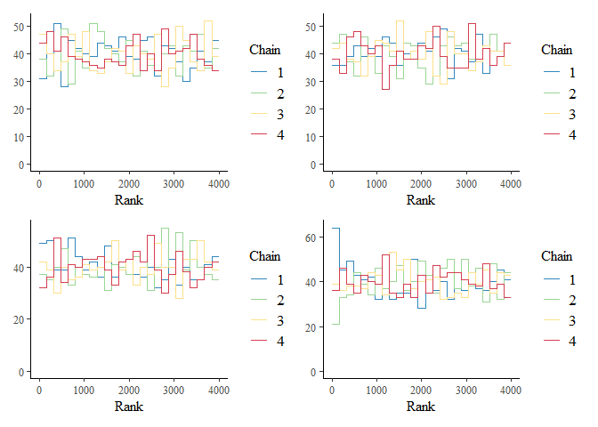<!-- -->

``` r
p1 <- mcmc_rank_ecdf(as_draws_df(dog_logit), pars = 'b_Intercept',plot_diff = TRUE)
p2 <- mcmc_rank_ecdf(as_draws_df(dog_logit), pars = 'b_time',plot_diff = TRUE)
p3 <- mcmc_rank_ecdf(as_draws_df(dog_logit), pars = 'sd_dog__Intercept',plot_diff = TRUE)
p4 <- mcmc_rank_ecdf(as_draws_df(dog_logit), pars = 'lp__',plot_diff = TRUE)
(p1 + p2 + p3 + p4) + plot_layout(ncol = 2)
```

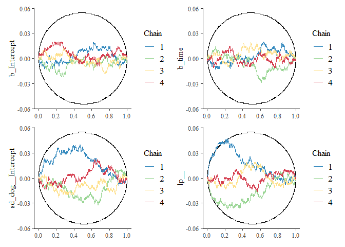<!-- -->

``` r
np <- nuts_params(dog_logit)
p1 <- mcmc_nuts_energy(np, merge_chains = TRUE, bins = 50)
p2 <-mcmc_nuts_divergence(np, log_posterior(dog_logit))

(p1 + p2) + plot_layout(ncol = 2)
```

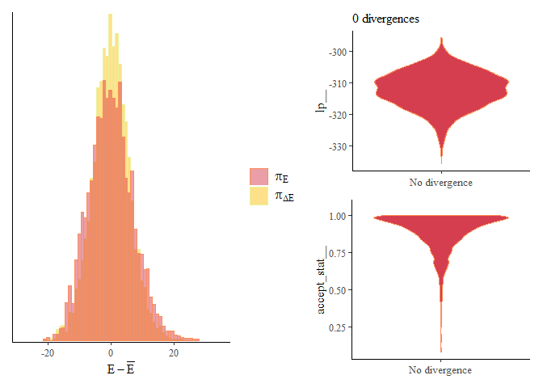<!-- -->

### Prior Sensitivity Analysis

Next, we perform the prior sensitivity analysis.

``` r
powerscale_sensitivity(dog_logit, variable = c('b_Intercept', 'b_time', 'sd_dog__Intercept'))
```

    ## Sensitivity based on cjs_dist
    ## Prior selection: all priors
    ## Likelihood selection: all data
    ## 
    ##           variable prior likelihood diagnosis
    ##        b_Intercept 0.001      0.078         -
    ##             b_time 0.008      0.145         -
    ##  sd_dog__Intercept 0.008      0.316         -

``` r
powerscale_plot_dens(dog_logit, variable = c('b_Intercept', 'b_time', 'sd_dog__Intercept'))
```

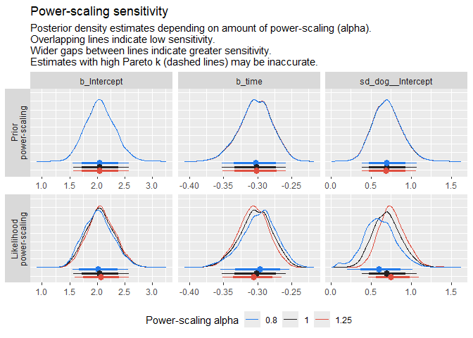<!-- -->

### Posterior Predictive Checking

Posterior predictive checking is a bit trickier for logistic regression
since the response variable is binary. Hence, the PIT scores are not
appropriate. Still, we can compare the simulated datasets with the
observed data.

``` r
y_sim <- posterior_predict(dog_logit)
```

``` r
par(mfrow = c(2, 2))
image(matrix(shock, nrow = 10, byrow = TRUE), col = c("gray", "red"), axes = FALSE)
image(matrix(y_sim[1,], nrow = 10, byrow = TRUE), col = c("gray", "red"), axes = FALSE)
image(matrix(y_sim[2,], nrow = 10, byrow = TRUE), col = c("gray", "red"), axes = FALSE)
image(matrix(y_sim[3,], nrow = 10, byrow = TRUE), col = c("gray", "red"), axes = FALSE)
```

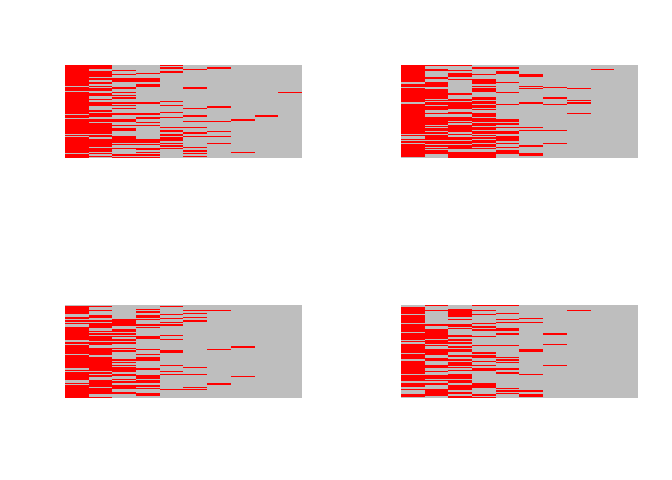<!-- -->

In addition, we can compute LOO predictions and perform similar
diagnostics to those we used for frequentist logistic regression: split
the data into bins according to predicted probability logits and check
the calibration of the model.

``` r
loo_fit <- loo(dog_logit, save_psis = TRUE)
loo_fit
```

    ## 
    ## Computed from 4000 by 720 log-likelihood matrix.
    ## 
    ##          Estimate   SE
    ## elpd_loo   -275.2 14.7
    ## p_loo        19.2  1.2
    ## looic       550.4 29.3
    ## ------
    ## MCSE of elpd_loo is 0.1.
    ## MCSE and ESS estimates assume MCMC draws (r_eff in [0.8, 1.7]).
    ## 
    ## All Pareto k estimates are good (k < 0.7).
    ## See help('pareto-k-diagnostic') for details.

We can use the following calibration check recommended in
<https://avehtari.github.io/Bayesian-Workflow/dogs/dogs_stan.html>.

``` r
library(reliabilitydiag)
rd <- reliabilitydiag(EMOS = loo_epred(dog_logit), y = get_y(dog_logit))
plot_calib_0h <- autoplot(rd) +
        labs(
                x = "Predicted (LOO)",
                y = "Conditional event probabilities"
        )
plot_calib_0h
```

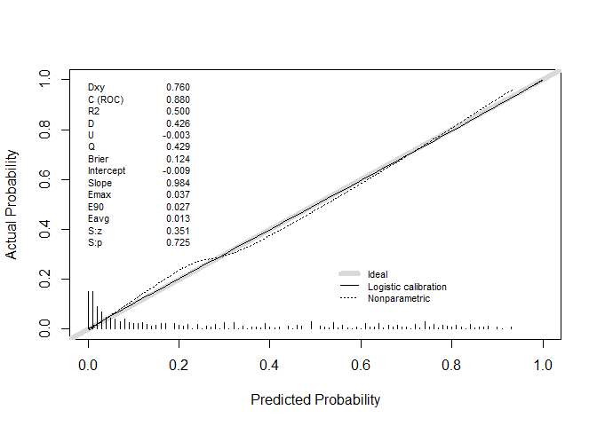<!-- -->

However, we could also employ the tools we used for non-Bayesian
logistic regression.

``` r
library(rms)
loo_ypred <- loo_epred(dog_logit)
val.prob(loo_ypred[,],get_y(dog_logit))
```

<!-- -->

    ##           Dxy       C (ROC)            R2             D      D:Chi-sq 
    ##   0.759708922   0.879854461   0.499712083   0.426345212 307.968552425 
    ##           D:p             U      U:Chi-sq           U:p             Q 
    ##   0.000000000  -0.002714998   0.045201769   0.977652602   0.429060209 
    ##         Brier     Intercept         Slope          Emax           E90 
    ##   0.123772033  -0.009154109   0.983584072   0.037194023   0.027372783 
    ##          Eavg           S:z           S:p 
    ##   0.012921768   0.351344831   0.725329666

We observe that the model appears well-calibrated. In addition, the
discrimination measure (ROC) indicates that the logistic regression
successfully models the dependence of the probability of the shock on
the trial number.

## References

<div id="refs" class="references csl-bib-body hanging-indent"
entry-spacing="0">

<div id="ref-belenky2003patterns" class="csl-entry">

Belenky, Gregory, Nancy J Wesensten, David R Thorne, Maria L Thomas,
Helen C Sing, Daniel P Redmond, Michael B Russo, and Thomas J Balkin.
2003. “Patterns of Performance Degradation and Restoration During Sleep
Restriction and Subsequent Recovery: A Sleep Dose-Response Study.”
*Journal of Sleep Research* 12 (1): 1–12.

</div>

<div id="ref-gelman1995bayesian" class="csl-entry">

Gelman, Andrew, John B Carlin, Hal S Stern, and Donald B Rubin. 1995.
*Bayesian Data Analysis*. Chapman; Hall/CRC.

</div>

<div id="ref-mcelreath2018statistical" class="csl-entry">

McElreath, Richard. 2018. *Statistical Rethinking: A Bayesian Course
with Examples in r and Stan*. Chapman; Hall/CRC.

</div>

<div id="ref-tesso2026loo" class="csl-entry">

Tesso, Herman, and Aki Vehtari. 2026. “LOO-PIT Predictive Model
Checking.” *arXiv Preprint arXiv:2603.02928*.

</div>

</div>
