# The Second Circle: Checking, Evaluating, and Comparing Bayesian Models, Part Three
<big>**Comparing Bayesian Models based on Predictive Performance**</big>

<br/>
Jiří Fejlek

2026-07-15
<br/>

<br/> We conclude *Second Circle: Checking, Evaluating, and Comparing Bayesian
Models* by comparing Bayesian models using estimates of their predictive
accuracy on unseen data. <br/>

## Table of Contents

- [Assessing Predictive Accuracy](#assessing-predictive-accuracy)
  - [Deviance Information Criterion
    (DIC)](#deviance-information-criterion-dic)
  - [Watanabe–Akaike Information Criterion
    (WAIC)](#watanabeakaike-information-criterion-waic)
  - [Leave-One-Out Cross-Validation](#leave-one-out-cross-validation)
- [Roaches Dataset](#roaches-dataset)
  - [Poisson Model](#poisson-model)
    - [Posterior Predictive Check](#posterior-predictive-check)
  - [Negative Binomial Model](#negative-binomial-model)
    - [Model Fit](#model-fit)
  - [Hurdle Model](#hurdle-model)
  - [Zero-inflated Model](#zero-inflated-model)
  - [Model Comparison](#model-comparison)
    - [DIC](#dic)
    - [WAIC](#waic)
    - [LOO Cross-Validation](#loo-cross-validation)  
  - [Diagnostics of Zero-inflated
    Model](#diagnostics-of-zero-inflated-model)
  - [Effect of Treatment](#effect-of-treatment)
- [Clinical Trial Dataset](#clinical-trial-dataset)
  - [Binomial Model](#binomial-model)
  - [Beta-binomial Model](#beta-binomial-model)
  - [Model Diagnostics](#model-diagnostics)
  - [Effect of Treatment](#effect-of-treatment-1)

``` r
library(tidyr)
library(rstan)
library(ggplot2)
library(HDInterval)
library(dplyr)
library(loo)
library(faraway)
library(patchwork)
library(brms)
library(bayesplot)
library(priorsense)
color_scheme_set("brewer-Spectral")
```

We conclude *Second Circle: Checking, Evaluating, and Comparing Bayesian
Models* by comparing Bayesian models using estimates of their predictive
accuracy on unseen data.

## Assessing Predictive Accuracy

Let us assume a statistical model and a prediction of new observations
$\tilde y_1, \ldots, \tilde y_N$. In the standard frequentist statistic,
we have encountered a plethora of measures of predictive accuracy. Let
us assume that our model produces point predictions
$\hat y_1, \ldots, \hat y_N$ (such as linear regression), then we
usually evaluate the predictions in terms of the *mean square error*
(MSE) $\frac{1}{n} \sum (\tilde y_i - \hat y_i)^2$.

Other models produce probabilistic predictions (e.g., logistic
regression). In these cases, we employed so-called scoring rules such as
the *logarithmic score* and the *Brier score* (quadratic score), which
equal $\frac{1}{n}\sum \tilde y_i\log p_i + (1-\tilde y_i)\log(1-p_i)$
and $\frac{1}{n} \sum (y_i-p_i)^2$ for binary response, respectively
($p_i$ denotes the predicted probability of $\tilde y_i = 1$).

In Bayesian modeling, our predictions are based on the posterior density
$p_\text{post}(\theta)$ from which we can compute a prediction for a new
observation $\tilde y_i$ as

``` math
p(\tilde y_i \mid y) =  \int p(\tilde y_i \mid \theta) p_\text{post}(\theta) \text{ d}\theta.
```

These are again probabilistic predictions and hence, we will use again
the logarithmic score for $\tilde y_i$ which here takes the form (Gelman
et al. 1995)

``` math
\log p_\text{post}(\tilde y_i ) =  \log \int p(\tilde y_i \mid \theta)p_\text{post}(\theta)\text{ d}\theta
```

By the way, we can notice that
$\tilde y_i\log p_i + (1-\tilde y_i)\log(1-p_i) = \log p(\tilde y_i)$
under the logistic model so these two definitions of the logarithmic
score correspond to each other.

Now, the value of the new $\tilde y_i$ is itself unknown; it will be
given by the data-generating process, which we characterize by the
distribution $f(\tilde y)$. Thus, we could consider averaging the
logarithmic score over all $\tilde y_i$ we could observe and define
*expected out-of-sample log predictive density* (Gelman et al. 1995)

``` math
\text{ELPD} = \mathbb{E}_f\log p_\text{post}(\tilde y) =  \int \log p_\text{post}(\tilde y) f(\tilde y) \text{ d}\tilde{y}.
```

Naturally, we do not know $f$, nor do we have enough held-out samples
$\tilde y_1, \tilde y_2, \ldots$ lying around to estimate ELPD reliably.
Hence, we could naively consider the so-called *log pointwise predictive
density* (Gelman et al. 1995)

``` math
\text{LPPD} = \sum_{i = 1}^N \log \int p(y_i \mid \theta)p_\text{post}(\theta)\text{ d}\theta,
```

i.e., the logarithmic score for the training data. However, such a
metric is naturally too optimistic an estimate. Thus, we need to
consider *information criteria* and or cross-validation.

### Deviance Information Criterion (DIC)

We will start with the deviance information criterion (DIC), which can
be seen as a Bayesian version of the Akaike information criterion (AIC)
for frequentist models (Gelman et al. 1995). The AIC is based on the
correction of the frequentist analog of LPPD
$\log p(y \mid \hat \theta_\text{MLE}) =  \sum_{i = 1}^N \log p(y_i \mid \hat \theta_\text{MLE})$

``` math
\text{ELPD}_\text{AIC} = \log p(y \mid \hat \theta_\text{MLE}) - k,
```

where $k$ is the number of estimated parameters, i.e., the correction is
the number of parameters that had to be estimated from the data. The AIC
itself is defined as $\text{AIC} = -2\text{ ELPD}_\text{AIC}$ to be on
the same scale as the deviance
``` math
D = -2 \log p(y \mid \hat \theta_\text{MLE}),
```
which we know from various likelihood ratio tests.

Deviance information criterion is defined similarly to AIC (Gelman et
al. 1995) as

``` math
\text{ELPD}_\text{DIC} = \log p(y \mid \hat \theta_\text{Bayes}) - p_\text{DIC},
```

where $\hat \theta_\text{Bayes} = \mathbb{E}(\theta \mid y)$ is the
posterior mean and $p_\text{DIC}$ is the *effective number of
parameters*.

The effective number of parameters is not always simply equal to the
number of parameters in the model; we know, for example, that pooling in
hierarchical models decreases the effective number of parameters. We
also know that regularization causes shrinkage that causes the effective
number of parameters to decrease (e.g., the ridge penalty in ridge
regression or the wiggliness penalty in generalized additive models). In
Bayesian settings, we get these kinds of shrinkage effects by using
appropriate informative priors (e.g. , setting the prior
$\beta \sim N(0, \sigma^2I)$ for small $\sigma$ gets us a Bayesian
analog to the ridge regression).

Overall,the effective number of parameters must be estimated for
Bayesian models. There are two main formulas: the original correction
proposed by (Spiegelhalter et al. 2002)

``` math
p_\text{DIC} = 2\left(\log p(y \mid \hat\theta_\text{Bayes}) - \mathbb{E}_\text{post} (\log p(y \mid \theta))\right)
```

which can be estimated from the posterior samples as

``` math
p_\text{DIC} \approx 2\left(\log p(y \mid \hat\theta_\text{Bayes}) - \frac{1}{S}\sum_{s = 1}^S(\log p(y \mid \theta^s))\right).
```

The second correction is from (Gelman, Hwang, and Vehtari 2014)

``` math
p_\text{DIC, alt} = 2 \text{ var}_\text{post} (\log p(y \mid \theta)).
```

Both of these corrections are asymptotically equivalent. The main
advantage of the second formula is that it is always non-negative,
although it is less numerically stable (Gelman et al. 1995). The actual
criterion is again defined in the deviance scale:
$\text{DIC} = -2\text{ ELPD}_\text{DIC}$.

The main issue with DIC, regardless of the particular variant, is that
it depends on the parameter posterior through a point estimate
$\hat\theta_\text{Bayes}$, so it can be quite unstable.

### Watanabe–Akaike Information Criterion (WAIC)

Watanabe–Akaike information criterion (or Widely applicable information
criterion) (Gelman et al. 1995) is a fully Bayesian version of AIC that
does not depend on singular point estimates. It is again defined as a
correction of LPPD

``` math
\text{ELPD}_\text{WAIC} = \text{LPPD } - p_\text{WAIC},
```

but where the effective number of parameters is estimated from the whole
posterior.

``` math
p_\text{WAIC} = 2 \sum_{i =1}^N\left(\log \mathbb{E}_\text{post}p(y_i\mid\theta) - \mathbb{E}_\text{post}\log p(y_i\mid\theta))\right)
```

There is again an alternative definition (Gelman et al. 1995)

``` math
p_\text{WAIC, alt} = \sum_{i = 1}^N \text{var}_\text{post}\log p(y_i\mid\theta).
```

As usual, we can compute these quantities in practice by replacing
posterior expectation/variance by sample mean/variance over posterior
draws, e.g.,

``` math
p_\text{WAIC} = 2 \sum_{i =1}^N\left(\log \left(\frac{1}{S}\sum_{s=1}^S p(y_i\mid\theta^s)\right) - \frac{1}{S}\sum_{s=1}^S \log p(y_i\mid\theta^s)\right).
```

One disadvantage of WAIC over DIC is that it requires partitioning the
data into pieces, $p(y_i \mid \theta)$, which may be difficult in some
structured-data settings (Gelman et al. 1995).

### Leave-One-Out Cross-Validation

The last method of estimating ELPD we will discuss here is leave-one-out
(LOO) cross-validation. We already covered it a bit in *First Circle
Part Three*, where we described in detail Pareto-smoothed importance
sampling (PSIS), which is used to estimate LOO cross-validation without
reestimating the whole model.

The estimate of the expected error for a new observation using LOO
cross-validation is (Gelman et al. 1995)\]

``` math
\text{ELPD}_\text{loo-cv} =  \sum_{i = 1}^n \log p_{\text{post}[-i]}(y_i) = \sum_{i = 1}^n \log \int p(y_i \mid \theta) p(\theta \mid y_{[-i]})\text{ d}\theta,
```

where $p(\theta \mid y_{[-i]})$ denotes the posterior without ith
observation. We can then estimate the effective sample size as
``` math
p_\text{loo-cv} = \text{LPPD} - \text{ELPD}_\text{loo-cv} 
```
and define the information criterion as $\text{LOOIC} = -2\text{ ELPD}_\text{loo-cv}$.

It can be shown that AIC, DIC, and WAIC are all asymptotically
equivalent to a LOO cross-validation (AIC to a LOO-CV with MLE
estimates, DIC to a LOO-CV with plug-in predictive densities, and WAIC
to a Bayesian LOO-CV, which we described here) (Gelman et al. 1995). Of
all the methods mentioned here, LOO cross-validation is preferred by
(Gelman et al. 1995). However, LOO-CV has some limitations for
time-series and structured data; it will not estimate the actual
expected error of a prediction for a new group or for future
observations in a time series. In these cases, we need to use other more
complex cross-validation methods, such as leave-one-group-out (LOGO) or
leave-future-out (LFO); see
<https://users.aalto.fi/~ave/CV-FAQ.html#timeseries> for more details.

## Roaches Dataset

Let us move to the first dataset from (Gelman and Hill 2007) and
<https://avehtari.github.io/Bayesian-Workflow/roaches/roaches.html>.

``` r
roaches <- read.csv("C:/Users/elini/Desktop/nine circles 3/roaches.csv", sep = ',')
head(roaches)
```

    ##     y roach1 treatment senior exposure2
    ## 1 153 308.00         1      0  0.800000
    ## 2 127 331.25         1      0  0.600000
    ## 3   7   1.67         1      0  1.000000
    ## 4   7   3.00         1      0  1.000000
    ## 5   0   2.00         1      0  1.142857
    ## 6   0   0.00         1      0  1.000000

The dataset contains information about an experiment in which pest
control was applied in 160 out of 264 apartments for an **exposure2**
number of days. The outcome variable is **y**, the number of roaches
caught in a set of traps after the treatment. We also have two control
variables, **roach1**, the pre-treatment number of roaches and a
variable **senior** indicating whether the apartment is in a building
restricted to elderly residents
(<https://mc-stan.org/loo/articles/loo2-example.html>).

We first notice that **roach1** is heavily skewed and thus, we will use
the square-root transformation.

``` r
hist(roaches$roach1, xlab = 'Pre-Treatment Number of Roaches', main = '')
```

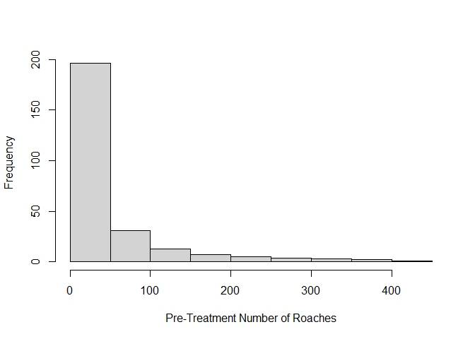<!-- -->

``` r
roaches$sqrt_roach1 <- sqrt(roaches$roach1)
hist(roaches$sqrt_roach1, xlab = 'Square Root of Pre-Treatment Number of Roaches', main = '')
```

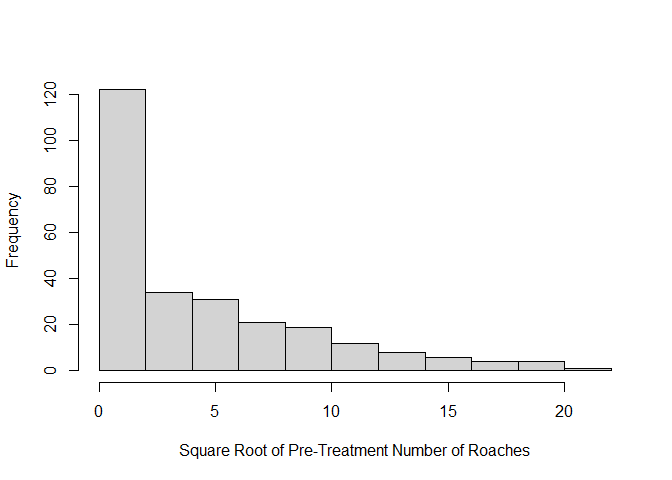<!-- -->

The outcome **y** is a count variable; thus, it makes sense to start
with a Poisson model. We need to remember to add the logarithm of
**exposure2** as an offset variable, since the treatment exposure times
vary in the data. Overall, we get the following model.

### Poisson Model

``` r
roaches_poisson <- brm(y ~ sqrt_roach1 + treatment + senior + offset(log(exposure2)) , family = poisson(), data = roaches, refresh = 0, silent = 2, seed = 123)
```

``` r
summary(roaches_poisson)
```

    ##  Family: poisson 
    ##   Links: mu = log 
    ## Formula: y ~ sqrt_roach1 + treatment + senior + offset(log(exposure2)) 
    ##    Data: roaches (Number of observations: 262) 
    ##   Draws: 4 chains, each with iter = 2000; warmup = 1000; thin = 1;
    ##          total post-warmup draws = 4000
    ## 
    ## Regression Coefficients:
    ##             Estimate Est.Error l-95% CI u-95% CI Rhat Bulk_ESS Tail_ESS
    ## Intercept       2.53      0.03     2.48     2.58 1.00     3510     2348
    ## sqrt_roach1     0.16      0.00     0.16     0.16 1.00     3891     3445
    ## treatment      -0.57      0.02    -0.62    -0.52 1.00     2270     2373
    ## senior         -0.31      0.03    -0.38    -0.25 1.00     2543     2657
    ## 
    ## Draws were sampled using sampling(NUTS). For each parameter, Bulk_ESS
    ## and Tail_ESS are effective sample size measures, and Rhat is the potential
    ## scale reduction factor on split chains (at convergence, Rhat = 1).

ESS and Rhat do not indicate any problems with sampling. Let us perform
LOO cross-validation using PSIS, since we will use it in further
analysis.

``` r
roaches_poisson <- add_criterion(roaches_poisson, criterion = "loo", save_psis = TRUE, reloo = TRUE)
roaches_poisson$criteria$loo
```

    ## 
    ## Computed from 4000 by 262 log-likelihood matrix.
    ## 
    ##          Estimate     SE
    ## elpd_loo  -5498.4  705.6
    ## p_loo       297.5   72.3
    ## looic     10996.8 1411.3
    ## ------
    ## MCSE of elpd_loo is 1.2.
    ## MCSE and ESS estimates assume independent draws (r_eff=1).
    ## 
    ## All Pareto k estimates are good (k < 0.7).
    ## See help('pareto-k-diagnostic') for details.

We have obtained the value of the LOOIC, which we can use to compare the
models in terms of their predictive accuracy. But before we do that, let
us assess the model based on its posterior predictions.

#### Posterior Predictive Check

Let us first compare the replicated datasets (generated from the
posterior distribution) with the original data.

``` r
y_pred <- posterior_predict(roaches_poisson)
y <- get_y(roaches_poisson)

ppc_dens_overlay(y, y_pred[1:250,])
```

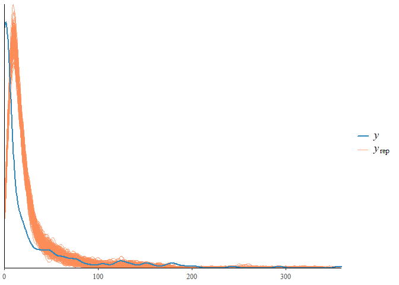<!-- -->

We can already notice a problem: the density peaks for the replicated
datasets differ noticeably from those of the original data. To get a
better picture of what is going on, we will plot a *rootogram*, as we
learned in *Nine Circles of Statistical Modeling* when we discussed
count models. A rootogram visualizes the comparison between the observed
frequencies and the model-predicted count distribution.

First, we need to compute the observed frequencies (i.e., how many times
$y = 0$, $y = 1$, etc.) and the predicted frequencies, obtained by
averaging the posterior chains.

``` r
max_val <- max(c(y, y_pred))
all_levels <- 0:min(max_val,200)

obs_counts <- as.vector(table(factor(y, levels = all_levels)))

exp_counts <- numeric(length(all_levels))
for (i in 1:length(all_levels)){
  exp_counts[i] <- mean(apply(y_pred == all_levels[i],1,sum))
}

# rootogram is usually in sqrt scale 
sqrt_obs <- sqrt(obs_counts)
sqrt_exp <- sqrt(exp_counts)
```

Then, we plot the ‘hanging’ rootogram.

``` r
df_root <- data.frame(
  x = all_levels,
  expected = sqrt_exp,
  observed = sqrt_obs,
  ymin = sqrt_exp - sqrt_obs,
  ymax = sqrt_exp
)

ggplot(df_root[1:150,]) +

  geom_hline(yintercept = 0, linetype = "dashed", color = "gray50", linewidth = 0.6) +
  geom_rect(aes(xmin = x - 0.4, xmax = x + 0.4, ymin = ymin, ymax = ymax),
            fill = "skyblue", color = "black", alpha = 0.8) +
  geom_line(aes(x = x, y = expected), color = "firebrick", linewidth = 1) +
  geom_point(aes(x = x, y = expected), color = "firebrick", size = 2.5) +
  
  labs(
    title = "Rootogram",
    x = "Counts",
    y = expression(sqrt(Frequency))
  )
```

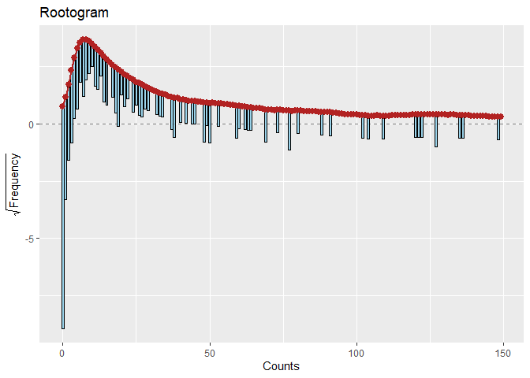<!-- -->

We observe that the Poisson model grossly underestimates the number of
zeros. We have discussed this common issue in *Nine Circles of
Statistical Modeling*. Long story short, the main issue is that the
Poisson distribution is a single-parameter distribution; its variance
equals its mean $\mu$, and hence its expressiveness is a bit limited.

### Negative Binomial Model

A common remedy is to switch to a *negative binomial model*, which has a
variance function $\mu +  \mu^2/\phi$, where $\phi>0$ is a scale
parameter. One way to motivate the transition from a Poisson model to a
negative binomial model (except by switching from the variance function
$\mu$ to a more general one) is to imagine a Poisson data-generating
process in which the rate $\lambda$ is no longer fixed. Instead, we
assume that $\lambda$ is drawn randomly between observations from a
Gamma distribution. Then the (marginal) distribution of observed data
will be negative binomial.

To illustrate this fact, let us generate some rates from
$\text{Gamma}(\alpha,\beta)$.

``` r
set.seed(123)
n_samples <- 100000

# Gamma
alpha <- 10  
beta  <- 2
lambdas <- rgamma(n_samples, shape = alpha, rate = beta)
plot(density(lambdas), main = '', xlab = 'Lambda')
```

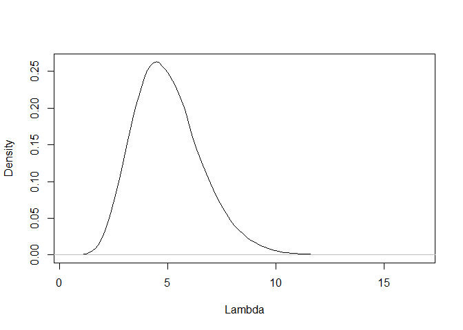<!-- -->

Then, we generate counts from a Poisson distribution and compare them
with samples from a negative binomial distribution, with the number of
observations $\alpha$ and the probability of success $\beta/(\beta+1)$.

``` r
gamma_poisson_samples <- rpois(n_samples, lambda = lambdas)


nb_size <- alpha
nb_prob <- beta / (1 + beta)
nb_samples <- rnbinom(n_samples, size = nb_size, prob = nb_prob)


plot(prop.table(table(gamma_poisson_samples)), type = 'b', col = "blue", 
     lwd = 2, xlim = c(0, 15), main = '',
     xlab = "Counts", ylab = "Relative Frequency")
lines(prop.table(table(nb_samples)), type = "b", col = "red", 
      lwd = 2, lty = 2)
legend("topright", legend = c("Gamma-Poisson Distribution", "Negative Binomial Distribution"),
       col = c("blue", "red"), lty = 1:2, lwd = 2)
```

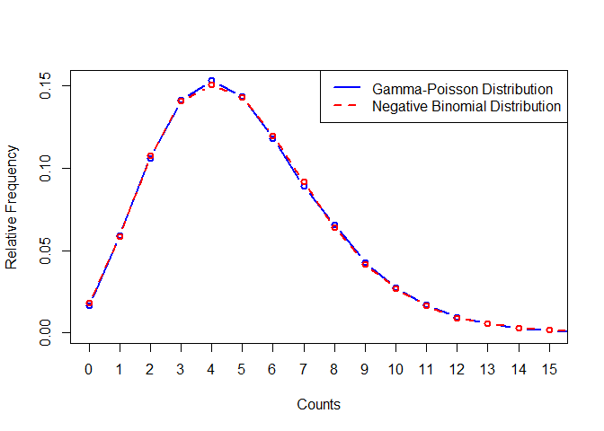<!-- -->

We observe that both distributions match.

#### Model Fit

Anyway, let us fit the negative binomial model.

``` r
roaches_negbinom <- brm(y ~ sqrt_roach1 + treatment + senior + offset(log(exposure2)) , family = negbinomial(), data = roaches, refresh = 0, silent = 2, seed = 123)
```

``` r
summary(roaches_negbinom)
```

    ##  Family: negbinomial 
    ##   Links: mu = log 
    ## Formula: y ~ sqrt_roach1 + treatment + senior + offset(log(exposure2)) 
    ##    Data: roaches (Number of observations: 262) 
    ##   Draws: 4 chains, each with iter = 2000; warmup = 1000; thin = 1;
    ##          total post-warmup draws = 4000
    ## 
    ## Regression Coefficients:
    ##             Estimate Est.Error l-95% CI u-95% CI Rhat Bulk_ESS Tail_ESS
    ## Intercept       2.15      0.24     1.69     2.64 1.00     4507     3133
    ## sqrt_roach1     0.26      0.03     0.20     0.33 1.00     4350     3130
    ## treatment      -1.03      0.24    -1.50    -0.59 1.00     4697     3060
    ## senior         -0.12      0.26    -0.63     0.40 1.00     4476     2807
    ## 
    ## Further Distributional Parameters:
    ##       Estimate Est.Error l-95% CI u-95% CI Rhat Bulk_ESS Tail_ESS
    ## shape     0.31      0.03     0.25     0.37 1.00     4309     3330
    ## 
    ## Draws were sampled using sampling(NUTS). For each parameter, Bulk_ESS
    ## and Tail_ESS are effective sample size measures, and Rhat is the potential
    ## scale reduction factor on split chains (at convergence, Rhat = 1).

We observe that the shape parameter is quite small, indicating
substantial *overdispersion*; i.e., the model is far from Poisson. Let’s
perform LOO cross-validation.

``` r
roaches_negbinom <- add_criterion(roaches_negbinom, criterion = "loo", save_psis = TRUE, reloo = TRUE)
roaches_negbinom$criteria$loo
```

    ## 
    ## Computed from 4000 by 262 log-likelihood matrix.
    ## 
    ##          Estimate   SE
    ## elpd_loo   -882.2 38.4
    ## p_loo         8.7  3.9
    ## looic      1764.3 76.8
    ## ------
    ## MCSE of elpd_loo is 0.2.
    ## MCSE and ESS estimates assume MCMC draws (r_eff in [0.7, 1.2]).
    ## 
    ## All Pareto k estimates are good (k < 0.7).
    ## See help('pareto-k-diagnostic') for details.

We can immediately notice that the LOOIC score is significantly smaller.
Let us check the rootogram.

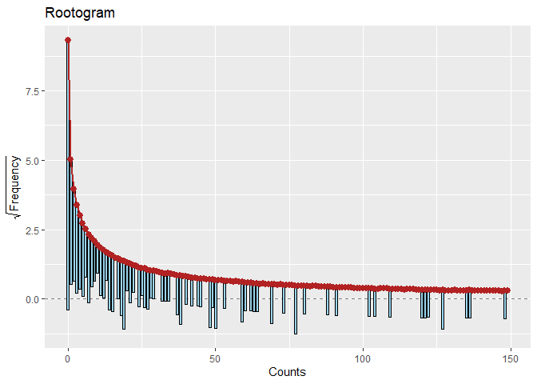<!-- -->

We observe that the posterior draws from the negative-binomial model
correspond to the data much better.

### Hurdle Model

We have observed an excessive number of zeros in the Poisson model, so
it makes sense to consider hurdle and zero-inflated models. We start
with a hurdle model, which combines a Bernoulli model (which determines
whether the count is zero/non-zero) and a truncated count model (which
generates the non-zero counts).

We will fit a negative-binomial hurdle model. We need to specify two
models: one for predicting whether the count is zero, and the second for
generating non-zero counts. We perform this in *brms* as follows.

``` r
roaches_hurdle_negbinom <- brm(bf(
  y ~ sqrt_roach1 + treatment + senior + offset(log(exposure2)),   
  hu ~ sqrt_roach1 + treatment + senior), 
  family = hurdle_negbinomial(), data = roaches, refresh = 0, silent = 2, seed = 123)
```

``` r
summary(roaches_hurdle_negbinom)
```

    ##  Family: hurdle_negbinomial 
    ##   Links: mu = log; hu = logit 
    ## Formula: y ~ sqrt_roach1 + treatment + senior + offset(log(exposure2)) 
    ##          hu ~ sqrt_roach1 + treatment + senior
    ##    Data: roaches (Number of observations: 262) 
    ##   Draws: 4 chains, each with iter = 2000; warmup = 1000; thin = 1;
    ##          total post-warmup draws = 4000
    ## 
    ## Regression Coefficients:
    ##                Estimate Est.Error l-95% CI u-95% CI Rhat Bulk_ESS Tail_ESS
    ## Intercept          2.51      0.25     2.01     3.01 1.00     4782     2594
    ## hu_Intercept      -0.18      0.29    -0.77     0.41 1.00     6161     3724
    ## sqrt_roach1        0.18      0.03     0.13     0.24 1.00     4599     3214
    ## treatment         -0.73      0.23    -1.20    -0.28 1.00     5444     2915
    ## senior             0.13      0.28    -0.42     0.68 1.00     6038     3335
    ## hu_sqrt_roach1    -0.36      0.06    -0.48    -0.25 1.00     4053     3094
    ## hu_treatment       0.78      0.32     0.16     1.41 1.00     5283     2982
    ## hu_senior          0.77      0.32     0.14     1.39 1.00     6477     3055
    ## 
    ## Further Distributional Parameters:
    ##       Estimate Est.Error l-95% CI u-95% CI Rhat Bulk_ESS Tail_ESS
    ## shape     0.43      0.09     0.27     0.62 1.00     4003     2521
    ## 
    ## Draws were sampled using sampling(NUTS). For each parameter, Bulk_ESS
    ## and Tail_ESS are effective sample size measures, and Rhat is the potential
    ## scale reduction factor on split chains (at convergence, Rhat = 1).

``` r
roaches_hurdle_negbinom <- add_criterion(roaches_hurdle_negbinom, criterion = "loo", save_psis = TRUE, reloo = TRUE)
roaches_hurdle_negbinom$criteria$loo
```

    ## 
    ## Computed from 4000 by 262 log-likelihood matrix.
    ## 
    ##          Estimate   SE
    ## elpd_loo   -864.5 37.6
    ## p_loo        11.6  2.7
    ## looic      1729.0 75.2
    ## ------
    ## MCSE of elpd_loo is 0.1.
    ## MCSE and ESS estimates assume MCMC draws (r_eff in [0.8, 1.8]).
    ## 
    ## All Pareto k estimates are good (k < 0.7).
    ## See help('pareto-k-diagnostic') for details.

We observe that the LOOIC score is even lower. The rootogram is as
follows.

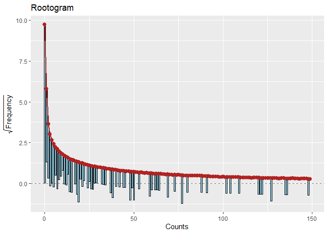<!-- -->

We notice that the improvement over the negative binomial model is less
pronounced

### Zero-inflated Model

Unlike a hurdle model, a zero-inflated model is a *mixture* of a count
model $p_\theta$ with a point mass at zero.

``` math
\begin{align*}
P[Y = 0\mid \theta, \lambda] &= \lambda + (1-\lambda)p_\theta(0)\\
P[Y = y\mid \theta, \lambda] & = (1-\lambda)p_\theta(y)
\end{align*}
```

Let us fit a zero-inflated negative binomial model.

``` r
roaches_zeroinfl_negbinom <- brm(bf(
  y ~ sqrt_roach1 + treatment + senior + offset(log(exposure2)),
  zi ~ sqrt_roach1 + treatment + senior), 
  family = zero_inflated_negbinomial(), data = roaches, refresh = 0, silent = 2, seed = 123)
```

``` r
summary(roaches_zeroinfl_negbinom)
```

    ##  Family: zero_inflated_negbinomial 
    ##   Links: mu = log; zi = logit 
    ## Formula: y ~ sqrt_roach1 + treatment + senior + offset(log(exposure2)) 
    ##          zi ~ sqrt_roach1 + treatment + senior
    ##    Data: roaches (Number of observations: 262) 
    ##   Draws: 4 chains, each with iter = 2000; warmup = 1000; thin = 1;
    ##          total post-warmup draws = 4000
    ## 
    ## Regression Coefficients:
    ##                Estimate Est.Error l-95% CI u-95% CI Rhat Bulk_ESS Tail_ESS
    ## Intercept          2.58      0.22     2.16     3.01 1.00     3570     3241
    ## zi_Intercept      -0.78      0.63    -2.20     0.30 1.00     3132     2522
    ## sqrt_roach1        0.18      0.03     0.13     0.23 1.00     3296     2968
    ## treatment         -0.68      0.22    -1.13    -0.26 1.00     3650     3125
    ## senior             0.06      0.26    -0.42     0.58 1.00     4276     3213
    ## zi_sqrt_roach1    -0.82      0.23    -1.35    -0.46 1.00     1727     1547
    ## zi_treatment       1.48      0.60     0.43     2.80 1.00     3161     2335
    ## zi_senior          1.05      0.55    -0.03     2.18 1.00     3507     2483
    ## 
    ## Further Distributional Parameters:
    ##       Estimate Est.Error l-95% CI u-95% CI Rhat Bulk_ESS Tail_ESS
    ## shape     0.51      0.06     0.39     0.65 1.00     3143     2625
    ## 
    ## Draws were sampled using sampling(NUTS). For each parameter, Bulk_ESS
    ## and Tail_ESS are effective sample size measures, and Rhat is the potential
    ## scale reduction factor on split chains (at convergence, Rhat = 1).

``` r
roaches_zeroinfl_negbinom <- add_criterion(roaches_zeroinfl_negbinom, criterion = "loo", save_psis = TRUE, reloo = TRUE)
roaches_zeroinfl_negbinom$criteria$loo
```

    ## 
    ## Computed from 4000 by 262 log-likelihood matrix.
    ## 
    ##          Estimate   SE
    ## elpd_loo   -859.8 37.7
    ## p_loo        11.4  2.7
    ## looic      1719.5 75.3
    ## ------
    ## MCSE of elpd_loo is 0.1.
    ## MCSE and ESS estimates assume MCMC draws (r_eff in [0.6, 1.9]).
    ## 
    ## All Pareto k estimates are good (k < 0.7).
    ## See help('pareto-k-diagnostic') for details.

The LOOIC score is similar to the score of our hurdle model. Let us also
plot the rootogram.

<!-- -->

### Model Comparison

Let us now compare all our models using the criteria we discussed in the
introduction.

#### DIC

We have learned that there are two versions of DIC:

``` math
\text{DIC}_1 = D(\hat \theta_\text{Bayes}) + 2p_1 = D(\hat \theta_\text{Bayes}) + 2(\mathbb{E}_{\text{post}} D(\theta) - D(\hat \theta_\text{Bayes}))
```

and

``` math
\text{DIC}_2 = D(\hat \theta_\text{Bayes}) + 2p_2 = D(\hat \theta_\text{Bayes}) + \text{var}_{\text{post}} D(\theta),
```

where $D(\theta) = -2\log p(y \mid \theta)$. The issue is that we need
to evaluate $D(\hat \theta_\text{Bayes})$, which is not even implemented
in Stan, since DIC is not generally recommended nowadays. Hence, we will
“cheat” a bit and use a version of DIC from (Xiao and Rabe-Hesketh
2026), which combines $\text{DIC}_1$ and $\text{DIC}_2$

``` math
\text{DIC}_3 = \frac{\text{DIC}_1 + \text{DIC}_2}{2} = \mathbb{E}_{\theta \mid y}D(\theta) + \frac{1}{2}\text{var}_{\theta \mid y} D(\theta)
```

It can be shown that $\text{DIC}_3$ is asymptotically equal to WAIC, and
unlike the other two versions, we can easily compute it from posterior
samples.

``` r
deviance_chain1 <- -2*rowSums(log_lik(roaches_poisson))
deviance_chain2 <- -2*rowSums(log_lik(roaches_negbinom))
deviance_chain3 <- -2*rowSums(log_lik(roaches_hurdle_negbinom))
deviance_chain4 <- -2*rowSums(log_lik(roaches_zeroinfl_negbinom))


D_mean1 <- mean(deviance_chain1)
D_mean2 <- mean(deviance_chain2)
D_mean3 <- mean(deviance_chain3)
D_mean4 <- mean(deviance_chain4)


p_D1 <- var(deviance_chain1) / 2
p_D2 <- var(deviance_chain2) / 2
p_D3 <- var(deviance_chain3) / 2
p_D4 <- var(deviance_chain4) / 2


DIC_scores <- c(D_mean1 + p_D1, D_mean2 + p_D2, D_mean3 + p_D3, D_mean4 +  p_D4 )
names(DIC_scores) <- c('poisson','neg-bin','hurdle neg-bin', 'zero-infl neg-bin')
DIC_scores
```

    ##           poisson           neg-bin    hurdle neg-bin zero-infl neg-bin 
    ##         10656.826          1759.083          1725.086          1716.009

We observe that the hurdle model and the zero-inflated model seem to be
the best.

#### WAIC

Next, we compute WAIC, which is implemented in Stan/brms.

``` r
WAIC_scores <- c(waic(roaches_poisson)$waic, waic(roaches_negbinom)$waic , waic(roaches_hurdle_negbinom)$waic, waic(roaches_zeroinfl_negbinom)$waic)
names(WAIC_scores) <- c('poisson','neg-bin','hurdle neg-bin', 'zero-infl neg-bin')
WAIC_scores
```

    ##           poisson           neg-bin    hurdle neg-bin zero-infl neg-bin 
    ##         10964.937          1762.905          1728.082          1719.062

We can also use the function *loo_compare* that evaluates the
differences between WAIC for the models, and estimates the standard
deviations of the differences, which in turn allows us to estimate the
probability of one model being better than the other (see
<https://users.aalto.fi/~ave/casestudies/LOO_uncertainty/loo_uncertainty.html#diagnostics-in-loo_compare>
for more details).

``` r
roaches_poisson <- add_criterion(roaches_poisson, criterion = "waic")
roaches_negbinom <- add_criterion(roaches_negbinom, criterion = "waic")
roaches_hurdle_negbinom <- add_criterion(roaches_hurdle_negbinom, criterion = "waic")
roaches_zeroinfl_negbinom <- add_criterion(roaches_zeroinfl_negbinom, criterion = "waic")

loo_compare(roaches_poisson, roaches_negbinom,roaches_hurdle_negbinom,roaches_zeroinfl_negbinom, criterion = 'waic')
```

    ##                      model elpd_diff se_diff p_worse diag_diff diag_elpd
    ##  roaches_zeroinfl_negbinom       0.0     0.0      NA                    
    ##    roaches_hurdle_negbinom      -4.5     4.1    0.86                    
    ##           roaches_negbinom     -21.9     6.9    1.00                    
    ##            roaches_poisson   -4622.9   683.3    1.00

We observe that the zero-inflated model seems to be the best one.

#### LOO Cross-Validation

Lastly, let us make the comparison based on LOO Cross-validation.

``` r
loo_compare(roaches_poisson, roaches_negbinom, roaches_hurdle_negbinom, roaches_zeroinfl_negbinom)
```

    ##                      model elpd_diff se_diff p_worse diag_diff diag_elpd
    ##  roaches_zeroinfl_negbinom       0.0     0.0      NA                    
    ##    roaches_hurdle_negbinom      -4.7     4.1    0.88                    
    ##           roaches_negbinom     -22.4     7.0    1.00                    
    ##            roaches_poisson   -4638.6   686.5    1.00

We have obtained the same result.

### Diagnostics of Zero-inflated Model

Let us do a quick diagnostics of our best model. Let us check the MCMC
chains first.

``` r
p1 <-mcmc_rank_overlay(as_draws_df(roaches_zeroinfl_negbinom), pars = 'b_Intercept', n_bins  = 25)
p2 <-mcmc_rank_overlay(as_draws_df(roaches_zeroinfl_negbinom), pars = 'b_sqrt_roach1', n_bins  = 25)
p3 <-mcmc_rank_overlay(as_draws_df(roaches_zeroinfl_negbinom), pars = 'b_treatment', n_bins  = 25)
p4 <-mcmc_rank_overlay(as_draws_df(roaches_zeroinfl_negbinom), pars = 'b_senior', n_bins  = 25)

(p1 + p2 + p3 + p4) + plot_layout(ncol = 2)
```

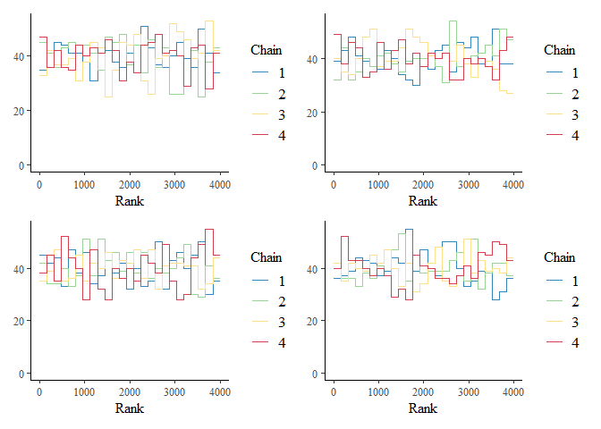<!-- -->

``` r
p1 <-mcmc_rank_overlay(as_draws_df(roaches_zeroinfl_negbinom), pars = 'b_zi_Intercept', n_bins  = 25)
p2 <-mcmc_rank_overlay(as_draws_df(roaches_zeroinfl_negbinom), pars = 'b_zi_sqrt_roach1', n_bins  = 25)
p3 <-mcmc_rank_overlay(as_draws_df(roaches_zeroinfl_negbinom), pars = 'b_zi_treatment', n_bins  = 25)
p4 <-mcmc_rank_overlay(as_draws_df(roaches_zeroinfl_negbinom), pars = 'b_zi_senior', n_bins  = 25)

(p1 + p2 + p3 + p4) + plot_layout(ncol = 2)
```

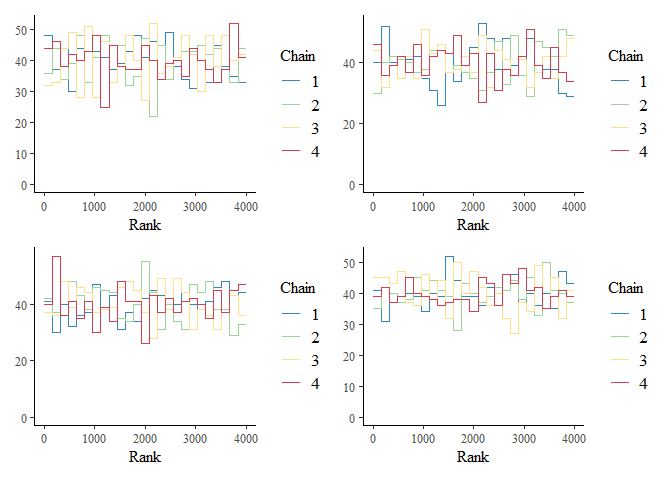<!-- -->

``` r
p1 <-mcmc_rank_overlay(as_draws_df(roaches_zeroinfl_negbinom), pars = 'shape', n_bins  = 25)
p2 <-mcmc_rank_overlay(as_draws_df(roaches_zeroinfl_negbinom), pars = 'lp__', n_bins  = 25)
(p1 + p2) + plot_layout(ncol = 2)
```

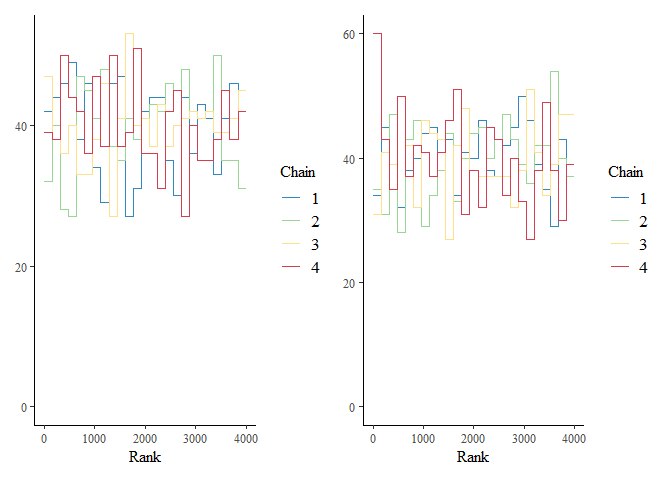<!-- -->

We do not observe any notable problems. Let us continue with the
Hamiltonian MCMC diagnostics.

``` r
np <- nuts_params(roaches_zeroinfl_negbinom)
p1 <- mcmc_nuts_energy(np, merge_chains = TRUE, bins = 50)
p2 <-mcmc_nuts_divergence(np, log_posterior(roaches_zeroinfl_negbinom))

(p1 + p2) + plot_layout(ncol = 2)
```

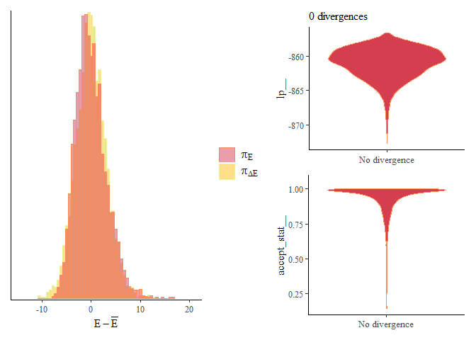<!-- -->

No problems there. Let’s check the sensitivity with respect to the
priors.

    ## Sensitivity based on cjs_dist
    ## Prior selection: all priors
    ## Likelihood selection: all data
    ## 
    ##          variable prior likelihood                     diagnosis
    ##       b_Intercept 0.010      0.077                             -
    ##    b_zi_Intercept 0.025      0.132                             -
    ##     b_sqrt_roach1 0.009      0.117                             -
    ##       b_treatment 0.009      0.094                             -
    ##          b_senior 0.007      0.088                             -
    ##  b_zi_sqrt_roach1 0.167      0.067 potential prior-data conflict
    ##    b_zi_treatment 0.048      0.111                             -
    ##       b_zi_senior 0.022      0.091                             -
    ##             shape 0.031      0.100                             -
    ##         Intercept 0.020      0.097                             -
    ##      Intercept_zi 0.182      0.063 potential prior-data conflict

The diagnostics declare two potential conflicts. Let us check the actual
differences in the posteriors.

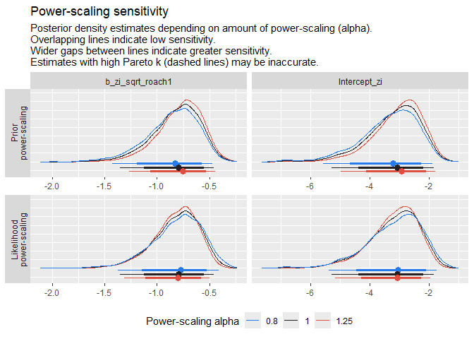<!-- -->

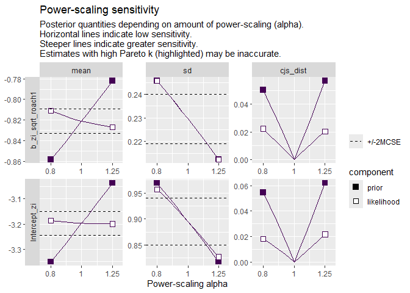<!-- -->

We observe that the posterior for these two parameters is quite
uncertain, and hence, the priors have a larger effect. Here, we should
keep in mind, as we will discuss in the next section, that our goal
would probably be to determine whether the treatment has an effect,
rather than to determine the specific values of these parameters. And
hence it will be the sensitivity of the treatment effect wrt. priors,
that is crucial.

Let’s conclude the diagnostics with a posterior predictive check. We
already checked the rootogram. Next, we can check the calibration for
predicting the non-zero response.

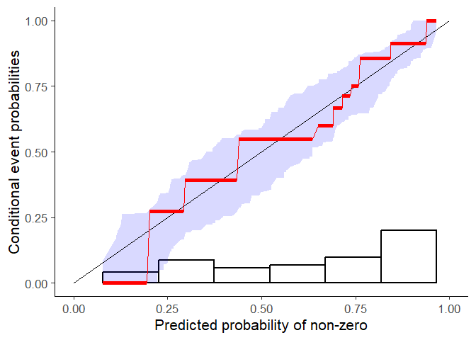<!-- -->

The model seems reasonably calibrated. We can also compute the PIT
values.

``` r
psis_object <- roaches_zeroinfl_negbinom$criteria$loo$psis_object
lw <- weights(psis_object)
y_sim <- posterior_predict(roaches_zeroinfl_negbinom)

p1 <- ppc_loo_pit_overlay(get_y(roaches_zeroinfl_negbinom), y_sim, lw = lw)
p2 <- ppc_loo_pit_qq(get_y(roaches_zeroinfl_negbinom), y_sim, lw = lw)
p3 <- ppc_loo_pit_ecdf(get_y(roaches_zeroinfl_negbinom), y_sim, lw = lw, plot_diff = TRUE)
p4 <- ppc_loo_intervals(get_y(roaches_zeroinfl_negbinom), y_sim, psis_object = psis_object, prob = 0.75, prob_outer = 0.99)


(p1 + p2 + p3 + p4) + plot_layout(ncol = 2)
```

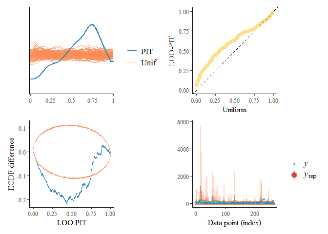<!-- -->

The model seems quite poor in terms of PIT values. The reason, as we
discussed in the previous part, is that the PIT values assume a
continuous distribution (with an invertible cdf). We can use PIT values
for discrete counts, but we need to employ *randomized* PIT values
$p_i \sim U(F(y_i-1),F(y_i))$ (Czado, Gneiting, and Held 2009), which
smudges the discrete jumps between the original PIT values.

We can obtain randomized PIT values using the package *posterior*.

``` r
library(posterior)
colnames(y_sim) <- paste0("V", 1:262)
pit_values <- posterior::pit(x = as_draws_matrix(y_sim), y = c(get_y(roaches_zeroinfl_negbinom)))

p1 <- ppc_loo_pit_overlay(pit = pit_values)
p2 <- ppc_loo_pit_qq(pit = pit_values)
p3 <- ppc_loo_pit_ecdf(pit = pit_values, plot_diff = TRUE)
p4 <- ppc_loo_intervals(get_y(roaches_zeroinfl_negbinom), y_sim, psis_object = psis_object, prob = 0.75, prob_outer = 0.99)

(p1 + p2 + p3 + p4) + plot_layout(ncol = 2)
```

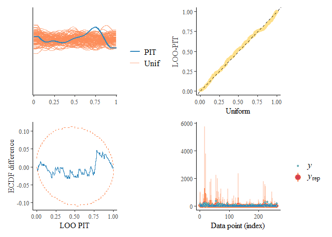<!-- -->

We observe that the apparent problems with PIT values disappeared.

### Effect of Treatment

As we have mentioned when discussing the prior sensitivity, the goal of
the data analysis would probably be to estimate the effect of the pest
control treatment. Hence, it is important to conduct diagnostics on the
treatment effect.

First, let us generate expected posterior draws for the data in which
every apartment received the treatment and no apartment received the
treatment. Then, we calculate the ratio of predictions for each
apartment and average the results across apartments. Thence, we obtain
the posterior distribution of the expected ratio of roaches with
treatment vs. without treatment, which we will use as the measure of the
treatment effect.

``` r
pred_zinb <- posterior_epred(roaches_zeroinfl_negbinom, newdata = rbind(mutate(roaches, treatment = 0), mutate(roaches, treatment = 1)))

ratio_zinb <- rowMeans(pred_zinb[, 263:524] / pred_zinb[, 1:262])

dens <- density(ratio_zinb)
dens_data <- data.frame(x = dens$x, y = dens$y)

ggplot(dens_data, aes(x = x, y = y)) +  geom_line(linewidth = 1) + xlab('Ratio of roaches with vs without treatment') + ylab('Posterior Density') + geom_vline(xintercept = mean(ratio_zinb), color = "red")
```

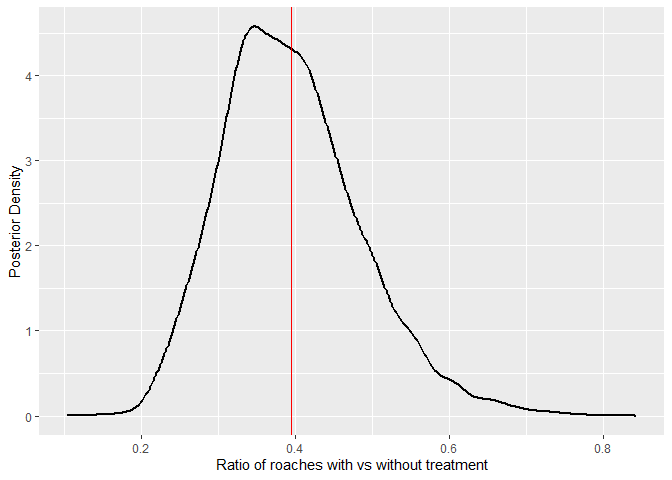<!-- -->

We observe that on average, the number of roaches is about 40%. Let us
diagnose the posterior samples we derived. We will again use the
*posterior* package to transform *ratio_zinb* into the corresponding
MCMC chains that we can analyze.

``` r
ratio_zinb <- array(ratio_zinb, c(1000, 4, 1))  |> as_draws_df() |> set_variables(variables = "ratio")
summary(ratio_zinb)
```

    ## # A tibble: 1 × 10
    ##   variable  mean median     sd    mad    q5   q95  rhat ess_bulk ess_tail
    ##   <chr>    <dbl>  <dbl>  <dbl>  <dbl> <dbl> <dbl> <dbl>    <dbl>    <dbl>
    ## 1 ratio    0.394  0.385 0.0898 0.0857 0.261 0.555  1.00    4037.    3015.

``` r
mcmc_rank_overlay(ratio_zinb)
```

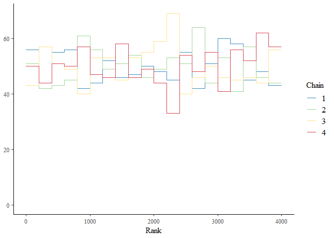<!-- -->

We observe that the rank plot, Rhat, and ESS values seem all fine. Next,
we can also perform prior sensitivity analysis for *ratio_zinb*.

``` r
powerscale_sensitivity(roaches_zeroinfl_negbinom, prediction = \(x, ...) ratio_zinb) |> filter(variable == "ratio")
```

    ## Sensitivity based on cjs_dist
    ## Prior selection: all priors
    ## Likelihood selection: all data
    ## 
    ##  variable prior likelihood diagnosis
    ##     ratio 0.005      0.106         -

``` r
powerscale_plot_dens(roaches_zeroinfl_negbinom, prediction = \(x, ...) ratio_zinb, variable = c('ratio'))
```

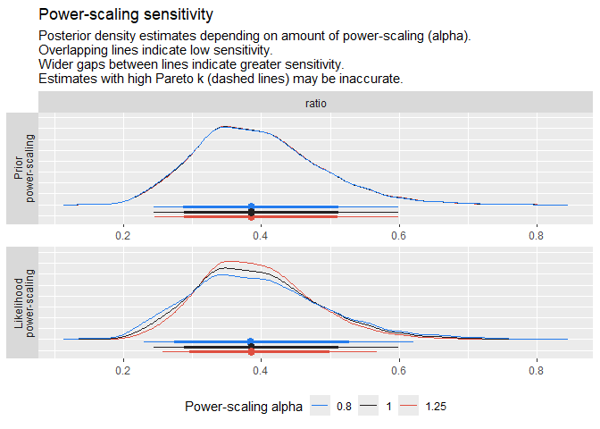<!-- -->

We observe that our posterior draws for the ratios are quite insensitive
to our choice of priors (we used the default *brms* ones).

Lastly, we will fit the model without the **treatment** variable and
compare the *looic* scores.

``` r
roaches_zeroinfl_negbinom_no_treatment <- brm(bf(
  y ~ sqrt_roach1 + senior + offset(log(exposure2)),
  zi ~ sqrt_roach1  + senior), 
  family = zero_inflated_negbinomial(), data = roaches, refresh = 0, silent = 2, seed = 123)
```

``` r
roaches_zeroinfl_negbinom_no_treatment <- add_criterion(roaches_zeroinfl_negbinom_no_treatment, criterion = "loo", save_psis = TRUE, reloo = TRUE)

loo_compare(roaches_zeroinfl_negbinom, roaches_zeroinfl_negbinom_no_treatment)
```

    ##                                   model elpd_diff se_diff p_worse diag_diff
    ##               roaches_zeroinfl_negbinom       0.0     0.0      NA          
    ##  roaches_zeroinfl_negbinom_no_treatment      -8.3     5.2    0.94          
    ##  diag_elpd
    ##           
    ## 

We observe a notable decrase in predictive performance of the model when
**treatment** is dropped from the model.

## Clinical Trial Dataset

The second dataset we will have a look at is the Clinical Trial dataset
from
<https://avehtari.github.io/Bayesian-Workflow/nabiximols/nabiximols.html>. 
and we will also mostly follow the analysis performed there.
The data contains information about a randomized trial in which
participants received a 12-week treatment of cannabis dependence
involving weekly clinical reviews, structured counseling, and flexible
medication doses. The goal is to assess the effect of Nabiximols, which
is a drug based on Cannabis extract. The observed variable is **cu**:
how many days out of 28 days (**set**) they used cannabis. The patients
were asked after 0, 4, 8, and 12 weeks.

``` r
cu_df <- read.csv("C:/Users/elini/Desktop/nine circles 3/clinical_trial.csv", sep = ',')
head(cu_df)
```

    ##   id      group week cu set
    ## 1  1 nabiximols    0 13  28
    ## 2  1 nabiximols    4 12  28
    ## 3  1 nabiximols    8 12  28
    ## 4  1 nabiximols   12 12  28
    ## 5  2 nabiximols    0 28  28
    ## 6  2 nabiximols    4  0  28

The dataset consists of some rows with missing response **cu**, which we
remove from the dataset.

``` r
any(is.na(cu_df))
```

    ## [1] TRUE

``` r
cu_df <- cu_df |> drop_na(cu)
```

Next, we will explicitly separate the cannabis use from the week 0, as
the pre-treatment effect **cu_baseline** that will serve as the
additional predictor for further weeks.

``` r
cu_df_week_not_0 <- cu_df |> dplyr::filter(week != 0)
cu_df_week_0 <- cu_df |> dplyr::filter(week == 0) |> rename(cu_baseline = cu)
cu_df <- left_join(cu_df_week_not_0, cu_df_week_0 |> select(id, cu_baseline ), by = "id")
```

Overall, we get the following dataset.

``` r
head(cu_df)
```

    ##   id      group week cu set cu_baseline
    ## 1  1 nabiximols    4 12  28          13
    ## 2  1 nabiximols    8 12  28          13
    ## 3  1 nabiximols   12 12  28          13
    ## 4  2 nabiximols    4  0  28          28
    ## 5  3 nabiximols    4  9  28          16
    ## 6  3 nabiximols    8  2  28          16

Let us plot the data to have a better idea of what we are dealing with.

``` r
ggplot(data = cu_df, aes(x = cu)) +
geom_histogram() +
facet_grid(group ~ week, switch = "y", axes = "all_x", labeller = labeller(group = label_value, week = label_both)) + labs(y = "")
```

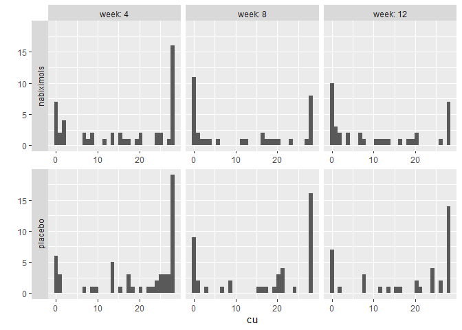<!-- -->

We observe that there is a notable decrease in Canabis usage for both
treatment and control (due to the 12-week cannabis dependence
treatment). The group that received Nabiximols as part of the treatment
seems to do a bit better; let’s see whether our model supports this
conclusion.

### Binomial Model

We are modeling a discrete variable that takes values from
$0, 1, \ldots, 28$, and hence the natural model is binomial. In
<https://avehtari.github.io/Bayesian-Workflow/nabiximols/nabiximols.html>,
the authors also investigate a normal model, but let us be clear here.
The normal model would never work for this dataset. The normal
approximation for the binomial distribution is valid, but the data must
lie far from the extremes 0 and $N$ (the number of trials), which is
clearly not the case here; we see many 0s and 28s.

Hence, let us fit the binomial model. The data contain repeated measures
for the same patient **id**; hence, we need to use a hierarchical model.

``` r
fit_binomial <- brm(formula = cu | trials(set)  ~ cu_baseline + group*week + (1 | id),
                    prior = c(prior(normal(0, 1.5), class = Intercept),
                              prior(normal(0, 1.5), class = b)),
                    data = cu_df, binomial(link = logit), refresh = 0, silent = 2, seed = 123)
```

``` r
summary(fit_binomial )
```

    ##  Family: binomial 
    ##   Links: mu = logit 
    ## Formula: cu | trials(set) ~ cu_baseline + group * week + (1 | id) 
    ##    Data: cu_df (Number of observations: 257) 
    ##   Draws: 4 chains, each with iter = 2000; warmup = 1000; thin = 1;
    ##          total post-warmup draws = 4000
    ## 
    ## Multilevel Hyperparameters:
    ## ~id (Number of levels: 105) 
    ##               Estimate Est.Error l-95% CI u-95% CI Rhat Bulk_ESS Tail_ESS
    ## sd(Intercept)     4.31      0.44     3.54     5.27 1.00      688     1494
    ## 
    ## Regression Coefficients:
    ##                   Estimate Est.Error l-95% CI u-95% CI Rhat Bulk_ESS Tail_ESS
    ## Intercept            -2.41      2.40    -7.24     2.17 1.01      379      573
    ## cu_baseline           0.15      0.09    -0.03     0.33 1.01      349      607
    ## groupplacebo          0.57      0.79    -0.94     2.11 1.02      317      688
    ## week                 -0.17      0.02    -0.20    -0.13 1.00     3580     2887
    ## groupplacebo:week     0.11      0.03     0.06     0.16 1.00     3543     3035
    ## 
    ## Draws were sampled using sampling(NUTS). For each parameter, Bulk_ESS
    ## and Tail_ESS are effective sample size measures, and Rhat is the potential
    ## scale reduction factor on split chains (at convergence, Rhat = 1).

Let us evaluate LOO cross-validation.

``` r
fit_binomial <- add_criterion(fit_binomial, criterion = "loo", save_psis = TRUE)
fit_binomial$criteria$loo
```

    ## 
    ## Computed from 4000 by 257 log-likelihood matrix.
    ## 
    ##          Estimate    SE
    ## elpd_loo   -727.3  63.4
    ## p_loo       244.4  28.4
    ## looic      1454.7 126.7
    ## ------
    ## MCSE of elpd_loo is NA.
    ## MCSE and ESS estimates assume MCMC draws (r_eff in [0.3, 1.9]).
    ## 
    ## Pareto k diagnostic values:
    ##                          Count Pct.    Min. ESS
    ## (-Inf, 0.7]   (good)     190   73.9%   55      
    ##    (0.7, 1]   (bad)       50   19.5%   <NA>    
    ##    (1, Inf)   (very bad)  17    6.6%   <NA>    
    ## See help('pareto-k-diagnostic') for details.

We observe a lot of observations with $k>0.7$ (we specifically did not
set *moment_match* = TRUE nor *reloo* = TRUE), which indicates that our
model is probably not that good (a lot of observations have a
significant influence on the fit). Let’s perform a simple posterior
check.

``` r
pp_check(fit_binomial, type = "bars", ndraws = 4000)
```

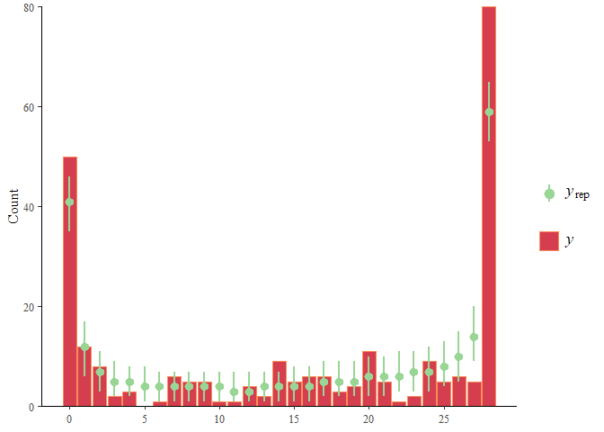<!-- -->

### Beta-binomial Model

We see the problem. Our binomial model struggles to model the extreme
counts, 0s and 28s. Thus, it is a similar issue to a zero-inflation in
count models. As with a Poisson model, which can be turned into a
negative binomial model by assuming a random rate, there is also an
‘overdispersed’ binomial model. It is called the beta-binomial model: a
binomial model in which the probability of success for each observation
is drawn from a beta distribution.

``` r
fit_beta_binomial <- brm(formula = cu | trials(set)  ~ cu_baseline + group*week + (1 | id),
                         prior = c(prior(normal(0, 1.5), class = Intercept), 
                                   prior(normal(0, 1.5), class = b)),
                         data = cu_df, beta_binomial(link = logit), save_pars = save_pars(all = TRUE), 
                         refresh = 0, silent = 2, seed = 123)
```

``` r
prior_summary(fit_beta_binomial)
```

    ##                 prior     class              coef group resp dpar nlpar lb ub
    ##        normal(0, 1.5)         b                                              
    ##        normal(0, 1.5)         b       cu_baseline                            
    ##        normal(0, 1.5)         b      groupplacebo                            
    ##        normal(0, 1.5)         b groupplacebo:week                            
    ##        normal(0, 1.5)         b              week                            
    ##        normal(0, 1.5) Intercept                                              
    ##     gamma(0.01, 0.01)       phi                                          0   
    ##  student_t(3, 0, 2.5)        sd                                          0   
    ##  student_t(3, 0, 2.5)        sd                      id                  0   
    ##  student_t(3, 0, 2.5)        sd         Intercept    id                  0   
    ##  tag       source
    ##              user
    ##      (vectorized)
    ##      (vectorized)
    ##      (vectorized)
    ##      (vectorized)
    ##              user
    ##           default
    ##           default
    ##      (vectorized)
    ##      (vectorized)

Overall, our model is as follows.

``` math
\begin{align*}
N & \sim \text{Binomial}(28, p)\\
p & \sim \text{Beta}(\mu\phi, (1-\mu)\phi) \\
\text{logit }\mu &\sim X\beta + \text{id}\\

\text{Regression Coefficients:}\\
\beta_\text{intercept} & \sim N(0,1.5)\\
\beta_\text{cu\_baseline} & \sim N(0,1.5)\\
\beta_\text{placebo} & \sim N(0,1.5)\\
\beta_\text{placebo:week} & \sim N(0,1.5)\\
\beta_\text{week} & \sim N(0,1.5)\\

\text{Random Effects:}\\
\text{id} & \sim N(0, \sigma^2)\\
\sigma & \sim \text{Half-Student}_3(0,2.5)\\

\text{Overdisperison Parameter:}\\
\phi & \sim \text{Gamma}(0.01,0.01)
\end{align*}
```

Let us check the fit.

``` r
summary(fit_beta_binomial)
```

    ##  Family: beta_binomial 
    ##   Links: mu = logit 
    ## Formula: cu | trials(set) ~ cu_baseline + group * week + (1 | id) 
    ##    Data: cu_df (Number of observations: 257) 
    ##   Draws: 4 chains, each with iter = 2000; warmup = 1000; thin = 1;
    ##          total post-warmup draws = 4000
    ## 
    ## Multilevel Hyperparameters:
    ## ~id (Number of levels: 105) 
    ##               Estimate Est.Error l-95% CI u-95% CI Rhat Bulk_ESS Tail_ESS
    ## sd(Intercept)     3.27      0.37     2.61     4.09 1.00      893     1448
    ## 
    ## Regression Coefficients:
    ##                   Estimate Est.Error l-95% CI u-95% CI Rhat Bulk_ESS Tail_ESS
    ## Intercept            -1.70      1.85    -5.36     1.88 1.01      695     1023
    ## cu_baseline           0.12      0.07    -0.02     0.26 1.01      600      924
    ## groupplacebo          0.36      0.71    -0.98     1.78 1.00      859     1234
    ## week                 -0.15      0.04    -0.23    -0.07 1.00     2319     2652
    ## groupplacebo:week     0.10      0.06    -0.01     0.21 1.00     2043     2562
    ## 
    ## Further Distributional Parameters:
    ##     Estimate Est.Error l-95% CI u-95% CI Rhat Bulk_ESS Tail_ESS
    ## phi     3.58      0.65     2.46     4.97 1.00     1963     2473
    ## 
    ## Draws were sampled using sampling(NUTS). For each parameter, Bulk_ESS
    ## and Tail_ESS are effective sample size measures, and Rhat is the potential
    ## scale reduction factor on split chains (at convergence, Rhat = 1).

We observe that ESS and Rhat are decent. Let us check the fit.

``` r
pp_check(fit_beta_binomial, type = "bars", ndraws = 4000)
```

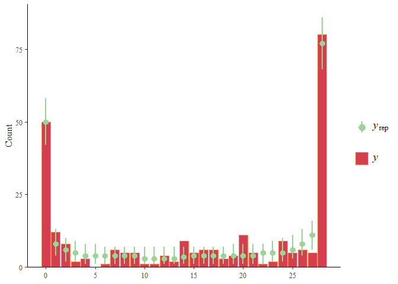<!-- -->

We observe that the beta-binomial model performs much better. We perform
LOO cross-validation next.

``` r
loo(fit_beta_binomial)
```

    ## 
    ## Computed from 4000 by 257 log-likelihood matrix.
    ## 
    ##          Estimate   SE
    ## elpd_loo   -528.8 27.7
    ## p_loo        86.8  9.1
    ## looic      1057.6 55.4
    ## ------
    ## MCSE of elpd_loo is NA.
    ## MCSE and ESS estimates assume MCMC draws (r_eff in [0.3, 1.7]).
    ## 
    ## Pareto k diagnostic values:
    ##                          Count Pct.    Min. ESS
    ## (-Inf, 0.7]   (good)     228   88.7%   74      
    ##    (0.7, 1]   (bad)       27   10.5%   <NA>    
    ##    (1, Inf)   (very bad)   2    0.8%   <NA>    
    ## See help('pareto-k-diagnostic') for details.

We observe that there are still some observations with high Pareto
diagnostics. Hence, we will need to recompute LOO for these. Here, we
will use both *moment_match* and *reloo* (if *moment_match* fails), to
ensure reliable results.

``` r
fit_beta_binomial <- add_criterion(fit_beta_binomial, criterion = "loo", save_psis = TRUE, moment_match = TRUE, reloo = TRUE)
fit_beta_binomial$criteria$loo
```

    ## 
    ## Computed from 4000 by 257 log-likelihood matrix.
    ## 
    ##          Estimate   SE
    ## elpd_loo   -528.2 27.8
    ## p_loo        86.2  9.5
    ## looic      1056.4 55.7
    ## ------
    ## MCSE of elpd_loo is 0.5.
    ## MCSE and ESS estimates assume MCMC draws (r_eff in [0.3, 1.7]).
    ## 
    ## All Pareto k estimates are good (k < 0.7).
    ## See help('pareto-k-diagnostic') for details.

The LOOIC score is significantly lower for the beta-binomial model
compared to the binomial model.

``` r
loo_compare(fit_beta_binomial,fit_binomial)
```

    ##              model elpd_diff se_diff p_worse diag_diff       diag_elpd
    ##  fit_beta_binomial       0.0     0.0      NA                          
    ##       fit_binomial    -199.1    46.0    1.00           67 k_psis > 0.7

We can also compare the model in terms of DIC and WAIC.

``` r
deviance_chain1 <- -2*rowSums(log_lik(fit_binomial))
deviance_chain2 <- -2*rowSums(log_lik(fit_beta_binomial))

D_mean1 <- mean(deviance_chain1)
D_mean2 <- mean(deviance_chain2)

p_D1 <- var(deviance_chain1) / 2
p_D2 <- var(deviance_chain2) / 2


DIC_scores <- c(D_mean1 + p_D1, D_mean2 + p_D2)
names(DIC_scores) <- c('binomial','beta-binomial')
DIC_scores
```

    ##      binomial beta-binomial 
    ##      1221.148      1095.888

``` r
fit_beta_binomial <- add_criterion(fit_beta_binomial, criterion = "waic")
fit_binomial <- add_criterion(fit_binomial, criterion = "waic")
loo_compare(fit_beta_binomial,fit_binomial, criterion = "waic")
```

    ##              model elpd_diff se_diff p_worse diag_diff diag_elpd
    ##  fit_beta_binomial       0.0     0.0      NA                    
    ##       fit_binomial    -185.2    46.5    1.00

We observe that the beta-binomial model is clearly better.

### Model Diagnostics

Let us check the beta-binomial model that fits the data better. As
usual, MCMC chains are first.

``` r
p1 <-mcmc_rank_overlay(as_draws_df(fit_beta_binomial), pars = 'b_Intercept', n_bins  = 25)
p2 <-mcmc_rank_overlay(as_draws_df(fit_beta_binomial), pars = 'b_cu_baseline', n_bins  = 25)
p3 <-mcmc_rank_overlay(as_draws_df(fit_beta_binomial), pars = 'b_groupplacebo', n_bins  = 25)
p4 <-mcmc_rank_overlay(as_draws_df(fit_beta_binomial), pars = 'b_week', n_bins  = 25)

(p1 + p2 + p3 + p4) + plot_layout(ncol = 2)
```

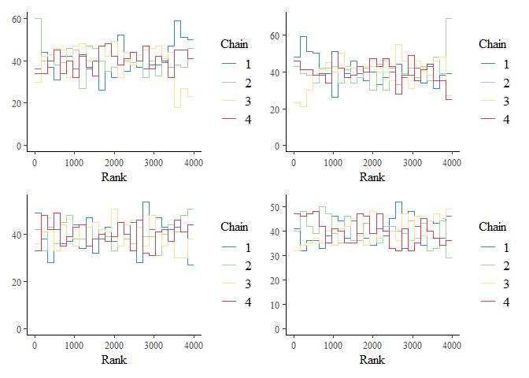<!-- -->

``` r
p1 <-mcmc_rank_overlay(as_draws_df(fit_beta_binomial), pars = 'b_groupplacebo:week', n_bins  = 25)
p2 <-mcmc_rank_overlay(as_draws_df(fit_beta_binomial), pars = 'sd_id__Intercept', n_bins  = 25)
p3 <-mcmc_rank_overlay(as_draws_df(fit_beta_binomial), pars = 'phi', n_bins  = 25)
p4 <-mcmc_rank_overlay(as_draws_df(fit_beta_binomial), pars = 'lp__', n_bins  = 25)

(p1 + p2 + p3 + p4) + plot_layout(ncol = 2)
```

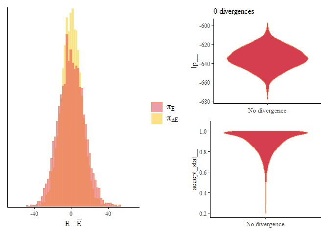<!-- -->

``` r
np <- nuts_params(fit_beta_binomial)
p1 <- mcmc_nuts_energy(np, merge_chains = TRUE, bins = 50)
p2 <-mcmc_nuts_divergence(np, log_posterior(fit_beta_binomial))

(p1 + p2) + plot_layout(ncol = 2)
```

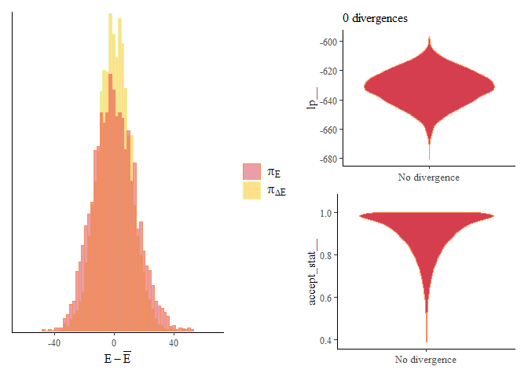<!-- -->

Next, we will check the sensitivity with respect to priors.

``` r
powerscale_sensitivity(fit_beta_binomial, variable = variables(as_draws(fit_beta_binomial))[1:7])
```

    ## Sensitivity based on cjs_dist
    ## Prior selection: all priors
    ## Likelihood selection: all data
    ## 
    ##             variable prior likelihood diagnosis
    ##          b_Intercept 0.008      0.108         -
    ##        b_cu_baseline 0.009      0.133         -
    ##       b_groupplacebo 0.041      0.126         -
    ##               b_week 0.003      0.162         -
    ##  b_groupplacebo:week 0.012      0.090         -
    ##     sd_id__Intercept 0.047      0.524         -
    ##                  phi 0.046      0.839         -

Lastly, we will continue the posterior predictive check by analyzing the
randomized PIT values.

``` r
set.seed(123)
y_sim <- posterior_predict(fit_beta_binomial)
colnames(y_sim) <- paste0("V", 1:257)
pit_values <- posterior::pit(x = as_draws_matrix(y_sim), y = c(get_y(fit_beta_binomial)))
psis_object <- fit_beta_binomial$criteria$loo$psis_object
lw <- weights(psis_object)

p1 <- ppc_loo_pit_overlay(pit = pit_values, samples = 100)
p2 <- ppc_loo_pit_qq(pit = pit_values)
p3 <- ppc_loo_pit_ecdf(pit = pit_values, plot_diff = TRUE)
p4 <- ppc_loo_intervals(get_y(fit_beta_binomial), y_sim, psis_object = psis_object, prob = 0.75, prob_outer = 0.99)


(p1 + p2 + p3 + p4) + plot_layout(ncol = 2)
```

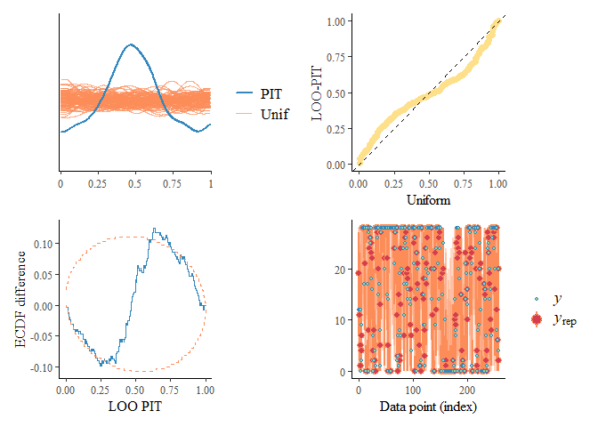<!-- -->

There are still some discrepancies in the fit, but the results are
somewhat borderline. We can also check the calibration of the
distribution for 0 and 28.

``` r
th <- 0
rd <- reliabilitydiag(
  EMOS = pmin(E_loo((posterior_predict(fit_beta_binomial) > th) + 0, 
                    loo(fit_beta_binomial)$psis_object)$value, 1),
  y = as.numeric(cu_df$cu > th)
)
autoplot(rd) +
  labs(x = "Predicted probability of > 0",
       y = "Conditional event probabilities") +
  bayesplot::theme_default(base_family = "sans", base_size = 16)
```

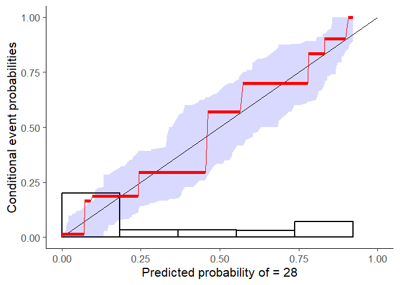<!-- -->

``` r
th <- 27
rd <- reliabilitydiag(
  EMOS = pmin(E_loo((posterior_predict(fit_beta_binomial) > th) + 0, 
                    loo(fit_beta_binomial)$psis_object)$value, 1),
  y = as.numeric(cu_df$cu > th)
)
autoplot(rd) +
  labs(x = "Predicted probability of = 28",
       y = "Conditional event probabilities") +
  bayesplot::theme_default(base_family = "sans", base_size = 16)
```

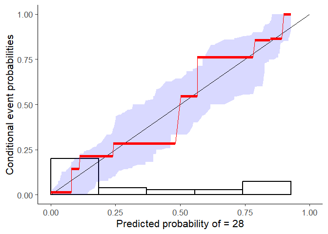<!-- -->

The calibration is pretty good.

### Effect of Treatment

We need to evaluate the effect of the treatment again. First, let us
create posterior predictions for a new patient that is not in the
original data, which starts with **cu_baseline** = 28, and plot the
predictions (the authors in
<https://avehtari.github.io/Bayesian-Workflow/nabiximols/nabiximols.html>
recommend plotting discrete probabilities using dots since it is easier
to compare them by counting the dots, and each dot is worth 0.01
probability).

``` r
max(cu_df$id)
```

    ## [1] 127

``` r
library(tidybayes)
library(modelr)
set.seed(123)

cu_df |>
  data_grid(group, week, cu_baseline = 28, id = 128, set = 28) |>
  add_predicted_draws(fit_beta_binomial, allow_new_levels = TRUE) |>
  ggplot(aes(x = .prediction)) +
  facet_grid(group ~ week, switch = "y", axes = "all_x",
             labeller = labeller(group = label_value, week = label_both)) +
  stat_dotsinterval(quantiles = 100, fill = 'skyblue', slab_color = 'skyblue', 
                    binwidth = 2/3, overflow = "keep") +
  coord_cartesian(expand = FALSE, clip = "off") +
  labs(x = "", y = "") +
  scale_x_continuous(lim = c(0, 28)) +
  labs(x = "Prediction of cu for a new patient", y = "Week") +
  theme(strip.background = element_blank(), strip.placement = "outside",
        panel.spacing.x = unit(0.5, "lines"),
        panel.spacing.y = unit(5, "lines"),
        panel.background = element_blank(),
        plot.background = element_blank(),
        panel.grid.major = element_blank(),
        panel.grid.minor = element_blank(),
        axis.line.y = element_blank(),
        axis.text.y = element_blank(),
        axis.ticks.y = element_blank(),
        axis.line.x = element_blank())
```

<!-- -->

We observe that the treatment seems to have an effect. Let us evaluate
the difference.

``` r
pred_diff <- cu_df |>
  data_grid(group, week, cu_baseline = 28, id = 128, set = 28) |>
  add_predicted_draws(fit_beta_binomial, allow_new_levels = TRUE) |>
  compare_levels(.prediction, by = group) 

pred_diff |>
  ggplot(aes(x = .prediction)) +
  facet_grid(group ~ week, switch = "y", axes = "all_x",
             labeller = labeller(group = label_value, week = label_both)) +
  stat_dotsinterval(quantiles = 100, fill = 'skyblue', slab_color = 'skyblue', 
                    binwidth = 1.5, overflow = "compress") +
  coord_cartesian(expand = FALSE, clip = "off") +
  theme(strip.background = element_blank(), strip.placement = "outside") +
  labs(x = "Difference in cu given placebo vs Nabiximols", y = "Week") + 
  scale_x_continuous(lim = c(-25, 25)) +
  theme(panel.spacing = unit(1, "lines")) +
  theme(strip.background = element_blank(), strip.placement = "outside",
        panel.spacing.x = unit(0.5, "lines"),
        panel.spacing.y = unit(5, "lines"),
        panel.background = element_blank(),
        plot.background = element_blank(),
        panel.grid.major = element_blank(),
        panel.grid.minor = element_blank(),
        axis.line.y = element_blank(),
        axis.text.y = element_blank(),
        axis.ticks.y = element_blank(),
        axis.line.x = element_blank())
```

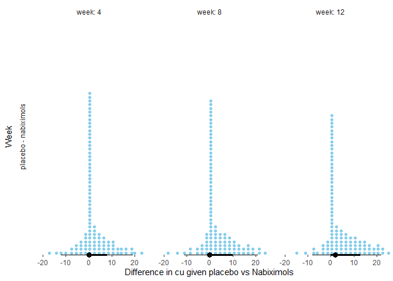<!-- -->

``` r
quantiles_pred_diff <- 
  rbind(
    quantile(pred_diff$.prediction[pred_diff$week == 4],  c(0.05, 0.1, 0.2, 0.5, 0.8, 0.9, 0.95)),
    quantile(pred_diff$.prediction[pred_diff$week == 8],  c(0.05, 0.1, 0.2, 0.5, 0.8, 0.9, 0.95)),
    quantile(pred_diff$.prediction[pred_diff$week == 12], c(0.05, 0.1, 0.2, 0.5, 0.8, 0.9, 0.95))
    )

rownames(quantiles_pred_diff) <- c('Week 4', 'Week 8', 'Week 12')
quantiles_pred_diff
```

    ##         5% 10% 20% 50% 80% 90% 95%
    ## Week 4  -8  -4   0   0   7  12  16
    ## Week 8  -6  -3   0   0   9  14  18
    ## Week 12 -5  -1   0   2  12  17  21

We observe an over 80% probability that the effect is non-negative, and
it seems to be stronger in the later weeks. However, the spread of
predictions is pretty large. Let us make the estimate tighter by
comparing expected posterior predictions instead (which removes the
variability caused by the beta-binomial model).

``` r
set.seed(123)
pred_e_diff <- cu_df |>
  data_grid(group, week, cu_baseline = 28, id = 128, set = 28) |>
  add_epred_draws(fit_beta_binomial, allow_new_levels = TRUE) |>
  compare_levels(.epred, by = group)

pred_e_diff |>
  ggplot(aes(x = .epred)) +
  facet_grid(group ~ week, switch = "y", axes = "all_x",
             labeller = labeller(group = label_value, week = label_both)) +
  stat_dotsinterval(quantiles = 100, fill = 'skyblue', slab_color = 'skyblue', 
                    binwidth = 1.5, overflow = "compress") +
  coord_cartesian(expand = FALSE, clip = "off") +
  theme(strip.background = element_blank(), strip.placement = "outside") +
  labs(x = "", y = "") +
  labs(x = "Difference in expected cu given placebo vs Nabiximols", y = "Week") + 
  scale_x_continuous(lim = c(-5, 25)) +
  theme(panel.spacing = unit(1, "lines")) +
  theme(strip.background = element_blank(), strip.placement = "outside",
        panel.spacing.x = unit(2, "lines"),
        panel.spacing.y = unit(1, "lines"),
        panel.background = element_blank(),
        plot.background = element_blank(),
        panel.grid.major = element_blank(),
        panel.grid.minor = element_blank(),
        axis.line.y = element_blank(),
        axis.text.y = element_blank(),
        axis.ticks.y = element_blank(),
        axis.line.x = element_blank())
```

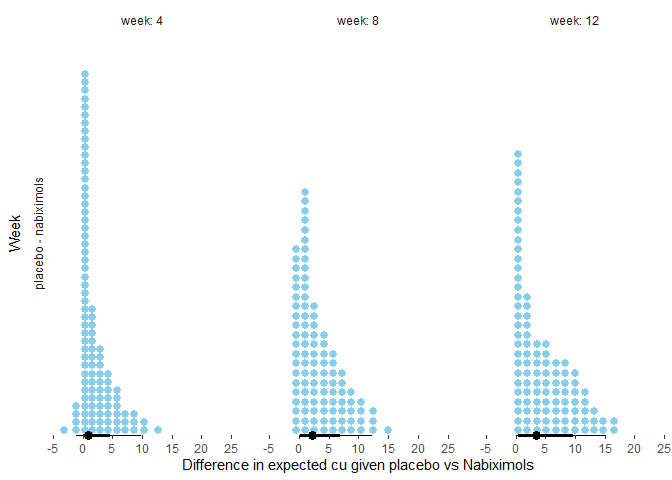<!-- -->

``` r
quantiles_pred_e_diff <- 
  rbind(
    quantile(pred_e_diff$.epred[pred_e_diff$week == 4],  c(0.05, 0.1, 0.2, 0.5, 0.8, 0.9, 0.95)),
    quantile(pred_e_diff$.epred[pred_e_diff$week == 8],  c(0.05, 0.1, 0.2, 0.5, 0.8, 0.9, 0.95)),
    quantile(pred_e_diff$.epred[pred_e_diff$week == 12], c(0.05, 0.1, 0.2, 0.5, 0.8, 0.9, 0.95))
    )

rownames(quantiles_pred_e_diff) <- c('Week 4', 'Week 8', 'Week 12')
quantiles_pred_e_diff
```

    ##                  5%         10%        20%      50%      80%       90%
    ## Week 4  -0.42520050 -0.01140396 0.03984256 1.000591 4.073293  6.263417
    ## Week 8   0.00494116  0.04473014 0.25048388 2.192169 6.488704  8.747276
    ## Week 12  0.02859521  0.11577243 0.51117496 3.469589 8.931773 11.474189
    ##               95%
    ## Week 4   8.275757
    ## Week 8  10.905290
    ## Week 12 13.501633

We see that the expected effect is definitely positive. We can further
reduce the variability of the estimate by ignoring the randomness
arising from the patient’s random effect. We remove so-called *aleatoric
uncertainty* (variability given by the probabilistic nature of the
model) and keep merely the *epistemic uncertainty*; uncertainty due to
the lack of knowledge.

``` r
set.seed(123)

pred_e_diff_nore <- cu_df |>
  data_grid(group, week, cu_baseline = 28, id = 128, set = 28) |>
  add_epred_draws(fit_beta_binomial, re_formula = NA, allow_new_levels = TRUE) |>
  compare_levels(.epred, by = group) 
  
pred_e_diff_nore |>  ggplot(aes(x = .epred)) +
  facet_grid(group ~ week, switch = "y", axes = "all_x",
             labeller = labeller(group = label_value, week = label_both)) +
  stat_dotsinterval(quantiles = 100, fill = 'skyblue', slab_color = 'skyblue', 
                    binwidth = 1.5, overflow = "compress") +
  coord_cartesian(expand = FALSE, clip = "off") +
  theme(strip.background = element_blank(), strip.placement = "outside") +
  labs(x = "", y = "") +
  labs(x = "Difference in expected cu (for re = 0) given placebo vs Nabiximols", y = "Week") + 
  scale_x_continuous(lim = c(-5, 25)) +
  theme(panel.spacing = unit(1, "lines")) +
  theme(strip.background = element_blank(), strip.placement = "outside",
        panel.spacing.x = unit(0.5, "lines"),
        panel.spacing.y = unit(5, "lines"),
        panel.background = element_blank(),
        plot.background = element_blank(),
        panel.grid.major = element_blank(),
        panel.grid.minor = element_blank(),
        axis.line.y = element_blank(),
        axis.text.y = element_blank(),
        axis.ticks.y = element_blank(),
        axis.line.x = element_blank())
```

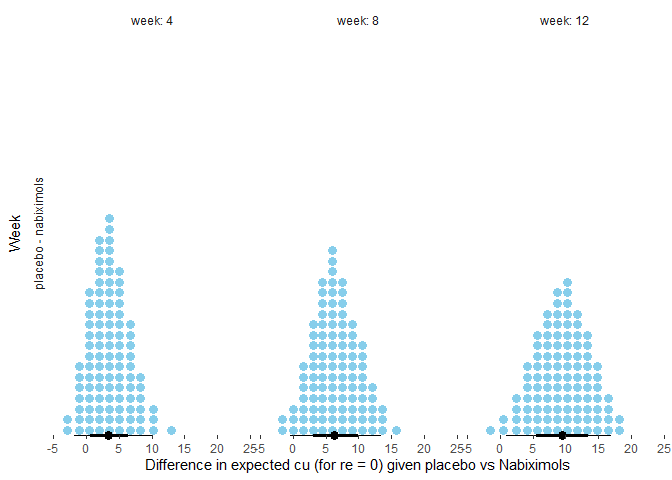<!-- -->

``` r
quantiles_pred_e_diff_nore <- 
  rbind(
    quantile(pred_e_diff_nore$.epred[pred_e_diff_nore$week == 4],  c(0.05, 0.1, 0.2, 0.5, 0.8, 0.9, 0.95)),
    quantile(pred_e_diff_nore$.epred[pred_e_diff_nore$week == 8],  c(0.05, 0.1, 0.2, 0.5, 0.8, 0.9, 0.95)),
    quantile(pred_e_diff_nore$.epred[pred_e_diff_nore$week == 12], c(0.05, 0.1, 0.2, 0.5, 0.8, 0.9, 0.95))
    )

rownames(quantiles_pred_e_diff_nore) <- c('Week 4', 'Week 8', 'Week 12')
quantiles_pred_e_diff_nore
```

    ##                 5%       10%       20%      50%       80%       90%       95%
    ## Week 4  -1.0419977 -0.160854 0.9929368 3.337805  6.042708  7.569687  8.737294
    ## Week 8   0.7985805  1.980366 3.4543532 6.297962  9.452420 11.089667 12.337009
    ## Week 12  2.4547653  4.167854 5.9273328 9.541981 12.943788 14.583368 15.983333

We observe that without individual random effects, the effect is now
significantly positive. To understand what is going on, let us plot the
predictions obtained by ignoring the random effects (i.e., setting their
values to zero).

``` r
set.seed(123)

cu_df |>
  data_grid(group, week, cu_baseline = 28, id = 128, set = 28) |>
  add_predicted_draws(fit_beta_binomial, re_formula = NA, allow_new_levels = TRUE) |>
  ggplot(aes(x = .prediction)) +
  facet_grid(group ~ week, switch = "y", axes = "all_x",
             labeller = labeller(group = label_value, week = label_both)) +
  stat_dotsinterval(quantiles = 100, fill = 'skyblue', slab_color = 'skyblue', 
                    binwidth = 2/3, overflow = "keep") +
  coord_cartesian(expand = FALSE, clip = "off") +
  labs(x = "", y = "") +
  scale_x_continuous(lim = c(0, 28)) +
  labs(x = "Prediction of cu for re = 0", y = "Week") +
  theme(strip.background = element_blank(), strip.placement = "outside",
        panel.spacing.x = unit(0.5, "lines"),
        panel.spacing.y = unit(5, "lines"),
        panel.background = element_blank(),
        plot.background = element_blank(),
        panel.grid.major = element_blank(),
        panel.grid.minor = element_blank(),
        axis.line.y = element_blank(),
        axis.text.y = element_blank(),
        axis.ticks.y = element_blank(),
        axis.line.x = element_blank())
```

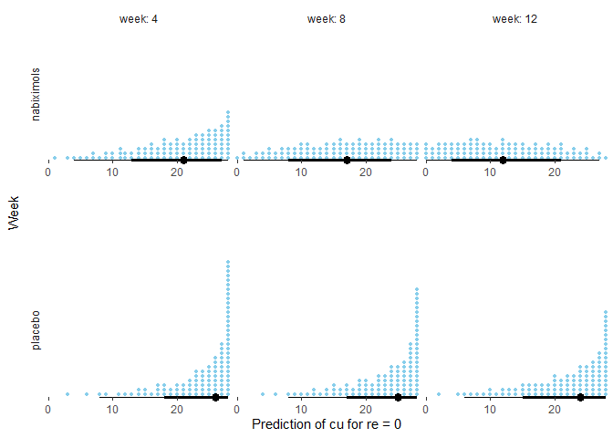<!-- -->

We can also plot the expected predictions without the random effects.

``` r
cu_df |>
  data_grid(group, week, cu_baseline = 28, id = 128, set = 28) |>
  add_epred_draws(fit_beta_binomial, re_formula = NA, allow_new_levels = TRUE) |>
  ggplot(aes(x = .epred)) +
  facet_grid(group ~ week, switch = "y", axes = "all_x",
             labeller = labeller(group = label_value, week = label_both)) +
  stat_dotsinterval(quantiles = 100, fill = 'skyblue', slab_color = 'skyblue', 
                    binwidth = 2/3, overflow = "keep") +
  coord_cartesian(expand = FALSE, clip = "off") +
  labs(x = "", y = "") +
  scale_x_continuous(lim = c(0, 28)) +
  labs(x = "Prediction of expected cu for re = 0", y = "Week") +
  theme(strip.background = element_blank(), strip.placement = "outside",
        panel.spacing.x = unit(1, "lines"),
        panel.spacing.y = unit(5, "lines"),
        panel.background = element_blank(),
        plot.background = element_blank(),
        panel.grid.major = element_blank(),
        panel.grid.minor = element_blank(),
        axis.line.y = element_blank(),
        axis.text.y = element_blank(),
        axis.ticks.y = element_blank(),
        axis.line.x = element_blank())
```

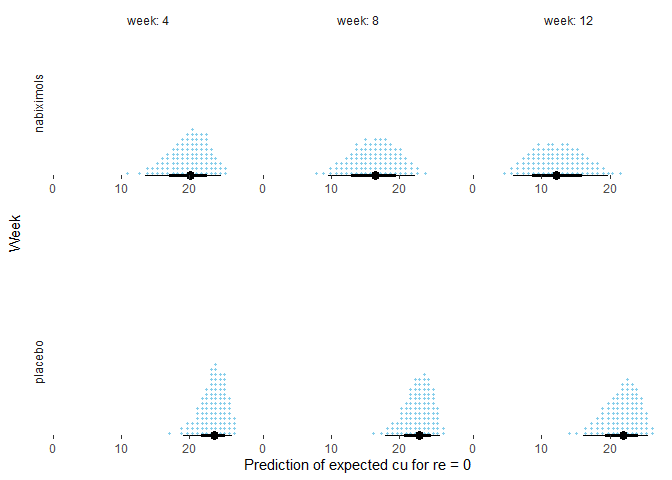<!-- -->

We observe that there is a much smaller number of observations at the
boundaries when random individual effects are not included. There are
almost no 0s, and a reduced number of 28s, which are mostly present only in the placebo group and in the treatment group for week 4. We observe almost
no 28s in the treatment group for weeks 8 and 12. This means that a
significant portion of these predicted extreme values is “generated” by
the model’s random effects. Going back to the fit, we notice that the
standard deviation for the random effect is quite large.

``` r
dens <- density(as_draws_df(fit_beta_binomial)$sd_id__Intercept)
dens_data <- data.frame(x = dens$x, y = dens$y)

ggplot(dens_data, aes(x = x, y = y)) +  geom_line(linewidth = 1) + xlab('Id Standard Deviation') + ylab('Posterior Density')
```

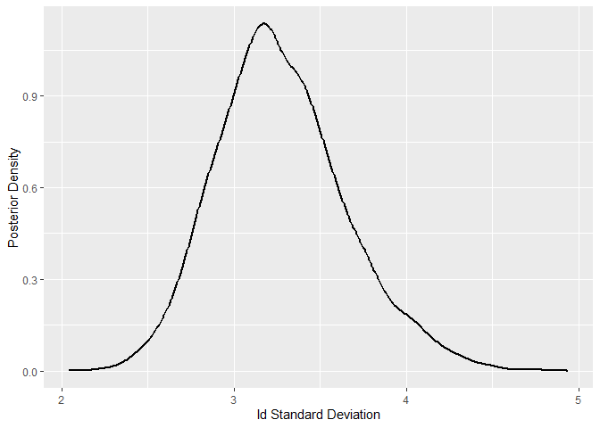<!-- -->

We also need to remember that the predictors and the random effects
enter into the model on the logit scale:

``` math
\text{logit }\mu = X\beta + \text{Ind},
```

where $\mu$ is the expected probability of success $p$ in the
beta-binomial model. This implies that, provided that $\text{Ind}$ is
generated large, it steers the probability towards 0 or 1 (i.e., to the
count response 0 or 28) and the effect of the predictors seems to be too
small to compensate for it. In other words, the model predicts that a
notable portion of the patients are not influenced by the Nabiximols
treatment; the model predicts that they stop using Cannabis right away
or keep using it every day regardless of the treatment.

We provide a simple simulation of what is going on. We assume a
beta-binomial model with a single effect $\beta \sim N(-2,0.25)$ and a
random effect $\text{Id} \sim N(0,16)$. When we ignore the random
effect, the treatment clearly lowers the predicted counts. However, when
the random effect is present, it pushes some simulated probabilities to the extremes, and hence, the observed treatment effect is much lower.

``` r
set.seed(123)
mu_eff <- -1.5
sigma_eff <- 0.5
sigma_rand <- 4
phi <- 4

pred_with_re <- numeric(10000)
for (i in 1:10000){
  
  mu1 <- ilogit(rnorm(1,mu_eff,sigma_eff) + rnorm(1,0,sigma_rand))
  mu2 <- ilogit(rnorm(1,0,sigma_rand))
  
  p1 <- rbeta(1, mu1*phi, (1-mu1)*phi)
  p2 <- rbeta(1, mu2*phi, (1-mu2)*phi)      
  
  pred_with_re[i] <- rbinom(1,28,p1) - rbinom(1,28,p2)
}

pred_no_re = numeric(10000)
for (i in 1:10000){
  
  mu1 <- ilogit(rnorm(1,mu_eff,sigma_eff))
  mu2 <- ilogit(0)
  
  p1 <- rbeta(1, mu1*phi, (1-mu1)*phi)
  p2 <- rbeta(1, mu2*phi, (1-mu2)*phi)      
  
  pred_no_re[i] <- rbinom(1,28,p1) - rbinom(1,28,p2)
}


data <- data.frame(no_random_effect = pred_no_re, random_effect = pred_with_re)

data |> 
  pivot_longer(cols = c(no_random_effect, random_effect), names_to = "Group", values_to = "Counts") |>
  ggplot(aes(x = Counts, fill = Group)) +
  geom_histogram(position = "identity", alpha = 0.5, bins = 30, color = "white") +
  labs(title = "", x = "Predicted Counts", y = "Frequency") +
  theme_minimal()
```

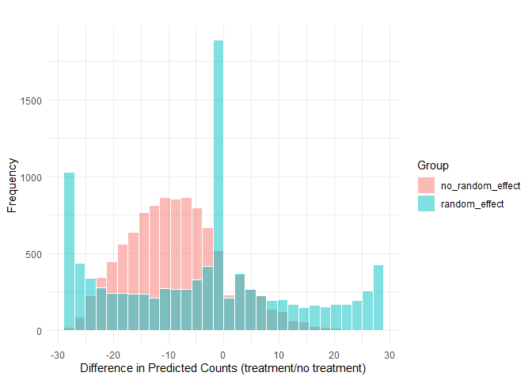<!-- -->

``` r
apply(data,2,quantile)
```

    ##      no_random_effect random_effect
    ## 0%                -28           -28
    ## 25%               -15           -18
    ## 50%                -9            -1
    ## 75%                -3             5
    ## 100%               26            28

Let us now check the chains and the sensitivity of our result to the
selection of priors.

``` r
trt_effect_draws <- cu_df |>
  data_grid(group, week, cu_baseline = 28, id = 128, set = 28) |>
  add_epred_draws(fit_beta_binomial,  re_formula = NA, allow_new_levels = TRUE) |>
  compare_levels(.epred, by = group) |>
  ungroup() |>
  pivot_wider(names_from = c(group,week), values_from = .epred, names_sep = " week ") |>
  select(!c(.chain,.iteration)) |>
  left_join(as_draws_df(log_lik_draws(fit_beta_binomial)), by = ".draw") |>
  left_join(as_draws_df(log_prior_draws(fit_beta_binomial)), by = ".draw") |>
  as_draws_df() 
```

``` r
effect_draws1 <- array(trt_effect_draws$`placebo - nabiximols week 4`, c(1000, 4, 1)) |>  as_draws_df() |> set_variables(variables = c("placebo - nabiximols week 4"))
effect_draws2 <- array(trt_effect_draws$`placebo - nabiximols week 8`, c(1000, 4, 1)) |>  as_draws_df() |> set_variables(variables = c("placebo - nabiximols week 8"))
effect_draws3 <- array(trt_effect_draws$`placebo - nabiximols week 12`, c(1000, 4, 1)) |>  as_draws_df() |> set_variables(variables = c("placebo - nabiximols week 12"))


p1 <-mcmc_rank_overlay(effect_draws1, n_bins  = 25)
p2 <-mcmc_rank_overlay(effect_draws2, n_bins  = 25)
p3 <-mcmc_rank_overlay(effect_draws3, n_bins  = 25)

(p1 + p2 + p3) + plot_layout(ncol = 3)
```

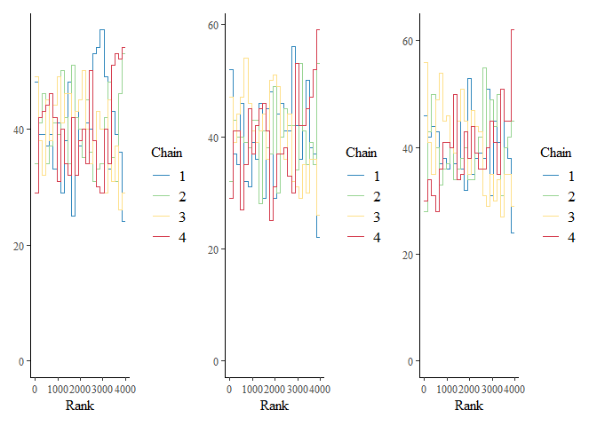<!-- -->

``` r
summary(effect_draws1)
```

    ## # A tibble: 1 × 10
    ##   variable           mean median    sd   mad    q5   q95  rhat ess_bulk ess_tail
    ##   <chr>             <dbl>  <dbl> <dbl> <dbl> <dbl> <dbl> <dbl>    <dbl>    <dbl>
    ## 1 placebo - nabixi…  3.54   3.34  3.08  2.96 -1.04  8.74  1.00     697.     971.

``` r
summary(effect_draws2)
```

    ## # A tibble: 1 × 10
    ##   variable           mean median    sd   mad    q5   q95  rhat ess_bulk ess_tail
    ##   <chr>             <dbl>  <dbl> <dbl> <dbl> <dbl> <dbl> <dbl>    <dbl>    <dbl>
    ## 1 placebo - nabixi…  6.39   6.30  3.53  3.55 0.799  12.3  1.01     638.     879.

``` r
summary(effect_draws3)
```

    ## # A tibble: 1 × 10
    ##   variable           mean median    sd   mad    q5   q95  rhat ess_bulk ess_tail
    ##   <chr>             <dbl>  <dbl> <dbl> <dbl> <dbl> <dbl> <dbl>    <dbl>    <dbl>
    ## 1 placebo - nabixi…  9.40   9.54  4.08  4.18  2.45  16.0  1.01     705.     987.

``` r
trt_effect_draws <- trt_effect_draws |>
  
  rename_variables('pn_w4' = 'placebo - nabiximols week 4',
                   'pn_w8' = 'placebo - nabiximols week 8',
                   'pn_w12' = 'placebo - nabiximols week 12',
                   ) |>
  
  subset_draws(variable = c('pn_w4',
                            'pn_w8',
                            'pn_w12',
                            'log_lik',
                            'lprior'))

trt_effect_draws |> powerscale_plot_dens()
```

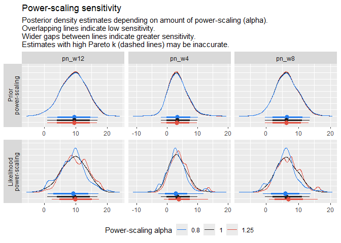<!-- -->

The diagnostics for the chains correspond to our earlier results about
the parameters. It also seems that the result is quite insensitive to
our priors.

Lastly, let us compare the LOO cross-validation scores with a model
without the treatment.

``` r
fit_beta_binomial_no_treatment <- brm(formula = cu | trials(set)  ~ cu_baseline + week + (1 | id),
                         prior = c(prior(normal(0, 1.5), class = Intercept), 
                                   prior(normal(0, 1.5), class = b)),
                         data = cu_df, beta_binomial(link = logit), save_pars = save_pars(all = TRUE), 
                         refresh = 0, silent = 2, seed = 123)
```

``` r
fit_beta_binomial_no_treatment <- add_criterion(fit_beta_binomial_no_treatment, criterion = "loo", save_psis = TRUE, moment_match = TRUE, reloo = TRUE)
```

``` r
loo_compare(fit_beta_binomial_no_treatment, fit_beta_binomial)
```

    ##                           model elpd_diff se_diff p_worse       diag_diff
    ##  fit_beta_binomial_no_treatment       0.0     0.0      NA                
    ##               fit_beta_binomial      -1.0     2.3    0.67 |elpd_diff| < 4
    ##  diag_elpd
    ##           
    ## 

We observe that the difference between models in terms of LOOIC is
small. This is because, as we learned when plotting the treatment
effects, the effect is quite small compared to aleatoric uncertainty
modeled by the random effects (and the beta-binomial model).

We can also compare the models based on expected predictions. Let’s use
the expected absolute error.

``` r
dif1 <- abs(cu_df$cu - E_loo(posterior_epred(fit_beta_binomial),
                       loo(fit_beta_binomial)$psis_object, type = "mean")$value)
                       
dif2 <- abs(cu_df$cu - E_loo(posterior_epred(fit_beta_binomial_no_treatment),
                       loo(fit_beta_binomial_no_treatment)$psis_object, type = "mean")$value)                     

dens1 <- density(dif1)
dens2 <- density(dif2)

dens_data1 <- data.frame(x = dens1$x, y = dens1$y)
dens_data2 <- data.frame(x = dens2$x, y = dens2$y)

ggplot() +  
  geom_line(data = dens_data1, aes(x = x, y = y, color = 'Model with treatment'), linewidth = 1) +  
  geom_line(data = dens_data2, aes(x = x, y = y, color = 'Model without treatment'), linewidth = 1) +
  scale_color_manual(name = "", values = c('Model with treatment' = 'blue', 'Model without treatment' = 'red')) +
  xlab('LOO-CV expected abs. error') + ylab('Distribution over Patients from the Dataset')
```

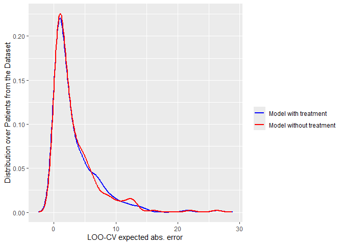<!-- -->

``` r
dens <- density(dif1 - dif2)
dens_data <- data.frame(x = dens$x, y = dens$y)

ggplot() +  
  geom_line(data = dens_data, aes(x = x, y = y), linewidth = 1) +
  xlab('LOO-CV expected abs. error (model with treatment - model without treatment)') + ylab('Distribution over Patients from the Dataset')
```

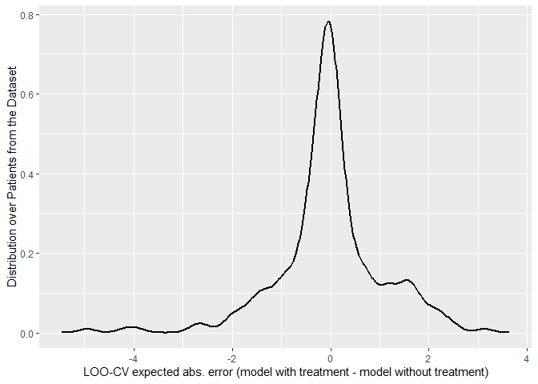<!-- -->

``` r
quantile(dif2-dif1)
```

    ##          0%         25%         50%         75%        100% 
    ## -3.12668959 -0.36835992  0.04820809  0.40418053  4.94509018

``` r
sum(dif2>dif1)/length(dif1)
```

    ## [1] 0.536965

We observe that the differences in prediction accuracy are again very
minor.

## References

<div id="refs" class="references csl-bib-body hanging-indent"
entry-spacing="0">

<div id="ref-czado2009predictive" class="csl-entry">

Czado, Claudia, Tilmann Gneiting, and Leonhard Held. 2009. “Predictive
Model Assessment for Count Data.” *Biometrics* 65 (4): 1254–61.

</div>

<div id="ref-gelman1995bayesian" class="csl-entry">

Gelman, Andrew, John B Carlin, Hal S Stern, and Donald B Rubin. 1995.
*Bayesian Data Analysis*. Chapman; Hall/CRC.

</div>

<div id="ref-gelman2007data" class="csl-entry">

Gelman, Andrew, and Jennifer Hill. 2007. *Data Analysis Using Regression
and Multilevel/Hierarchical Models*. Cambridge university press.

</div>

<div id="ref-gelman2014understanding" class="csl-entry">

Gelman, Andrew, Jessica Hwang, and Aki Vehtari. 2014. “Understanding
Predictive Information Criteria for Bayesian Models.” *Statistics and
Computing* 24 (6): 997–1016.

</div>

<div id="ref-spiegelhalter2002bayesian" class="csl-entry">

Spiegelhalter, David J, Nicola G Best, Bradley P Carlin, and Angelika
Van Der Linde. 2002. “Bayesian Measures of Model Complexity and Fit.”
*Journal of the Royal Statistical Society: Series b (Statistical
Methodology)* 64 (4): 583–639.

</div>

<div id="ref-xiao2026parameterization" class="csl-entry">

Xiao, Xingyao, and Sophia Rabe-Hesketh. 2026. “A
Parameterization-Invariant DIC.” *arXiv Preprint arXiv:2605.27844*.

</div>

</div>
