# The Third Circle: Bayes Factors

<br/>
Jiří Fejlek

2026-07-26
<br/>

<br/> At this point, we have covered a lot of aspects of Bayesian modeling,
but we have not yet mentioned hypothesis testing. Hypothesis testing is,
after all, one of the cornerstones of frequentist statistics. Thence, we
will cover *Bayes factors* (Kass and Raftery 1995) in this project, a
Bayesian version of the likelihood ratio test.

## Table of Contents

- [Bayes Factors](#bayes-factors)
- [Proportion of Girl Births
  Revisited](#proportion-of-girl-births-revisited)
- [Testing (Un)fair Coin (and the Savage-Dickey Density
  Ratio)](#testing-unfair-coin-and-the-savage-dickey-density-ratio)
- [Bayesian Paired t-test](#bayesian-paired-t-test)
- [Bayesian Two-Sample Hypothesis
  Testing](#bayesian-two-sample-hypothesis-testing)
- [Bayesian ANOVA/ANCOVA](#bayesian-anovaancova)
- [Bayesian Test of Homogeneity of
  Variances](#bayesian-test-of-homogeneity-of-variances)
- [Rat Brain Dataset](#rat-brain-dataset)
  - [Prior Predictive Check](#prior-predictive-check)
  - [Simulation-Based Calibration](#simulation-based-calibration)
  - [SBC for Checking Bayes Factors](#sbc-for-checking-bayes-factors)
- [References](#references)


``` r
library(dplyr)
library(tidyr)
library(rstan)
library(ggplot2)
library(HDInterval)
library(dplyr)
library(loo)
library(faraway)
library(patchwork)
library(brms)
library(bayesplot)
library(priorsense)
color_scheme_set("brewer-Spectral")
```

## Bayes Factors

Let us assume two competing *hypotheses* (we can think of competing
statistical models) $\mathcal H_0$ and $\mathcal H_1$, and let us assume
that we have some prior belief about their truthfulness
$p(\mathcal H_0)$ and $p(\mathcal H_1)$. We then observe data $y$, and
update our beliefs using Bayes’ rule (Gelman et al. 1995)

```math
\begin{align*}
p(\mathcal H_0 \mid y) = \frac{p(y \mid \mathcal H_0)p(\mathcal H_0)}{p(y)}\\
p(\mathcal H_1 \mid y) = \frac{p(y \mid \mathcal H_1)p(\mathcal H_1)}{p(y)}
\end{align*}
``` 
 We can compare the acquired evidence by computing the ratio between
the posterior probabilities (*posterior odds*) 
```math
\frac{p(\mathcal H_0 \mid y)}{p(\mathcal H_1 \mid y)} = \frac{p(\mathcal H_0)}{p(\mathcal H_1)} \times B(\mathcal H_0;\mathcal H_1).
``` 
We observe that the posterior odds are updated by multiplying the
*prior odds* with a so-called *Bayes factor*
```math
 B(\mathcal H_0;\mathcal H_1) = \frac{p(y \mid \mathcal H_0)}{p(y \mid \mathcal H_1)},
```
which tells us how much the evidence shifted the odds in favor of one
of the hypotheses. The more distant $B(\mathcal H_0;\mathcal H_1)$ is
from one, the stronger the evidence we observed. So far so good.

However, let us assume a typical parametrized problem
$\mathcal{H}_0: \theta_0 \in \Theta_0$ vs
$\mathcal{H}_1: \theta_1 \in \Theta_1$. The Bayes factor in this case is
a *marginalized* likelihood ratio

```math
 B(\mathcal H_0;\mathcal H_1) = \frac{p(y \mid \mathcal H_0)}{p(y \mid \mathcal H_1)} = \frac{\int p(y \mid \mathcal H_0, \theta_0) p(\theta_0 \mid \mathcal H_0) \text{ d}\theta_0}{\int p(y \mid \mathcal H_1, \theta_1) p(\theta_1 \mid \mathcal H_1) \text{ d}\theta_1},
``` 
i.e., the observed evidence $p(y \mid \mathcal H_0, \theta_0)$ and
$p(y \mid \mathcal H_1, \theta_1)$ are weighted by the prior
distribution $p(\theta_0 \mid \mathcal H_0)$ and
$p(\theta_1 \mid \mathcal H_1)$. This implies that the Bayesian factor
depends on the priors much more strongly than the posterior
distribution; this effect will not generally disappear with larger
sample sizes of $y$ (Kass and Raftery 1995).

Namely, there can be a mismatch between say
$p(y \mid \mathcal H_0, \theta_0)$ and $p(\theta_0 \mid \mathcal H_0)$,
in which $p(\theta_0 \mid \mathcal H_0)$ is large for the values that
are nonsensical according to observed $p(y \mid \mathcal H_0, \theta_0)$
and vice versa. Then the integral
$\int p(y \mid \mathcal H_0, \theta_0) p(\theta_0 \mid \mathcal H_0) \text{ d}\theta_0$
will be small and we observe very little evidence for $\mathcal{H}_0$,
even though for a different choice of $p(\theta_0 \mid \mathcal H_0)$,
the evidence for $\mathcal H_0$ would be strong.

An example of this problem is so-called Lindley’s paradox
(<https://en.wikipedia.org/wiki/Lindley’s_paradox>), in which the
Bayesian approach overwhelmingly supports the null hypothesis $p = 0.5$
vs the alternative $p \neq 0.5$, even though the standard frequentist
approach would soundly reject the null. The reason is that the prior for
the alternative is set vague (uniform distribution on
$[0,1] \setminus 0.5$), and hence, the data produce very little evidence
for $\mathcal{H}_1$ compared to the evidence for $\mathcal{H}_0$.

This dependence on priors is not a bug; it is a feature; it means that
Bayes factors are coherent with respect to Bayesian updating
(<https://www.bayesianspectacles.org/bayes-factors-for-those-who-hate-bayes-factors-part-ii-lord-ludicrus-vampire-count-of-incoherence-insists-on-a-dance/>).
However, it means that we have to be even more careful when postulating
our priors.

We should also note that in some particular cases, the computation of
Bayes factors simplifies quite a bit. The first case is point hypotheses
$\mathcal{H}_0: \theta = \theta_0$
vs. $\mathcal{H}_1: \theta = \theta_1$ in which the Bayes factor reduces
to the standard likelihood ratio 
```math
 B(\mathcal H_0;\mathcal H_1) = \frac{p(y \mid \mathcal H_0)}{p(y \mid \mathcal H_1)} = \frac{p(y\mid \theta_0)}{p(y\mid \theta_1)}.
``` 
The second type are hypothesis such as
$\mathcal{H}_0: \theta > \theta_0$
vs. $\mathcal{H}_1: \theta \leq \theta_0$. Then, we can specify a single
prior $p(\theta)$ on the full parameter space $\Theta$ (Bozza et al.
2022), and we can derive the Bayes factor directly from the prior odds
```math
\text{prior odds} = \frac{p(\mathcal H_0)}{p(\mathcal H_1)} = \frac{p(\theta > \theta_0)}{p(\theta \leq \theta_0)}.
``` 
and the posterior odds
```math
\text{posterior odds} = \frac{p(\mathcal{H_0} \mid y)}{p(\mathcal{H}_1 \mid y)} = \frac{p(\theta>\theta_0 \mid y)}{p(\theta \leq \theta_0\mid y)}  = \frac{p_\text{post}(\theta>\theta_0)}{p_\text{post}(\theta \leq \theta_0)}.
```
as
```math
B(\mathcal H_0;\mathcal H_1) = \frac{\text{posterior odds}}{\text{prior odds}}
```

We observe that that this approach generalizes to tests
$\mathcal{H}_0: \theta \in \Theta_0$
vs. $\mathcal{H}_1: \theta \in \Theta\setminus\Theta_0$, in which the
measure of $p(\Theta_0) > 0$ since 
```math
\begin{align*}
\text{prior odds} &= \frac{p(\mathcal H_0)}{p(\mathcal H_1)} = \frac{p(\theta \in \Theta_0)}{p(\theta \in \Theta_0 \setminus \Theta)}\\
\text{posterior odds} &= \frac{p(\mathcal{H_0} \mid y)}{p(\mathcal{H}_1 \mid y)} = \frac{p(\theta \in \Theta_0 \mid y)}{p(\theta \in \Theta_0 \setminus \Theta\mid y)}  = \frac{p_\text{post}(\theta \in \Theta_0)}{p_\text{post}(\theta \in \Theta_0 \setminus \Theta)}.
\end{align*}
```

However, notice that this “trick” does not work on the “fabled” null
hypothesis testing $\mathcal{H}_0: \theta = \theta_0$
vs. $\mathcal{H}_1: \theta \neq \theta_0$, since the prior probability
for $\mathcal{H}_0$ would be zero (unless $\theta$ is discrete). Thus,
the computation of $B(\mathcal H_0;\mathcal H_1)$ will include the
marginalized likelihood under the alternative. The computation itself is
often pretty simple, since there is a simplification called the
*Savage-Dickey density ratio* that we will derive in a bit.

Also importantly, the parameter space under the null and under the
alternative can partially overlap when comparing two models. Or we are
dealing with models with completely different parametrizations
altogether. Then we have to rely on computing marginalized likelihoods,
usually numerically. Although, to be fair, such hypothesis tests (we are
referring here to so-called non-nested models) are also extremely
difficult in the frequentist setting, Bayes factors at least give us a
general algorithmic approach that we can employ.

Let us demonstrate hypothesis testing using Bayes factors; we start with
simple models that have a single parameter.

## Proportion of Girl Births Revisited

Let us return to the problem of estimating the proportion of girl
births. We assumed that 60 girls and 63 boys have been observed. Let’s
consider two competing hypotheses $\mathcal{H}_0 : \theta > 1/2$ vs
$\mathcal{H}_1 : \theta \leq 1/2$. We mentioned in the previous section
that we only need to specify a prior on the proportion $\theta$. Let’s,
for example, use an uninformative uniform prior $\theta \sim U(0,1)$,
Then the prior probabilities of both hypotheses under our noninformative
prior are $1/2$, i.e., the prior odds meet 
```math
\text{prior odds} = \frac{p(\mathcal H_0)}{p(\mathcal H_1)} = 1.
``` 
After observing the data, we update our estimate of the proportion
$\theta$. Since, our prior is conjugate prior
$\theta \sim U(0,1) = \text{Beta}(1,1)$ for the binomial distribution,
we can derive posterior for $\theta$ as 
```math
\theta_\text{post} \sim \text{Beta}(60 + 1/2, 63 + 1/2).
```
Thus, we can compute the posterior odds directly using the cumulative
distribution function of $\text{Beta}(60.5, 63.5)$.

```math
\text{posterior odds} = \frac{p(\mathcal{H_0} \mid y)}{p(\mathcal{H}_1 \mid y)} = \frac{p(\theta>1/2 \mid y)}{p(\theta \leq 1/2 \mid y)}  = \frac{1-F_{\text{Beta}(60.5,63.5)}(1/2)}{F_{\text{Beta}(60.5,63.5)}(1/2)} \approx 0.65 .
```

``` r
(1- pbeta(0.5,60.5,63.5))/pbeta(0.5,60.5,63.5)
```

    ## [1] 0.6486785

Since our prior odds are 1, the posterior odds are equal to the Bayes
factor $B(\mathcal H_0;\mathcal H_1)$, and thence,
$B(\mathcal H_0;\mathcal H_1) \approx 0.65$. The Bayes factor supports
$\mathcal{H}_1 : \theta < 1/2$, although the evidence is very weak
($B(\mathcal H_1;\mathcal H_0) = 1/\mathcal B(H_0;\mathcal H_1) \approx 1.54 < 5$)
using the standard *Jeffreys’ scale* interpretation
(<https://en.wikipedia.org/wiki/Bayes_factor>).

``` r
n <- 60 + 63
y <- 60

alpha <- y + 1
beta <- n - y + 1
  
curve(dbeta(x, alpha, beta, ncp = 0, log = FALSE), from = 0.40, to = 0.58, 
      col = "blue", lwd = 2, ylab = "Posterior PDF", xlab = "Theta")

abline(v = (y+1)/(n +2), lty = "dotted", lwd = 2, col = "red")
```

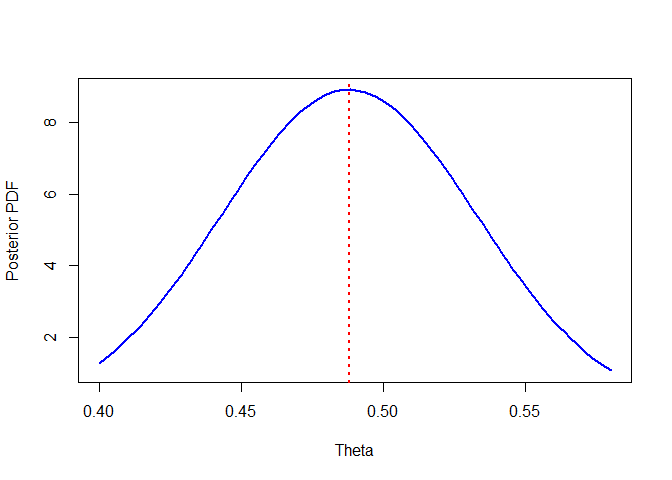<!-- -->

Let us consider 241,945 girls and 251,527 boys, which is data that
Laplace analyzed (Gelman et al. 1995).

``` r
(1- pbeta(0.5, 241945.5, 251527.5))/pbeta(0.5, 241945.5, 251527.5)
```

    ## [1] 0

We observe that $\mathcal H_0$ has no support after observing this
dataset.

``` r
n <- 241945 + 251527
y <- 241945

alpha <- y + 1
beta <- n - y + 1
  
curve(dbeta(x, alpha, beta, ncp = 0, log = FALSE), from = 0.488, to = 0.493, 
      col = "blue", lwd = 2, ylab = "Posterior PDF", xlab = "Theta")

abline(v = (y+1)/(n +2), lty = "dotted", lwd = 2, col = "red")
```

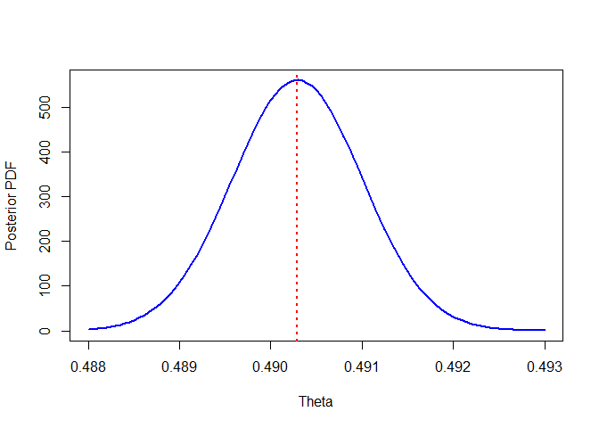<!-- -->

## Testing (Un)fair Coin (and the Savage-Dickey Density Ratio)

Let us consider a problem of testing a null hypothesis for a binomial
model. The marginal likelihood of the model under the null
$\mathcal{H}_0:\theta = \theta_0 =0.5$ is simply the binomial likelihood
```math
p(y \mid \mathcal{H}_0) = \binom{n}{y}\theta_0^y(1-\theta_0)^{N-y}
```

Let us assume an alternative $\mathcal{H}_1$ in which $\theta$ has a
beta prior $p(\theta\mid\mathcal{H}_1)= \text{Beta}(\alpha, \beta)$. The
marginal likelihood under the alternative is the binomial distribution
in which $\theta$ is drawn randomly from the beta prior
$\text{Beta}(\alpha, \beta)$, i.e., it is the beta-binomial distribution
(Kruschke et al. 2014) (here $B$ denotes the beta function)
```math
p(y \mid \mathcal{H}_1) = \binom{n}{y}\frac{B(y + \alpha, n-y + \beta)}{B(\alpha, \beta)} \sim \text{Beta-Binomial}(n,\alpha,\beta).
```

Let us compute Bayes Factors for the alternative for various beta priors
(we will assume $y = 6, N = 24$).

```math
B(\mathcal{H}_1;\mathcal{H}_0) = \frac{B(y + \alpha, n-y + \beta)}{\theta_0^y(1-\theta_0)^{N-y} B(\alpha, \beta)}
```

``` r
x_vals <- seq(0, 1, 0.001)

beta_data <- expand.grid(x = x_vals, shape1 = c(0.01, 0.1, 1, 10, 25, 5, 10))
shape2 <- c(0.01, 0.1, 1, 10, 25,  10, 5)
beta_data$shape2  <- rep(shape2, each = length(x_vals))                      
                        
beta_data <- beta_data  %>%
  mutate(
    Density = dbeta(x, shape1, shape2),
    Parameters = factor(paste0("Beta(", shape1, ", ", shape2, ")"))
  )


ggplot(beta_data, aes(x = x, y = Density, color = Parameters)) +
  geom_line(linewidth = 1.2) +
  theme_minimal(base_size = 14) +
  labs(
    title = " ",
    x = " ",
    y = "Probability Density",
    color = "Distribution"
  )
```

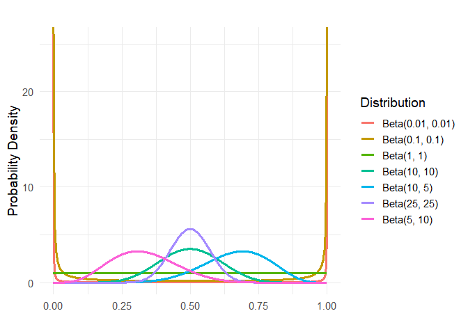<!-- -->

``` r
N <- 24
y <- 6   
  
library(extraDistr)
shape1 = c(0.01, 0.1, 1, 10, 25, 5, 10)
shape2 <- c(0.01, 0.1, 1, 10, 25,  10, 5)

BF <- numeric(length(shape1))

for (i in 1:length(shape1)){
  
  BF[i] <- dbbinom(x = y, size = N, alpha = shape1[i], beta = shape2[i])/(choose(N, y)*(0.5)^24)
  
}

data.frame(BF, shape1, shape2)
```

    ##           BF shape1 shape2
    ## 1  0.1361243   0.01   0.01
    ## 2  1.1803707   0.10   0.10
    ## 3  4.9859479   1.00   1.00
    ## 4  3.6527856  10.00  10.00
    ## 5  2.2102071  25.00  25.00
    ## 6 12.6875956   5.00  10.00
    ## 7  0.4719540  10.00   5.00

We observe that depending on our priors, the Bayes factors vary quite a
lot. Some results even favor the null! For a comparison, let us compute
a frequentist exact binomial test $\mathcal{H}_0:\theta = 0.5$ vs
$\mathcal{H}_1:\theta \neq 0.5$.

``` r
binom.test(y, N, p = 0.5)
```

    ## 
    ##  Exact binomial test
    ## 
    ## data:  y and N
    ## number of successes = 6, number of trials = 24, p-value = 0.02266
    ## alternative hypothesis: true probability of success is not equal to 0.5
    ## 95 percent confidence interval:
    ##  0.09773041 0.46711280
    ## sample estimates:
    ## probability of success 
    ##                   0.25

We observe that the test would reject the null using the standard cutoff
$\text{P-value} = 0.05$. So which Bayes factor is correct? Well, all of
them are provided that we have the corresponding alternative hypothesis
in mind.

The highest Bayes factor is observed for the prior
$p(\theta \mid \mathcal{H}_1) = \text{Beta}(5,10)$, i.e., we *a priori*
assume that the coin is biased and the observed data provide the bias in
the same direction as our prior. For the opposite bias
$p(\theta \mid \mathcal{H}_1) = \text{Beta}(10,5)$, the Bayes factor
actually favors the null because the null hypothesis is still more
consistent with the data than our proposed alternative.

Provided that we apriori assume the the coin is somewhat fair, it
probably makes sense to use an alternative such as
$p(\theta \mid \mathcal{H}_1) = \text{Beta}(5,5)$ or
$p(\theta \mid \mathcal{H}_1) = \text{Beta}(10,10)$, which still prefer
a fair coin, but allow for some discrepancies in either direction.

We could also consider the flat prior
$p(\theta \mid \mathcal{H}_1) = \text{Beta}(0,0)$, which here works just
fine. However, there is a risk of Lindley’s paradox
(<https://en.wikipedia.org/wiki/Lindley’s_paradox>) if the bias of the
coin is small.

Let us check what would happen if we observed five times more data and
kept the proportions the same.

``` r
N <- 120
y <- 30 

shape1 = c(0.01, 0.1, 1, 10, 25, 5, 10)
shape2 <- c(0.01, 0.1, 1, 10, 25,  10, 5)

BF <- numeric(length(shape1))

for (i in 1:length(shape1)){
  
  BF[i] <- dbbinom(x = y, size = N, alpha = shape1[i], beta = shape2[i])/(choose(N, y)*(0.5)^N)
  
}

data.frame(BF, shape1, shape2)
```

    ##           BF shape1 shape2
    ## 1   17113.11   0.01   0.01
    ## 2  149124.24   0.10   0.10
    ## 3  647166.65   1.00   1.00
    ## 4  243094.32  10.00  10.00
    ## 5   28888.16  25.00  25.00
    ## 6 1839530.50   5.00  10.00
    ## 7   14808.11  10.00   5.00

We observe that all the alternatives would be strongly supported against
the null. This is because the likelihood ultimately concentrates on the
true value of the parameter $\theta$, which is far from 0.5, making the
marginal prior for the null extremely small. Hence, it overcomes even
our “poorer” choices (with respect to the actual reality) of priors
under the alternative.

We mentioned in the introduction that the computation of Bayes factors
for null hypothesis testing can be simplified using the Savage-Dickey
density ratio. Let’s assume a one-parameter model and a test of the
hypothesis $\mathcal{H}_0: \theta = \theta_0$
vs. $\mathcal{H}_1: \theta \sim p(\theta \mid \mathcal{H}_1)$. To derive
the Savage-Dickey Density Ratio, let us write the Bayes factor
$B(\mathcal H_0;\mathcal H_1)$ and multiply both the numerator and the
denominator by the prior density under the alternative evaluated
at $\theta_0$ (see <https://statproofbook.github.io/P/bf-sddr.html>). 
```math
B(\mathcal H_0;\mathcal H_1) = \frac{p(y \mid \mathcal H_0)}{p(y \mid \mathcal H_1)} = \frac{p(y \mid \theta_0)}{\int p(y \mid \mathcal{H}_1,\theta)p(\theta \mid \mathcal{H}_1)\text{ d}\theta} \times \frac{p(\theta_0 \mid \mathcal{H}_1)}{p(\theta_0 \mid \mathcal{H}_1)}
``` 
Then, we compute the posterior density under the alternative using
the Bayes formula.
```math
p(\theta \mid y, \mathcal{H}_1) = \frac{p(y \mid, \mathcal{H}_1, \theta)p(\theta \mid \mathcal{H}_1)}{ \int p(y \mid, \mathcal{H}_1, \theta)p(\theta \mid \mathcal{H}_1) \text{ d}\theta}
```
This implies that the posterior density for $\theta_0$ under the
alternative is
```math
p(\theta_0 \mid y, \mathcal{H}_1) = \frac{p(y \mid \mathcal{H}_1, \theta_0)p(\theta_0 \mid \mathcal{H}_1)}{ \int p(y \mid, \mathcal{H}_1, \theta)p(\theta \mid \mathcal{H}_1) \text{ d}\theta} = \frac{p(y \mid \theta_0)p(\theta_0 \mid \mathcal{H}_1)}{ \int p(y \mid, \mathcal{H}_1, \theta)p(\theta \mid \mathcal{H}_1) \text{ d}\theta},
```
which we can substitute back into the formula for the Bayes factor
and obtain
```math
B(\mathcal H_0;\mathcal H_1) = \frac{p(\theta_0 \mid y, \mathcal{H}_1)}{p(\theta_0 \mid \mathcal{H_1})}.
```
which is known as the Savage-Dickey density ratio: the Bayes factor
equals the posterior under the alternative divided by the prior under
the alternative, both evaluated at $\theta_0$. From this formula, we can
clearly see that the null is preferred provided that the prior
$p(\theta_0 \mid \mathcal{H_1})$ is small compared to the posterior
$p(\theta_0 \mid y, \mathcal{H}_1)$.

Let us use the Savage-Dickey density ratio for our example.

``` r
library(extraDistr)

N <- 24
y <- 6   
  
shape1 = c(0.01, 0.1, 1, 10, 25, 5, 10)
shape2 <- c(0.01, 0.1, 1, 10, 25,  10, 5)

BF <- numeric(length(shape1))
BF_SD_ratio <- numeric(length(shape1))

for (i in 1:length(shape1)){
  
  BF[i] <- dbbinom(x = y, size = N, alpha = shape1[i], beta = shape2[i])/(choose(N, y)*(0.5)^24)
  BF_SD_ratio[i] <- dbeta(0.5,shape1[i],shape2[i])/dbeta(0.5,shape1[i]+y,shape2[i] + N -y)
  
}

data.frame(BF, BF_SD_ratio, shape1, shape2)
```

    ##           BF BF_SD_ratio shape1 shape2
    ## 1  0.1361243   0.1361243   0.01   0.01
    ## 2  1.1803707   1.1803707   0.10   0.10
    ## 3  4.9859479   4.9859479   1.00   1.00
    ## 4  3.6527856   3.6527856  10.00  10.00
    ## 5  2.2102071   2.2102071  25.00  25.00
    ## 6 12.6875956  12.6875956   5.00  10.00
    ## 7  0.4719540   0.4719540  10.00   5.00

We got the same results as expected.

We derived the Savage-Dickey Density Ratio for a simple single-parameter
problem. However, let us assume a multiparameter model for which we want
to test whether a parameter of interest meets $\theta = \theta_0$. We
see from the derivations that to make the derivations valid,
```math
p(y \mid \mathcal{H}_0)  =  p(y \mid \theta_0, \mathcal{H}_1)
```
must
hold. Let denote the remaining “nuisance” parameters of the model as
$\varphi$. We can then write
(<https://statproofbook.github.io/P/bf-sddr.html>)

$$
\begin{align*}
p(y \mid \mathcal{H}_0) &= \int p(y \mid \varphi, \mathcal{H}_0)p(\varphi \mid \mathcal{H}_0)\text{ d}\varphi\\
& = \int p(y \mid \theta_0, \varphi, \mathcal{H}_1)p(\varphi \mid \mathcal{H}_0)\text{ d}\varphi\\
& = \int p(y \mid \theta_0, \varphi, \mathcal{H}_1)p(\varphi \mid \theta_0,\mathcal{H}_1)\text{ d}\varphi =p(y \mid \theta_0,\mathcal{H}_1),
\end{align*}
$$ in which the second last equality holds provided that
$$p(\varphi \mid \mathcal{H}_0) = p(\varphi \mid \theta_0,\mathcal{H}_1).$$
In other words, the Savage-Dickey density ratio is valid provided that
the prior of the nuisance parameters under the null model equals the
conditional prior of the nuisance parameters under the alternative for
$\theta = \theta_0$. We can meet these conditions, e.g., by selecting
priors for $\theta$ and $\phi$ that are independent.

## Bayesian Paired t-test

Let us have a look at the famous *sleep* dataset that William Sealy
Gosset (Student) used to introduce the *Student’s paired t-test*. The
experiment investigated sleep-inducing effects of two soporific drugs.

``` r
head(sleep)
```

    ##   extra group ID
    ## 1   0.7     1  1
    ## 2  -1.6     1  2
    ## 3  -0.2     1  3
    ## 4  -1.2     1  4
    ## 5  -0.1     1  5
    ## 6   3.4     1  6

We observe that the data consist of measurements of **extra** (increase
in hours of sleep compared to control) for patients **ID** depending on
the drug-given **group**.

``` r
ggplot(data = sleep, aes(x = group, y = extra, fill = group)) + geom_boxplot(show.legend = FALSE) + scale_fill_manual(values = c("lightblue", "lightpink"))
```

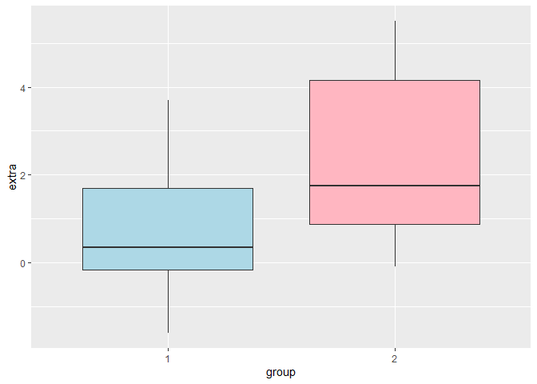<!-- -->

``` r
ggplot(sleep, aes(x = ID, y = extra, group = ID )) +
  geom_line(color = "gray70", linewidth = 0.8) +
  geom_point(aes(color = group ), size = 3) +
  theme_minimal() +
  labs(
    title = "",
    x = "ID",
    y = "extra"
  )
```

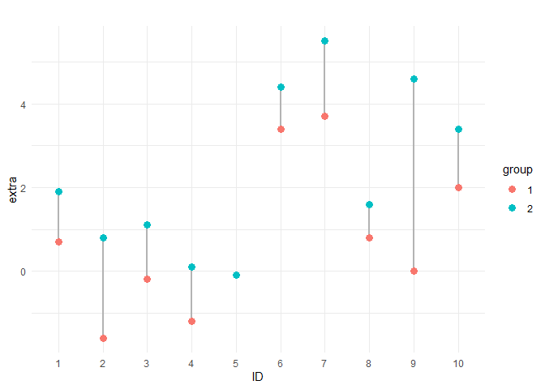<!-- -->

The way to analyze the data is actually pretty simple. We can compute
the difference between two observations for each patient and then fit
the model $\mathcal{H}_1$ (we assume that the differences have an
approximately normal distribution)
```math
\begin{align*}
\text{Group2} - \text{Group1} &\sim N(\mu, \sigma^2)\\
\mu & \sim N(0,1)\\
\sigma & \sim \text{Student}_3(0,2.5).\\ 
\end{align*}
```
We expect the effect to be small a priori, so we set the prior for
$\mu$ to $N(0,1)$. The prior for $\sigma$ is the default choice of
*brms* (the choice is much less critical since these parameters are
included in both models $\mathcal{H}_0: \mu = 0$ and $\mathcal{H}_1$
(Rouder et al. 2009)).

``` r
# we include save_pars = save_pars(all = TRUE) for bridge sampling, we also increase the number of iterations (conservative rule of thumb is 10-20 times more samples than for estimating parameters)

sleep_dif <- sleep[1:10,]$extra - sleep[11:20,]$extra

sleep_lr <- brm(sleep_dif ~ 1, family = gaussian(),  prior = prior(normal(0, 1), class = 'Intercept'), refresh = 0, silent = 2, seed = 123, data = as.data.frame(sleep_dif), sample_prior = "yes", save_pars = save_pars(all = TRUE), iter = 10000, warmup = 2000)
```

``` r
summary(sleep_lr)
```

    ##  Family: gaussian 
    ##   Links: mu = identity 
    ## Formula: sleep_dif ~ 1 
    ##    Data: as.data.frame(sleep_dif) (Number of observations: 10) 
    ##   Draws: 4 chains, each with iter = 10000; warmup = 2000; thin = 1;
    ##          total post-warmup draws = 32000
    ## 
    ## Regression Coefficients:
    ##           Estimate Est.Error l-95% CI u-95% CI Rhat Bulk_ESS Tail_ESS
    ## Intercept    -1.31      0.43    -2.09    -0.39 1.00    17367    13812
    ## 
    ## Further Distributional Parameters:
    ##       Estimate Est.Error l-95% CI u-95% CI Rhat Bulk_ESS Tail_ESS
    ## sigma     1.41      0.39     0.88     2.38 1.00    16200    15691
    ## 
    ## Draws were sampled using sampling(NUTS). For each parameter, Bulk_ESS
    ## and Tail_ESS are effective sample size measures, and Rhat is the potential
    ## scale reduction factor on split chains (at convergence, Rhat = 1).

We observe from the credible interval that the intercept is clearly
non-zero. To make the appropriate test, we will fit the null model
without the intercept.

``` r
sleep_lr_null <- brm(sleep_dif ~ -1, family = gaussian(), refresh = 0, silent = 2, seed = 123, data = as.data.frame(sleep_dif), sample_prior = "yes", save_pars = save_pars(all = TRUE), iter = 10000, warmup = 2000)
```

We can then compute the Bayes factor by *bayes_factor* that estimates
marginalized likelihoods using *bridge sampling*
(<https://www.rdocumentation.org/packages/brms/versions/2.22.0/topics/bayes_factor.brmsfit>).

``` r
bayes_factor(sleep_lr, sleep_lr_null, silent = TRUE)
```

    ## Estimated Bayes factor in favor of sleep_lr over sleep_lr_null: 19.34355

We have obtained strong evidence (\>10 (Kass and Raftery 1995)) against
the null. For comparison, a standard paired t-test is as follows.

``` r
t.test(sleep$extra[sleep$group==1], sleep$extra[sleep$group==2], paired = TRUE)
```

    ## 
    ##  Paired t-test
    ## 
    ## data:  sleep$extra[sleep$group == 1] and sleep$extra[sleep$group == 2]
    ## t = -4.0621, df = 9, p-value = 0.002833
    ## alternative hypothesis: true mean difference is not equal to 0
    ## 95 percent confidence interval:
    ##  -2.4598858 -0.7001142
    ## sample estimates:
    ## mean difference 
    ##           -1.58

For these simple examples, we do not have to construct appropriate
Bayesian regression models using *brms*. Instead, we can test Bayesian
hypotheses using the package *BayesFactor*. A Bayesian test for
$\mu = 0$ for a sample from a normal distribution is implemented as
*ttestBF*. This function uses the Bayesian t-test from (Rouder et al.
2009) based on *Jeffreys-Zellner-Siow priors*

```math
\begin{align*}
\text{Group2} - \text{Group1} &\sim N(\delta\sigma, \sigma^2)\\
\delta & \sim \text{Cauchy}(0,r)\\
\sigma & \sim 1/\sigma^2.\\ 
\end{align*}
``` 
The default choice for $r$ in *ttestBF* is
$r = \sqrt{2}/2 \approx 0.707$.

``` r
library(BayesFactor)
ttestBF(sleep$extra[sleep$group==1]- sleep$extra[sleep$group==2])
```

    ## Bayes factor analysis
    ## --------------
    ## [1] Alt., r=0.707 : 17.25888 ±0%
    ## 
    ## Against denominator:
    ##   Null, mu = 0 
    ## ---
    ## Bayes factor type: BFoneSample, JZS

We got a very similar result to the one we obtained by fitting a model
in *brms*.

## Bayesian Two-Sample Hypothesis Testing

Let us now consider a two-sample hypothesis testing problem, sometimes
referred to as *A/B testing*. In particular, we will consider the
problem from
<https://www.bayesianspectacles.org/do-the-data-speak-for-themselves-a-bayesian-analysis-of-a-labor-law-case/>.
The question at hand is to assess whether there was a notable change in
the number of judgements in which the Dutch courts imposed restrictions
on trade unions before 2015 and after (the issue was raised due to the
two judgements in 2014/2015 by the Dutch supreme court, which could
impact future judgements of Dutch lower courts).

The data are as follows (**y** is the number of judgments that impose
restrictions out of **N** cases; **interv** denotes the cases before and
after the two supreme court judgments).

``` r
judgements <- data.frame(y = c(15,14), N = c(27,33), interv = c(0,1))
judgements
```

    ##    y  N interv
    ## 1 15 27      0
    ## 2 14 33      1

To investigate this issue, we can use a simple binomial model. Again,
since we expect the effect to be somewhat small, we will use a normal
prior $N(0,1.5)$ for **interv**. Otherwise, we will stick to the default
priors.

``` r
summary(judgements_bin)
```

    ##  Family: binomial 
    ##   Links: mu = logit 
    ## Formula: y | trials(N) ~ interv 
    ##    Data: judgements (Number of observations: 2) 
    ##   Draws: 4 chains, each with iter = 10000; warmup = 2000; thin = 1;
    ##          total post-warmup draws = 32000
    ## 
    ## Regression Coefficients:
    ##           Estimate Est.Error l-95% CI u-95% CI Rhat Bulk_ESS Tail_ESS
    ## Intercept     0.20      0.38    -0.54     0.94 1.00    23652    20390
    ## interv       -0.48      0.50    -1.49     0.49 1.00    24729    20190
    ## 
    ## Draws were sampled using sampling(NUTS). For each parameter, Bulk_ESS
    ## and Tail_ESS are effective sample size measures, and Rhat is the potential
    ## scale reduction factor on split chains (at convergence, Rhat = 1).

By looking at the credible intervals, the evidence that the effect of
**interv** differs substantially from zero is weak. Let us fit the null
model

and compute the Bayes factor.

``` r
bayes_factor(judgements_bin, judgements_bin_null, silent = TRUE)
```

    ## Estimated Bayes factor in favor of judgements_bin over judgements_bin_null: 0.52975

Indeed, we have no evidence against the null. We did not have to fit the
null; we could calculate the Bayes factor directly using the
Savage-Dickey density ratio.

``` r
null_hyp <- hypothesis(judgements_bin, "interv = 0")
1/null_hyp$hypothesis$Evid.Ratio
```

    ## [1] 0.511063

For a comparison, an analogous frequentist test for this problem would
be as follows.

``` r
prop.test(judgements$y, judgements$N, alternative = 'two.sided')
```

    ## 
    ##  2-sample test for equality of proportions with continuity correction
    ## 
    ## data:  judgements$y out of judgements$N
    ## X-squared = 0.56696, df = 1, p-value = 0.4515
    ## alternative hypothesis: two.sided
    ## 95 percent confidence interval:
    ##  -0.1544755  0.4171018
    ## sample estimates:
    ##    prop 1    prop 2 
    ## 0.5555556 0.4242424

Again, we do not have to transform the hypothesis testing into
regression models and fit them by ourselves. We will also demonstrate
using the *abtest* package (Gronau, KN, and Wagenmakers 2021), which
does the test for us and a bit more. Specifically, *abtest* fits the
following models of proportions
```math
\begin{align*}
y_1 & \sim \text{Binomial}(N_1,p_1)\\
y_2 & \sim \text{Binomial}(N_2,p_2)\\
\text{logit }(p_1) & = \beta - \phi/2\\
\text{logit }(p_2) & = \beta + \phi/2\\
\beta & \sim N(\mu_\beta, \sigma_\beta^2)\\
\phi & \sim N(\mu_\phi, \sigma_\phi^2),
\end{align*}
``` 
where the default choices are $\beta \sim N(0, 1)$,
$\phi \sim N(0, 1)$. We observe that the null hypothesis corresponds to
$\phi = 0$. Let us first test our original hypothesis of testing a
non-zero effect.

``` r
library(abtest)
judgements2 <- list(y1 = 15, n1 = 27, y2 = 14, n2 = 33)
prior_prob <- c(0.5, 0, 0, 0.5) # prior probabilities
names(prior_prob) <- c("H1", "H+", "H-", "H0")

ab <- ab_test(data = judgements2, prior_prob = prior_prob)
print(ab)
```

    ## Bayesian A/B Test Results:
    ## 
    ##  Bayes Factors:
    ## 
    ##  BF10: 0.6971496
    ##  BF+0: 0.2532301
    ##  BF-0: 1.193507
    ## 
    ##  Prior Probabilities Hypotheses:
    ## 
    ##  H1: 0.5
    ##  H0: 0.5
    ## 
    ##  Posterior Probabilities Hypotheses:
    ## 
    ##  H1: 0.4108
    ##  H0: 0.5892

``` r
prob_wheel(ab)
```

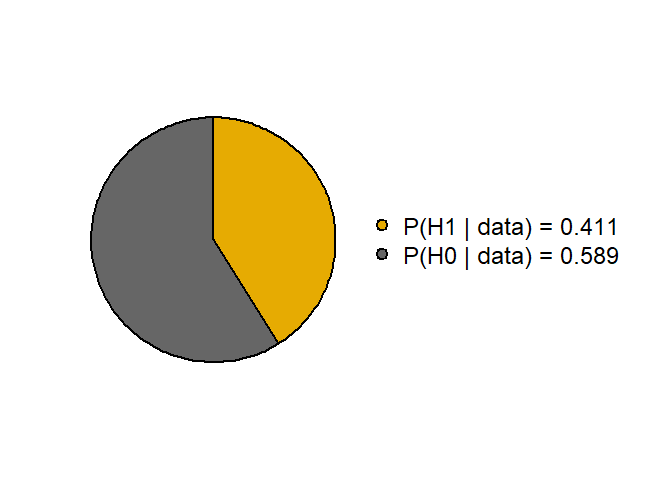<!-- -->

We observe that the data slightly favors the null. A nice thing about
*abtest* is that it also computes Bayes factors for one-sided hypotheses
(the corresponding normal prior is truncated at zero). Hence, let us
perform the test in which we consider three hypotheses $\phi = 0$,
$\phi >0$, and $\phi <0$ with prior probabilities 0.5, 0.25, and 0.25
respectively.

``` r
prior_prob <- c(0, 0.25, 0.25, 0.5)
names(prior_prob) <- c("H1", "H+", "H-", "H0")

ab <- ab_test(data = judgements2, prior_prob = prior_prob)
print(ab)
```

    ## Bayesian A/B Test Results:
    ## 
    ##  Bayes Factors:
    ## 
    ##  BF10: 0.6971496
    ##  BF+0: 0.2527483
    ##  BF-0: 1.141404
    ## 
    ##  Prior Probabilities Hypotheses:
    ## 
    ##  H+: 0.25
    ##  H-: 0.25
    ##  H0: 0.5
    ## 
    ##  Posterior Probabilities Hypotheses:
    ## 
    ##  H+: 0.0745
    ##  H-: 0.3363
    ##  H0: 0.5892

``` r
prob_wheel(ab)
```

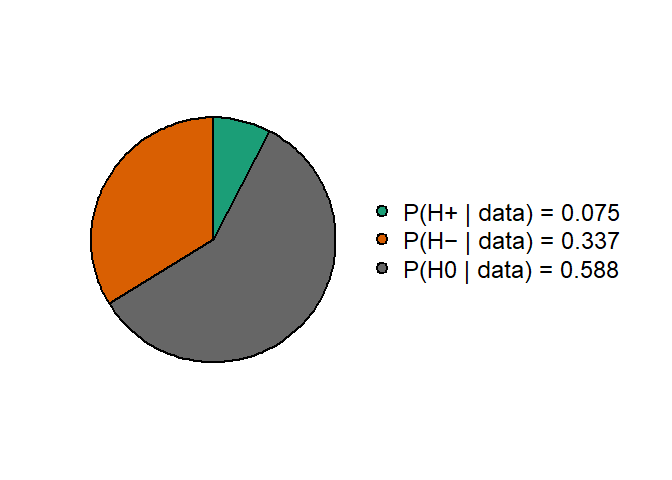<!-- -->

We observe that the Bayes factors are quite close to 1; the evidence
that the data provides is quite weak. We should note that the posterior
probabilities for multiple hypotheses are computed using the Bayes
factors as follows.

```math
p(\mathcal{H}_j \mid y) = \frac{p(y \mid \mathcal{H}_j)}{\sum_k p(y \mid \mathcal{H}_k)p(\mathcal{H}_k)} \times p(\mathcal{H}_j) = \frac{B(\mathcal{H}_j; \mathcal{H}_0)p(\mathcal{H}_j)}{\sum_kB(\mathcal{H}_k; \mathcal{H}_0)p(\mathcal{H}_k)}
```

## Bayesian ANOVA/ANCOVA

Let us continue with another standard hypothesis test: *ANOVA/ANCOVA*.
For an illustration, we will consider the textbook dataset ToothGrowth,
which contains an experiment examining how vitamin C dosage delivered in
2 different methods predicts tooth growth in guinea pigs
(<https://www.rdocumentation.org/packages/datasets/versions/3.6.2/topics/ToothGrowth>).

``` r
head(ToothGrowth)
```

    ##    len supp dose
    ## 1  4.2   VC  0.5
    ## 2 11.5   VC  0.5
    ## 3  7.3   VC  0.5
    ## 4  5.8   VC  0.5
    ## 5  6.4   VC  0.5
    ## 6 10.0   VC  0.5

``` r
summary_data <- ToothGrowth %>%
  group_by(dose, supp) %>%
  summarise(
    mean_len = mean(len),
    se = sd(len) / sqrt(n()),
    .groups = "drop"
  )

ggplot(summary_data, aes(x = dose, y = mean_len, color = supp, group = supp)) +
  geom_line(linewidth = 1) +
  geom_point(size = 3) +
  labs(
    title = "",
    x = "dose",
    y = "len",
    color = "supp"
  ) +
  theme_minimal()
```

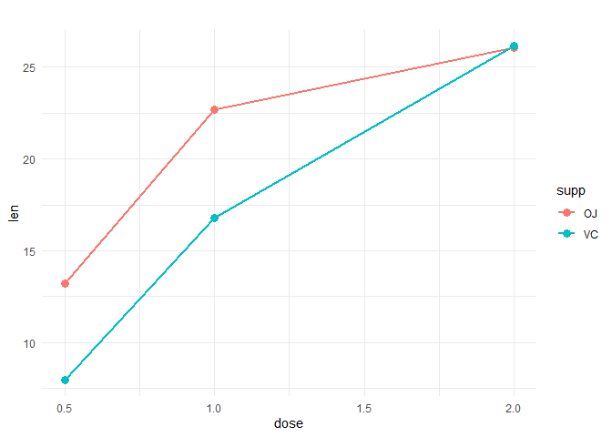<!-- -->

ANOVA/ANCOVA leads to standard linear regression models in which the
predictor of interest is a factor variable (in standard ANOVA all
covariates are factor variables, whereas in ANCOVA some covariates are
continuous). In our case, the effect of interest is **supp**: the
delivery method (orange juice or ascorbic acid). We will assume normal
priors on the regression coefficients and fit the following linear
model.

``` r
tooth_lr <- brm(len ~ supp + dose + supp:dose, family = gaussian(),  prior = prior(normal(0, 1.5), class = 'b'), refresh = 0, silent = 2, seed = 123, data = ToothGrowth, sample_prior = "yes", save_pars = save_pars(all = TRUE), iter = 10000, warmup = 2000)
```

``` r
summary(tooth_lr)
```

    ##  Family: gaussian 
    ##   Links: mu = identity 
    ## Formula: len ~ supp + dose + supp:dose 
    ##    Data: ToothGrowth (Number of observations: 60) 
    ##   Draws: 4 chains, each with iter = 10000; warmup = 2000; thin = 1;
    ##          total post-warmup draws = 32000
    ## 
    ## Regression Coefficients:
    ##             Estimate Est.Error l-95% CI u-95% CI Rhat Bulk_ESS Tail_ESS
    ## Intercept      12.11      1.26     9.73    14.66 1.00    34219    26603
    ## suppVC         -3.13      1.19    -5.46    -0.79 1.00    25677    24171
    ## dose            6.47      0.94     4.55     8.24 1.00    30326    24453
    ## suppVC:dose     1.23      0.93    -0.59     3.03 1.00    26435    24499
    ## 
    ## Further Distributional Parameters:
    ##       Estimate Est.Error l-95% CI u-95% CI Rhat Bulk_ESS Tail_ESS
    ## sigma     4.67      0.52     3.78     5.82 1.00    27455    22926
    ## 
    ## Draws were sampled using sampling(NUTS). For each parameter, Bulk_ESS
    ## and Tail_ESS are effective sample size measures, and Rhat is the potential
    ## scale reduction factor on split chains (at convergence, Rhat = 1).

We can immediately get the Bayes factor for the interaction term using
the Savage-Dickey Density Ratio.

``` r
null_hyp <- hypothesis(tooth_lr, "suppVC:dose = 0")
1/null_hyp$hypothesis$Evid.Ratio
```

    ## [1] 1.482325

We get very weak evidence for the presence of the interaction in the
model. To test the effect of **supp**, we will fit the following null
hypothesis model and evaluate the Bayes factor using bridge sampling.

``` r
tooth_lr_null <- brm(len ~ dose , family = gaussian(),  prior = prior(normal(0, 1.5), class = 'b'), refresh = 0, silent = 2, seed = 123, data = ToothGrowth, save_pars = save_pars(all = TRUE), iter = 10000, warmup = 2000)
bayes_factor(tooth_lr, tooth_lr_null, silent = TRUE)
```

    ## Estimated Bayes factor in favor of tooth_lr over tooth_lr_null: 12.76543

We get strong evidence against the null hypothesis. Let’s have a look at
frequentist tests. First, we check the significance of interactions.

``` r
anova(lm(len ~ supp + dose + supp:dose, data = ToothGrowth), lm(len ~ supp + dose , data = ToothGrowth))
```

    ## Analysis of Variance Table
    ## 
    ## Model 1: len ~ supp + dose + supp:dose
    ## Model 2: len ~ supp + dose
    ##   Res.Df     RSS Df Sum of Sq      F  Pr(>F)  
    ## 1     56  933.63                              
    ## 2     57 1022.56 -1    -88.92 5.3335 0.02463 *
    ## ---
    ## Signif. codes:  0 '***' 0.001 '**' 0.01 '*' 0.05 '.' 0.1 ' ' 1

We would reject the hypothesis provided that we use the standard cutoff
of a P-value of 0.05. Next, we test the significance of **supp**.

``` r
anova(lm(len ~ supp + dose + supp:dose, data = ToothGrowth), lm(len ~ dose, data = ToothGrowth))
```

    ## Analysis of Variance Table
    ## 
    ## Model 1: len ~ supp + dose + supp:dose
    ## Model 2: len ~ dose
    ##   Res.Df     RSS Df Sum of Sq      F   Pr(>F)    
    ## 1     56  933.63                                 
    ## 2     58 1227.91 -2   -294.27 8.8253 0.000466 ***
    ## ---
    ## Signif. codes:  0 '***' 0.001 '**' 0.01 '*' 0.05 '.' 0.1 ' ' 1

The P-value is much smaller, below 0.0005. This indicates that the
observed data are not very compatible with the null hypothesis. Our
result nicely illustrates a general observation that P-values just below
0.05 usually indicate pretty weak evidence in terms of Bayes factors
(below 5). In contrast, P-values below 0.005 often indicate strong
evidence (Bayes factors above 10) (Benjamin et al. 2018).

## Bayesian Test of Homogeneity of Variances

We will consider a Bayesian version of *Bartlett’s test* of
homoscedasticity of several samples from a normal distribution. We will
use the dataset *InsectSprays*, which contains counts of insects in
agricultural experimental units treated with different insecticides
(<https://www.rdocumentation.org/packages/datasets/versions/3.6.2/topics/InsectSprays>)
and is used to demonstrate Bartlett’s test; see
<https://stat.ethz.ch/R-manual/R-devel/library/stats/html/bartlett.test.html>.

``` r
head(InsectSprays)
```

    ##   count spray
    ## 1    10     A
    ## 2     7     A
    ## 3    20     A
    ## 4    14     A
    ## 5    14     A
    ## 6    12     A

``` r
ggplot(InsectSprays, aes(x = count, fill = spray)) +
  geom_histogram(bins = 10, color = "white", alpha = 0.8) +
  facet_wrap(~ spray, nrow = 2) +
  labs(title = "",
       x = "Counts",
       y = "Frequency") +
  theme_minimal() +
  theme(legend.position = "none")
```

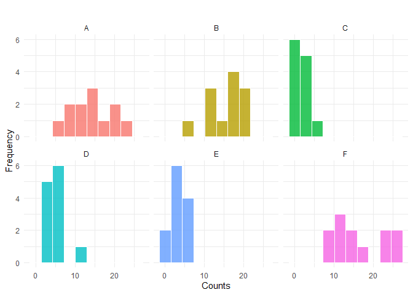<!-- -->

We will not consider insecticide C in the test, since the counts are low
and thus the normal approximation is not really appropriate. We will fit
the following (heteroskedasticity) model 
```math
\begin{align*}
y & \sim N(\mu, \sigma^2)\\
\mu &= \text{Intercept}_\mu + \text{spray}_\mu\\
\sigma &= \text{exp}(\text{Intercept}_\sigma + \text{spray}_\sigma)\\
\text{Intercept}_\mu&\sim \text{Student}_3(7,7.4)\\
\text{Intercept}_\sigma&\sim \text{Student}_3(0,2.5)\\
\text{spray}_\mu & \sim 1\\
\text{spray}_\sigma & \sim N(0,I).
\end{align*}
```

``` r
InsectSprays_lr <- brm(bf(count ~ spray, sigma ~ spray), family = gaussian(), prior(normal(0, 1), class = "b", dpar = "sigma"), refresh = 0, silent = 2, seed = 123, data = InsectSprays[InsectSprays$spray != 'C',], save_pars = save_pars(all = TRUE), iter = 10000, warmup = 2000)
```

``` r
summary(InsectSprays_lr)
```

    ##  Family: gaussian 
    ##   Links: mu = identity; sigma = log 
    ## Formula: count ~ spray 
    ##          sigma ~ spray
    ##    Data: InsectSprays[InsectSprays$spray != "C", ] (Number of observations: 60) 
    ##   Draws: 4 chains, each with iter = 10000; warmup = 2000; thin = 1;
    ##          total post-warmup draws = 32000
    ## 
    ## Regression Coefficients:
    ##                 Estimate Est.Error l-95% CI u-95% CI Rhat Bulk_ESS Tail_ESS
    ## Intercept          14.49      1.40    11.72    17.30 1.00    13300    13740
    ## sigma_Intercept     1.53      0.19     1.19     1.95 1.00    17414    16886
    ## sprayB              0.85      1.94    -3.03     4.67 1.00    16851    19118
    ## sprayD             -9.58      1.62   -12.80    -6.40 1.00    14738    16765
    ## sprayE            -10.99      1.51   -14.01    -8.04 1.00    14125    15592
    ## sprayF              2.17      2.38    -2.51     6.83 1.00    18401    20129
    ## sigma_sprayB       -0.04      0.28    -0.59     0.52 1.00    19855    21218
    ## sigma_sprayD       -0.55      0.29    -1.09     0.03 1.00    19920    21744
    ## sigma_sprayE       -0.90      0.29    -1.46    -0.31 1.00    19709    21716
    ## sigma_sprayF        0.32      0.28    -0.23     0.88 1.00    19809    20299
    ## 
    ## Draws were sampled using sampling(NUTS). For each parameter, Bulk_ESS
    ## and Tail_ESS are effective sample size measures, and Rhat is the potential
    ## scale reduction factor on split chains (at convergence, Rhat = 1).

We compare this model with the null $\text{spray}_\sigma = 0$, i.e.,
regular linear regression, and we compute the Bayes factor.

``` r
InsectSprays_lr_null <- brm(count ~ spray, family = gaussian(), refresh = 0, silent = 2, seed = 123, data = InsectSprays[InsectSprays$spray != 'C',], save_pars = save_pars(all = TRUE), iter = 10000, warmup = 2000)
bayes_factor(InsectSprays_lr, InsectSprays_lr_null, silent = TRUE)
```

    ## Estimated Bayes factor in favor of InsectSprays_lr over InsectSprays_lr_null: 14.53179

The Bayes factor strongly supports the heteroskedastic model, which
corresponds to the result of Bartlett’s test.

``` r
bartlett.test(count ~ spray, data = InsectSprays[InsectSprays$spray != 'C',])
```

    ## 
    ##  Bartlett test of homogeneity of variances
    ## 
    ## data:  count by spray
    ## Bartlett's K-squared = 18.758, df = 4, p-value = 0.0008769

## Rat Brain Dataset

The last dataset we will consider here is from
<https://rdrr.io/cran/WWGbook/man/rat.brain.html> based on the
experiment by (Douglas et al. 2004). Their experiment aimed to examine
nucleotide activation in seven different brain nuclei (brain
**regions**) among five adult male rats based on the **treatment** (1 =
Basal, 2 = Carbachol).

``` r
rat_brain <- read.csv("C:/Users/elini/Desktop/nine circles 3/rat_brain.csv") 
rat_brain$treatment <- factor(rat_brain$treatment)
rat_brain$region <- factor(rat_brain$region)
rat_brain
```

    ##     animal treatment region activate
    ## 1  R111097         1      1   366.19
    ## 2  R111097         1      2   199.31
    ## 3  R111097         1      3   187.11
    ## 4  R111097         2      1   371.71
    ## 5  R111097         2      2   302.02
    ## 6  R111097         2      3   449.70
    ## 7  R111397         1      1   375.58
    ## 8  R111397         1      2   204.85
    ## 9  R111397         1      3   179.38
    ## 10 R111397         2      1   492.58
    ## 11 R111397         2      2   355.74
    ## 12 R111397         2      3   459.58
    ## 13 R100797         1      1   458.16
    ## 14 R100797         1      2   245.04
    ## 15 R100797         1      3   237.42
    ## 16 R100797         2      1   664.72
    ## 17 R100797         2      2   587.10
    ## 18 R100797         2      3   726.96
    ## 19 R100997         1      1   479.81
    ## 20 R100997         1      2   261.19
    ## 21 R100997         1      3   195.51
    ## 22 R100997         2      1   515.29
    ## 23 R100997         2      2   437.56
    ## 24 R100997         2      3   604.29
    ## 25 R110597         1      1   462.79
    ## 26 R110597         1      2   278.33
    ## 27 R110597         1      3   262.05
    ## 28 R110597         2      1   589.25
    ## 29 R110597         2      2   493.93
    ## 30 R110597         2      3   621.07

``` r
ggplot(rat_brain, aes(x = treatment, y = activate, color = treatment)) +
  geom_jitter(width = 0.2, height = 0, size = 3, alpha = 0.8) + 
  facet_grid(region ~ treatment, scales = "free_x") +
  labs(
    title = "",
    x = "treatment",
    y = "activate",
    color = "treatment"
  ) +
  theme_bw() +
  theme(strip.text = element_text(face = "bold", size = 11)) +
  theme(
    strip.text = element_text(face = "bold", size = 11),
    legend.position = "none" 
  )
```

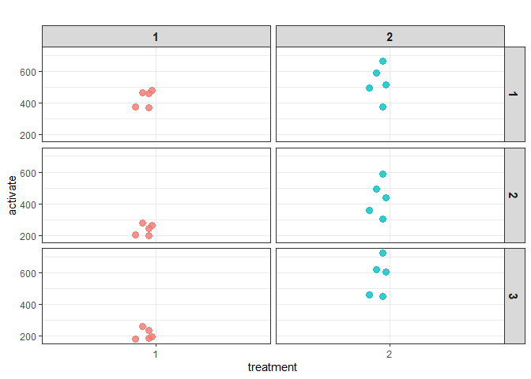<!-- -->

``` r
ggplot(rat_brain, aes(x = region, y = activate, group = animal, color = treatment)) +
  geom_point(size = 3) +
  facet_wrap(~ animal, scales = "free_y") +
  labs(
    title = "Activate for each animal",
    x = "Region",
    y = "Activate",
    color = "Treatment)"
  ) +
  theme_minimal() +
  theme(
    strip.text = element_text(face = "bold", size = 10),
    legend.position = "bottom"
  )
```

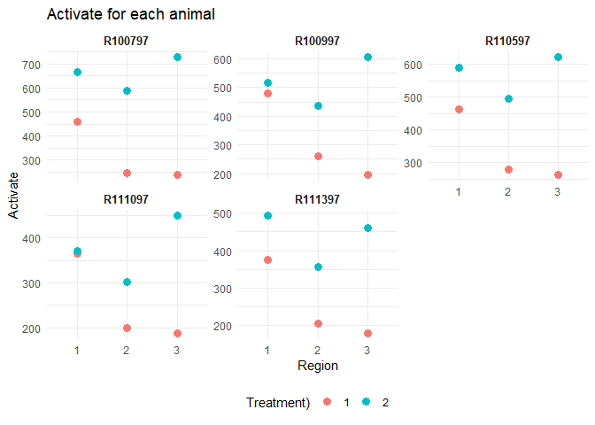<!-- -->

This dataset is a bit more complex, since we will end up employing a
random effect to model the effect of particular rats. To make selecting
priors for the hypothesis testing a bit easier, we will standardize the
response **activate**.

``` r
rat_brain <- read.csv("C:/Users/elini/Desktop/nine circles 3/rat_brain.csv") 
rat_brain$treatment <- factor(rat_brain$treatment)
rat_brain$region <- factor(rat_brain$region)
rat_brain$activate <- (rat_brain$activate - mean(rat_brain$activate))/sd(rat_brain$activate)
```

The modeling will turn out to be a bit trickier than it would appear at
first glance. Let us start with a default *brms* fit.

``` r
rat_brain_lr <- brm(activate ~ treatment + region + treatment:region + (1|animal), family = gaussian(),  data = rat_brain, refresh = 0, silent = 2, seed = 123, save_pars = save_pars(all = TRUE))
```

    ## Warning: There were 1 divergent transitions after warmup. See
    ## https://mc-stan.org/misc/warnings.html#divergent-transitions-after-warmup
    ## to find out why this is a problem and how to eliminate them.

    ## Warning: Examine the pairs() plot to diagnose sampling problems

``` r
summary(rat_brain_lr)
```

    ##  Family: gaussian 
    ##   Links: mu = identity 
    ## Formula: activate ~ treatment + region + treatment:region + (1 | animal) 
    ##    Data: rat_brain (Number of observations: 30) 
    ##   Draws: 4 chains, each with iter = 2000; warmup = 1000; thin = 1;
    ##          total post-warmup draws = 4000
    ## 
    ## Multilevel Hyperparameters:
    ## ~animal (Number of levels: 5) 
    ##               Estimate Est.Error l-95% CI u-95% CI Rhat Bulk_ESS Tail_ESS
    ## sd(Intercept)     0.63      0.32     0.25     1.49 1.00      927     1413
    ## 
    ## Regression Coefficients:
    ##                    Estimate Est.Error l-95% CI u-95% CI Rhat Bulk_ESS Tail_ESS
    ## Intercept              0.18      0.34    -0.49     0.89 1.00     1367     1495
    ## treatment2             0.61      0.21     0.18     1.03 1.00     1810     2179
    ## region2               -1.22      0.21    -1.65    -0.79 1.00     1892     2021
    ## region3               -1.38      0.22    -1.81    -0.96 1.00     1873     2060
    ## treatment2:region2     0.64      0.30     0.08     1.24 1.00     1787     1860
    ## treatment2:region3     1.67      0.30     1.08     2.28 1.00     1900     2074
    ## 
    ## Further Distributional Parameters:
    ##       Estimate Est.Error l-95% CI u-95% CI Rhat Bulk_ESS Tail_ESS
    ## sigma     0.33      0.06     0.25     0.46 1.00     1863     1901
    ## 
    ## Draws were sampled using sampling(NUTS). For each parameter, Bulk_ESS
    ## and Tail_ESS are effective sample size measures, and Rhat is the potential
    ## scale reduction factor on split chains (at convergence, Rhat = 1).

``` r
np <- nuts_params(rat_brain_lr)
p1 <- mcmc_nuts_energy(np, merge_chains = TRUE, bins = 50)
p2 <-mcmc_nuts_divergence(np, log_posterior(rat_brain_lr))

(p1 + p2) + plot_layout(ncol = 2)
```

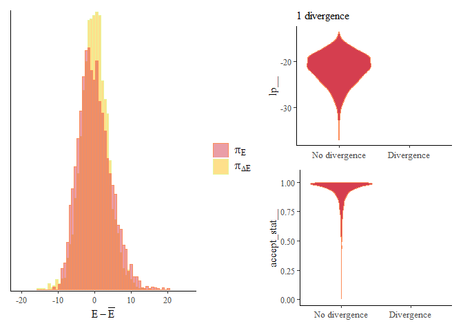<!-- -->

Everything seems fine except one lonely divergence of the Hamiltonian
MCMC. That cannot be that bad, right? Let’s increase the number of
samples, since we will be estimating Bayes factors using the bridge
sampling after all.

``` r
rat_brain_lr <- brm(activate ~ treatment + region + treatment:region + (1|animal), family = gaussian(),  data = rat_brain, refresh = 0, silent = 2, seed = 123, save_pars = save_pars(all = TRUE), warmup = 2000, iter = 10000)
```

    ## Warning: There were 62 divergent transitions after warmup. See
    ## https://mc-stan.org/misc/warnings.html#divergent-transitions-after-warmup
    ## to find out why this is a problem and how to eliminate them.

    ## Warning: Examine the pairs() plot to diagnose sampling problems

``` r
summary(rat_brain_lr)
```

    ##  Family: gaussian 
    ##   Links: mu = identity 
    ## Formula: activate ~ treatment + region + treatment:region + (1 | animal) 
    ##    Data: rat_brain (Number of observations: 30) 
    ##   Draws: 4 chains, each with iter = 10000; warmup = 2000; thin = 1;
    ##          total post-warmup draws = 32000
    ## 
    ## Multilevel Hyperparameters:
    ## ~animal (Number of levels: 5) 
    ##               Estimate Est.Error l-95% CI u-95% CI Rhat Bulk_ESS Tail_ESS
    ## sd(Intercept)     0.65      0.36     0.26     1.60 1.00     5769     4970
    ## 
    ## Regression Coefficients:
    ##                    Estimate Est.Error l-95% CI u-95% CI Rhat Bulk_ESS Tail_ESS
    ## Intercept              0.18      0.34    -0.50     0.87 1.00     7648     6734
    ## treatment2             0.62      0.21     0.19     1.05 1.00    14105    17221
    ## region2               -1.21      0.22    -1.64    -0.79 1.00    14939    16225
    ## region3               -1.37      0.22    -1.80    -0.94 1.00    15134    17148
    ## treatment2:region2     0.63      0.30     0.03     1.24 1.00    14242    15639
    ## treatment2:region3     1.66      0.30     1.07     2.26 1.00    14287    17964
    ## 
    ## Further Distributional Parameters:
    ##       Estimate Est.Error l-95% CI u-95% CI Rhat Bulk_ESS Tail_ESS
    ## sigma     0.34      0.06     0.25     0.47 1.00    13291    17515
    ## 
    ## Draws were sampled using sampling(NUTS). For each parameter, Bulk_ESS
    ## and Tail_ESS are effective sample size measures, and Rhat is the potential
    ## scale reduction factor on split chains (at convergence, Rhat = 1).

``` r
np <- nuts_params(rat_brain_lr)
p1 <- mcmc_nuts_energy(np, merge_chains = TRUE, bins = 50)
p2 <-mcmc_nuts_divergence(np, log_posterior(rat_brain_lr))

(p1 + p2) + plot_layout(ncol = 2)
```

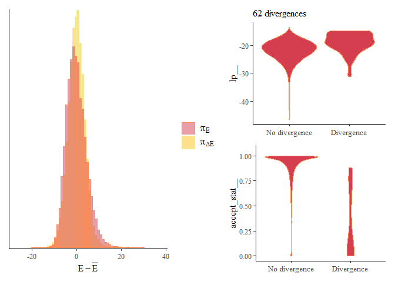<!-- -->

Well, it turns out it is pretty bad. We have 62 divergences. We can also
notice that ESS for the intercept and the random effect is much worse
than for the remaining parameters. Yes, our first fit was mostly fine,
but we were merely lucky. This example illustrates that, unfortunately,
even a single divergence cannot be safely ignored, since it may indicate
a fundamental flaw with our model.

In this case, it is not that hard to find. Let us use a *pairs* plot,
which analyzes bivariate distributions of posterior draws; namely,
between intercept and random effects.

``` r
pairs(rat_brain_lr$fit, pars = c("b_Intercept", "r_animal[R111097,Intercept]", "r_animal[R111397,Intercept]", "r_animal[R100797,Intercept]"))
```

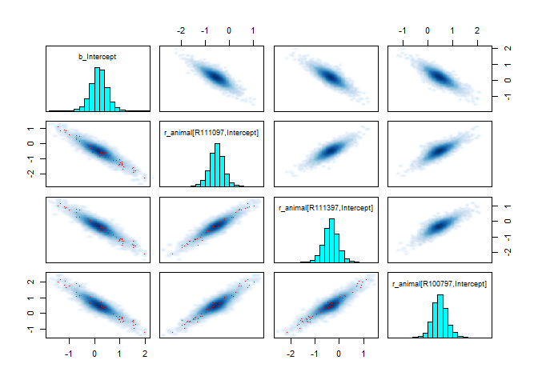<!-- -->

``` r
pairs(rat_brain_lr$fit, pars = c("b_Intercept", "r_animal[R100997,Intercept]", "r_animal[R110597,Intercept]"))
```

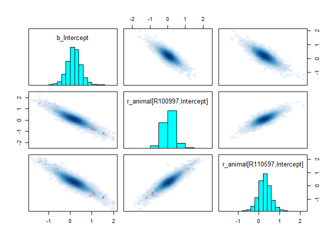<!-- -->

Red dots show the positions of divergent transitions, which can be used
to detect problematic parts of the posterior distribution. Here,
however, the main takeaway is the fact that random effects and the
intercept are *heavily (negatively) correlated*. The issue is that we
have only 5 groups (individual rats), which makes it difficult to
distinguish the population effect (intercept) from the individual
(random) effects.

To remedy this fact, we will choose a tighter prior on the variance of
random effects. After a bit of trial and error, we landed on the
following priors.

``` r
priors <- c(
  prior(normal(0, 1.5), class = "b", coef = "region2"),
  prior(normal(0, 1.5), class = "b", coef = "region3"),
  prior(normal(0, 1.5), class = "b", coef = "treatment2"),
  prior(normal(0, 1.5), class = "b", coef = "treatment2:region2"),
  prior(normal(0, 1.5), class = "b", coef = "treatment2:region3"),
  prior(student_t(8, 0, 1), class = "Intercept"),
  prior(normal(0, 0.5), lb = 0, class = "sd"),
  prior(student_t(8, 0, 1), lb = 0, class = "sigma")
)

priors_null <- c(
  prior(normal(0, 1.5), class = "b", coef = "region2"),
  prior(normal(0, 1.5), class = "b", coef = "region3"),
  prior(student_t(8, 0, 1), class = "Intercept"),
  prior(normal(0, 0.5), lb = 0, class = "sd"),
  prior(student_t(8, 0, 1), lb = 0, class = "sigma")
)
```

We also increased *adapt_delta* to 0.95 to make the MCMC a bit more
stable by forcing it to take smaller steps.

``` r
rat_brain_lr <- brm(activate ~ treatment + region + treatment:region + (1|animal), prior = priors, family = gaussian(),  data = rat_brain, refresh = 0, silent = 2, seed = 123, save_pars = save_pars(all = TRUE), control = list(adapt_delta = 0.99), warmup = 2000, iter = 10000)
```

``` r
summary(rat_brain_lr)
```

    ##  Family: gaussian 
    ##   Links: mu = identity 
    ## Formula: activate ~ treatment + region + treatment:region + (1 | animal) 
    ##    Data: rat_brain (Number of observations: 30) 
    ##   Draws: 4 chains, each with iter = 10000; warmup = 2000; thin = 1;
    ##          total post-warmup draws = 32000
    ## 
    ## Multilevel Hyperparameters:
    ## ~animal (Number of levels: 5) 
    ##               Estimate Est.Error l-95% CI u-95% CI Rhat Bulk_ESS Tail_ESS
    ## sd(Intercept)     0.49      0.18     0.23     0.92 1.00    10155    16099
    ## 
    ## Regression Coefficients:
    ##                    Estimate Est.Error l-95% CI u-95% CI Rhat Bulk_ESS Tail_ESS
    ## Intercept              0.13      0.27    -0.41     0.66 1.00     9565    13267
    ## treatment2             0.68      0.21     0.28     1.09 1.00    13191    17037
    ## region2               -1.15      0.21    -1.56    -0.73 1.00    14256    17214
    ## region3               -1.30      0.21    -1.71    -0.88 1.00    15256    17297
    ## treatment2:region2     0.55      0.29    -0.04     1.11 1.00    13257    16434
    ## treatment2:region3     1.56      0.29     0.96     2.12 1.00    14024    17817
    ## 
    ## Further Distributional Parameters:
    ##       Estimate Est.Error l-95% CI u-95% CI Rhat Bulk_ESS Tail_ESS
    ## sigma     0.34      0.06     0.25     0.47 1.00    14424    17983
    ## 
    ## Draws were sampled using sampling(NUTS). For each parameter, Bulk_ESS
    ## and Tail_ESS are effective sample size measures, and Rhat is the potential
    ## scale reduction factor on split chains (at convergence, Rhat = 1).

``` r
np <- nuts_params(rat_brain_lr)
p1 <- mcmc_nuts_energy(np, merge_chains = TRUE, bins = 50)
p2 <-mcmc_nuts_divergence(np, log_posterior(rat_brain_lr))

(p1 + p2) + plot_layout(ncol = 2)
```

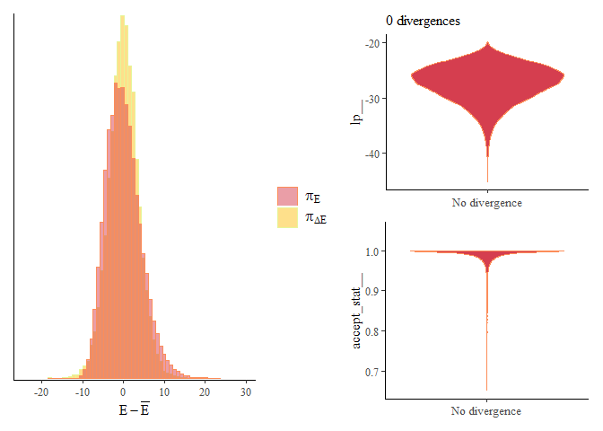<!-- -->

We can notice that restricting the random effects a bit (via the normal
prior) makes the correlations a bit weaker, which makes sampling from
the posterior easier.

``` r
pairs(rat_brain_lr$fit, pars = c("b_Intercept", "r_animal[R111097,Intercept]", "r_animal[R111397,Intercept]", "r_animal[R100797,Intercept]"))
```

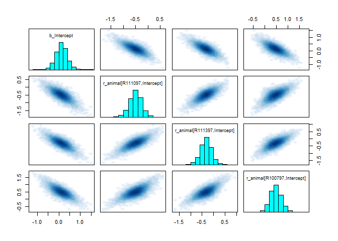<!-- -->

``` r
pairs(rat_brain_lr$fit, pars = c("b_Intercept", "r_animal[R100997,Intercept]", "r_animal[R110597,Intercept]"))
```

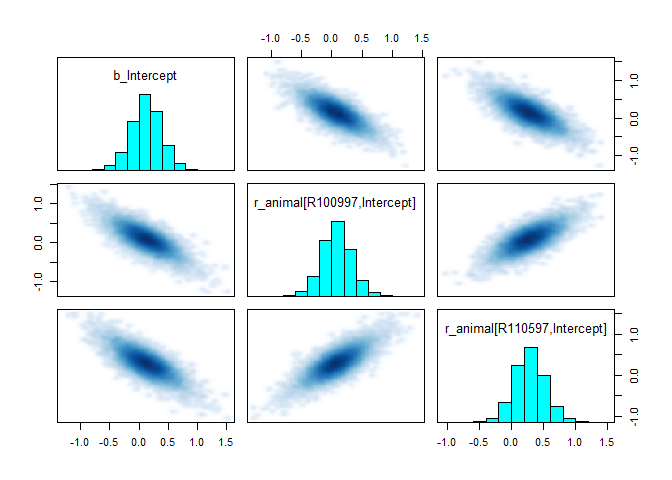<!-- -->

Let us also fit the null that **treatment** has no effect.

``` r
rat_brain_lr_null <- brm(activate ~ region + (1|animal), prior = priors_null, family = gaussian(),  data = rat_brain, refresh = 0, silent = 2, seed = 123, save_pars = save_pars(all = TRUE), control = list(adapt_delta = 0.99), warmup = 2000, iter = 10000)
```

``` r
summary(rat_brain_lr_null)
```

    ##  Family: gaussian 
    ##   Links: mu = identity 
    ## Formula: activate ~ region + (1 | animal) 
    ##    Data: rat_brain (Number of observations: 30) 
    ##   Draws: 4 chains, each with iter = 10000; warmup = 2000; thin = 1;
    ##          total post-warmup draws = 32000
    ## 
    ## Multilevel Hyperparameters:
    ## ~animal (Number of levels: 5) 
    ##               Estimate Est.Error l-95% CI u-95% CI Rhat Bulk_ESS Tail_ESS
    ## sd(Intercept)     0.30      0.21     0.01     0.81 1.00    11719    11976
    ## 
    ## Regression Coefficients:
    ##           Estimate Est.Error l-95% CI u-95% CI Rhat Bulk_ESS Tail_ESS
    ## Intercept     0.43      0.33    -0.23     1.09 1.00    20793    19364
    ## region2      -0.81      0.41    -1.61     0.01 1.00    26964    22433
    ## region3      -0.47      0.41    -1.28     0.35 1.00    26892    21705
    ## 
    ## Further Distributional Parameters:
    ##       Estimate Est.Error l-95% CI u-95% CI Rhat Bulk_ESS Tail_ESS
    ## sigma     0.96      0.14     0.73     1.27 1.00    23942    21255
    ## 
    ## Draws were sampled using sampling(NUTS). For each parameter, Bulk_ESS
    ## and Tail_ESS are effective sample size measures, and Rhat is the potential
    ## scale reduction factor on split chains (at convergence, Rhat = 1).

``` r
np <- nuts_params(rat_brain_lr_null)
p1 <- mcmc_nuts_energy(np, merge_chains = TRUE, bins = 50)
p2 <-mcmc_nuts_divergence(np, log_posterior(rat_brain_lr_null))

(p1 + p2) + plot_layout(ncol = 2)
```

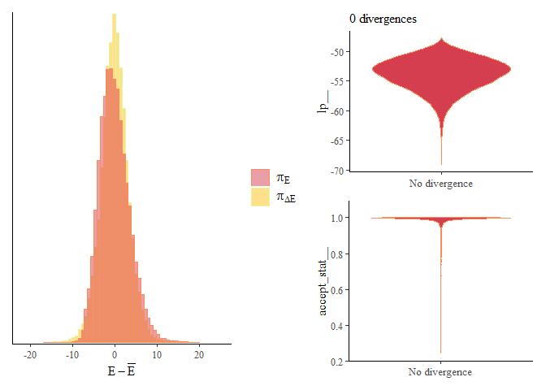<!-- -->

We fit the null model without obvious issues, and thus, we can compute
the Bayes factor.

``` r
bayes_factor(rat_brain_lr, rat_brain_lr_null, silent = TRUE)
```

    ## Estimated Bayes factor in favor of rat_brain_lr over rat_brain_lr_null: 70224053.67314

We observe that the data provide “decisive” evidence that the treatment
has an effect. We can also employ the comparison methods based on the
predictive performance from the previous circle.

``` r
rat_brain_lr <- add_criterion(rat_brain_lr, criterion = "loo", save_psis = TRUE, reloo = TRUE)
rat_brain_lr_null <- add_criterion(rat_brain_lr_null, criterion = "loo", save_psis = TRUE, reloo = TRUE)

rat_brain_lr <- add_criterion(rat_brain_lr, criterion = "waic")
rat_brain_lr_null <- add_criterion(rat_brain_lr_null, criterion = "waic")

loo_compare(rat_brain_lr, rat_brain_lr_null, criterion = 'waic')
```

    ##              model elpd_diff se_diff p_worse diag_diff diag_elpd
    ##       rat_brain_lr       0.0     0.0      NA                    
    ##  rat_brain_lr_null     -29.6     3.2    1.00   N < 100

``` r
loo_compare(rat_brain_lr, rat_brain_lr_null)
```

    ##              model elpd_diff se_diff p_worse diag_diff diag_elpd
    ##       rat_brain_lr       0.0     0.0      NA                    
    ##  rat_brain_lr_null     -28.8     3.3    1.00   N < 100

We observe that these metrics support that the **treatment** has an
effect as well (*loo_compare* only warns us that our sample size is
small). For a comparison, let us also fit the models using the
frequentist methods.

``` r
library(lme4)
anova(lmer(activate ~ treatment + region + treatment:region + (1|animal),  data = rat_brain, REML = FALSE), lmer(activate ~ region + (1|animal),  data = rat_brain), REML = FALSE)
```

    ## Data: rat_brain
    ## Models:
    ## lmer(activate ~ region + (1 | animal), data = rat_brain): activate ~ region + (1 | animal)
    ## lmer(activate ~ treatment + region + treatment:region + (1 | animal), data = rat_brain, REML = FALSE): activate ~ treatment + region + treatment:region + (1 | animal)
    ##                                                                                                       npar
    ## lmer(activate ~ region + (1 | animal), data = rat_brain)                                                 5
    ## lmer(activate ~ treatment + region + treatment:region + (1 | animal), data = rat_brain, REML = FALSE)    8
    ##                                                                                                          AIC
    ## lmer(activate ~ region + (1 | animal), data = rat_brain)                                              89.468
    ## lmer(activate ~ treatment + region + treatment:region + (1 | animal), data = rat_brain, REML = FALSE) 37.667
    ##                                                                                                          BIC
    ## lmer(activate ~ region + (1 | animal), data = rat_brain)                                              96.474
    ## lmer(activate ~ treatment + region + treatment:region + (1 | animal), data = rat_brain, REML = FALSE) 48.877
    ##                                                                                                        logLik
    ## lmer(activate ~ region + (1 | animal), data = rat_brain)                                              -39.734
    ## lmer(activate ~ treatment + region + treatment:region + (1 | animal), data = rat_brain, REML = FALSE) -10.834
    ##                                                                                                       deviance
    ## lmer(activate ~ region + (1 | animal), data = rat_brain)                                                79.468
    ## lmer(activate ~ treatment + region + treatment:region + (1 | animal), data = rat_brain, REML = FALSE)   21.667
    ##                                                                                                       Chisq
    ## lmer(activate ~ region + (1 | animal), data = rat_brain)                                                   
    ## lmer(activate ~ treatment + region + treatment:region + (1 | animal), data = rat_brain, REML = FALSE)  57.8
    ##                                                                                                       Df
    ## lmer(activate ~ region + (1 | animal), data = rat_brain)                                                
    ## lmer(activate ~ treatment + region + treatment:region + (1 | animal), data = rat_brain, REML = FALSE)  3
    ##                                                                                                       Pr(>Chisq)
    ## lmer(activate ~ region + (1 | animal), data = rat_brain)                                                        
    ## lmer(activate ~ treatment + region + treatment:region + (1 | animal), data = rat_brain, REML = FALSE)  1.734e-12
    ##                                                                                                          
    ## lmer(activate ~ region + (1 | animal), data = rat_brain)                                                 
    ## lmer(activate ~ treatment + region + treatment:region + (1 | animal), data = rat_brain, REML = FALSE) ***
    ## ---
    ## Signif. codes:  0 '***' 0.001 '**' 0.01 '*' 0.05 '.' 0.1 ' ' 1

We again notice that the AIC/BIC criteria and the likelihood ratio test
overwhelmingly support the model with the **treatment**.

### Prior Predictive Check

Our random effect model is just complex enough that it warrants some caution when
computing Bayes factors. We know that the Bayes factors depend heavily
on our priors, so we should check that our priors are reasonable.
Additionally, computing Bayes factors (using bridge sampling) is
non-trivial; hence, we also need to make sure that our approximation is
sound.

Let us start with a simple *prior predictive check* in which we simulate
new datasets and compare them with the original data. We can do so in
*brms* by setting *sample_prior = ‘only’*.

``` r
rat_brain_lr_prior <- brm(activate ~ treatment + region + treatment:region + (1|animal), prior = priors, family = gaussian(),  data = rat_brain, refresh = 0, silent = 2, seed = 123, save_pars = save_pars(all = TRUE), iter = 100000, thin = 50, sample_prior = 'only')
```

``` r
pp_check(rat_brain_lr_prior , ndraws = 250)
```

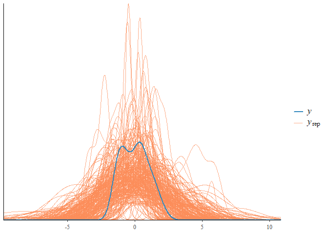<!-- -->

We observe that our data seem like a typical sample from our priors.

### Simulation-Based Calibration

Our first check was pretty surface-level. So let’s go a bit deeper and
employ the simulation-based calibration (SBC) (Modrák et al. 2023).
Simulation-based calibration is a method to validate Bayesian
computations; in short, it checks via simulations whether we can recover
parameter samples from the priors using the posterior samples computed
via the MCMC.

Now, our problem is simple enough so we do not expect our posterior
samplers to fail. However, SBC is indispensable in more complex tasks
such as mixture models, in which it is quite easy to implement a model
that does not work (see e.g.,
<https://avehtari.github.io/Bayesian-Workflow/sbc/sbc.html#ref-sbc2023>).

We perform SBC using the package *SBC*
(<https://hyunjimoon.github.io/SBC/index.html>). First, we will define
the *generator* that samples artificial datasets from our priors.

``` r
library(SBC)
library(future)

cache_dir <- "./_brms_rstan_SBC_cache"
if(!dir.exists(cache_dir)) {
  dir.create(cache_dir)
}

generator <- SBC_generator_brms(activate ~ treatment + region + treatment:region + (1|animal), control = list(adapt_delta = 0.99), prior = priors, family = gaussian(),  data = rat_brain, refresh = 0, thin = 50, iter = 20000, refresh = 0, out_stan_file = file.path(cache_dir, "brms_rat.stan"))
```

Then we generate the datasets.

``` r
set.seed(123)
datasets <- generate_datasets(generator, 1000)
```

Next, we define the *backend*, the algorithm we use to generate
posterior draws.

``` r
backend <- SBC_backend_brms_from_generator(generator, control = list(adapt_delta = 0.99), chains = 1, thin = 1, warmup = 2000, iter = 4000)
```

Finally, we will sample the posterior distributions for each generated
dataset using the function *compute_SBC*.

``` r
set.seed(123, kind = "L'Ecuyer-CMRG")
plan(multisession, workers = 4)
SBC_results <- compute_SBC(
  datasets = datasets, 
  backend = backend
)
```

``` r
SBC_results
```

    ## SBC_results with 1000 total fits.
    ##  - [OK] No fits produced error.
    ##  - [BAD] 272 (27%) fits gave warning. Inspect $warnings for the full messages.
    ##  - [INFO] Maximum time per chain was 28.4. 
    ##  - [BAD] 269 (27%) fits had divergences. Maximum number of divergences was 251. 
    ##  - [BAD] 10 (1%) fits had iterations that saturated max treedepth. Maximum number of max treedepths was 1692. 
    ##  - [OK] All fits had E-BFMI >= 0.2. Minimum E-BFMI was 0.598. 
    ##  - [OK] No fits had steps rejected.
    ##  - [BAD] 68 (7%) fits had maximum Rhat > 1.01. Maximum Rhat was 1.174. 
    ##  - [INFO] Minimum bulk ESS was 5. 
    ##  - [INFO] Minimum tail ESS was 9. 
    ##  - [BAD] 13 (1%) fits had tail ESS / maximum rank < 0.5. Minimum tail ESS / maximum rank was 0.05. This potentially skews the rank statistics.
    ##     If the fits look good otherwise, increasing `thin_ranks` (via recompute_SBC_statistics) 
    ##    or number of posterior draws (by refitting) might help.

    ## Not all diagnostics are OK.
    ## You can learn more by inspecting $default_diagnostics, $backend_diagnostics 
    ## and/or investigating $outputs/$messages/$warnings for detailed output from the backend.

We observe that there were problems with some simulations (this is not
unusual since our priors can lead to unrealistic datasets). Fortunately,
we can reject some samples without biasing the posterior distribution
(<https://hyunjimoon.github.io/SBC/articles/rejection_sampling.html>)
provided that our rejection rule depends only on the simulated data. To
see that this is the case, we can write
```math
p(\theta \mid y, \text{ accept}) = \frac{p(\text{accept} \mid y)p(y \mid \theta) p(\theta)}{\int_\Theta p(\text{accept} \mid y)p(y \mid \theta) p(\theta) \text{ d}\theta} = \frac{p(y \mid \theta) p(\theta)}{\int_\Theta p(y \mid \theta) p(\theta) \text{ d}\theta} = p(\theta \mid y),
```
where we used that
$p(y, \text{accept} \mid \theta) = p(\text{accept} \mid y, \theta)p(y \mid \theta) = p(\text{accept} \mid y)p(y \mid \theta)$.
Let us remove the problematic simulations.

``` r
sim_ids_warning<- SBC_results$backend_diagnostics$sim_id[SBC_results$backend_diagnostics$n_divergent == 0 & SBC_results$backend_diagnostics$n_max_treedepth == 0 & SBC_results$default_diagnostics$max_rhat < 1.01]
SBC_results_subset <- SBC_results[sim_ids_warning]
summary(SBC_results_subset)
```

    ## SBC_results with 696 total fits.
    ##  - [OK] No fits produced error.
    ##  - [OK] No fits gave warning.
    ##  - [INFO] Maximum time per chain was 8.5. 
    ##  - [OK] No fits had divergences.
    ##  - [OK] No fits had iterations that saturated max treedepth.
    ##  - [OK] All fits had E-BFMI >= 0.2. Minimum E-BFMI was 0.604. 
    ##  - [OK] No fits had steps rejected.
    ##  - [OK] All fits had maximum Rhat <= 1.01. Maximum Rhat was 1.01. 
    ##  - [INFO] Minimum bulk ESS was 260. 
    ##  - [INFO] Minimum tail ESS was 198. 
    ##  - [OK] All fits had tail ESS / maximum rank >= 0.5. Minimum tail ESS / maximum rank was 1.

The main diagnostic tool that the *SBC* package provides is the *rank
plots*. For each simulated dataset, it computes the rank of the true
value of the parameter with respect to the computed posterior draws.
Provided that the algorithm for sampling from the posterior is correct,
the distribution of ranks should be uniform.

``` r
idx <- c(1:8,37)
plot_rank_hist(SBC_results_subset, variables = SBC_results_subset$stats$variable[idx])
```

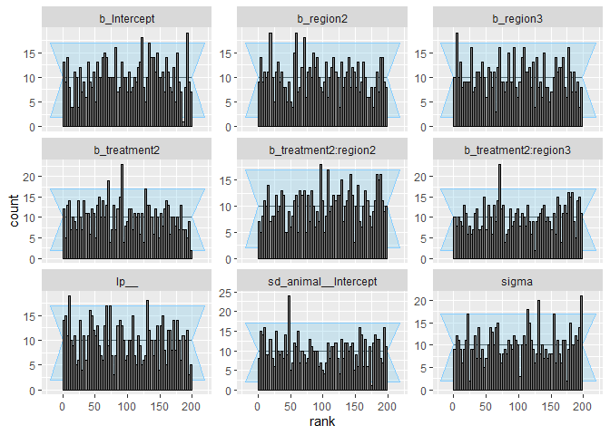<!-- -->

``` r
plot_ecdf_diff(SBC_results_subset, variables = SBC_results_subset$stats$variable[idx])
```

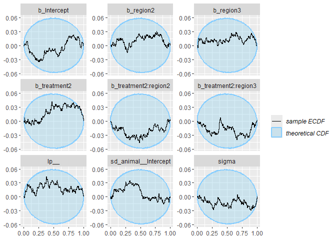<!-- -->

We observe that the uniformity condition is met. Next, we will plot the
true values of parameters vs. posterior. The goal is to assess whether
the model can learn the parameters from the data. What we do not want to
see is our estimates forming a horizontal line, which means our model
fails to learn anything from the data about the given parameter.

``` r
plot_sim_estimated(SBC_results_subset, variables = SBC_results_subset$stats$variable[idx])
```

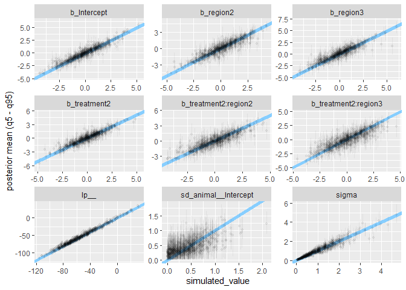<!-- -->

We observe that the model struggles a bit to learn the variance of the
random effect, which corresponds to the observations we made earlier.
Lastly, we can also check the coverage of the credible intervals.

``` r
plot_coverage(SBC_results_subset, variables = SBC_results_subset$stats$variable[idx])
```

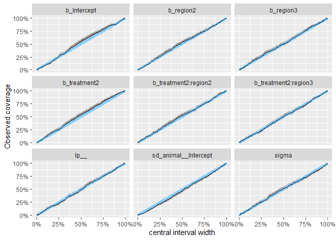<!-- -->


### SBC for Checking Bayes Factors

We can also use SBC to check Bayes factor computations. Namely, we will
follow the approach from (Schad et al. 2023). Again, we will first
generate the datasets; we will randomly generate data from both
hypotheses (we will assume that both are selected with an equal
probability).

``` r
rat_brain_lr <- brm(activate ~ treatment + region + treatment:region + (1|animal), prior = priors, family = gaussian(),  data = rat_brain, refresh = 0, silent = 2, seed = 123, save_pars = save_pars(all = TRUE), control = list(adapt_delta = 0.99), warmup = 2000, iter = 10000)


rat_brain_lr_null <- brm(activate ~ region + (1|animal), prior = priors_null, family = gaussian(),  data = rat_brain, refresh = 0, silent = 2, seed = 123, save_pars = save_pars(all = TRUE), control = list(adapt_delta = 0.99), warmup = 2000, iter = 10000)

rat_brain_lr_prior <- brm(activate ~ treatment + region + treatment:region + (1|animal), prior = priors, family = gaussian(),  data = rat_brain, refresh = 0, silent = 2, seed = 123, save_pars = save_pars(all = TRUE), iter = 25000, thin = 50, sample_prior = 'only')

rat_brain_lr_null_prior <- brm(activate ~  region +  (1|animal), prior = priors_null, family = gaussian(),  data = rat_brain, refresh = 0, silent = 2, seed = 123, save_pars = save_pars(all = TRUE), iter = 25000, thin = 50, sample_prior = 'only')
```

``` r
library(foreach)
library(doFuture)

set.seed(123)

plan(multisession, workers = 4)
BF_results  <- foreach(i = 1:1000, .options.future = list(seed = TRUE, .combine = 'rbind', .packages = c("brms"))) %dofuture% {
  
  rat_brain_new <- rat_brain
  
  
  if (runif(1) > 0.5){
    rat_brain_new$activate <- posterior_predict(rat_brain_lr_prior)[i,]
    hyp <- 1
  } else {
    rat_brain_new$activate <- posterior_predict(rat_brain_lr_null_prior)[i,]
    hyp <- 0
  }
  
  rat_brain_lr_test <- update(rat_brain_lr, newdata = rat_brain_new, recompile = FALSE)
  rat_brain_lr_test_null <- update(rat_brain_lr_null, newdata = rat_brain_new, recompile = FALSE)
  
  np0 <- nuts_params(rat_brain_lr_test_null)
  np1 <- nuts_params(rat_brain_lr_test)
  
  bayes_factors_01 <- tryCatch(
    {bayes_factors_01 <- bayes_factor(rat_brain_lr_test_null, rat_brain_lr_test , silent = TRUE)$bf
  }, error = function(e) {return(NA)}
  )
  div0 <- sum(subset(np0, Parameter == "divergent__")$Value)
  div1 <- sum(subset(np1, Parameter == "divergent__")$Value)
  
  data.frame(BF01 = bayes_factors_01, Hyp = hyp, Div0 = div0, Div1 = div1)

}

BF_results <- do.call(rbind, lapply(BF_results, as.data.frame))
```

Again, we will first remove the fits with divergences, which indicate
poor model fit.

``` r
BF_results_no_div  <- BF_results[BF_results$Div0 == 0 & BF_results$Div1 == 0,]
BF_div <- BF_results[BF_results$Div0 >= 1 | BF_results$Div1 >= 1,]
dim(BF_div)
```

    ## [1] 92  4

We had to remove 92 simulations out of the original 1000. 

Next, we will compute the posterior probabilities for both hypotheses
from the obtained Bayes factors using the following formulas

```math
\begin{align*}
p(y \mid \mathcal{H_0}) & = \frac{B(\mathcal{H_0};\mathcal{H}_1)}{1+B(\mathcal{H_0};\mathcal{H}_1)}\\
p(y \mid \mathcal{H_1}) & = \frac{1}{1+B(\mathcal{H_0};\mathcal{H}_1)}.
\end{align*}
```

``` r
postH0 <- BF_results_no_div$BF01/(BF_results_no_div$BF01+1)
postH1 <- 1/(BF_results_no_div$BF01+1)
```

We actually know the true probabilities; both hypotheses were generated
with probability 0.5. Hence, we want to check that the posterior
probabilities are also 0.5; in other words, we want to validate that our
computed Bayes factors are unbiased.

``` r
mean(postH0)
```

    ## [1] 0.5034918

``` r
mean(postH1)
```

    ## [1] 0.4965082

The posterior probabilities obtained from the simulations are fairly
close to 0.5. We can test this more formally via an appropriate test.

``` r
summary(glm(postH0~1,family="binomial"))
```

    ## 
    ## Call:
    ## glm(formula = postH0 ~ 1, family = "binomial")
    ## 
    ## Coefficients:
    ##             Estimate Std. Error z value Pr(>|z|)
    ## (Intercept)  0.01397    0.06637    0.21    0.833
    ## 
    ## (Dispersion parameter for binomial family taken to be 1)
    ## 
    ##     Null deviance: 813.17  on 907  degrees of freedom
    ## Residual deviance: 813.17  on 907  degrees of freedom
    ## AIC: 1259.7
    ## 
    ## Number of Fisher Scoring iterations: 3

We can also plot the histograms of the posterior probabilities under the
null and the alternative.

``` r
postH1_0 <- data.frame(postH1_0 = postH1[BF_results_no_div$Hyp == 0])
postH1_1 <- data.frame(postH1_1 = postH1[BF_results_no_div$Hyp == 1])
  

p1 <- ggplot(postH1_0, aes(x = postH1_0)) +geom_histogram(color = "black", alpha = 0.8, fill =  "#E69F00") + xlab('H1 posterior probability under H0') + theme_minimal() 
p2 <- ggplot(postH1_1, aes(x = postH1_1)) +geom_histogram(color = "black", alpha = 0.8, fill =  "#56B4E9") + xlab('H1 posterior probability under H1') + theme_minimal() 


(p1 + p2) + plot_layout(ncol = 1)
```

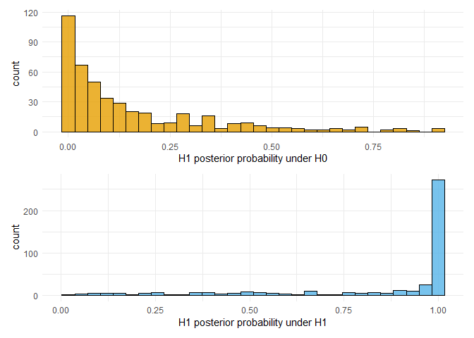<!-- -->

We see that under the alternative, the posterior probability is
concentrated around 1. Under the null, the posterior is much more
varied, but it is still quite unlikely that the posterior would favor
the alternative hypothesis.

We can also check that our Bayes factors discriminate between the two
hypotheses by constructing a simple contingency table.

``` r
BF01_H0 <- BF_results_no_div$BF01[BF_results_no_div$Hyp == 0]
BF10_H1 <- 1/BF_results_no_div$BF01[BF_results_no_div$Hyp == 1]

conf_table <- data.frame(H0 = c(sum(BF01_H0 > 1),sum(BF10_H1<1)), H1 = c(sum(BF01_H0 < 1), sum(BF10_H1>1)))
rownames(conf_table) <- c('H0 holds', 'H1 holds')
conf_table
```

    ##           H0  H1
    ## H0 holds 420  32
    ## H1 holds  73 383

We observe that the Bayes factors indicated the true hypotheses in about
93% of cases under the null and 84% of cases under the alternative. This
demonstrates that the data and our model can provide evidence about our
hypotheses. We can also plot the distribution of Bayes factors (the red
dashed lines denote the decisive evidence $B_{100} = 10$ and
$B_{100} = 1/10$).

``` r
ggplot(data = BF_results_no_div, aes(x = as.factor(Hyp), y = log10(1/BF_results_no_div$BF01))) + geom_violin() + xlab('True Hypothesis') + ylab('Log10 Bayes Factor B10') + geom_hline(yintercept = 2, linetype = "dashed", color = "red", linewidth = 0.5) + geom_hline(yintercept = -2, linetype = "dashed", color = "red", linewidth = 0.5)
```

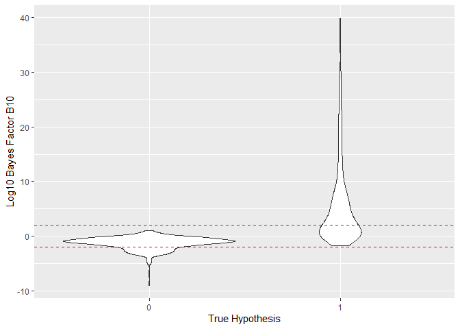<!-- -->

Notice that the distribution of Bayes factor $B_{10}$ under the
alternative is extremely skewed compared to the distribution under the
null, i.e., it will be much harder to obtain very strong evidence for
the null in our setting.

``` r
quantile(log10(1/BF_results_no_div$BF01[BF_results_no_div$Hyp == 1]), c(0.25, 0.35, 0.5, 0.65, 0.75, 0.95 ))
```

    ##        25%        35%        50%        65%        75%        95% 
    ##  0.4997031  1.2836835  2.7853086  5.5515895  7.7484753 22.0328449

Lastly, we will check how the observed Bayes factors depend on the true
values of parameters in the model. Namely, we will look at the effect
sizes based on the true parameter values that we will measure in terms
of (expected) absolute effect maximized over the regions
```math
\max_\text{region} \left| \text{treatment} + \text{region:treatment}\right|.
```
We will also compute the total standard deviations of errors and random
effects $\sqrt{\sigma^2  + \sigma^2_\text{animal}}$.

``` r
prior_samples <- as_draws_df(rat_brain_lr_prior)
prior_null_samples <- as_draws_df(rat_brain_lr_null_prior)

effects <- numeric(1000)
sigmas <- numeric(1000)

for (i in 1:1000){

  if (BF_results$Hyp[i] == 0){
    
    effects[i] <- 0
    sigmas[i] <- sqrt(prior_null_samples$sigma[i]^2 + prior_null_samples$`sd_animal__Intercept`[i]^2)
    
  } else {
    effects[i] <- c(abs(prior_samples$b_treatment2[i]), 
                    abs(prior_samples$b_treatment2[i] + prior_samples$`b_treatment2:region2`[i]) ,
                    abs(prior_samples$b_treatment2[i] + prior_samples$`b_treatment2:region3`[i]))
    
    sigmas[i] <- sqrt(prior_samples$sigma[i]^2 + prior_samples$`sd_animal__Intercept`[i]^2)
  }
}

effects_no_div <- effects[BF_results$Div0 == 0 & BF_results$Div1 == 0]
sigmas_no_div <- sigmas[BF_results$Div0 == 0 & BF_results$Div1 == 0]
```

Let us plot the logarithms of Bayes factor vs the non-zero true effects.

``` r
plot_data <- data.frame(effect = effects_no_div[effects_no_div != 0], BF = -log10(BF_results_no_div$BF01[effects_no_div != 0]))

ggplot(plot_data, aes(x = effect, y = BF)) +
  geom_point(color = "blue", size = 1) +
  geom_smooth(method = "lm", color = "red", se = FALSE) +
  geom_hline(yintercept = 1, color = "red", linetype = "dashed") + 
  labs(title = "",
       x = "True Absolute Effect (max over region)", 
       y = "log10 BF10") +
  scale_y_continuous(
    name = "log10 BF10",
    sec.axis = sec_axis(~ . * 1, name = "")
  ) + 
  theme_minimal()
```

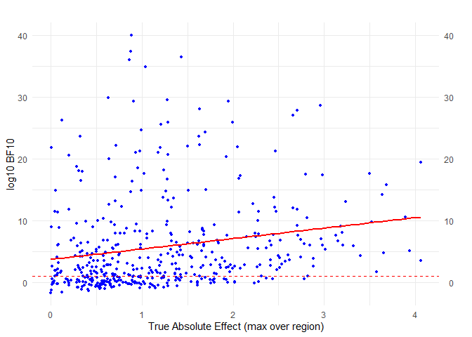<!-- -->

The red dashed line denotes the value $B_{10}=10$ for which we consider
the evidence strong for the alternative hypothesis, and the red line
denotes a linear trend obtained from linear regression. We observe that
Bayes factors tend to increase with the value of the true treatment
effect as expected. The quantiles of the logarithm of $B_{10}$ for the
effect \> 0.5 are as follows.

``` r
BF_quan_effect <- rbind(
  quantile(log10(1/BF_results_no_div$BF01[effects_no_div > 0.25]), c(0.1, 0.25, 0.35, 0.5, 0.65, 0.75, 0.95 )),
  quantile(log10(1/BF_results_no_div$BF01[effects_no_div > 0.5]), c(0.1, 0.25, 0.35, 0.5, 0.65, 0.75, 0.95 )),
  quantile(log10(1/BF_results_no_div$BF01[effects_no_div > 0.75]), c(0.1, 0.25, 0.35, 0.5, 0.65, 0.75, 0.95 )),
  quantile(log10(1/BF_results_no_div$BF01[effects_no_div > 1]), c(0.1, 0.25, 0.35, 0.5, 0.65, 0.75, 0.95 )),
  quantile(log10(1/BF_results_no_div$BF01[effects_no_div > 2]), c(0.1, 0.25, 0.35, 0.5, 0.65, 0.75, 0.95 ))
)
rownames (BF_quan_effect) <- c('Max Abs. Effect > 0.25', 'Max Abs. Effect > 0.50', 'Max Abs. Effect > 0.75', 'Max Abs. Effect > 1.00', 'Max Abs. Effect > 2.00')
BF_quan_effect
```

    ##                                10%       25%      35%      50%      65%
    ## Max Abs. Effect > 0.25 -0.22314151 0.6140372 1.414750 3.029583 5.798890
    ## Max Abs. Effect > 0.50 -0.17850340 0.6988478 1.492591 3.496860 6.089514
    ## Max Abs. Effect > 0.75 -0.03587999 1.0258457 2.211715 4.208188 6.769017
    ## Max Abs. Effect > 1.00  0.10664231 1.4416995 2.528106 4.402850 6.727834
    ## Max Abs. Effect > 2.00  0.95574252 3.2602644 4.269488 6.104616 7.929033
    ##                              75%      95%
    ## Max Abs. Effect > 0.25  7.813311 22.18087
    ## Max Abs. Effect > 0.50  8.082237 23.85327
    ## Max Abs. Effect > 0.75  9.165641 25.59758
    ## Max Abs. Effect > 1.00  8.982974 24.11224
    ## Max Abs. Effect > 2.00 11.343265 20.91786

Provided that the (expected) true effect in some of the regions is at
least 0.5, we have over 75% probability to observe strong evidence
($BF_{10}>10$) against the null. However, there is quite a big spread in
the actual Bayes factor values, which is caused by the model (aleatoric)
uncertainty given by the standard deviations of errors and random
effects $\sqrt{\sigma^2  + \sigma^2_\text{animal}}$.

``` r
plot_data <- data.frame(effect = sigmas_no_div[effects_no_div != 0], BF = -log10(BF_results_no_div$BF01[effects_no_div != 0]))

ggplot(plot_data, aes(x = effect, y = BF)) +
  geom_point(color = "blue", size = 1) +  
  geom_hline(yintercept = 1, color = "red", linetype = "dashed") + 
  scale_y_continuous(
    name = "log10 BF10",
    sec.axis = sec_axis(~ . * 1, name = "")
  ) + 
  labs(title = "",
       x = "Aleatoric Uncertainty (Standard Deviation of Errors/RE)", 
       ylab = "log10 BF10") +
  theme_minimal()
```

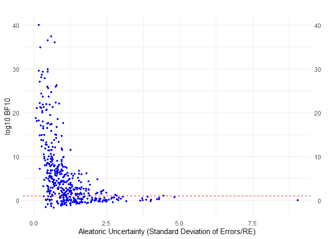<!-- -->

Provided that the total standard deviation
$\sqrt{\sigma^2  + \sigma^2_\text{animal}}$ is greater than 2, we have a
very small chance that we obtain strong evidence for the alternative
hypothesis.

``` r
BF_quan_effect <- rbind(
  quantile(log10(1/BF_results_no_div$BF01[sigmas_no_div < 0.5 & effects_no_div > 0]), c(0.1, 0.25, 0.35, 0.5, 0.65, 0.75, 0.95 )),
  quantile(log10(1/BF_results_no_div$BF01[sigmas_no_div > 0.5 & sigmas_no_div < 1 & effects_no_div > 0]), c(0.1, 0.25, 0.35, 0.5, 0.65, 0.75, 0.95 )),
  quantile(log10(1/BF_results_no_div$BF01[sigmas_no_div > 1 & sigmas_no_div < 1.5 & effects_no_div > 0]), c(0.1, 0.25, 0.35, 0.5, 0.65, 0.75, 0.95 )),
  quantile(log10(1/BF_results_no_div$BF01[sigmas_no_div > 1.5 & sigmas_no_div < 2 & effects_no_div > 0]), c(0.1, 0.25, 0.35, 0.5, 0.65, 0.75, 0.95 )),
  quantile(log10(1/BF_results_no_div$BF01[sigmas_no_div > 2 & effects_no_div > 0]), c(0.1, 0.25, 0.35, 0.5, 0.65, 0.75, 0.95 ))
)

rownames (BF_quan_effect) <- c('Total SD < 0.5', 'Total SD [0.5, 1]', 'Total SD [1, 1.5]', 'Total SD [1.5, 2]', 'Total SD > 2')
BF_quan_effect
```

    ##                          10%         25%        35%        50%        65%
    ## Total SD < 0.5     1.8543398  7.48479682 9.70674431 14.8784151 19.2891624
    ## Total SD [0.5, 1]  0.2446988  2.64976333 3.90136741  5.8721899  7.6965788
    ## Total SD [1, 1.5] -0.4202890  0.13350471 0.76235746  1.5839998  2.5580747
    ## Total SD [1.5, 2] -0.5320780  0.01882239 0.31799588  1.0366346  1.5896024
    ## Total SD > 2      -0.2488074 -0.04222962 0.02861384  0.2276983  0.4819848
    ##                          75%       95%
    ## Total SD < 0.5    21.1912725 29.631840
    ## Total SD [0.5, 1]  9.2006604 21.941000
    ## Total SD [1, 1.5]  3.5345845  7.413831
    ## Total SD [1.5, 2]  2.5142160  5.949134
    ## Total SD > 2       0.6218488  1.963606

We can combine these two observations into a single plot by computing
standardized effects $\text{Effect}/\text{Standard Deviation}$.

``` r
plot_data <- data.frame(effect = effects_no_div[effects_no_div != 0]/sigmas_no_div[effects_no_div != 0], BF = -log10(BF_results_no_div$BF01[effects_no_div != 0]))

ggplot(plot_data, aes(x = effect, y = BF)) +
  geom_point(color = "blue", size = 1) +
  geom_smooth(method = "lm", color = "red", se = FALSE) +
  geom_hline(yintercept = 1, color = "red", linetype = "dashed") + 
  labs(title = "",
       x = "True Standardized Absolute Effect (max over region)", 
       y = "log10 BF10") +
  scale_y_continuous(
    name = "log10 BF10",
    sec.axis = sec_axis(~ . * 1, name = "")
  ) + 
  theme_minimal()
```

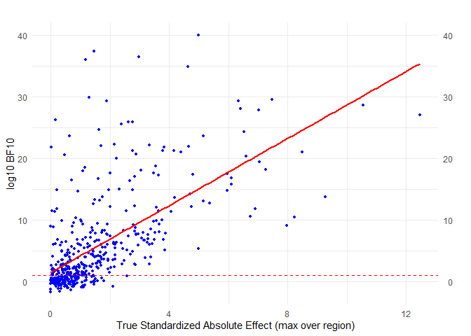<!-- -->

``` r
stand_effect <- effects_no_div[effects_no_div != 0]/sigmas_no_div[effects_no_div != 0]
BF_effect <- BF_results_no_div$BF01[effects_no_div != 0]

BF_quan_effect <- rbind(
  quantile(log10(1/BF_effect[stand_effect > 0.10]), c(0.01, 0.1, 0.25, 0.35, 0.5, 0.65, 0.75, 0.95 )),
  quantile(log10(1/BF_effect[stand_effect > 0.25]), c(0.01, 0.1, 0.25, 0.35, 0.5, 0.65, 0.75, 0.95 )),
  quantile(log10(1/BF_effect[stand_effect > 0.50]), c(0.01, 0.1, 0.25, 0.35, 0.5, 0.65, 0.75, 0.95 )),
  quantile(log10(1/BF_effect[stand_effect > 0.75]), c(0.01, 0.1, 0.25, 0.35, 0.5, 0.65, 0.75, 0.95 )),
  quantile(log10(1/BF_effect[stand_effect > 1.00]), c(0.01, 0.1, 0.25, 0.35, 0.5, 0.65, 0.75, 0.95 )),
  quantile(log10(1/BF_effect[stand_effect > 2.00]), c(0.01, 0.1, 0.25, 0.35, 0.5, 0.65, 0.75, 0.95 )),
  quantile(log10(1/BF_effect[stand_effect > 3.00]), c(0.01, 0.1, 0.25, 0.35, 0.5, 0.65, 0.75, 0.95 ))
)

rownames (BF_quan_effect) <- c('Std. Effect > 0.1', 'Std. Effect > 0.25', 'Std. Effect > 0.5', 'Std. Effect > 0.75', 'Std. Effect > 1', 'Std. Effect > 2', 'Std. Effect > 3')
BF_quan_effect
```

    ##                            1%         10%       25%      35%       50%
    ## Std. Effect > 0.1  -1.0805028 -0.22856502 0.6079596 1.424376  3.029583
    ## Std. Effect > 0.25 -1.0916369 -0.18940597 0.7930075 1.626854  3.488994
    ## Std. Effect > 0.5  -0.9759942  0.03656761 1.3768794 2.467302  4.402850
    ## Std. Effect > 0.75 -0.9072035  0.45808121 2.1972551 3.272913  5.547882
    ## Std. Effect > 1    -0.9244921  0.98987374 3.0284039 4.373715  6.619721
    ## Std. Effect > 2     0.9741449  3.82903447 6.2886531 7.640950 10.489439
    ## Std. Effect > 3     3.4531237  6.19933616 7.8705119 9.831491 12.840643
    ##                          65%       75%      95%
    ## Std. Effect > 0.1   5.891468  7.840577 22.20208
    ## Std. Effect > 0.25  5.946197  7.924545 22.38054
    ## Std. Effect > 0.5   6.747243  9.283652 24.41935
    ## Std. Effect > 0.75  7.838918 10.945197 25.82506
    ## Std. Effect > 1     8.998496 13.043636 27.31008
    ## Std. Effect > 2    15.103964 18.286106 28.25828
    ## Std. Effect > 3    17.468190 20.814031 29.12069

For illustration, our mean posterior estimate of the effect for the
third region is $0.68+1.56 = 2.24$, and the mean posterior estimate of
the total standard deviation is $\sqrt{0.49^2+0.34^2} = 0.60$, which
equals the standardized effect size of $3.76$. Provided that these
estimates are somewhat accurate, this standardized effect size
translates to a very high probability of obtaining decisive evidence
from the data based on our simulations.

Overall, we can conclude that our Bayesian hypothesis testing for this
dataset seems sound.


# References

<div id="refs" class="references csl-bib-body hanging-indent"
entry-spacing="0">

<div id="ref-benjamin2018redefine" class="csl-entry">

Benjamin, Daniel J, James O Berger, Magnus Johannesson, Brian A Nosek,
E-J Wagenmakers, Richard Berk, Kenneth A Bollen, et al. 2018. “Redefine
Statistical Significance.” *Nature Human Behaviour* 2 (1): 6–10.

</div>

<div id="ref-bozza2022bayes" class="csl-entry">

Bozza, Silvia, Franco Taroni, Alex Biedermann, et al. 2022. *Bayes
Factors for Forensic Decision Analyses with r*. Springer.

</div>

<div id="ref-douglas2004pontine" class="csl-entry">

Douglas, Christopher L, George J DeMarco, Helen A Baghdoyan, and Ralph
Lydic. 2004. “Pontine and Basal Forebrain Cholinergic Interaction:
Implications for Sleep and Breathing.” *Respiratory Physiology &
Neurobiology* 143 (2-3): 251–62.

</div>

<div id="ref-gelman1995bayesian" class="csl-entry">

Gelman, Andrew, John B Carlin, Hal S Stern, and Donald B Rubin. 1995.
*Bayesian Data Analysis*. Chapman; Hall/CRC.

</div>

<div id="ref-gronau2021informed" class="csl-entry">

Gronau, Quentin F, Akash Raj KN, and Eric-Jan Wagenmakers. 2021.
“Informed Bayesian Inference for the a/b Test.” *Journal of Statistical
Software* 100: 1–39.

</div>

<div id="ref-kass1995bayes" class="csl-entry">

Kass, Robert E, and Adrian E Raftery. 1995. “Bayes Factors.” *Journal of
the American Statistical Association* 90 (430): 773–95.

</div>

<div id="ref-kruschke2014doing" class="csl-entry">

Kruschke, John et al. 2014. *Doing Bayesian Data Analysis*. Vol. 2.
Elsevier.

</div>

<div id="ref-modrak2023simulation" class="csl-entry">

Modrák, Martin, Angie H Moon, Shinyoung Kim, Paul Bürkner, Niko Huurre,
Kateřina Faltejsková, Andrew Gelman, and Aki Vehtari. 2023.
“Simulation-Based Calibration Checking for Bayesian Computation: The
Choice of Test Quantities Shapes Sensitivity.” *Bayesian Analysis* 20
(2): 461.

</div>

<div id="ref-rouder2009bayesian" class="csl-entry">

Rouder, Jeffrey N, Paul L Speckman, Dongchu Sun, Richard D Morey, and
Geoffrey Iverson. 2009. “Bayesian t Tests for Accepting and Rejecting
the Null Hypothesis.” *Psychonomic Bulletin & Review* 16 (2): 225–37.

</div>

<div id="ref-schad2023workflow" class="csl-entry">

Schad, Daniel J, Bruno Nicenboim, Paul-Christian Bürkner, Michael
Betancourt, and Shravan Vasishth. 2023. “Workflow Techniques for the
Robust Use of Bayes Factors.” *Psychological Methods* 28 (6): 1404.

</div>

</div>
