# The Fourth Circle: Bayesian Regression Models, Part One
<big>**Bayesian Linear Regression**</big>

<br/>
Jiří Fejlek

2026-08-02
<br/>

<br/> We have already covered much about Bayesian regression in the previous
circles. However, we did not do so in one place. Instead, we covered
regression examples as illustrations of other topics such as comparisons
of Bayesian models and Bayes factors. Hence, we will now correct for
this fragmentation of one of the fundamental topics of Bayesian modeling
and focus this circle exclusively on Bayesian regression models. <br/>

## Table of Contents

- [Bayesian Linear Regression](#bayesian-linear-regression)
- [Bodyfat Dataset](#bodyfat-dataset)
- [Bayesian Ordinary Linear
  Regression](#bayesian-ordinary-linear-regression-1)
- [Bayesian Ridge Regression](#bayesian-ridge-regression)
- [Bayesian LASSO](#bayesian-lasso)
- [Bayesian LASSO with Reversible-Jump
  MCMC](#bayesian-lasso-with-reversible-jump-mcmc)
- [Spike and Slab Prior](#spike-and-slab-prior)
- [Horseshoe Prior](#horseshoe-prior)
- [R2D2 Prior](#r2d2-prior)
- [References](#references)


``` r
library(dplyr)
library(tidyr)
library(rstan)
library(ggplot2)
library(HDInterval)
library(loo)
library(faraway)
library(patchwork)
library(brms)
library(bayesplot)
library(priorsense)
color_scheme_set("brewer-Spectral")
```

## Bayesian Linear Regression

We will start with the simple Bayesian linear regression model with no
hierarchical (multilevel) components, which is given by the conditional
mean specification
``` math
 \mathbb{E}(y_i \mid X,\beta) = X_i\beta,
```
where $`X_i`$ denotes the $`i`$-th row of the regression matrix of
predictors $`X`$. To obtain an *ordinary linear regression* model, we
also specify the conditional variance
``` math
 \text{Var}(y_i \mid X,\beta) = \sigma^2
```
and we will assume that $`y_i`$ are independent. Since we do not assume
any additional restrictions/conditions in our model, we can assume that
$`y_i`$ has a normal distribution (we are using the so-called *principle
of maximum entropy*
<https://en.wikipedia.org/wiki/Principle_of_maximum_entropy>)
``` math
 y \mid X, \beta, \sigma^2 \sim N(X\beta, \sigma^2I).
```
Let’s assume a noninformative prior on parameters $`\beta`$ and
$`\sigma^2`$
``` math
 
p(\beta, \sigma^2 \mid X) \sim 1/\sigma^2,
```
then the conditional posterior for $`\beta`$ meets (Gelman et al. 1995)
``` math
 \beta \mid \sigma, y, X = N(\hat \beta, V_\beta\sigma^2),
```
where
``` math
\begin{align*}
\hat\beta & = (X^TX)^{-1}X^Ty \\
V_\beta &= (X^TX)^{-1}.
\end{align*}
```

The estimate $`\hat \beta`$ corresponds to the the well-known ordinary
least squares (OLS) estimate $`\hat\beta_\text{OLS} = (X^TX)^{-1}X^Ty`$,
which equals the MLE estimate $`\hat\beta_\text{MLE}`$ under the
normality assumption. In addition, the MLE estimate meets
``` math
\hat\beta_\text{MLE} \sim N(\beta_0, \sigma^2(X^TX)^{-1}),
```
where $`\beta_0`$ denotes the true value of the parameters. Hence,
again, we conclude that the Bayesian and frequentist approaches
coincide.

The marginal posterior for $`\sigma^2`$ is (Gelman et al. 1995)
``` math
 \sigma^2 \mid y, X \sim \text{Inv-}\chi^2(n-k,s^2),
```
where
``` math
 s^2 = \frac{1}{n-k}(y-X\hat\beta)^T(y-X\hat\beta),
```
where $`k`$ is the number of parameters (i.e., the number of columns of
$`X`$) of linear regression. The term $`s^2`$ is the residual sum of
squares (sum of squared residuals), and the marginal posterior
distribution of $`\sigma^2`$ corresponds to the standard result
$`s^2(n-k)/\sigma^2 \sim \chi^2_{n-k}`$. Overall, by using a
noninformative prior, we have recovered the Bayesian analog of the
ordinary least squares regression.

Naturally, we are not restricted to using merely noninformative priors.
We can consider more informative ones and recover other well-known
regression methods instead. For example, let us assume normal priors on
$`\beta`$:
``` math
 \beta \sim N(0, \tau^2I).
```
The posterior probability meets
``` math
\log p(\beta, \sigma^2\mid y,X) = -\frac{1}{2\sigma^2}(y-X\beta)^T(y-X\beta) -\frac{1}{2\tau^2}\beta^T\beta + C(\sigma^2) 
```
and thus the maximum a posteriori estimate (MAP) for $`\beta`$ maximizes
the ridge penalty
$`\Vert y-X\beta\Vert^2 + \lambda \Vert \beta \Vert^2`$, where
$`\lambda = \sigma^2/\tau^2`$. In other words, we obtained a Bayesian
analog to *ridge regression*.

Alternatively, we could consider a *Laplace (double exponential)*
conditional prior (Park and Casella 2008)
``` math
 \beta \sim \prod_{j=1}^k \frac{1}{2\lambda}e^{-|\beta_j|/\lambda}
```
and obtain
``` math
\log p(\beta, \sigma^2\mid y,X) = -\frac{1}{2\sigma^2}(y-X\beta)^T(y-X\beta) -\frac{1}{\lambda}\sum_j|\beta_j| + C,
```
for which the MAP estimate will be *LASSO*.

We should keep in mind that other, more Bayes-specific priors do not
readily correspond to some popular frequentist so-called *penalized
likelihood* methods such as the *horseshoe* (Carvalho et al. 2009) and
*R2D2* priors (Zhang et al. 2022), which we will cover in more detail
later in this text.

Before we proceed, these examples nicely illustrate that a claim that
frequentist statistics cannot incorporate prior information is simply
false; a frequentist statistician does so by adding penalization terms
to the likelihood function. Conversely, the Bayesian framework justifies
seemingly “arbitrary” terms added to the likelihood,, such as ridge and
LASSO penalties, and gives these estimates a clear statistical meaning.
Finally, from the optimization perspective, the penalized likelihood
function is just a Lagrange function; penalization terms correspond to
the additional constraints on the likelihood optimization; in other
words, we can look at priors as constraints added to otherwise (mostly)
unconstrained parameter estimation.

Going back to our introductory discussion on Bayesian statistics in the
First Circle, if this is the case, why have we not stayed with
frequentist methods throughout all projects and employed penalized
likelihood approaches more often? The issue is that standard frequentist
inference is based on large-sample asymptotics, but as we learned by
now, our priors usually do not matter for large samples. We need to use
the appropriate priors mainly for problems with *small samples* (in
which the standard estimates do not work as well). Naturally, in these
cases, large-sample asymptotics is not applicable. Consequently, the
frequentist inference becomes much more difficult (see our Circle about
LASSO for a concrete example). And the core issue that makes it so
difficult (and is probably the main criticism of the frequentist
statistics overall, see, e.g., <https://www.fharrell.com/post/journey/>)
is the fact that the frequentist inference depends on hypothetical
repetitions, which are ultimately *unobserved data we could have
observed*. In contrast, the Bayesian inference via Bayes’ update depends
only on the data we actually observed.

## Bodyfat Dataset

In this project, we will consider the Bodyfat Dataset from
<https://www.kaggle.com/datasets/fedesoriano/body-fat-prediction-dataset>,
in which the percentage of body fat was determined for 252 men using an
underwater weighing method. This method is quite inconvenient; hence, we
want to estimate the percentage using various body circumference
measurements.

``` r
bodyfat <- read.csv("C:/Users/elini/Desktop/nine circles 3/bodyfat.csv")
bodyfat
```

    ##     Density BodyFat Age Weight Height Neck Chest Abdomen   Hip Thigh Knee Ankle Biceps Forearm Wrist
    ## 1    1.0708    12.3  23 154.25  67.75 36.2  93.1    85.2  94.5  59.0 37.3  21.9   32.0    27.4  17.1
    ## 2    1.0853     6.1  22 173.25  72.25 38.5  93.6    83.0  98.7  58.7 37.3  23.4   30.5    28.9  18.2
    ## 3    1.0414    25.3  22 154.00  66.25 34.0  95.8    87.9  99.2  59.6 38.9  24.0   28.8    25.2  16.6
    ## 4    1.0751    10.4  26 184.75  72.25 37.4 101.8    86.4 101.2  60.1 37.3  22.8   32.4    29.4  18.2
    ## 5    1.0340    28.7  24 184.25  71.25 34.4  97.3   100.0 101.9  63.2 42.2  24.0   32.2    27.7  17.7
    ## 6    1.0502    20.9  24 210.25  74.75 39.0 104.5    94.4 107.8  66.0 42.0  25.6   35.7    30.6  18.8
    ## 7    1.0549    19.2  26 181.00  69.75 36.4 105.1    90.7 100.3  58.4 38.3  22.9   31.9    27.8  17.7
    ## 8    1.0704    12.4  25 176.00  72.50 37.8  99.6    88.5  97.1  60.0 39.4  23.2   30.5    29.0  18.8
    ## 9    1.0900     4.1  25 191.00  74.00 38.1 100.9    82.5  99.9  62.9 38.3  23.8   35.9    31.1  18.2
    ## 10   1.0722    11.7  23 198.25  73.50 42.1  99.6    88.6 104.1  63.1 41.7  25.0   35.6    30.0  19.2
    ## 11   1.0830     7.1  26 186.25  74.50 38.5 101.5    83.6  98.2  59.7 39.7  25.2   32.8    29.4  18.5
    ## 12   1.0812     7.8  27 216.00  76.00 39.4 103.6    90.9 107.7  66.2 39.2  25.9   37.2    30.2  19.0
    ## 13   1.0513    20.8  32 180.50  69.50 38.4 102.0    91.6 103.9  63.4 38.3  21.5   32.5    28.6  17.7
    ## 14   1.0505    21.2  30 205.25  71.25 39.4 104.1   101.8 108.6  66.0 41.5  23.7   36.9    31.6  18.8
    ## 15   1.0484    22.1  35 187.75  69.50 40.5 101.3    96.4 100.1  69.0 39.0  23.1   36.1    30.5  18.2
    ## 16   1.0512    20.9  35 162.75  66.00 36.4  99.1    92.8  99.2  63.1 38.7  21.7   31.1    26.4  16.9
    ## 17   1.0333    29.0  34 195.75  71.00 38.9 101.9    96.4 105.2  64.8 40.8  23.1   36.2    30.8  17.3
    ## 18   1.0468    22.9  32 209.25  71.00 42.1 107.6    97.5 107.0  66.9 40.0  24.4   38.2    31.6  19.3
    ## 19   1.0622    16.0  28 183.75  67.75 38.0 106.8    89.6 102.4  64.2 38.7  22.9   37.2    30.5  18.5
    ## 20   1.0610    16.5  33 211.75  73.50 40.0 106.2   100.5 109.0  65.8 40.6  24.0   37.1    30.1  18.2


Strictly speaking, the percentage of body fat is bounded between 0% and
100%. However, the typical range of body fat percentage is about 4%
(minimum needed for basic health) to 35%
(<https://en.wikipedia.org/wiki/Body_fat_percentage>), and the vast
majority of men have body fat over 5%, thus the approximation using the
normal distribution should be reasonable.

``` r
quantile(bodyfat$BodyFat, c(0.01, 0.05, 0.25, 0.50, 0.75, 0.95, 0.99))
```

    ##     1%     5%    25%    50%    75%    95%    99% 
    ##  3.357  6.055 12.475 19.200 25.300 32.600 36.621

``` r
hist(bodyfat$BodyFat/100, breaks = 50, main ='', xlab = 'Body Fat Percentage')
```

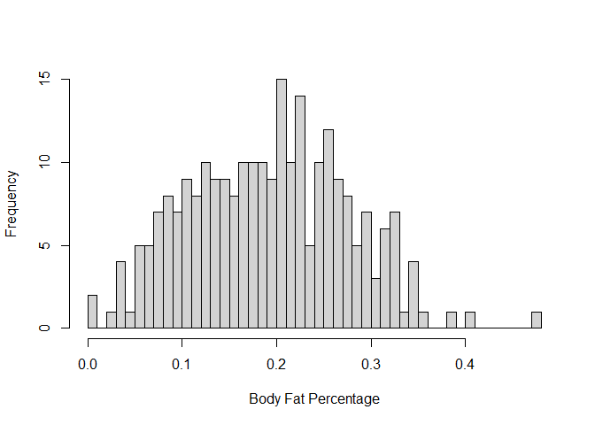<!-- -->

Let us also check the predictors we want to use in the model.

``` r
library(modelsummary)
datasummary_skim(bodyfat[,3:15])
```

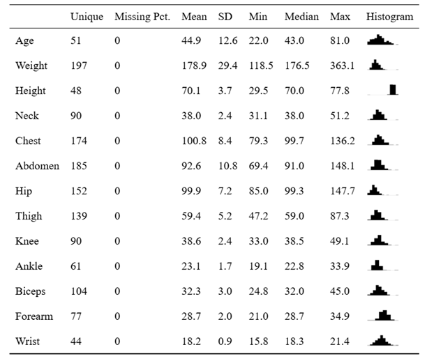<!-- -->

``` r
bodyfat[,3:8] %>%
  pivot_longer(cols = everything(), names_to = "variable", values_to = "value") %>% 
  ggplot(aes(x = value)) +
  geom_histogram(bins = 15, fill = "steelblue", color = "white") +
  facet_wrap(~ variable, scales = "free_x") +
  theme_minimal() +
  labs(title = "Histograms of All Numeric Variables", x = "Value", y = "Count")
```

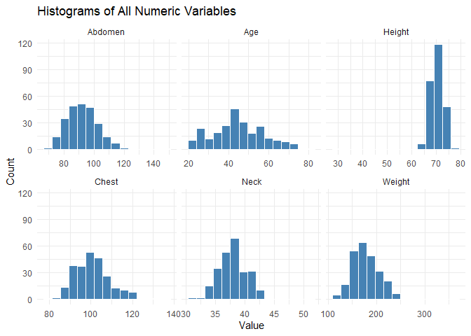<!-- -->

``` r
bodyfat[,9:15] %>%
  pivot_longer(cols = everything(), names_to = "variable", values_to = "value") %>% 
  ggplot(aes(x = value)) +
  geom_histogram(bins = 15, fill = "steelblue", color = "white") +
  facet_wrap(~ variable, scales = "free_x") +
  theme_minimal() +
  labs(title = "Histograms of All Numeric Variables", x = "Value", y = "Count")
```

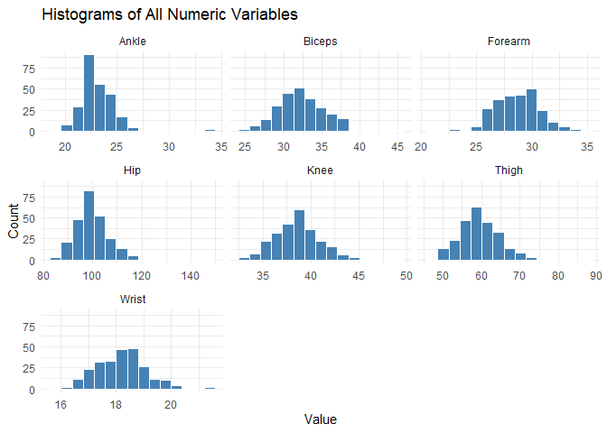<!-- -->

No predictor values are missing, and the values seem reasonable. We will
also investigate the correlation between predictors by plotting the
correlation heatmap and also performing the redundancy analysis via
*redun*.

``` r
library(pheatmap)
pheatmap(cor(bodyfat[,3:15]),display_numbers = TRUE, fontsize = 8, cluster_rows = FALSE, cluster_cols = FALSE)
```

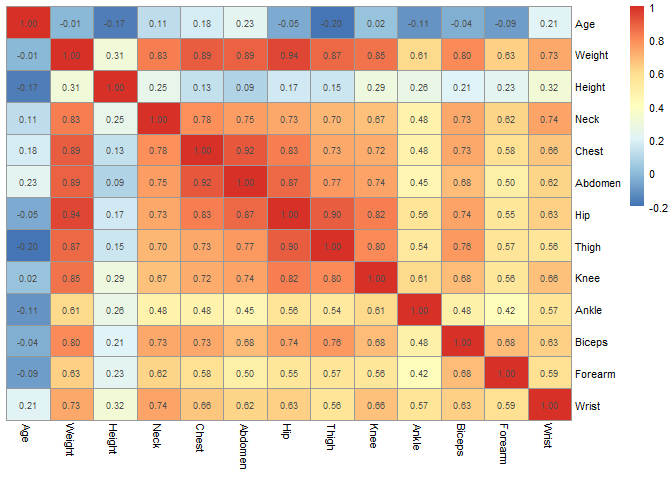<!-- -->

``` r
library(Hmisc)
redun(~.- BodyFat - Density,data = bodyfat,nk = 4, r2 = 0.95)
```

    ## 
    ## Redundancy Analysis
    ## 
    ## ~Age + Weight + Height + Neck + Chest + Abdomen + Hip + Thigh + 
    ##     Knee + Ankle + Biceps + Forearm + Wrist
    ## <environment: 0x000002708a761158>
    ## 
    ## n: 252   p: 13   nk: 4 
    ## 
    ## Number of NAs:    0 
    ## 
    ## Transformation of target variables forced to be linear
    ## 
    ## R-squared cutoff: 0.95   Type: ordinary 
    ## 
    ## R^2 with which each variable can be predicted from all other variables:
    ## 
    ##     Age  Weight  Height    Neck   Chest Abdomen     Hip   Thigh    Knee   Ankle 
    ##   0.602   0.984   0.556   0.787   0.918   0.936   0.943   0.895   0.821   0.524 
    ##  Biceps Forearm   Wrist 
    ##   0.757   0.615   0.776 
    ## 
    ## Rendundant variables:
    ## 
    ## Weight
    ## 
    ## 
    ## Predicted from variables:
    ## 
    ## Age Height Neck Chest Abdomen Hip Thigh Knee Ankle Biceps Forearm Wrist
    ## 
    ##   Variable Deleted   R^2 R^2 after later deletions
    ## 1           Weight 0.984

We observe that some variables are strongly correlated and can be
predicted from other variables. Hence, we should investigate dropping
some variables from the model to make the prediction model simpler (we
do not want to take 14 measurements when we need to take just 5 to make
an accurate prediction). As the last step, we will standardize all the
predictors. This step is crucial when considering shrinkage priors such
as Laplace or horseshoe.

``` r
bodyfat_std <- as.data.frame(cbind(bodyfat$BodyFat, scale(bodyfat[,3:15], center = TRUE, scale = TRUE)))
colnames(bodyfat_std) <- colnames(bodyfat)[2:15]
```

## Bayesian Ordinary Linear Regression

Let us first consider a Bayesian ordinary linear regression with
noninformative priors. We know from the previous circle that *brms*
actually does not use noninformative priors on intercept and variance
(it uses Student’s t-distribution), so we have to force it manually to
do so.

``` r
ols_prior <- c(
  set_prior("", class = "Intercept"),
  prior("", class = "sigma"),
  prior_string("target += -log(sigma)", check = FALSE)
)

bodyfat_b_ols <- brm(BodyFat  ~ ., prior = ols_prior, family = gaussian(), data = bodyfat_std, refresh = 0, silent = 2, seed = 123, warmup = 2000, iter = 10000)
bodyfat_b_ols <- add_criterion(bodyfat_b_ols, criterion = "loo", save_psis = TRUE, reloo = TRUE)
```

``` r
prior_summary(bodyfat_b_ols)
```

    ##                  prior     class    coef group resp dpar nlpar lb ub tag        source
    ##                 (flat)         b                                        
    ##                 (flat)         b Abdomen                                       default
    ##                 (flat)         b     Age                                  (vectorized)
    ##                 (flat)         b   Ankle                                  (vectorized)
    ##                 (flat)         b  Biceps                                  (vectorized)
    ##                 (flat)         b Forearm                                  (vectorized)
    ##                 (flat)         b  Height                                  (vectorized)
    ##                 (flat)         b     Hip                                  (vectorized)
    ##                 (flat)         b   Chest                                  (vectorized)
    ##                 (flat)         b    Knee                                  (vectorized)
    ##                 (flat)         b    Neck                                  (vectorized)
    ##                 (flat)         b   Thigh                                  (vectorized)
    ##                 (flat)         b  Weight                                  (vectorized)
    ##                 (flat)         b   Wrist                                  (vectorized)
    ##                 (flat) Intercept                                                  user
    ##                 (flat)     sigma                                0                 user           
    ##  target += -log(sigma)                                                            user

Let us check the fit.

``` r
summary(bodyfat_b_ols)
```

    ##  Family: gaussian 
    ##   Links: mu = identity 
    ## Formula: BodyFat ~ Age + Weight + Height + Neck + Chest + Abdomen + Hip + Thigh + Knee + Ankle + Biceps + Forearm + Wrist 
    ##    Data: bodyfat_std (Number of observations: 252) 
    ##   Draws: 4 chains, each with iter = 10000; warmup = 2000; thin = 1;
    ##          total post-warmup draws = 32000
    ## 
    ## Regression Coefficients:
    ##           Estimate Est.Error l-95% CI u-95% CI Rhat Bulk_ESS Tail_ESS
    ## Intercept    19.15      0.27    18.62    19.68 1.00    37631    23815
    ## Age           0.78      0.41    -0.03     1.59 1.00    23337    23868
    ## Weight       -2.60      1.56    -5.64     0.47 1.00    19295    21097
    ## Height       -0.25      0.35    -0.94     0.44 1.00    25968    23958
    ## Neck         -1.14      0.57    -2.25    -0.01 1.00    28196    23447
    ## Chest        -0.20      0.84    -1.85     1.46 1.00    24955    23854
    ## Abdomen      10.30      0.94     8.46    12.14 1.00    23803    23111
    ## Hip          -1.49      1.04    -3.51     0.56 1.00    24166    24244
    ## Thigh         1.24      0.76    -0.25     2.73 1.00    26065    24356
    ## Knee          0.04      0.59    -1.12     1.18 1.00    30675    24517
    ## Ankle         0.30      0.38    -0.44     1.03 1.00    31265    24975
    ## Biceps        0.55      0.52    -0.46     1.57 1.00    31547    24311
    ## Forearm       0.91      0.41     0.12     1.70 1.00    31941    25465
    ## Wrist        -1.51      0.51    -2.50    -0.52 1.00    27398    24804
    ## 
    ## Further Distributional Parameters:
    ##       Estimate Est.Error l-95% CI u-95% CI Rhat Bulk_ESS Tail_ESS
    ## sigma     4.32      0.20     3.95     4.73 1.00    35440    23879
    ## 
    ## Draws were sampled using sampling(NUTS). For each parameter, Bulk_ESS
    ## and Tail_ESS are effective sample size measures, and Rhat is the potential
    ## scale reduction factor on split chains (at convergence, Rhat = 1).

``` r
np <- nuts_params(bodyfat_b_ols)
p1 <- mcmc_nuts_energy(np, merge_chains = TRUE, bins = 50)
p2 <-mcmc_nuts_divergence(np, log_posterior(bodyfat_b_ols))

(p1 + p2) + plot_layout(ncol = 2)
```

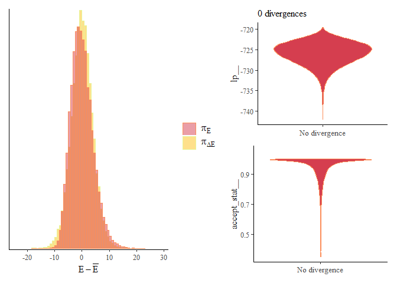<!-- -->

We can compare the point estimates with the OLS.

``` r
summary(lm(BodyFat  ~ ., data = bodyfat_std))
```

    ## 
    ## Call:
    ## lm(formula = BodyFat ~ ., data = bodyfat_std)
    ## 
    ## Residuals:
    ##      Min       1Q   Median       3Q      Max 
    ## -11.1687  -2.8639  -0.1014   3.2085  10.0068 
    ## 
    ## Coefficients:
    ##             Estimate Std. Error t value Pr(>|t|)    
    ## (Intercept) 19.15079    0.27121  70.613  < 2e-16 ***
    ## Age          0.78232    0.40766   1.919  0.05618 .  
    ## Weight      -2.59931    1.57307  -1.652  0.09978 .  
    ## Height      -0.25490    0.35166  -0.725  0.46925    
    ## Neck        -1.14399    0.56511  -2.024  0.04405 *  
    ## Chest       -0.20119    0.83586  -0.241  0.81000    
    ## Abdomen     10.29540    0.93218  11.044  < 2e-16 ***
    ## Hip         -1.48684    1.04531  -1.422  0.15622    
    ## Thigh        1.23951    0.75787   1.636  0.10326    
    ## Knee         0.03686    0.58360   0.063  0.94970    
    ## Ankle        0.29490    0.37536   0.786  0.43285    
    ## Biceps       0.54867    0.51702   1.061  0.28966    
    ## Forearm      0.91340    0.40238   2.270  0.02410 *  
    ## Wrist       -1.51300    0.49942  -3.030  0.00272 ** 
    ## ---
    ## Signif. codes:  0 '***' 0.001 '**' 0.01 '*' 0.05 '.' 0.1 ' ' 1
    ## 
    ## Residual standard error: 4.305 on 238 degrees of freedom
    ## Multiple R-squared:  0.749,  Adjusted R-squared:  0.7353 
    ## F-statistic: 54.65 on 13 and 238 DF,  p-value: < 2.2e-16

As expected, the point estimates obtained using both methods are almost
identical. This also holds for the interval estimates.

``` r
library(bayestestR)
hdi(bodyfat_b_ols)
```

    ## Highest Density Interval
    ## 
    ## Parameter   |        95% HDI
    ## ----------------------------
    ## (Intercept) | [18.62, 19.68]
    ## Age         | [-0.02,  1.59]
    ## Weight      | [-5.66,  0.45]
    ## Height      | [-0.96,  0.43]
    ## Neck        | [-2.26, -0.02]
    ## Chest       | [-1.87,  1.42]
    ## Abdomen     | [ 8.45, 12.13]
    ## Hip         | [-3.49,  0.58]
    ## Thigh       | [-0.28,  2.70]
    ## Knee        | [-1.11,  1.19]
    ## Ankle       | [-0.44,  1.02]
    ## Biceps      | [-0.46,  1.57]
    ## Forearm     | [ 0.12,  1.69]
    ## Wrist       | [-2.46, -0.49]

``` r
confint(lm(BodyFat  ~ ., data = bodyfat_std))
```

    ##                   2.5 %      97.5 %
    ## (Intercept) 18.61651971 19.68506759
    ## Age         -0.02076853  1.58540366
    ## Weight      -5.69823358  0.49960414
    ## Height      -0.94765804  0.43785862
    ## Neck        -2.25723986 -0.03073575
    ## Chest       -1.84780504  1.44543283
    ## Abdomen      8.45901943 12.13177161
    ## Hip         -3.54607764  0.57240449
    ## Thigh       -0.25347952  2.73250524
    ## Knee        -1.11282994  1.18654055
    ## Ankle       -0.44455207  1.03435927
    ## Biceps      -0.46984174  1.56718297
    ## Forearm      0.12072545  1.70608005
    ## Wrist       -2.49684777 -0.52916070

We often read lamentations that confidence intervals are frequently
misunderstood by practitioners, who interpret them as Bayesian credible
intervals rather than correctly from the frequentist “repeated
experiment” viewpoint. However, as we observe here, there are practical
situations in which they give very similar results.

These similar results happens largely because under some regularity
conditions,
$`p(\theta \mid y) \approx N(\hat \theta_\text{MLE}, I(\hat \theta_\text{MLE})^{-1})`$,
where $`I(\hat \theta_\text{MLE})`$ is the observed (i.e., sample-based)
Fisher information matrix (Gelman et al. 1995). This coincides with the
core frequentist result that
$`\hat\theta_\text{MLE} \approx N(\theta_0,I(\hat \theta_\text{MLE})^{-1} )`$
($`\theta_0`$ denotes the true value of the parameter), which is used to
construct the standard (known as *Wald*) confidence intervals. However,
one must always keep in mind there are many ways to construct confidence
intervals (other than Wald confidence intervals), and these can be
wildly different from credible intervals, even derived from
noninformative priors (see (Morey et al. 2016) for a concrete example).

Let us perform the posterior predictive check.

``` r
y_sim <- posterior_predict(bodyfat_b_ols)
ppc_dens_overlay(get_y(bodyfat_b_ols), y_sim[1:250,])
```

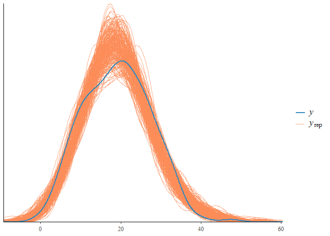<!-- -->

``` r
psis_object <- bodyfat_b_ols$criteria$loo$psis_object
lw <- weights(psis_object)

p1 <- ppc_loo_pit_overlay(get_y(bodyfat_b_ols), y_sim, lw = lw)
p2 <- ppc_loo_pit_qq(get_y(bodyfat_b_ols), y_sim, lw = lw)
p3 <- ppc_loo_pit_ecdf(get_y(bodyfat_b_ols), y_sim, lw = lw, plot_diff = TRUE)
p4 <- ppc_loo_intervals(get_y(bodyfat_b_ols), y_sim, psis_object = psis_object, prob = 0.75, prob_outer = 0.99)

(p1 + p2 + p3 + p4) + plot_layout(ncol = 2)
```

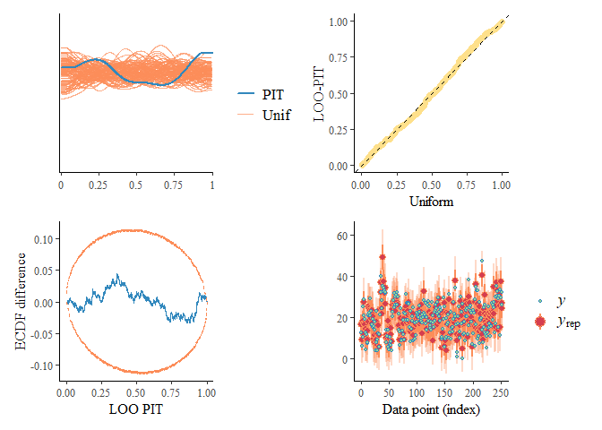<!-- -->

We can also check the normality of expected (LOO) residuals.

``` r
lood_ypred <- loo_epred(bodyfat_b_ols)
qqnorm(lood_ypred[,]-get_y(bodyfat_b_ols))
qqline(lood_ypred[,]-get_y(bodyfat_b_ols))
```

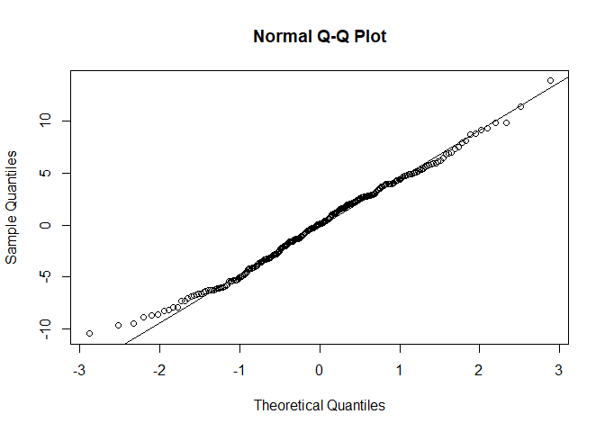<!-- -->

Overall, the model seems reasonable.

A popular metric that is used to assess standard OLS models is $`R^2`$
(*coefficient of determination*)
``` math
 R^2 = \frac{\text{explained sum of squares}}{\text{total sum of squares}} = \frac{\sum_i(X_i\hat\beta - \bar y)^2}{\sum_i(y_i -\bar y)^2},
```
which expresses how much variability in the data is explained by the
model. It can also be computed as
``` math
R^2 = 1 - \frac{\text{residual sum of squares}}{\text{total sum of squares}} = 1 - \frac{\sum_i (y_i - X_i\hat\beta)^2}{\sum_i(y_i -\bar y)^2}.
```
since
$`\text{explained sum of squares} + \text{residual sum of squares} = \text{total sum of squares}`$.
Also importantly, the explained sum of squares is just the sample
variance of $`X\hat\beta`$ (since $`\sum_i X_i\hat\beta/n = \bar y`$)
and the residual sum of squares is the sample variance of residuals.
Hence, we can define the Bayes analog of $`R^2`$ as(Gelman et al. 2019)

``` math
 R^2 = \frac{\sum_i \text{Var } y^{\text{pred},s}_i}{\sum_i \text{Var } y^{\text{pred},s}_i + (\sigma^s)^2},
```
where $`y^{\text{pred},s}_i`$ are expected predictions based on
posterior draws $`\beta^s`$ and $`\sigma^s`$ denotes posterior draws of
$`\sigma`$.

``` r
y_pred <- posterior_epred(bodyfat_b_ols)
var_y_pred <- apply(y_pred, 1, var)
sigmas2 <- (as_draws_df(bodyfat_b_ols)$sigma)^2

bayes_Rsquared <- (var_y_pred)/(var_y_pred + sigmas2)
summary(bayes_Rsquared)
```

    ##    Min. 1st Qu.  Median    Mean 3rd Qu.    Max. 
    ##  0.6136  0.7258  0.7418  0.7404  0.7563  0.8176

We do not have to compute the Bayesian $`R^2`$ ourselves; we can use
*bayes_R2* instead.

``` r
bayes_R2(bodyfat_b_ols)
```

    ##     Estimate Est.Error      Q2.5     Q97.5
    ## R2 0.7415645 0.0146336 0.7092217 0.7663408

We observe that the model explains a significant portion of the variance
in the data.

## Bayesian Ridge Regression

Let’s consider other Bayesian Linear Models derived from the ordinary
linear regression by considering other priors. Bayesian Ridge Regression
is obtained by considering normal priors. Normal priors *shrink*
estimates of $`\beta`$, which can help improve the model’s
generalizability to new data (observed large effects are often overly
optimistic).

Let’s consider priors $`\beta \mid X \sim N(0, 0.25I)`$ (we are
excluding the intercept here, since it does not really make sense to
shrink it).

``` r
ridge_prior <- c(
  set_prior("", class = "Intercept"),
  prior("", class = "sigma"),
  set_prior("normal(0, 0.5)", class = "b"),
  prior_string("target += -log(sigma)", check = FALSE)
)

bodyfat_b_ridge <- brm(BodyFat  ~ ., prior = ridge_prior, family = gaussian(), data = bodyfat_std, refresh = 0, silent = 2, seed = 123, warmup = 2000, iter = 10000)
```

    ##  Family: gaussian 
    ##   Links: mu = identity 
    ## Formula: BodyFat ~ Age + Weight + Height + Neck + Chest + Abdomen + Hip + Thigh + Knee + Ankle + Biceps + Forearm + Wrist 
    ##    Data: bodyfat_std (Number of observations: 252) 
    ##   Draws: 4 chains, each with iter = 10000; warmup = 2000; thin = 1;
    ##          total post-warmup draws = 32000
    ## 
    ## Regression Coefficients:
    ##           Estimate Est.Error l-95% CI u-95% CI Rhat Bulk_ESS Tail_ESS
    ## Intercept    19.15      0.31    18.53    19.76 1.00    64486    22240
    ## Age           1.29      0.30     0.71     1.86 1.00    50671    26941
    ## Weight        0.48      0.45    -0.40     1.35 1.00    51581    24188
    ## Height       -0.81      0.28    -1.37    -0.26 1.00    55406    24548
    ## Neck         -0.19      0.38    -0.93     0.54 1.00    50724    25623
    ## Chest         1.35      0.41     0.55     2.13 1.00    53943    24858
    ## Abdomen       2.91      0.43     2.06     3.76 1.00    45787    25338
    ## Hip           0.67      0.42    -0.14     1.50 1.00    48016    24443
    ## Thigh         0.72      0.40    -0.06     1.51 1.00    51293    26699
    ## Knee          0.20      0.38    -0.55     0.95 1.00    51103    23021
    ## Ankle        -0.18      0.32    -0.80     0.44 1.00    53041    23932
    ## Biceps        0.28      0.36    -0.43     0.99 1.00    55375    25060
    ## Forearm       0.29      0.33    -0.37     0.93 1.00    57543    23881
    ## Wrist        -0.87      0.36    -1.58    -0.15 1.00    51933    26038
    ## 
    ## Further Distributional Parameters:
    ##       Estimate Est.Error l-95% CI u-95% CI Rhat Bulk_ESS Tail_ESS
    ## sigma     4.99      0.25     4.54     5.50 1.00    48411    25111
    ## 
    ## Draws were sampled using sampling(NUTS). For each parameter, Bulk_ESS
    ## and Tail_ESS are effective sample size measures, and Rhat is the potential
    ## scale reduction factor on split chains (at convergence, Rhat = 1).

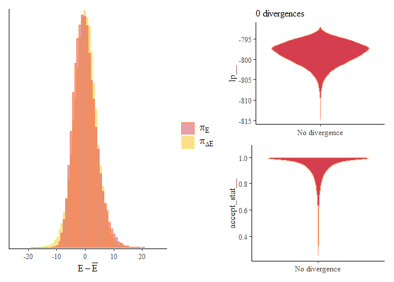<!-- -->

We can immediately notice that the large coefficients are significantly
smaller compared to OLS.

``` r
hdi_brmsfit <- function(x) {
 
  hdi_info <- hdi(x)
  
  df <- data.frame(
    Parameter = hdi_info$Parameter,
    HDI_low  = round(hdi_info$CI_low,2), 
    HDI_high = round(hdi_info$CI_high,2)
  )
  return(df)
}

hdis <- cbind(hdi_brmsfit(bodyfat_b_ols), hdi_brmsfit(bodyfat_b_ridge)[2:3])
colnames(hdis) <- c("Parameter", "HDI_low OLS",   "HDI_high OLS",  "HDI_low Ridge",   "HDI_high Ridge")
hdis
```

    ##      Parameter HDI_low OLS HDI_high OLS HDI_low Ridge HDI_high Ridge
    ## 1  b_Intercept       18.62        19.68         18.54          19.77
    ## 2        b_Age       -0.02         1.59          0.70           1.86
    ## 3     b_Weight       -5.66         0.45         -0.41           1.34
    ## 4     b_Height       -0.96         0.43         -1.36          -0.25
    ## 5       b_Neck       -2.26        -0.02         -0.93           0.54
    ## 6      b_Chest       -1.87         1.42          0.54           2.12
    ## 7    b_Abdomen        8.45        12.13          2.06           3.76
    ## 8        b_Hip       -3.49         0.58         -0.16           1.48
    ## 9      b_Thigh       -0.28         2.70         -0.07           1.50
    ## 10      b_Knee       -1.11         1.19         -0.55           0.95
    ## 11     b_Ankle       -0.44         1.02         -0.77           0.47
    ## 12    b_Biceps       -0.46         1.57         -0.42           1.00
    ## 13   b_Forearm        0.12         1.69         -0.36           0.94
    ## 14     b_Wrist       -2.46        -0.49         -1.59          -0.16

The natural question is how much shrinkage to use for a given problem.
Similar to determining hyperparameters in a hierarchical model, we can
employ leave-one-out (LOO) cross-validation. Let us denote the
hyperparameter for the ridge regression as
$`\beta\mid X \sim N(0, \tau^2)`$.

``` r
ridge_values <- c(0.5, 1, 2, 3, 5, 10, 20)

loo_scores <- numeric(length(ridge_values))

tau <- stanvar(x = ridge_values[1], name = "tau")

ridge_prior <- c(
  set_prior("", class = "Intercept"),
  prior("", class = "sigma"),
  set_prior("normal(0, tau)", class = "b"),
  prior_string("target += -log(sigma)", check = FALSE)
)


bodyfat_b_ridge <- brm(BodyFat  ~ ., prior = ridge_prior, family = gaussian(), stanvars = tau, data = bodyfat_std, refresh = 0, silent = 2, seed = 123, warmup = 2000, iter = 10000)

bodyfat_b_ridge <- add_criterion(bodyfat_b_ridge, criterion = "loo", save_psis = TRUE, reloo = TRUE)
loo_scores[1] <- bodyfat_b_ridge$criteria$loo$estimates[3]


for (i in 2:length(ridge_values)) {

  tau <- stanvar(x = ridge_values[i], name = "tau")

  bodyfat_b_ridge <- update(bodyfat_b_ridge, stanvars = tau, recompile = FALSE)
  
  bodyfat_b_ridge <- add_criterion(bodyfat_b_ridge, criterion = "loo", save_psis = TRUE, reloo = TRUE)
  loo_scores[i] <- bodyfat_b_ridge$criteria$loo$estimates[3]
}
```

``` r
names(loo_scores) <- ridge_values
loo_scores
```

    ##      0.5        1        2        3        5       10       20 
    ## 1534.191 1490.870 1471.329 1468.862 1468.734 1468.769 1468.999

``` r
ggplot() + geom_point(aes(x = ridge_values, y = loo_scores)) +  xlab("Tau") + ylab("LOO-CV")
```

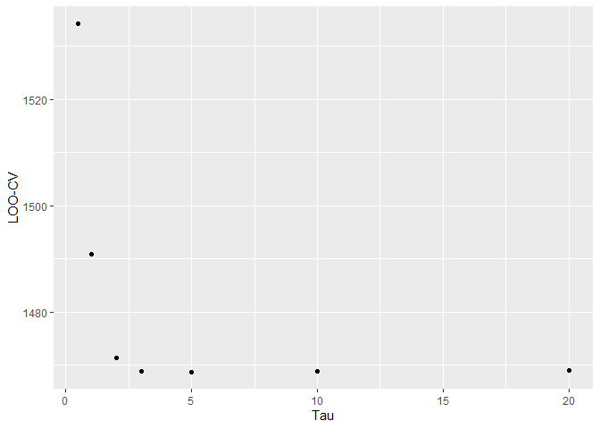<!-- -->

We observe that the model does not really require shrinkage; the LOO-CV
scores plateaued for $`\tau \geq 3`$. This is not that surprising, since
we have a reasonable number (13) predictors for 225 observations.

``` r
tau <- stanvar(x = ridge_values[4], name = "tau")
bodyfat_b_ridge <- update(bodyfat_b_ridge, stanvars = tau, recompile = FALSE)
bodyfat_b_ridge <- add_criterion(bodyfat_b_ridge, criterion = "loo", save_psis = TRUE, reloo = TRUE)
summary(bodyfat_b_ridge)
```

    ##  Family: gaussian 
    ##   Links: mu = identity 
    ## Formula: BodyFat ~ Age + Weight + Height + Neck + Chest + Abdomen + Hip + Thigh + Knee + Ankle + Biceps + Forearm + Wrist 
    ##    Data: bodyfat_std (Number of observations: 252) 
    ##   Draws: 4 chains, each with iter = 10000; warmup = 2000; thin = 1;
    ##          total post-warmup draws = 32000
    ## 
    ## Regression Coefficients:
    ##           Estimate Est.Error l-95% CI u-95% CI Rhat Bulk_ESS Tail_ESS
    ## Intercept    19.15      0.28    18.61    19.69 1.00    46724    23614
    ## Age           0.94      0.40     0.16     1.73 1.00    23862    24148
    ## Weight       -1.92      1.37    -4.58     0.77 1.00    23135    23039
    ## Height       -0.34      0.34    -1.01     0.32 1.00    31059    24154
    ## Neck         -1.13      0.55    -2.21    -0.05 1.00    33096    24465
    ## Chest         0.07      0.78    -1.46     1.60 1.00    28941    25487
    ## Abdomen       9.34      0.88     7.61    11.06 1.00    25163    24970
    ## Hip          -1.24      0.96    -3.14     0.64 1.00    27267    24053
    ## Thigh         1.20      0.73    -0.22     2.64 1.00    26135    25617
    ## Knee         -0.03      0.57    -1.14     1.10 1.00    32075    23454
    ## Ankle         0.23      0.37    -0.49     0.96 1.00    38352    24993
    ## Biceps        0.47      0.50    -0.52     1.45 1.00    34339    25469
    ## Forearm       0.87      0.40     0.08     1.66 1.00    37150    24340
    ## Wrist        -1.57      0.49    -2.53    -0.59 1.00    31152    24743
    ## 
    ## Further Distributional Parameters:
    ##       Estimate Est.Error l-95% CI u-95% CI Rhat Bulk_ESS Tail_ESS
    ## sigma     4.32      0.20     3.96     4.73 1.00    38936    24286
    ## 
    ## Draws were sampled using sampling(NUTS). For each parameter, Bulk_ESS
    ## and Tail_ESS are effective sample size measures, and Rhat is the potential
    ## scale reduction factor on split chains (at convergence, Rhat = 1).

We can get a similar result by using a fully Bayesian approach by
setting a prior on $`\tau`$. Let’s use $`\tau \sim \text{Exp}(1)`$.

``` r
ridge_prior2 <- c(
  set_prior("", class = "Intercept"),
  prior("", class = "sigma"),
  set_prior("normal(0, tau)", class = "b"),
  prior_string("target += exponential_lpdf(tau | 1)", check = FALSE),
  prior_string("target += -log(sigma)", check = FALSE)
)

stanvars <- stanvar(scode = "real<lower=0> tau;", block = "parameters")

bodyfat_b_ridge2 <- brm(BodyFat  ~ ., prior = ridge_prior2, stanvars = stanvars, family = gaussian(), data = bodyfat_std, refresh = 0, silent = 2, seed = 123, warmup = 2000, iter = 10000)
bodyfat_b_ridge2 <- add_criterion(bodyfat_b_ridge2, criterion = "loo", save_psis = TRUE, reloo = TRUE)
```

``` r
dens <- density(as_draws_df(bodyfat_b_ridge2)$tau)
dens_data <- data.frame(x = dens$x, y = dens$y)
ggplot(dens_data, aes(x = x, y = y)) +  geom_line(linewidth = 1) + xlab('Tau') + ylab('Posterior Density')
```

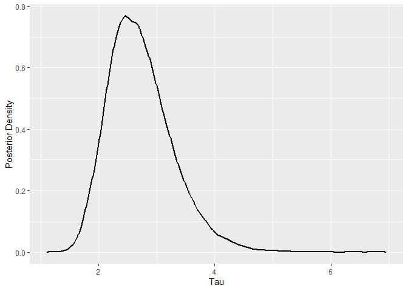<!-- -->
Again, the “optimal” value of $`\tau`$ is around 3. Let’s compare the
parameter estimates for both ridge regression models (the one found by
LOO-CV and the full Bayesian one) with the Bayesian OLS.

``` r
hdis <- cbind(hdi_brmsfit(bodyfat_b_ols), hdi_brmsfit(bodyfat_b_ridge)[2:3], hdi_brmsfit(bodyfat_b_ridge2)[2:3])

colnames(hdis) <- c("Parameter", "HDI_low OLS",   "HDI_high OLS",  "HDI_low Ridge (CV)",   "HDI_high Ridge (CV)",  "HDI_low Ridge (fullB)",   "HDI_high Ridge (fullB)")
hdis
```

    ##      Parameter HDI_low OLS HDI_high OLS HDI_low Ridge (CV) HDI_high Ridge (CV)  HDI_low Ridge (fullB) HDI_high Ridge (fullB)
    ## 1  b_Intercept       18.62        19.68              18.61               19.69                  18.61                  19.67
    ## 2        b_Age       -0.02         1.59               0.17                1.73                   0.20                   1.77
    ## 3     b_Weight       -5.66         0.45              -4.59                0.76                  -4.49                   0.76
    ## 4     b_Height       -0.96         0.43              -1.00                0.33                  -1.04                   0.30
    ## 5       b_Neck       -2.26        -0.02              -2.19               -0.03                  -2.21                  -0.08
    ## 6      b_Chest       -1.87         1.42              -1.44                1.63                  -1.42                   1.67
    ## 7    b_Abdomen        8.45        12.13               7.65               11.09                   7.12                  10.88
    ## 8        b_Hip       -3.49         0.58              -3.08                0.69                  -3.00                   0.69
    ## 9      b_Thigh       -0.28         2.70              -0.24                2.61                  -0.25                   2.58
    ## 10      b_Knee       -1.11         1.19              -1.14                1.10                  -1.16                   1.07
    ## 11     b_Ankle       -0.44         1.02              -0.51                0.95                  -0.51                   0.93
    ## 12    b_Biceps       -0.46         1.57              -0.51                1.45                  -0.54                   1.45
    ## 13   b_Forearm        0.12         1.69               0.10                1.67                   0.05                   1.61
    ## 14     b_Wrist       -2.46        -0.49              -2.53               -0.60                  -2.52                  -0.62

We observe very small changes. We can also compare the models using
LOO-CV scores.

``` r
loo_compare(bodyfat_b_ols,bodyfat_b_ridge, bodyfat_b_ridge2)
```

    ##             model elpd_diff se_diff p_worse       diag_diff diag_elpd
    ##   bodyfat_b_ridge       0.0     0.0      NA                          
    ##     bodyfat_b_ols      -0.1     1.1    0.53 |elpd_diff| < 4          
    ##  bodyfat_b_ridge2      -0.5     0.4    0.92 |elpd_diff| < 4

All three models are practically identical.

For a comparison, the ordinary non-Bayesian ridge regression can be
fitted as follows (a 10-fold CV estimates the optimal ridge shrinkage
parameter).

``` r
library(glmnet)

model_matrix_bodyfat <- as.matrix(bodyfat_std[2:14])
bodyfat_ridge_cv <- cv.glmnet(model_matrix_bodyfat,bodyfat_std$BodyFat,alpha=0,family='gaussian',nfolds = 10,type.measure = 'mse')
bodyfat_ridge_cv
```

    ## 
    ## Call:  cv.glmnet(x = model_matrix_bodyfat, y = bodyfat_std$BodyFat,      type.measure = "mse", nfolds = 10, alpha = 0, family = "gaussian") 
    ## 
    ## Measure: Mean-Squared Error 
    ## 
    ##     Lambda Index Measure    SE Nonzero
    ## min 0.6794   100   21.84 2.240      13
    ## 1se 1.8904    89   24.07 2.479      13

We observe again that the optimal shrinkage appears to be very small.

``` r
plot(bodyfat_ridge_cv)
```

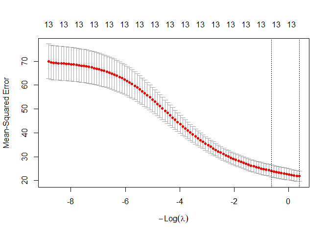<!-- -->

The estimates for the optimal ridge shrinkage are as follows.

``` r
bodyfat_ridge_cv$glmnet.fit$beta[,bodyfat_ridge_cv$index[1]]
```

    ##         Age      Weight      Height        Neck       Chest     Abdomen 
    ##  1.38617719 -0.23278180 -0.64360331 -0.83255797  1.11113308  5.68912637 
    ##         Hip       Thigh        Knee       Ankle      Biceps     Forearm 
    ## -0.02733322  0.97495110 -0.05814441 -0.02265553  0.26824642  0.62277280 
    ##       Wrist 
    ## -1.54290961

## Bayesian LASSO

Let’s move to the Bayesian LASSO (Park and Casella 2008), which is
obtained by considering Laplace(double exponential) priors
``` math
 \beta_j \mid X \sim \text{Laplace} (\lambda) = \frac{\lambda}{2}\exp(-\lambda|\beta_j|).
```

We know that non-Bayesian LASSO is a bit special since, apart from
shrinkage, it also causes *variable selection*; typically, many optimal
values of parameters are zero. This can be very useful since it allows
us to simplify our model (e.g., in our case, we would have to take fewer
body measurements). However, we will unfortunately observe that while
non-Bayesian LASSO causes variable selection (i.e., the MAP estimator),
the whole posterior distribution does not.

Let us fit a Bayesian LASSO model.

``` r
lasso_prior <- c(
  set_prior("", class = "Intercept"),
  prior("", class = "sigma"),
  set_prior("double_exponential(0, 0.5)", class = "b"),
  prior_string("target += -log(sigma)", check = FALSE)
)


bodyfat_b_lasso <- brm(BodyFat  ~ ., prior = lasso_prior, family = gaussian(), data = bodyfat_std, refresh = 0, silent = 2, seed = 123, warmup = 2000, iter = 10000)
```

``` r
summary(bodyfat_b_lasso)
```

    ##  Family: gaussian 
    ##   Links: mu = identity 
    ## Formula: BodyFat ~ Age + Weight + Height + Neck + Chest + Abdomen + Hip + Thigh + Knee + Ankle + Biceps + Forearm + Wrist 
    ##    Data: bodyfat_std (Number of observations: 252) 
    ##   Draws: 4 chains, each with iter = 10000; warmup = 2000; thin = 1;
    ##          total post-warmup draws = 32000
    ## 
    ## Regression Coefficients:
    ##           Estimate Est.Error l-95% CI u-95% CI Rhat Bulk_ESS Tail_ESS
    ## Intercept    19.15      0.28    18.61    19.69 1.00    33837    22204
    ## Age           0.73      0.37     0.04     1.47 1.00    23206    22921
    ## Weight       -0.75      0.79    -2.58     0.44 1.00    20178    17135
    ## Height       -0.49      0.30    -1.10     0.06 1.00    27931    22146
    ## Neck         -0.75      0.49    -1.76     0.11 1.00    27280    21113
    ## Chest         0.03      0.45    -0.89     0.98 1.00    29494    19609
    ## Abdomen       8.35      0.77     6.87     9.88 1.00    21684    21747
    ## Hip          -0.49      0.58    -1.79     0.46 1.00    23202    17753
    ## Thigh         0.32      0.47    -0.48     1.36 1.00    24787    18632
    ## Knee         -0.06      0.36    -0.81     0.67 1.00    30031    19883
    ## Ankle         0.00      0.28    -0.57     0.57 1.00    32352    20103
    ## Biceps        0.23      0.36    -0.43     1.02 1.00    28804    18877
    ## Forearm       0.51      0.36    -0.12     1.25 1.00    27871    22042
    ## Wrist        -1.32      0.48    -2.27    -0.38 1.00    25619    22386
    ## 
    ## Further Distributional Parameters:
    ##       Estimate Est.Error l-95% CI u-95% CI Rhat Bulk_ESS Tail_ESS
    ## sigma     4.37      0.20     4.00     4.79 1.00    31783    24021
    ## 
    ## Draws were sampled using sampling(NUTS). For each parameter, Bulk_ESS
    ## and Tail_ESS are effective sample size measures, and Rhat is the potential
    ## scale reduction factor on split chains (at convergence, Rhat = 1).

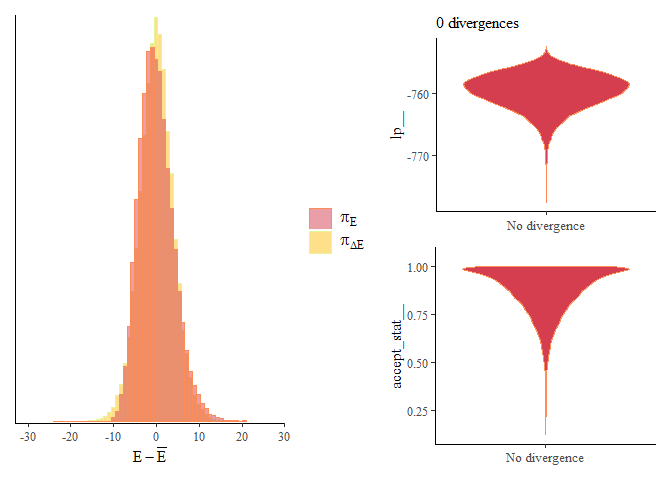<!-- -->

We fit the model without problems. To have a look at the Bayesian LASSO
behavior, let us explicitly plot the posterior distributions for all
parameters.

``` r
dens <- density(as_draws_df(bodyfat_b_lasso)$b_Age)
dens_data <- data.frame(x = dens$x, y = dens$y)
plot1 <- ggplot(dens_data, aes(x = x, y = y)) +  geom_line(linewidth = 1) + xlab('Age') + ylab('Posterior Density')

dens <- density(as_draws_df(bodyfat_b_lasso)$b_Weight)
dens_data <- data.frame(x = dens$x, y = dens$y)
plot2 <- ggplot(dens_data, aes(x = x, y = y)) +  geom_line(linewidth = 1) + xlab('Weight') + ylab('Posterior Density')


dens <- density(as_draws_df(bodyfat_b_lasso)$b_Height)
dens_data <- data.frame(x = dens$x, y = dens$y)
plot3 <- ggplot(dens_data, aes(x = x, y = y)) +  geom_line(linewidth = 1) + xlab('Height') + ylab('Posterior Density')


dens <- density(as_draws_df(bodyfat_b_lasso)$b_Neck)
dens_data <- data.frame(x = dens$x, y = dens$y)
plot4 <- ggplot(dens_data, aes(x = x, y = y)) +  geom_line(linewidth = 1) + xlab('Neck') + ylab('Posterior Density')


dens <- density(as_draws_df(bodyfat_b_lasso)$b_Chest)
dens_data <- data.frame(x = dens$x, y = dens$y)
plot5 <- ggplot(dens_data, aes(x = x, y = y)) +  geom_line(linewidth = 1) + xlab('Chest') + ylab('Posterior Density')

dens <- density(as_draws_df(bodyfat_b_lasso)$b_Abdomen)
dens_data <- data.frame(x = dens$x, y = dens$y)
plot6 <- ggplot(dens_data, aes(x = x, y = y)) +  geom_line(linewidth = 1) + xlab('Abdomen') + ylab('Posterior Density')

dens <- density(as_draws_df(bodyfat_b_lasso)$b_Hip)
dens_data <- data.frame(x = dens$x, y = dens$y)
plot7 <- ggplot(dens_data, aes(x = x, y = y)) +  geom_line(linewidth = 1) + xlab('Hip') + ylab('Posterior Density')

dens <- density(as_draws_df(bodyfat_b_lasso)$b_Thigh)
dens_data <- data.frame(x = dens$x, y = dens$y)
plot8 <- ggplot(dens_data, aes(x = x, y = y)) +  geom_line(linewidth = 1) + xlab('Thigh') + ylab('Posterior Density')


dens <- density(as_draws_df(bodyfat_b_lasso)$b_Knee)
dens_data <- data.frame(x = dens$x, y = dens$y)
plot9 <- ggplot(dens_data, aes(x = x, y = y)) +  geom_line(linewidth = 1) + xlab('Knee') + ylab('Posterior Density')


(plot1 + plot2 + plot3 + plot4 + plot5 + plot6 + plot7 + plot8 + plot9) + plot_layout(ncol = 3)
```

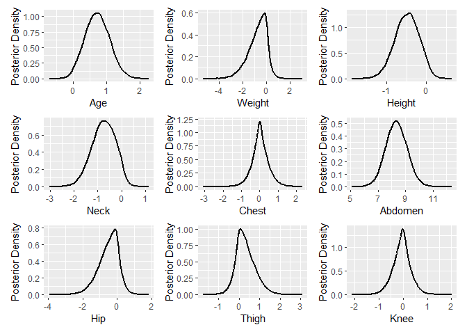<!-- -->

``` r
dens <- density(as_draws_df(bodyfat_b_lasso)$b_Ankle)
dens_data <- data.frame(x = dens$x, y = dens$y)
plot1 <- ggplot(dens_data, aes(x = x, y = y)) +  geom_line(linewidth = 1) + xlab('Ankle') + ylab('Posterior Density')

dens <- density(as_draws_df(bodyfat_b_lasso)$b_Biceps)
dens_data <- data.frame(x = dens$x, y = dens$y)
plot2 <- ggplot(dens_data, aes(x = x, y = y)) +  geom_line(linewidth = 1) + xlab('Biceps') + ylab('Posterior Density')


dens <- density(as_draws_df(bodyfat_b_lasso)$b_Forearm)
dens_data <- data.frame(x = dens$x, y = dens$y)
plot3 <- ggplot(dens_data, aes(x = x, y = y)) +  geom_line(linewidth = 1) + xlab('Forearm') + ylab('Posterior Density')


dens <- density(as_draws_df(bodyfat_b_lasso)$b_Wrist)
dens_data <- data.frame(x = dens$x, y = dens$y)
plot4 <- ggplot(dens_data, aes(x = x, y = y)) +  geom_line(linewidth = 1) + xlab('Wrist') + ylab('Posterior Density')


(plot1 + plot2 + plot3 + plot4) + plot_layout(ncol = 2)
```

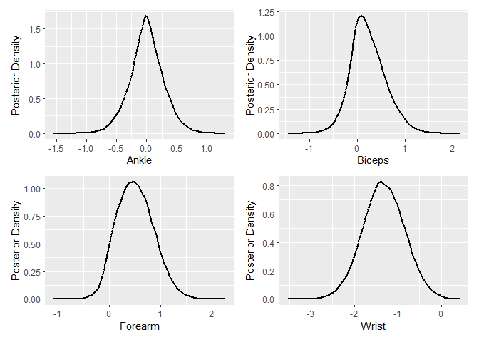<!-- -->

The posteriors seem pretty usual. Let’s repeat the plot for a smaller
value of $`\lambda`$ (i.e., more prior shrinkage)

``` r
lasso_prior <- c(
  set_prior("", class = "Intercept"),
  prior("", class = "sigma"),
  set_prior("double_exponential(0, 0.1)", class = "b"),
  prior_string("target += -log(sigma)", check = FALSE)
)

bodyfat_b_lasso <- brm(BodyFat  ~ ., prior = lasso_prior, family = gaussian(), data = bodyfat_std, refresh = 0, silent = 2, seed = 123, warmup = 2000, iter = 10000)
```

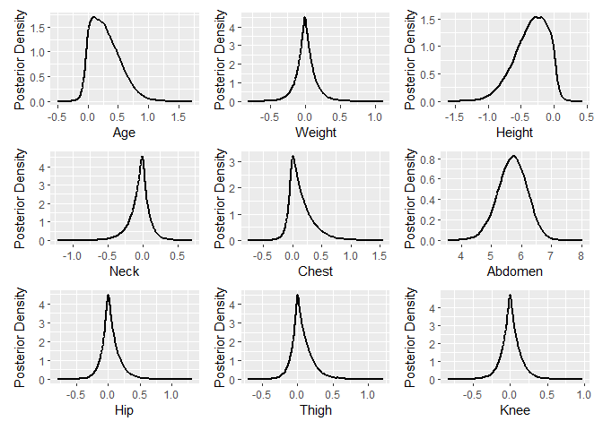<!-- -->

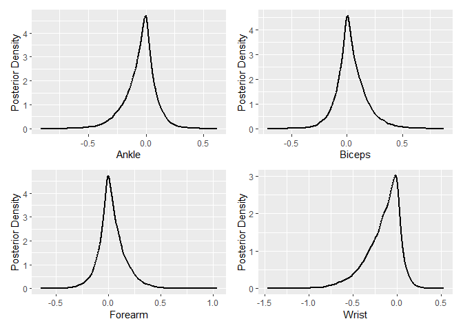<!-- -->

The distributions for smaller $`\lambda`$ are a bit more sharply
concentrated around 0. So, what were our notions about Bayesian LASSO
being quite different from non-Bayesian LASSO? Well, let us fit the
non-Bayesian LASSO. Again, we will determine an optimal shrinkage
parameter by CV.

``` r
bodyfat_lasso_cv <- cv.glmnet(model_matrix_bodyfat,bodyfat_std$BodyFat,alpha=1,family='gaussian',nfolds = 10,type.measure = 'mse')
bodyfat_lasso_cv
```

    ## 
    ## Call:  cv.glmnet(x = model_matrix_bodyfat, y = bodyfat_std$BodyFat,      type.measure = "mse", nfolds = 10, alpha = 1, family = "gaussian") 
    ## 
    ## Measure: Mean-Squared Error 
    ## 
    ##     Lambda Index Measure    SE Nonzero
    ## min 0.0447    55   19.82 1.796      11
    ## 1se 0.4575    30   21.50 1.775       4

``` r
plot(bodyfat_lasso_cv)
```

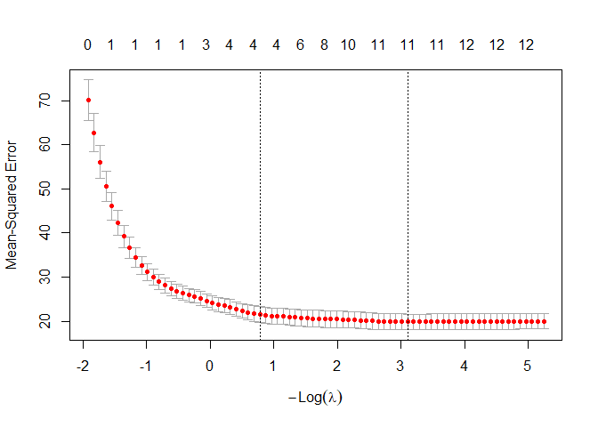<!-- -->

The value *min* corresponds to shrinkage for which the CV score was
minimal; *1se* is a larger shrinkage that is one standard deviation from
the optimal value. The estimated parameter values are as follows.

``` r
bodyfat_lasso_cv$glmnet.fit$beta[,bodyfat_lasso_cv$index[1]]
```

    ##        Age     Weight     Height       Neck      Chest    Abdomen        Hip 
    ##  0.7618661 -1.8629782 -0.3433152 -1.0335276  0.0000000  9.4810529 -0.9774518 
    ##      Thigh       Knee      Ankle     Biceps    Forearm      Wrist 
    ##  0.8001724  0.0000000  0.1138121  0.3775194  0.7978897 -1.4557157

``` r
bodyfat_lasso_cv$glmnet.fit$beta[,bodyfat_lasso_cv$index[2]]
```

    ##        Age     Weight     Height       Neck      Chest    Abdomen        Hip 
    ##  0.4898134  0.0000000 -0.5578402  0.0000000  0.0000000  6.7494679  0.0000000 
    ##      Thigh       Knee      Ankle     Biceps    Forearm      Wrist 
    ##  0.0000000  0.0000000  0.0000000  0.0000000  0.0000000 -0.7496524

We can notice that many parameter estimates are zero (this is due to the
shape of the penalized likelihood
$`-\frac{1}{2\sigma^2}(y-X\beta)^T(y-X\beta) -\lambda\sum_j|\beta_j|`$).
Now, let us estimate sampling distributions of these estimates via a
pairs bootstrap, which is a frequentist “analog” of posterior
distributions.

``` r
set.seed(123)
nb <- 5000

betas_boot_min <- matrix(NA,nb,13)
colnames(betas_boot_min) <-  colnames(model_matrix_bodyfat)
betas_boot_1se <- betas_boot_min


for(i in 1:nb){


  bodyfat_new <- bodyfat[sample(nrow(bodyfat) , rep=TRUE),]
  bodyfat_std_new <- scale(bodyfat_new[,3:15], center = TRUE, scale = TRUE) 
  
  bodyfat_lasso_cv_new <- cv.glmnet(as.matrix(bodyfat_std_new),bodyfat_new$BodyFat,alpha=1,family='gaussian',nfolds = 10,type.measure = 'mse')
  
  betas_boot_min[i,] <- bodyfat_lasso_cv_new$glmnet.fit$beta[,bodyfat_lasso_cv_new$index[1]]
  betas_boot_1se[i,] <- bodyfat_lasso_cv_new$glmnet.fit$beta[,bodyfat_lasso_cv_new$index[2]]
}
```

Let us plot the results for both *min* and *1se*. We start with weaker
shrinkage, *min*.

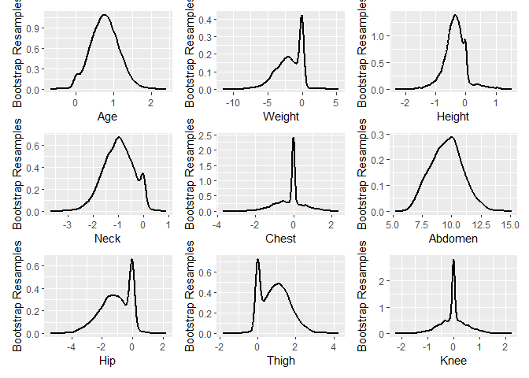<!-- -->

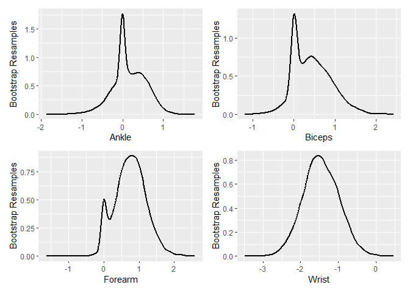<!-- -->

Then, we plot the results for *1se*.

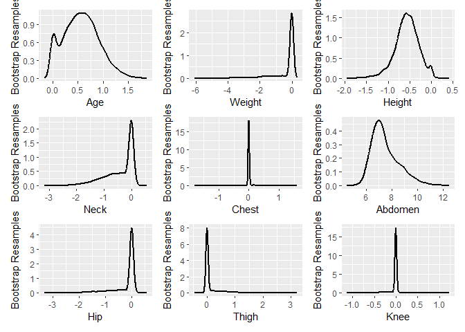<!-- -->

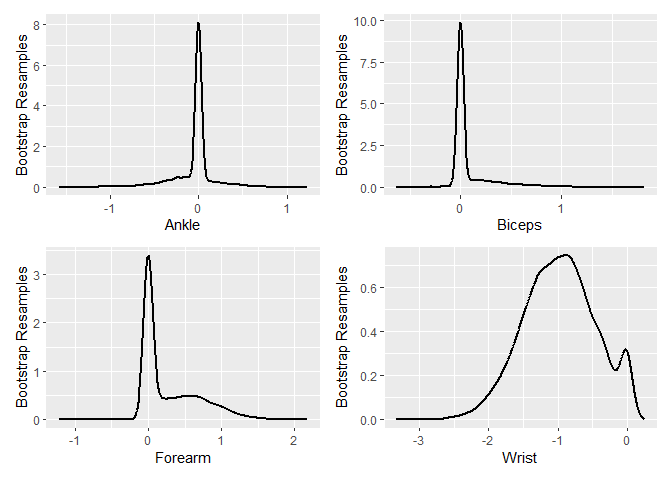<!-- -->

The difference between sampling distributions for non-Bayesian LASSO and
posterior Bayesian LASSO distributions is pretty large. Let us discuss
what is happening here. We start with the sampling distributions.

As we mentioned earlier, the main property of non-Bayesian LASSO
estimates is that some coefficients are usually zero. This property does
not change when we resample the dataset. Consequently, the sampling
distribution of any parameter estimator is a mixture of Dirac at zero
and some continuous distribution of nonzero values. The plots do not
look that way exactly, since the densities are estimated via a
continuous kernel estimate, but these Dirac peaks at zero are still
noticeable.

We can also show this more explicitly by computing the proportion of
exact zero estimates for each parameter in bootstrap resamples.

``` r
sel_prob <- rbind(apply(betas_boot_min == 0,2,mean), apply(betas_boot_1se == 0,2,mean))
rownames(sel_prob) <- c('lambda min', 'lambda 1se')
sel_prob
```

    ##               Age Weight Height   Neck  Chest Abdomen    Hip  Thigh   Knee  Ankle Biceps Forearm  Wrist
    ## lambda min 0.0144 0.2686 0.0588 0.0554 0.3476       0 0.2148 0.1734 0.2902 0.1612 0.1728  0.0690 0.0012
    ## lambda 1se 0.0682 0.7884 0.0222 0.4552 0.9408       0 0.7752 0.8198 0.8844 0.6498 0.7716  0.5124 0.0542

In contrast, the posterior distributions do not have these distinct
Dirac peaks at zero. This is because the Laplace distribution is a continuous distribution. Hence, it cannot cause the posterior to collapse into a mixture with a Dirac distribution. There are continuous distributions that can do so approximately; we will discuss it in more detail when we get to the horseshoe distribution and when we demonstrate using  *shrinkage factors* why Bayessian LASSO fails in variable selection. 

To sum up, the mode of the posterior (i.e., the MAP estimator, aka the
non-Bayesian LASSO) has the strong variable selection properties; the
whole posterior does not. This means that the Bayesian LASSO is
ultimately not that useful, and, e.g., it is discontinued in brms for
that reason <https://paulbuerkner.com/brms/reference/lasso.html>.

Let’s conclude by determining the optimal shrinkage of Bayesian LASSO.
We can again use either cross-validation or fully Bayesian
specification. We start with the LOO-CV.

``` r
lasso_values <- c(0.5, 1, 2, 3, 5, 10, 20)

loo_scores <- numeric(length(lasso_values))

tau <- stanvar(x = lasso_values[1], name = "tau")

lasso_prior <- c(
  set_prior("", class = "Intercept"),
  prior("", class = "sigma"),
  set_prior("double_exponential(0, tau)", class = "b"),
  prior_string("target += -log(sigma)", check = FALSE)
)

bodyfat_b_lasso <- brm(BodyFat  ~ . - Density, prior = lasso_prior, family = gaussian(), stanvars = tau, data = bodyfat_std, refresh = 0, silent = 2, seed = 123, warmup = 2000, iter = 10000)

bodyfat_b_lasso <- add_criterion(bodyfat_b_lasso, criterion = "loo", save_psis = TRUE, reloo = TRUE)
loo_scores[1] <- bodyfat_b_lasso$criteria$loo$estimates[3]


for (i in 2:length(lasso_values)) {

  tau <- stanvar(x = lasso_values[i], name = "tau")

  bodyfat_b_lasso <- update(bodyfat_b_lasso, stanvars = tau, recompile = FALSE)
  
  bodyfat_b_lasso <- add_criterion(bodyfat_b_lasso, criterion = "loo", save_psis = TRUE, reloo = TRUE)
  loo_scores[i] <- bodyfat_b_lasso$criteria$loo$estimates[3]
}
```

``` r
names(loo_scores) <- lasso_values
loo_scores
```

    ##      0.5        1        2        3        5       10       20 
    ## 1471.287 1468.030 1467.514 1467.463 1468.195 1468.401 1468.473

``` r
ggplot() + geom_point(aes(x = lasso_values, y = loo_scores)) + xlab('Lambda') + ylab('LOO-CV')
```

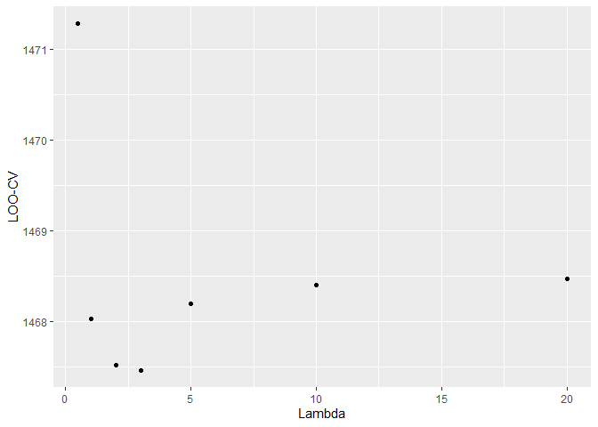<!-- -->

``` r
tau <- stanvar(x = lasso_values[2], name = "tau")
bodyfat_b_lasso <- update(bodyfat_b_lasso, stanvars = tau, recompile = FALSE)
bodyfat_b_lasso <- add_criterion(bodyfat_b_lasso, criterion = "loo", save_psis = TRUE, reloo = TRUE)
```

Next, we fit the fully Bayesian model. We will again select
$`\lambda \sim \text{Exp}(1)`$.

``` r
lasso_prior2 <- c(
  set_prior("", class = "Intercept"),
  prior("", class = "sigma"),
  set_prior("double_exponential(0, tau)", class = "b"),
  prior_string("target += exponential_lpdf(tau | 1)", check = FALSE),
  prior_string("target += -log(sigma)", check = FALSE)
)

stanvars <- stanvar(scode = "real<lower=0> tau;", block = "parameters")

bodyfat_b_lasso2 <- brm(BodyFat  ~ . - Density, prior = lasso_prior2, stanvars = stanvars, family = gaussian(), data = bodyfat_std, refresh = 0, silent = 2, seed = 123, warmup = 2000, iter = 10000)
bodyfat_b_lasso2 <- add_criterion(bodyfat_b_lasso2, criterion = "loo", save_psis = TRUE, reloo = TRUE)
```

``` r
dens <- density(as_draws_df(bodyfat_b_lasso2)$tau)
dens_data <- data.frame(x = dens$x, y = dens$y)
ggplot(dens_data, aes(x = x, y = y)) +  geom_line(linewidth = 1) + xlab('Lambda') + ylab('Posterior Density')
```

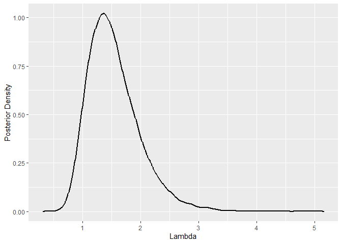<!-- -->

We observe that both approaches again provide similar results. We also
notice that the optimal $`\lambda`$ is more pronounced than the optimal
ridge penalty.

We can compare our LASSO models with the OLS and ridge.

``` r
loo_compare(bodyfat_b_ols,bodyfat_b_ridge, bodyfat_b_ridge2, bodyfat_b_lasso, bodyfat_b_lasso2)
```

    ##             model elpd_diff se_diff p_worse       diag_diff diag_elpd
    ##  bodyfat_b_lasso2       0.0     0.0      NA                          
    ##   bodyfat_b_lasso      -0.2     0.6    0.62 |elpd_diff| < 4          
    ##   bodyfat_b_ridge      -0.6     1.0    0.71 |elpd_diff| < 4          
    ##     bodyfat_b_ols      -0.6     1.6    0.65 |elpd_diff| < 4          
    ##  bodyfat_b_ridge2      -1.0     1.0    0.86 |elpd_diff| < 4

The differences are again minimal, though LASSO seems to be a marginally
better fit than OLS.

We discussed that the posterior distributions and the MAP sampling
distributions are quite a bit different for LASSO. Still, let’s do more
surface look by boxplots (we compare the Bayesian LASSO model chosen by
LOO-CV and the MAP estimate chosen by 10-fold CV).

``` r
betas <- as_draws_df(bodyfat_b_lasso)[2:14]
colnames(betas) <- colnames(model_matrix_bodyfat)

df_long <- pivot_longer(betas, cols = everything(), names_to = "column", values_to = "value")

ggplot(df_long, aes(x = column, y = value, fill = column)) +
  geom_boxplot() +
  theme_minimal() +
  theme(legend.position = "none") +
  theme(axis.text.x = element_text(size = 8, angle = 45, hjust = 1)) +
  xlab('Bayesian LASSO') + ylab('Posterior Draws')
```

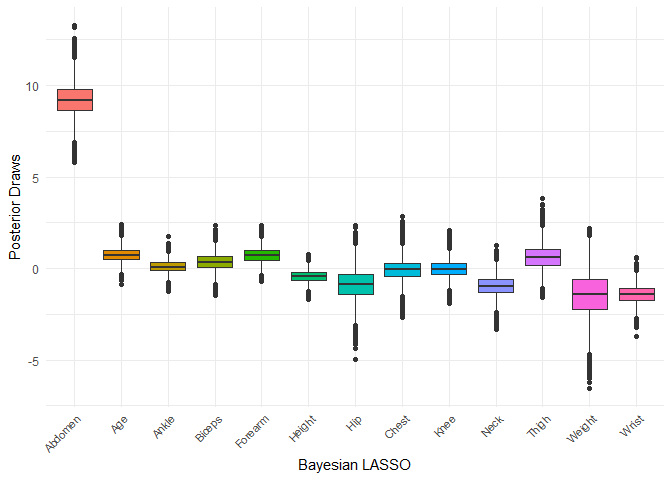<!-- -->

``` r
df_long <- pivot_longer(as.data.frame(betas_boot_min), cols = everything(), names_to = "column", values_to = "value")

ggplot(df_long, aes(x = column, y = value, fill = column)) +
  geom_boxplot() +
  theme_minimal() +
  theme(legend.position = "none") +
  theme(axis.text.x = element_text(size = 8, angle = 45, hjust = 1)) +
  xlab('non-Bayesian LASSO') + ylab('Bootstrap Resamples')
```

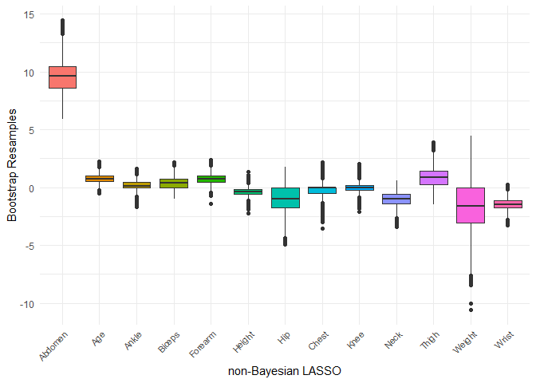<!-- -->

We notice that if we ignore the lack of selection in the posterior
distribution, the overall variability of both estimates is actually very
similar. We can also plot boxplots for a much more aggressive *1se* fit.

``` r
df_long <- pivot_longer(as.data.frame(betas_boot_1se), cols = everything(), names_to = "column", values_to = "value")

ggplot(df_long, aes(x = column, y = value, fill = column)) +
  geom_boxplot() +
  theme_minimal() +
  theme(legend.position = "none") +
  theme(axis.text.x = element_text(size = 8, angle = 45, hjust = 1)) +
  xlab('non-Bayesian  LASSO (1se shrinkage selection)') + ylab('Bootstrap Resamples')
```

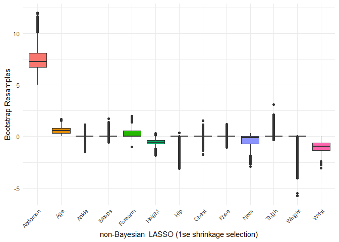<!-- -->

## Bayesian LASSO with Reversible-Jump MCMC

We learned in the previous section that Bayesian LASSO does not really
perform variable selection. Hence, we will explore other priors that do.
First, we will introduce *Bayesian LASSO with Reversible-Jump MCMC*
(Chen et al. 2011), which we employed in *Nine Circles of Statistical
Modeling: LASSO*.

Bayesian LASSO with Reversible-Jump MCMC is an extension of Bayesian
LASSO, in which we explicitly model the number of non-zero components.
Specifically, we will assume a (right-truncated) Poisson prior on the
number of non-zero coefficients
``` math
p(k_0\mid \nu) = \frac{e^{-\mu}\nu^{k_0}}{Ck_0!},
```
where $`C =  \sum_{j = 0}^{k} \nu^je^{-\nu}/j!`$. We will also assume
that prior probabilities of all submodels with $`k_0`$ non-zero
coefficients are equal, i.e., $`1/\binom{k}{k_0}`$. Other than that we
will use a standard Laplace prior $`\lambda/2\exp(-|\beta_j|/\lambda)`$
and we will put noninfromative priors on $`\sigma, \lambda`$ and $`\nu`$
``` math
 p(\sigma,\lambda, \nu) \sim (\sigma^2)^{-1}\lambda\nu^{-1}.
```
The posterior distribution is (Chen et al. 2011) ($`\gamma`$ denotes the
“active set” of coefficients; $`|\gamma| = k_0`$)
``` math
 p(\beta, \sigma^2, \lambda, \nu, \gamma \mid X) \propto \frac{e^{-\nu}\nu^{k_0-1}}{\binom{p}{k_0}k_0!}\exp\left(-\frac{\Vert y-X\beta\Vert^2}{2\sigma^2}\right)\prod_{j \in \gamma} \exp\left(-\frac{|\beta_j|}{\lambda}\right) \lambda^{-(k_0+1)}(\sigma^2)^{-(n+1)}
```

Now, we cannot use a standard Hamiltonian MCM sampler for this
posterior, since we need to perform discrete transitions over the active
sets $`\gamma`$; (Chen et al. 2011) describes custom Metropolis–Hastings
MCMC for that purpose. The algorithm is implemented in package
*monomvn*.

``` r
library(monomvn)
bodyfat_blasso_revjump <- blasso(X = model_matrix_bodyfat,
                          y = bodyfat_std$BodyFat,
                          T = 20000, # number of MCMC iterations
                          beta = rep(1,13), # init. est. of betas
                          lambda2 = 1, # init. est. of lambda
                          s2 = var(bodyfat_std$BodyFat - mean(bodyfat_std$BodyFat)), # init. est. of                                                                                        # sigma 
                          verb = 0)
```

Let us check the coefficients.

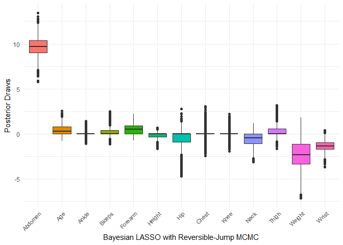<!-- -->

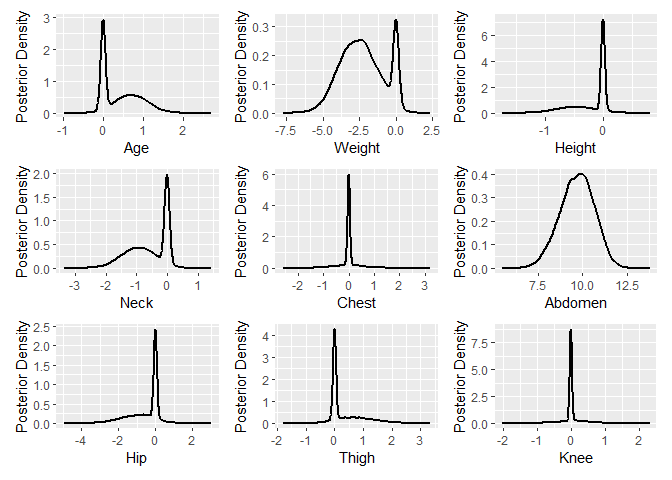<!-- -->

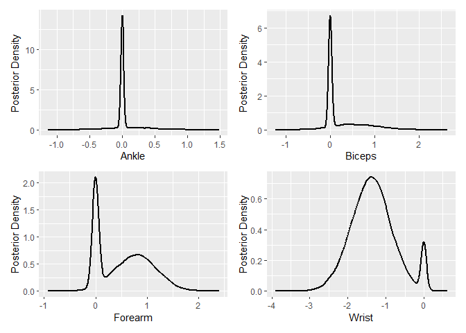<!-- -->

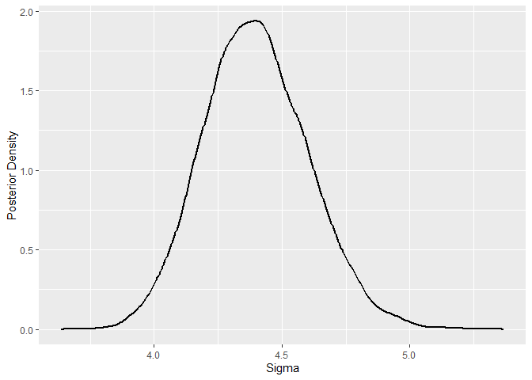<!-- -->

``` r
sel_prob <- rbind(apply(betas_boot_min == 0,2,mean), apply(betas_boot_1se == 0,2,mean), apply(bodyfat_blasso_revjump$beta[2000:20000,]== 0, 2, mean))
rownames(sel_prob) <- c('lambda min', 'lambda 1se', 'Bayes LASSO')
sel_prob
```

    ##                   Age    Weight    Height      Neck     Chest Abdomen       Hip
    ## lambda min  0.0144000 0.2686000 0.0588000 0.0554000 0.3476000       0 0.2148000
    ## lambda 1se  0.0682000 0.7884000 0.0222000 0.4552000 0.9408000       0 0.7752000
    ## Bayes LASSO 0.4156436 0.1335481 0.6016888 0.3764791 0.6894061       0 0.4979723
    ##                 Thigh      Knee     Ankle    Biceps  Forearm      Wrist
    ## lambda min  0.1734000 0.2902000 0.1612000 0.1728000 0.069000 0.00120000
    ## lambda 1se  0.8198000 0.8844000 0.6498000 0.7716000 0.512400 0.05420000
    ## Bayes LASSO 0.5570246 0.7282929 0.7770679 0.6012444 0.314427 0.05266374

We observe that Bayesian LASSO with reversible-jump MCMC is a bit more
aggressive in the selection than non-Bayesian LASSO with the shrinkage
selection *min* but less aggressive than *1se*.

Let’s compare the Bayesian LASSO models. Unfortunately, the *blasso*
implementation is a bit bare-bones in some regards, so we have to
implement the comparison metric ourselves. We will use the WAIC score,
since it does not require repeated refit of the model.

    ## [1] 1467.136

    ## [1] 1466.718

For *blasso*, it will be more involved, since we have to compute the
log-likelihood ourselves. Fortunately, the log-likelihood of the model
is just the normal distribution. Other than that, we can then use the
function *waic* to compute the WAIC score.

``` math
 
\begin{align*}
\text{ELPD}_\text{WAIC} &= \text{LPPD } - p_\text{WAIC}\\
p_\text{WAIC} &= 2 \sum_{i =1}^N\left(\log \left(\frac{1}{S}\sum_{s=1}^S p(y_i\mid\theta^s)\right) - \frac{1}{S}\sum_{s=1}^S \log p(y_i\mid\theta^s)\right)
\end{align*}
```

    ## 
    ## Computed from 18001 by 252 log-likelihood matrix.
    ## 
    ##           Estimate   SE
    ## elpd_waic   -735.7 10.3
    ## p_waic        12.9  2.8
    ## waic        1471.3 20.5
    ## 
    ## 1 (0.4%) p_waic estimates greater than 0.4. We recommend trying loo instead.

We observe that the Bayesian LASSO model with Reversible-Jump MCMC is
slightly worse in terms of WAIC than the other two Bayesian LASSO
models, but it is still within one standard deviation.

## Spike and Slab Prior

The reason that the Bayesian LASSO model with Reversible-Jump MCMC
performed variable selection is that we assigned discrete probabilities
to the number of non-zero parameters in the model. However, if this is
the way to go, why not consider a bit less convoluted approach in which
we assign prior probabilities of the form
``` math
\beta_j \sim \tau_j\delta_0 + (1-\tau_j)f(\beta_j),
```
where $`f(\beta_j)`$ is some continuous “slab” distribution (e.g.,
normal distribution), $`\delta_0`$ is a “spike” (e.g., a Dirac
distribution centered at zero or a very narrow Gaussian), and an
indicator $`\tau_j \sim \text{Bernoulli}(\pi)`$. These mixtures are
known as *spike and slab priors* (Mitchell and Beauchamp 1988).

Similar to the Bayesian LASSO model with Reversible-Jump MCMC, spike and
slab requires simulating discrete indicator states $`\tau`$ and hence,
Hamiltonian MCMC is not applicable. Hence, we have to use a specialized
sampler again. Namely, we will use the package *BoomSpikeSlab*
(<https://www.rdocumentation.org/packages/BoomSpikeSlab/versions/1.2.6>).

``` r
library(BoomSpikeSlab)

spike_prior <- SpikeSlabPrior(x = cbind(model_matrix_bodyfat, rep(1,252)),
                              y = bodyfat_std$BodyFat,
                              expected.r2 = 0.5,
                              prior.df = 0.01,
                              expected.model.size = 7,
                              prior.information.weight = 0.01,
                              diagonal.shrinkage = 0.25)


bodyfat_b_spike <- lm.spike(BodyFat ~ ., data = bodyfat_std, niter = 20000, ping = 0, prior = spike_prior)
```

The specification of the prior may seem a bit nonstandard and ominous;
see
<https://www.rdocumentation.org/packages/BoomSpikeSlab/versions/1.2.6/topics/spike.slab.prior>
for a more detailed explanation. In short, the prior on $`\sigma`$ is
inverse-gamma; its parameters are given by *expected.r2* (a prior
estimate of the $`R^2`$ statistic) and *prior.df*, which represents the
strength of our guess. The “slab” portion of the prior on $`\beta`$ is
Gaussian, given by the shrinkage factor *diagonal.shrinkage* (i.e.,
without the spike, we would assume the standard normal-gamma conjugate
prior). As far as the spike is concerned, the probability of including
the parameter $`\pi`$ has a beta prior given by *expected.model.size*
(prior estimate of the number of non-zero coefficients) and
*prior.information.weight* (the strength of our guess). You can find the
derivations of conditional posterior distributions at
<https://fabiandablander.com/r/Spike-and-Slab.html>.

Let us plot the results.

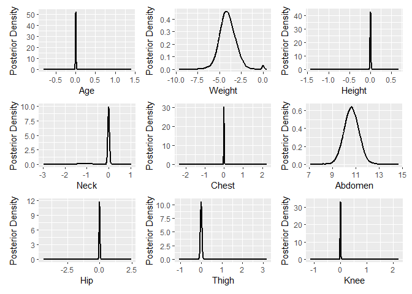<!-- -->

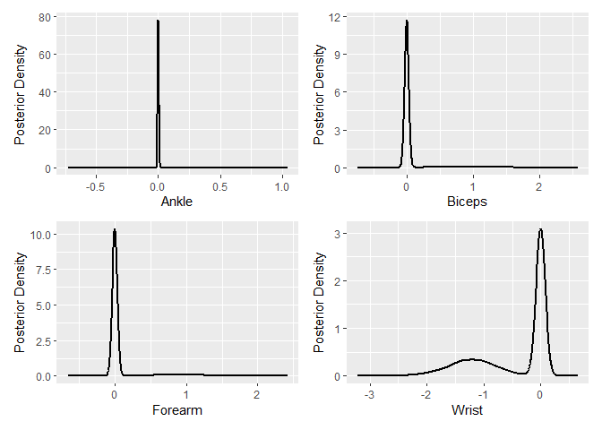<!-- -->

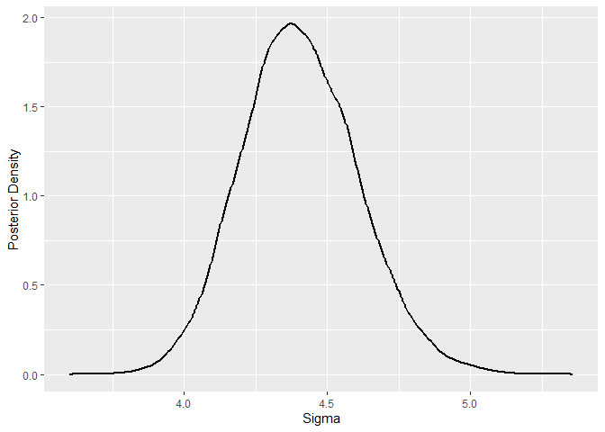<!-- -->

We observe that the selection with spike-and-slab prior is even more
aggressive than LASSO.

``` r
sel_prob <- rbind(apply(betas_boot_min == 0,2,mean), 
                  apply(betas_boot_1se == 0,2,mean), 
                  apply(bodyfat_blasso_revjump$beta[2000:20000,]== 0, 2, mean),
                  apply(bodyfat_b_spike$beta[2000:20000,2:14]== 0, 2, mean))
 
rownames(sel_prob) <- c('lambda min', 'lambda 1se', 'Bayes LASSO', 'Spike & Slab')
sel_prob
```

    ##                    Age      Weight    Height      Neck     Chest Abdomen
    ## lambda min   0.0144000 0.268600000 0.0588000 0.0554000 0.3476000       0
    ## lambda 1se   0.0682000 0.788400000 0.0222000 0.4552000 0.9408000       0
    ## Bayes LASSO  0.4156436 0.133548136 0.6016888 0.3764791 0.6894061       0
    ## Spike & Slab 0.9919449 0.008610633 0.9844453 0.9362258 0.9861119       0
    ##                    Hip     Thigh      Knee     Ankle    Biceps   Forearm
    ## lambda min   0.2148000 0.1734000 0.2902000 0.1612000 0.1728000 0.0690000
    ## lambda 1se   0.7752000 0.8198000 0.8844000 0.6498000 0.7716000 0.5124000
    ## Bayes LASSO  0.4979723 0.5570246 0.7282929 0.7770679 0.6012444 0.3144270
    ## Spike & Slab 0.9770013 0.9471696 0.9853897 0.9910005 0.9397256 0.9147825
    ##                   Wrist
    ## lambda min   0.00120000
    ## lambda 1se   0.05420000
    ## Bayes LASSO  0.05266374
    ## Spike & Slab 0.63229821

Let’s compute WAIC using the same methods as for the LASSO model with
reversible-jump MCMC.

``` r
log_lik_matrix <- matrix(0,length(bodyfat_std$BodyFat), dim(bodyfat_b_spike$beta)[1])

for (i in 1: dim(bodyfat_b_spike$beta)[1]){
  
  mean_i <- bodyfat_b_spike$beta[i,1] + model_matrix_bodyfat %*% bodyfat_b_spike$beta[i,2:14]
  sd_i <- bodyfat_b_spike$sigma[i]
  
  for (j in 1:length(bodyfat_std$BodyFat)){
    log_lik_matrix[j, i] <- dnorm(bodyfat_std$BodyFat[j], mean = mean_i[j], sd = sd_i, log = TRUE) 
    }
}
```

``` r
waic(t(log_lik_matrix[,2000:20000]))
```

    ## 
    ## Computed from 18001 by 252 log-likelihood matrix.
    ## 
    ##           Estimate   SE
    ## elpd_waic   -737.3 10.2
    ## p_waic         8.5  1.9
    ## waic        1474.6 20.4
    ## 
    ## 1 (0.4%) p_waic estimates greater than 0.4. We recommend trying loo instead.

The WAIC score slightly increased, probably due to more aggressive
variable selection; however, the result is quite comparable to other
methods.

## Horseshoe Prior

The main disadvantage of LASSO with Reversible-Jump MCMC and regression
with spike-and-slab priors is that we cannot use standard tools like
*brms*, based on Hamiltonian MCMC, to fit and evaluate the models with
all the advanced tools it offers.

Hence, the next prior that will be considered here, is implemented in
*brms*. It is the horseshoe prior (Carvalho et al. 2009), which is
defined as follows.

``` math
 
\begin{align*}
\beta_j & \sim N(0, \lambda_j^2\tau^2) \\
\lambda_j & \sim \text{Half-Cauchy}(0,1)
\end{align*}
```

We can simulate the horseshoe distribution and compare it to some other
standard priors.

``` r
library(extraDistr)
n_samples <- 1000000
tau <- 1  # Global shrinkage scale


lambda <- abs(rt(n_samples, df = 1)) 
beta <- rnorm(n_samples, mean = 0, sd = tau * lambda)

df <- data.frame(beta = beta)
df_filtered <- subset(df, beta > -4 & beta < 4)

ggplot(df_filtered, aes(x = beta)) +
  geom_density(aes(color = "Horseshoe"), linewidth = 0.75) +
  stat_function(fun = dnorm, aes(color = "Normal (0,1)"), linewidth = 0.75) +
  stat_function(fun = dlaplace, aes(color = "Laplace (0,1)"), linewidth = 0.75) +
  stat_function(fun = dt, aes(color = "Student(1)"), args = list(df = 1), linewidth = 0.75) +
  scale_color_manual(values = c("Horseshoe" = "red", 
                                "Normal (0,1)" = "blue",
                                "Laplace (0,1)" = "orange",
                                "Student(1)" = "purple")) +
     labs(
         title = "Horseshoe Prior Density vs. Normal Prior",
         x = expression(beta),
         y = "Density",
         color = "Prior Type"
     ) +
     theme_minimal()
```

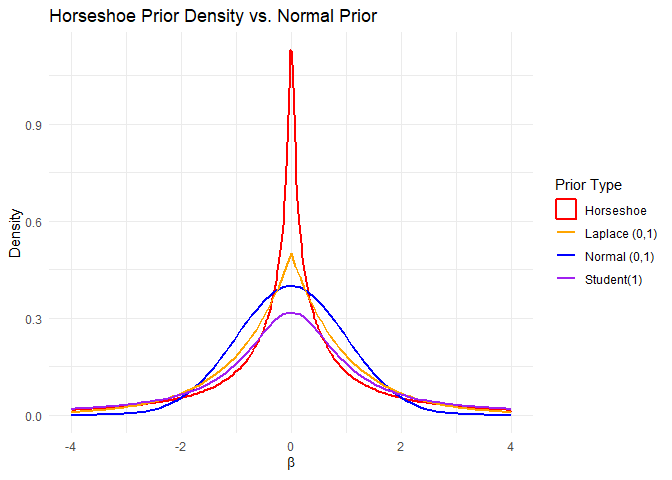<!-- -->

The plot is actually a bit misleading, since the “peak” of the horseshoe
distribution at 0 diverges to infinite, and thus the horseshoe
distribution can (approximately) cause the variable selection unlike, e.g., Laplace. Interestingly enough, the horseshoe is part of a family of prior
distributions, which can be written as

``` math
\begin{align*}
y_i & = X_i\beta + \varepsilon_i \\
\varepsilon_i & \sim N(0, \sigma^2)\\
\beta_j  & \sim N(0, \lambda_j^2\tau^2)\\
\lambda_j & \sim p(\lambda_j).
\end{align*}
```

Depending on the choice of prior on $`\lambda`$, we get various
shrinkage priors (Carvalho et al. 2009). For $`\lambda_j`$ fixed (i.e.,
deterministic), we get Bayesian ridge regression. For
$`\lambda_j^2 \sim \text{Exp}(1/2)`$, we get the Bayesian LASSO
regression $`\beta_j \sim \text{Laplace}(\tau)`$.

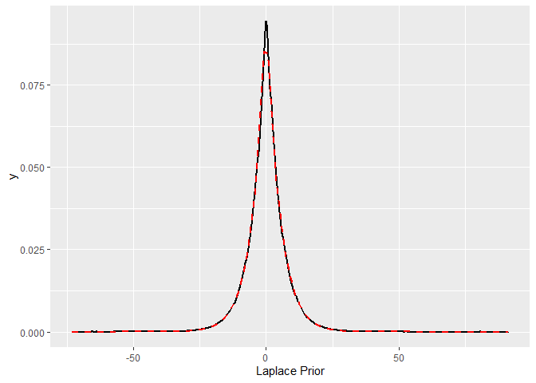<!-- -->

And for $`\lambda_j^2 \sim \text{Inv-Gamma}(\alpha,\alpha)`$, we get the
Student’s distribution $`\beta_j \sim \text{Student}_{2\alpha}(\tau)`$.

``` r
n <- 1000000
tau <- 5

gamma_variance <- rinvgamma(n, 2, 2)
simulated_student <- rnorm(n, mean = 0, sd = sqrt(tau^2*gamma_variance))

ggplot(as.data.frame(simulated_student), aes(x = simulated_student)) +
  geom_density(linewidth = 0.75 , color = 'black') +
  stat_function(fun = dlst, args = list(df = 4, mu =0, sigma = tau), linewidth = 0.75, color = 'red', linetype = "dashed") + xlim(c(-100,100)) + xlab("Student's Prior")
```

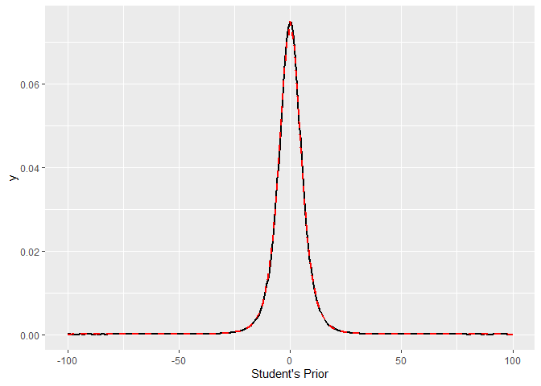<!-- -->

In addition, the conditional posterior distribution of $`\beta`$ meets
(Piironen and Vehtari 2017)

``` math
\begin{align*}
\beta  \mid \Lambda, \tau, \sigma^2, y, X & \sim N(\bar\beta, \Sigma)\\
\bar \beta & =\tau^2\Lambda(\tau^2\Lambda + \sigma^2(X^TX)^{-1})^{-1}\hat\beta_\text{MLE}\\
\Sigma & = (\tau^{-2}\Lambda^{-1} + \sigma^{-2}(X^TX))^{-1},
\end{align*}
```
where $`\Lambda = \text{diag}(\lambda_1^2, \ldots, \lambda_m^2)`$. We
can simplify this relation provided that
$`(X^TX) \approx n\text{ diag}(s_1^2, \ldots, s_m^2)`$ (i.e., the model
matrix is approximately orthogonal). Then
``` math
 \hat\beta_j \approx (1-\kappa_j)\hat\beta_\text{MLE},
```
where
``` math
\kappa_j =  \frac{1}{1+n\sigma^{-2}\tau^2s_j^2\lambda_j^2}
```
is the *shrinkage factor*. Importantly, we can now simulate from the
various prior distributions and get the corresponding prior distribution
of shrinkage factors. For simplicity, let’s assume that $`n\sigma^{-2}s_j^2 = 1`$.

Let us start with the Student’s distribution.

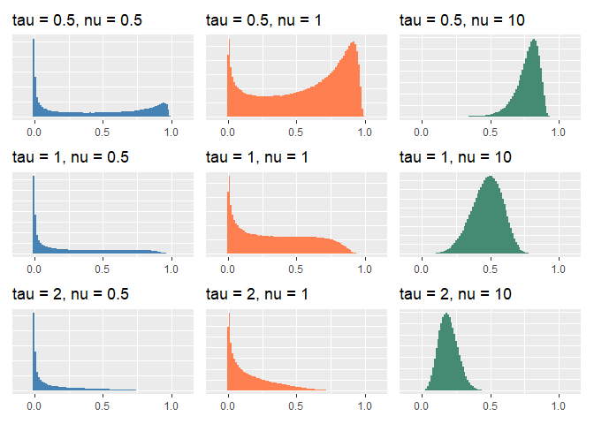<!-- -->

We observe that for low degrees of freedom $`\nu`$, there is little
shrinkage. This makes sense since Student’s distribution in these cases
has much heavier tails than the normal distribution. For large $`\nu`$,
the shrinkage becomes more concentrated around some value, since
Student’s distribution is more similar to the normal prior, which causes
a fixed amount of shrinkage.

Interestingly enough, for $`\tau = 0.5`$ and $`\nu=1`$, we are actually
pretty close to what we want to see. A concentration of probability mass
at shrinkage zero and one, which means that our prior is to shrink some
coefficients to zero and leave the rest as it is; in other words, we
want shrinkage priors that approximate a spike and slab prior.

Let us plot the prior distribution of the shrinkage factors for LASSO
next.

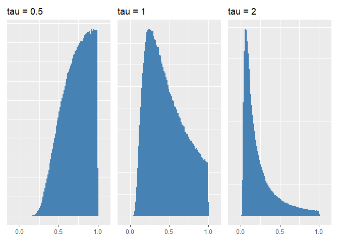<!-- -->

From these plots, we essentially observe why the Bayesian LASSO is
pretty bad for variable selection. It does not produce the “U-shape” we
want to see.

Let’s plot the prior shrinkage factor for the horseshoe.

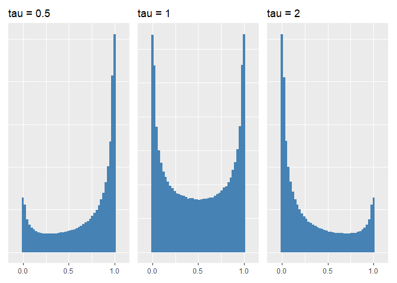<!-- -->

We observe that the horseshoe has the shape we want; the prior shrinkage
probability is concentrated near 0 and 1.

Before we proceed, we should mention two main modifications to the
horseshoe distribution from (Piironen and Vehtari 2017) implemented in
*brms*. First is the regularized horseshoe for which $`\lambda_j`$ is
recomputed for some $`c>0`$ as
``` math
\tilde\lambda_j = \frac{c^2\lambda_j^2}{c^2 + \tau^2\lambda_j^2}
```
We can look at the effect of various choices of $`c`$ on the shrinkage
factor.

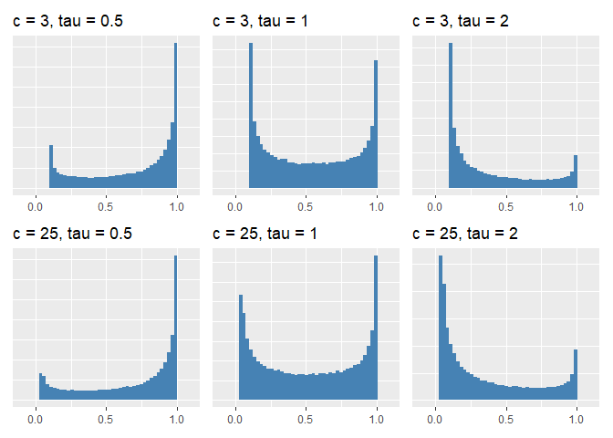<!-- -->

We can notice that the shrinkage factor is bounded away from zero, i.e.,
regularized horseshoe ensures that large coefficients are shrunk at
least a bit. The authors of (Piironen and Vehtari 2017) recommend a
prior
``` math
 c^2 \sim \text{Student}_\nu(0, s^2)
```
rather than fixing the value of $`c`$.

The second modification is replacing the prior
``` math
\lambda_j \sim \text{Half-Cauchy}(0,1) = \text{Half-Student}_1(0,1)
```
with
``` math
\lambda_j \sim \text{Half-Student}_\nu(0,1)
```
for low $`\nu`$ (e.g., $`\nu = 3`$). The reason is that the horseshoe
prior can be hard to sample even for simple linear regression (it leads
to funnel shapes in the posterior, which cause divergent transitions).
Larger $`\nu`$ seems to help this issue (Piironen and Vehtari 2017).

Let us plot the prior shrinkage factors for this modified horseshoe
prior.

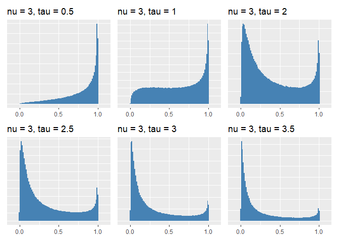<!-- -->

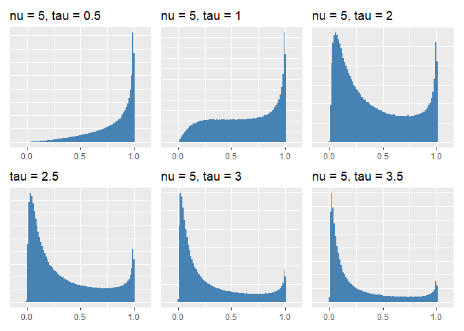<!-- -->

We notice that the shape has changed slightly: we need larger values of
$`\tau`$ to get both peaks pronounced.

Let us fit the model with a horseshoe prior. We will use the Cauchy
distribution to generate $`\lambda_j`$. Notice that we specify the prior
on $`\tau`$ using our expected ratio of non-zero parameters *par_ratio*;
namely, the prior for $`\tau`$ is
``` math
\tau \mid \sigma \sim \text{Half-Cauchy}(0, \tau_0^2),
```
where $`\tau_0 = \text{par\_ratio}\cdot\frac{\sigma}{\sqrt{n}}`$
(Piironen and Vehtari 2017). Notice that the choice of prior global shrinkage $\tau$ is directly tied to the prior variance $\sigma^2$. This makes sense due to the aforementioned formula for the prior shrinkage factor
``` math
\kappa_j =  \frac{1}{1+n\sigma^{-2}\tau^2s_j^2\lambda_j^2}.
```

``` r
horseshoe_prior <- c(
  set_prior("", class = "Intercept"),
  prior("", class = "sigma"),
  set_prior(horseshoe(df = 1,           # dof of half-student for lambda_j
                      df_global = 1,    # dof of half-student for tau (if we do not want to use H-C)
                      par_ratio = 0.5,  
                      scale_slab = 2,   # s^2 parameter for prior on c^2
                      df_slab = 4,)     # dof parameter for prior on c^2
            , class = "b"),
  prior_string("target += -log(sigma)", check = FALSE)
)

bodyfat_b_horseshoe <- brm(BodyFat  ~ ., prior = horseshoe_prior, family = gaussian(), data = bodyfat_std, refresh = 0, silent = 2, seed = 123, warmup = 2000, iter = 10000)
```

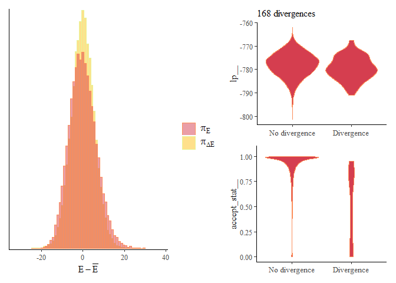<!-- -->

As predicted, we observe many divergences when we use half-Cauchy priors
on $`\lambda_j`$ with default settings. Fortunately, all we need to do
for our example is to increase *adapt_delta*.

``` r
horseshoe_prior <- c(
  set_prior("", class = "Intercept"),
  prior("", class = "sigma"),
  set_prior(horseshoe(df = 1,           # dof of half-student for lambda_j
                      df_global = 1,    # dof of half-student for tau (if we do not want to use H-C)
                      par_ratio = 0.5,  
                      scale_slab = 2,   # s^2 parameter for prior on c^2
                      df_slab = 4,)     # dof parameter for prior on c^2
            , class = "b"),
  prior_string("target += -log(sigma)", check = FALSE)
)

bodyfat_b_horseshoe <- brm(BodyFat  ~ ., prior = horseshoe_prior, family = gaussian(), data = bodyfat_std, refresh = 0, silent = 2, seed = 123, warmup = 2000, iter = 10000, control = list(adapt_delta = 0.99))
bodyfat_b_horseshoe <- add_criterion(bodyfat_b_horseshoe, criterion = "loo", save_psis = TRUE, reloo = TRUE)
```

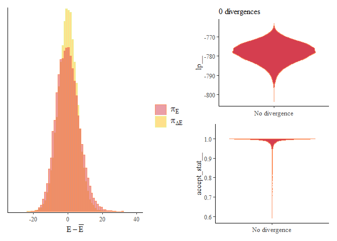<!-- -->

``` r
summary(bodyfat_b_horseshoe)
```

    ##  Family: gaussian 
    ##   Links: mu = identity 
    ## Formula: BodyFat ~ Age + Weight + Height + Neck + Chest + Abdomen + Hip + Thigh + Knee + Ankle + Biceps + Forearm + Wrist 
    ##    Data: bodyfat_std (Number of observations: 252) 
    ##   Draws: 4 chains, each with iter = 10000; warmup = 2000; thin = 1;
    ##          total post-warmup draws = 32000
    ## 
    ## Regression Coefficients:
    ##           Estimate Est.Error l-95% CI u-95% CI Rhat Bulk_ESS Tail_ESS
    ## Intercept    19.15      0.27    18.62    19.69 1.00    59441    22180
    ## Age           0.46      0.41    -0.14     1.35 1.00    17176    22691
    ## Weight       -2.15      1.49    -4.99     0.17 1.00    18190    19124
    ## Height       -0.28      0.31    -0.97     0.19 1.00    24809    28159
    ## Neck         -0.68      0.58    -1.91     0.15 1.00    18428    22564
    ## Chest        -0.04      0.46    -1.10     0.93 1.00    40752    30636
    ## Abdomen       9.64      0.91     7.83    11.37 1.00    27117    28554
    ## Hip          -0.60      0.81    -2.58     0.46 1.00    21364    29537
    ## Thigh         0.38      0.56    -0.40     1.77 1.00    24311    28944
    ## Knee          0.02      0.35    -0.71     0.80 1.00    38426    29853
    ## Ankle         0.07      0.25    -0.41     0.66 1.00    35939    30755
    ## Biceps        0.28      0.40    -0.33     1.24 1.00    28448    28162
    ## Forearm       0.55      0.42    -0.09     1.41 1.00    16733    19000
    ## Wrist        -1.26      0.57    -2.35    -0.07 1.00    20704    12963
    ## 
    ## Further Distributional Parameters:
    ##       Estimate Est.Error l-95% CI u-95% CI Rhat Bulk_ESS Tail_ESS
    ## sigma     4.35      0.20     3.99     4.77 1.00    43075    23518
    ## 
    ## Draws were sampled using sampling(NUTS). For each parameter, Bulk_ESS
    ## and Tail_ESS are effective sample size measures, and Rhat is the potential
    ## scale reduction factor on split chains (at convergence, Rhat = 1).

Let us check the posterior draws.

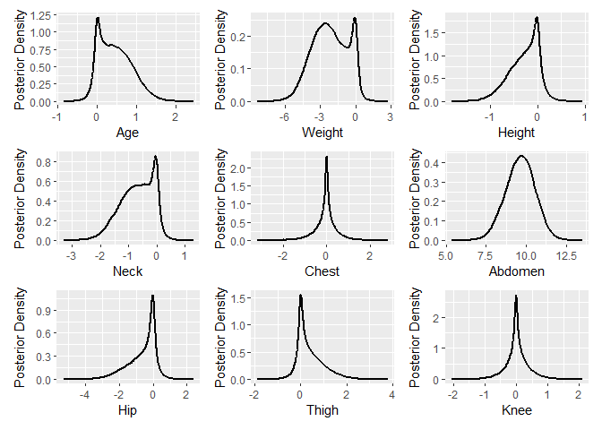<!-- -->

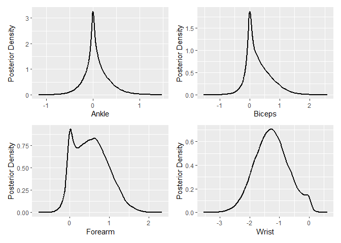<!-- -->

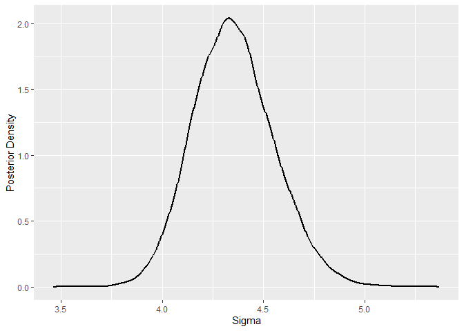<!-- -->

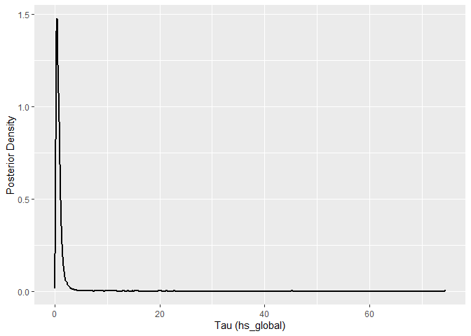<!-- -->

We observe some peaks at zero reminiscent of Bayesian LASSO with
reversible-jump MCMC. Still, overall the selection is nowhere near as
aggressive as it was with the spike and slab prior. We should also note
that variable selection with horseshoe prior is merely approximate.

``` r
sel_prob <- rbind(apply(betas_boot_min == 0,2,mean), 
                  apply(betas_boot_1se == 0,2,mean), 
                  apply(bodyfat_blasso_revjump$beta[2000:20000,]== 0, 2, mean),
                  apply(bodyfat_b_spike$beta[2000:20000,2:14]== 0, 2, mean),
                  apply(as_draws_df(bodyfat_b_horseshoe)[,2:14]== 0, 2, mean)
                  )
 
rownames(sel_prob) <- c('lambda min', 'lambda 1se', 'Bayes LASSO', 'Spike & Slab', 'Horseshoe')
sel_prob
```

    ##                    Age      Weight    Height      Neck     Chest Abdomen
    ## lambda min   0.0144000 0.268600000 0.0588000 0.0554000 0.3476000       0
    ## lambda 1se   0.0682000 0.788400000 0.0222000 0.4552000 0.9408000       0
    ## Bayes LASSO  0.4156436 0.133548136 0.6016888 0.3764791 0.6894061       0
    ## Spike & Slab 0.9919449 0.008610633 0.9844453 0.9362258 0.9861119       0
    ## Horseshoe    0.0000000 0.000000000 0.0000000 0.0000000 0.0000000       0
    ##                    Hip     Thigh      Knee     Ankle    Biceps   Forearm
    ## lambda min   0.2148000 0.1734000 0.2902000 0.1612000 0.1728000 0.0690000
    ## lambda 1se   0.7752000 0.8198000 0.8844000 0.6498000 0.7716000 0.5124000
    ## Bayes LASSO  0.4979723 0.5570246 0.7282929 0.7770679 0.6012444 0.3144270
    ## Spike & Slab 0.9770013 0.9471696 0.9853897 0.9910005 0.9397256 0.9147825
    ## Horseshoe    0.0000000 0.0000000 0.0000000 0.0000000 0.0000000 0.0000000
    ##                   Wrist
    ## lambda min   0.00120000
    ## lambda 1se   0.05420000
    ## Bayes LASSO  0.05266374
    ## Spike & Slab 0.63229821
    ## Horseshoe    0.00000000

We observe that no posterior draws of $`\beta`$ are actually exact zeros, i.e., those observed peaks are not exact Diracs.

We can also plot the draws of “local” shrinkage $`\lambda_j`$ for
individual parameters.

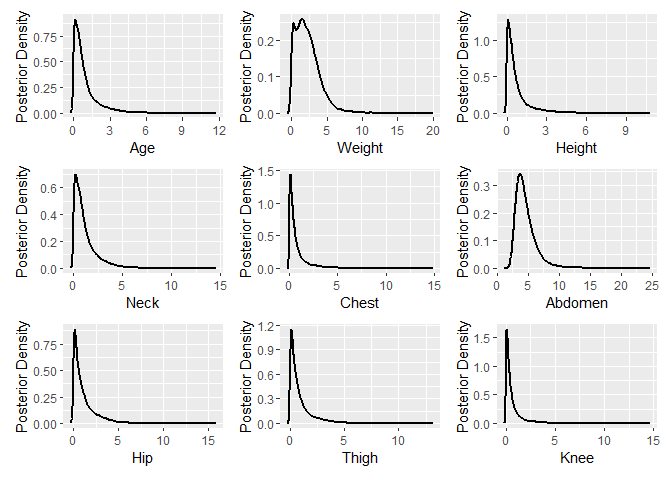<!-- -->

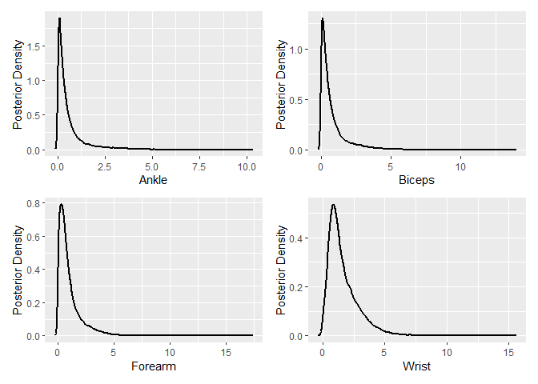<!-- -->

From these, we can, for example, notice that **Abdomen** was not shrunk,
which makes sense since it is the largest coefficient in the model.

Now, let us check how our choice of *par_ratio* influenced the fit using
LOO-CV.

``` r
ratios <- c(0.1, 0.25, 0.5, 0.75, 0.9)

loo_scores <- numeric(length(ratios))

for (i in 1:length(ratios)) {
  
  horseshoe_prior <- c(
  set_prior("", class = "Intercept"),
  prior("", class = "sigma"),
  set_prior(horseshoe(df = 1,           
                      df_global = 1,    
                      par_ratio = ratios[i],  
                      scale_slab = 2,  
                      df_slab = 4,)   
            , class = "b"),
  prior_string("target += -log(sigma)", check = FALSE)
)
  
  bodyfat_b_horseshoe <- brm(BodyFat  ~ ., prior = horseshoe_prior, family = gaussian(), data = bodyfat_std, refresh = 0, silent = 2, seed = 123, warmup = 2000, iter = 10000, control = list(adapt_delta = 0.99))
  
  bodyfat_b_horseshoe <- add_criterion(bodyfat_b_horseshoe, criterion = "loo", save_psis = TRUE, reloo = TRUE)
  
  loo_scores[i] <- bodyfat_b_horseshoe$criteria$loo$estimates[3]
}
```

``` r
names(loo_scores) <- ratios
loo_scores
```

    ##      0.1     0.25      0.5     0.75      0.9 
    ## 1470.460 1470.352 1469.981 1469.754 1469.476

``` r
ggplot() + geom_point(aes(x = ratios, y = loo_scores)) + xlab('par_ratio') + ylab('LOO-CV')
```

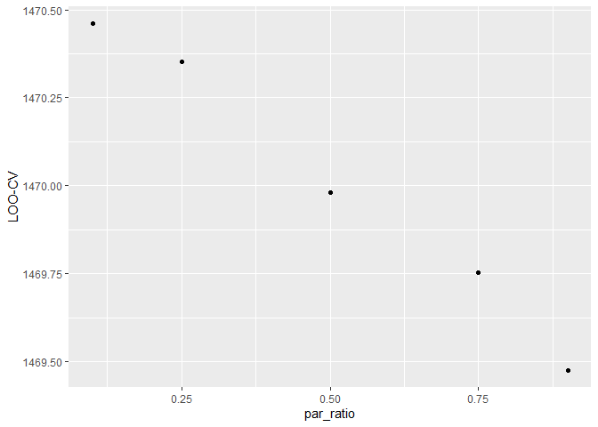<!-- -->

We observe that not much. Lastly, let’s compare the models again.

``` r
loo_compare(bodyfat_b_ols,bodyfat_b_ridge, bodyfat_b_ridge2, bodyfat_b_lasso, bodyfat_b_lasso2, bodyfat_b_horseshoe)
```

    ##                model elpd_diff se_diff p_worse       diag_diff diag_elpd
    ##     bodyfat_b_lasso2       0.0     0.0      NA                          
    ##      bodyfat_b_lasso      -0.2     0.6    0.62 |elpd_diff| < 4          
    ##      bodyfat_b_ridge      -0.6     1.0    0.71 |elpd_diff| < 4          
    ##        bodyfat_b_ols      -0.6     1.6    0.65 |elpd_diff| < 4          
    ##  bodyfat_b_horseshoe      -0.9     1.3    0.77 |elpd_diff| < 4          
    ##     bodyfat_b_ridge2      -1.0     1.0    0.86 |elpd_diff| < 4

## R2D2 Prior

The R2D2 prior is an alternative to the horseshoe prior with the main befefit being a more intuitive way to construct priors; the prior is primarily set on the proportion of the explained variance $R^2$ rather than individual parameters (Zhang et al. 2022).

Let’s assume linear regression $`y = X\beta`$. For simplicity, we will
assume no intercept and that $`X`$ is is standardized to zero mean and
unit variance. We will assume a prior on $`\beta`$ such that
$`\mathbb{E}\beta = 0`$ and
$`\text{Cov }\beta = \sigma^2\Lambda = \sigma^2\text{diag }(\lambda_1, \ldots, \lambda_m)`$ 

Then the prior $`R^2`$ meets (Zhang et al. 2022)
``` math
R^2 = \frac{\sum_i\text{Var}(X_i\beta)}{\sum_i\text{Var}(X_i\beta) + \sigma^2} = \frac{\sigma^2\sum_i \lambda_i}{\sigma^2\sum_i \lambda_i + \sigma^2} = \frac{W}{W+1},
```
where $`W = \sum_i \lambda_i`$. Notice that since the covariance matrix of the prior on $\beta$ is proportional to $\sigma^2$, the prior on $R^2$ does not depend on $\sigma^2$. 

Now, let’s go the other way around. Let’s assume a natural beta prior on
$`R^2`$
``` math
R^2 \sim \text{Beta}(a,b),
```
then $`W = \frac{R^2}{1-R^2}`$ has the so-called *Beta Prime*
distribution (Zhang et al. 2022) $`W \sim \text{Beta Prime}(a,b)`$,
which has density for all $`x>0`$
``` math
f_\text{BP}(x) = \frac{\Gamma(a+b)}{\Gamma(a)\Gamma(b)}\frac{x^{a-1}}{(1+x)^{(a+b)}}
```
Notice that the Beta Prime distribution denotes the distribution of odds
$`p/(1-p)`$ provided that $`p`$ has a beta distribution.

We derived that $`W = \sum_i \lambda_i \sim \text{BP}(a,b)`$ and our goal now is to put a reasonable prior on $`\beta`$. We express $`\lambda_i`$ as
$`\phi_i\omega`$, where $`\sum_i\phi_i = 1`$ and $`\phi_i\geq 0`$, i.e.,
$`\omega`$ represents the total prior variability and $`\phi_i`$ denotes
the proportion of the variability assigned to $`\beta_i`$. We notice
that
``` math
 W = \sum_i \lambda_i = \sum_i \phi_i\omega = \omega,
```
an thence, $`\omega \sim \text{Beta Prime}(a,b)`$ as well.

Hence, we merely need to set priors on $`\phi_i`$. Due to the constraints on
$`\phi_i`$, it is quite natural to select a Dirichlet prior
$`\phi \sim \text{Dirichlet}(\alpha)`$ with the concentration parameter
$`\alpha = (\alpha_1, \ldots, \alpha_m)`$. Other than that, (Zhang et
al. 2022) assume that the shape of prior on $`\beta`$ is Laplace and the
prior on $`\sigma`$ is standard inverse-gamma as

``` math
\begin{align*}
y  & = X\beta + \varepsilon\\
\beta_j &\sim \text{Laplace}\left(\sigma\sqrt{\phi_j\omega/2}\right)\\
\varepsilon &\sim N(0, \sigma^2I)\\
\omega & \sim \text{Beta Prime}(a, b)\\
\sigma & \sim \text{Inverse-Gamma}(a_1, b_1)\\
\phi & \sim \text{Dirichlet}(\alpha).
\end{align*}
```
However, we could make different choices; e.g., *brm*s assumes normal priors for $\beta$
``` math
 \beta_j \sim N(0, \sigma^2\phi_j\omega)
```
and we can set any prior on $`\sigma`$.

Let us fit the model with an R2D2 prior. We need to choose the
parameters in terms of the beta prior $`\text{Beta}(a, \beta)`$ on
$`R^2`$: *mean_R2* $`=  \frac{a}{a + b}`$ and
*prec_R2* = $`a + b`$. The Dirichlet prior is given by *cons_D2*;
smaller values push more coefficients toward zero (small concentrations
push the Dirichlet prior towards the extremes, i.e., most proportions
must be close to zero). 

We used default Student’s priors for sigma and the intercept since
we detected problems with divergences for flat priors.

``` r
r2d2_prior <- c(
  set_prior(R2D2(mean_R2 = 0.5, prec_R2 = 2, cons_D2 = 0.5), class = "b")
)

bodyfat_b_r2d2 <- brm(BodyFat  ~ ., prior = r2d2_prior, family = gaussian(), data = bodyfat_std, refresh = 0, silent = 2, seed = 123, warmup = 2000, iter = 10000, control = list(adapt_delta = 0.99))

bodyfat_b_r2d2 <- add_criterion(bodyfat_b_r2d2, criterion = "loo", save_psis = TRUE, reloo = TRUE)
```

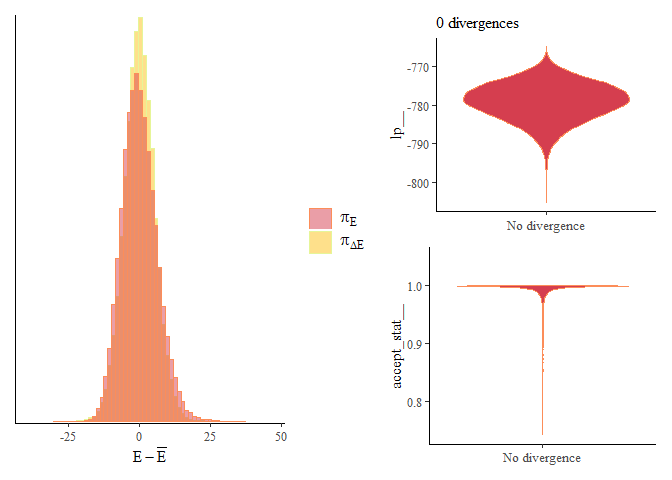<!-- -->

    ##  Family: gaussian 
    ##   Links: mu = identity 
    ## Formula: BodyFat ~ Age + Weight + Height + Neck + Chest + Abdomen + Hip + Thigh + Knee + Ankle + Biceps + Forearm + Wrist 
    ##    Data: bodyfat_std (Number of observations: 252) 
    ##   Draws: 4 chains, each with iter = 10000; warmup = 2000; thin = 1;
    ##          total post-warmup draws = 32000
    ## 
    ## Regression Coefficients:
    ##           Estimate Est.Error l-95% CI u-95% CI Rhat Bulk_ESS Tail_ESS
    ## Intercept    19.15      0.28    18.61    19.69 1.00    47933    22132
    ## Age           0.64      0.41    -0.08     1.45 1.00    23292    17331
    ## Weight       -1.94      1.38    -4.76     0.27 1.00    20087    19482
    ## Height       -0.32      0.32    -1.01     0.22 1.00    23631    27842
    ## Neck         -0.91      0.58    -2.07     0.09 1.00    23925    15713
    ## Chest        -0.10      0.58    -1.39     1.07 1.00    38245    30308
    ## Abdomen       9.65      0.89     7.92    11.39 1.00    31411    30250
    ## Hip          -0.91      0.90    -2.87     0.51 1.00    23182    25607
    ## Thigh         0.63      0.66    -0.42     2.07 1.00    22902    27092
    ## Knee          0.02      0.43    -0.86     0.93 1.00    37271    31374
    ## Ankle         0.11      0.30    -0.47     0.77 1.00    33765    30369
    ## Biceps        0.37      0.45    -0.40     1.35 1.00    28594    28332
    ## Forearm       0.70      0.41    -0.04     1.52 1.00    24983    14237
    ## Wrist        -1.39      0.52    -2.40    -0.35 1.00    29616    21991
    ## 
    ## Further Distributional Parameters:
    ##       Estimate Est.Error l-95% CI u-95% CI Rhat Bulk_ESS Tail_ESS
    ## sigma     4.34      0.20     3.97     4.76 1.00    41763    23060
    ## 
    ## Draws were sampled using sampling(NUTS). For each parameter, Bulk_ESS
    ## and Tail_ESS are effective sample size measures, and Rhat is the potential
    ## scale reduction factor on split chains (at convergence, Rhat = 1).

As usual, we will check the posterior draws.

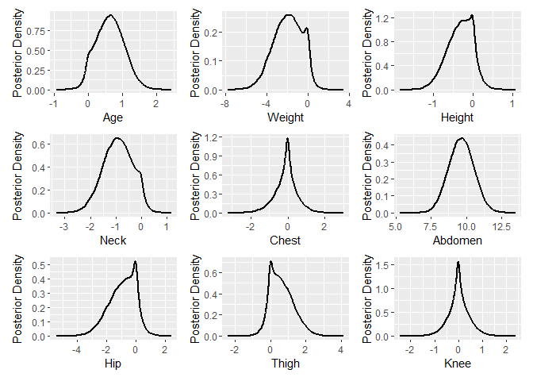<!-- -->

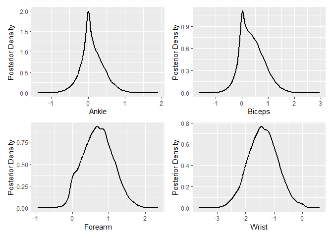<!-- -->

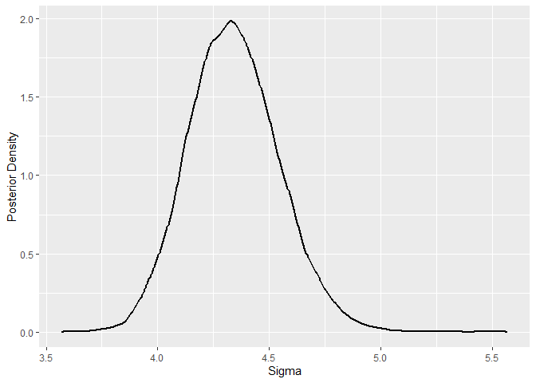<!-- -->

The results are similar to the model with the horseshoe prior. Again,
variable selection is merely approximate.

``` r
sel_prob <- rbind(apply(betas_boot_min == 0,2,mean), 
                  apply(betas_boot_1se == 0,2,mean), 
                  apply(bodyfat_blasso_revjump$beta[2000:20000,]== 0, 2, mean),
                  apply(bodyfat_b_spike$beta[2000:20000,2:14]== 0, 2, mean),
                  apply(as_draws_df(bodyfat_b_horseshoe)[,2:14]== 0, 2, mean),
                  apply(as_draws_df(bodyfat_b_r2d2)[,2:14]== 0, 2, mean)
                  )
 
rownames(sel_prob) <- c('lambda min', 'lambda 1se', 'Bayes LASSO', 'Spike & Slab', 'Horseshoe', 'R2D2')
sel_prob
```

    ##                    Age      Weight    Height      Neck     Chest Abdomen
    ## lambda min   0.0144000 0.268600000 0.0588000 0.0554000 0.3476000       0
    ## lambda 1se   0.0682000 0.788400000 0.0222000 0.4552000 0.9408000       0
    ## Bayes LASSO  0.4156436 0.133548136 0.6016888 0.3764791 0.6894061       0
    ## Spike & Slab 0.9919449 0.008610633 0.9844453 0.9362258 0.9861119       0
    ## Horseshoe    0.0000000 0.000000000 0.0000000 0.0000000 0.0000000       0
    ## R2D2         0.0000000 0.000000000 0.0000000 0.0000000 0.0000000       0
    ##                    Hip     Thigh      Knee     Ankle    Biceps   Forearm
    ## lambda min   0.2148000 0.1734000 0.2902000 0.1612000 0.1728000 0.0690000
    ## lambda 1se   0.7752000 0.8198000 0.8844000 0.6498000 0.7716000 0.5124000
    ## Bayes LASSO  0.4979723 0.5570246 0.7282929 0.7770679 0.6012444 0.3144270
    ## Spike & Slab 0.9770013 0.9471696 0.9853897 0.9910005 0.9397256 0.9147825
    ## Horseshoe    0.0000000 0.0000000 0.0000000 0.0000000 0.0000000 0.0000000
    ## R2D2         0.0000000 0.0000000 0.0000000 0.0000000 0.0000000 0.0000000
    ##                   Wrist
    ## lambda min   0.00120000
    ## lambda 1se   0.05420000
    ## Bayes LASSO  0.05266374
    ## Spike & Slab 0.63229821
    ## Horseshoe    0.00000000
    ## R2D2         0.00000000

Notice that we also get a posterior distribution of $`R^2`$, which
largely corresponds to the one we compute for the Bayesian OLS.

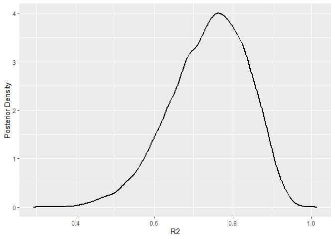<!-- -->

Similar to the model with the horseshoe prior, we can also plot the
posterior local shrinkage factors.

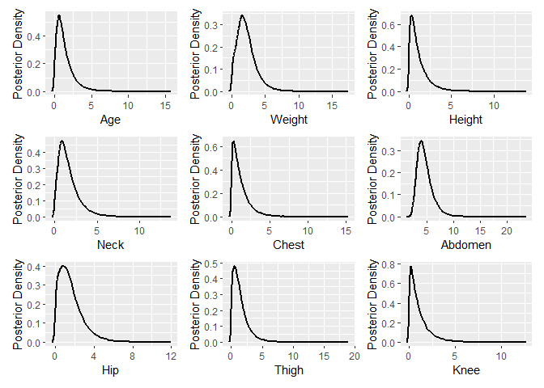<!-- -->

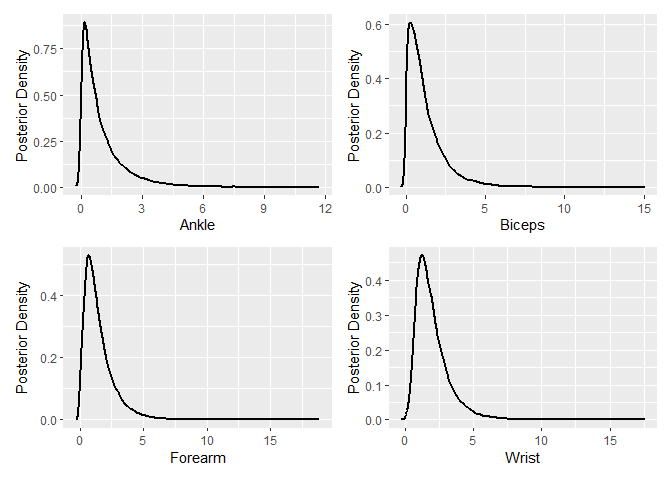<!-- -->

The results are pretty similar to the horseshoe prior.

``` r
loo_compare(bodyfat_b_ols,bodyfat_b_ridge, bodyfat_b_ridge2, bodyfat_b_lasso, bodyfat_b_lasso2, bodyfat_b_horseshoe, bodyfat_b_r2d2)
```

    ##                model elpd_diff se_diff p_worse       diag_diff diag_elpd
    ##     bodyfat_b_lasso2       0.0     0.0      NA                          
    ##      bodyfat_b_lasso      -0.2     0.6    0.62 |elpd_diff| < 4          
    ##       bodyfat_b_r2d2      -0.2     0.5    0.67 |elpd_diff| < 4          
    ##      bodyfat_b_ridge      -0.6     1.0    0.71 |elpd_diff| < 4          
    ##        bodyfat_b_ols      -0.6     1.6    0.65 |elpd_diff| < 4          
    ##  bodyfat_b_horseshoe      -0.9     1.3    0.77 |elpd_diff| < 4          
    ##     bodyfat_b_ridge2      -1.0     1.0    0.86 |elpd_diff| < 4

As the last step of this project, let us investigate the influence of
our choice of Dirichlet concentrations.

``` r
cons <- c(0.1, 0.25, 0.5, 1, 2)

loo_scores <- numeric(length(cons))

for (i in 1:length(cons)) {
  
  r2d2_prior <- c(
  set_prior(R2D2(mean_R2 = 0.5, prec_R2 = 2, cons_D2 = cons[i]), class = "b")
  )
  
  bodyfat_b_r2d2 <- brm(BodyFat  ~ ., prior = r2d2_prior, family = gaussian(), data = bodyfat_std, refresh = 0, silent = 2, seed = 123, warmup = 2000, iter = 10000, control = list(adapt_delta = 0.99))
  
  bodyfat_b_r2d2 <- add_criterion(bodyfat_b_r2d2, criterion = "loo", save_psis = TRUE, reloo = TRUE)
  
  
  loo_scores[i] <- bodyfat_b_r2d2$criteria$loo$estimates[3]
}
```

``` r
names(loo_scores) <- cons
loo_scores
```

    ##      0.1     0.25      0.5        1        2 
    ## 1471.052 1469.111 1468.081 1467.903 1467.785

``` r
ggplot() + geom_point(aes(x = cons, y = loo_scores)) + xlab('par_ratio') + ylab('LOO-CV')
```

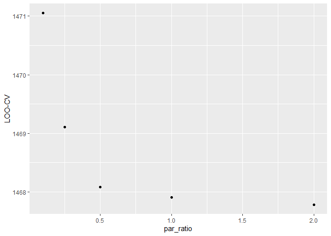<!-- -->

Again, it seems that low shrinkage is preferred.


##  References

<div id="refs" class="references csl-bib-body hanging-indent"
entry-spacing="0">

<div id="refs" class="references csl-bib-body hanging-indent">

<div id="ref-carvalho2009handling" class="csl-entry">

Carvalho, Carlos M, Nicholas G Polson, and James G Scott. 2009.
“Handling Sparsity via the Horseshoe.” *Artificial Intelligence and
Statistics*, 73–80.

</div>

<div id="ref-chen2011bayesian" class="csl-entry">

Chen, Xiaohui, Z Jane Wang, and Martin J McKeown. 2011. “A Bayesian
Lasso via Reversible-Jump MCMC.” *Signal Processing* 91 (8): 1920–32.

</div>

<div id="ref-gelman1995bayesian" class="csl-entry">

Gelman, Andrew, John B Carlin, Hal S Stern, and Donald B Rubin. 1995.
*Bayesian Data Analysis*. Chapman; Hall/CRC.

</div>

<div id="ref-gelman2019r" class="csl-entry">

Gelman, Andrew, Ben Goodrich, Jonah Gabry, and Aki Vehtari. 2019.
“R-Squared for Bayesian Regression Models.” *The American Statistician*.

</div>

<div id="ref-mitchell1988bayesian" class="csl-entry">

Mitchell, Toby J, and John J Beauchamp. 1988. “Bayesian Variable
Selection in Linear Regression.” *Journal of the American Statistical
Association* 83 (404): 1023–32.

</div>

<div id="ref-morey2016fallacy" class="csl-entry">

Morey, Richard D, Rink Hoekstra, Jeffrey N Rouder, Michael D Lee, and
Eric-Jan Wagenmakers. 2016. “The Fallacy of Placing Confidence in
Confidence Intervals.” *Psychonomic Bulletin & Review* 23 (1): 103–23.

</div>

<div id="ref-park2008bayesian" class="csl-entry">

Park, Trevor, and George Casella. 2008. “The Bayesian Lasso.” *Journal
of the American Statistical Association* 103 (482): 681–86.

</div>

<div id="ref-piironen2017sparsity" class="csl-entry">

Piironen, Juho, and Aki Vehtari. 2017. *Sparsity Information and
Regularization in the Horseshoe and Other Shrinkage Priors*.

</div>

<div id="ref-zhang2022bayesian" class="csl-entry">

Zhang, Yan Dora, Brian P Naughton, Howard D Bondell, and Brian J Reich.
2022. “Bayesian Regression Using a Prior on the Model Fit: The R2-D2
Shrinkage Prior.” *Journal of the American Statistical Association* 117
(538): 862–74.

</div>

</div>
